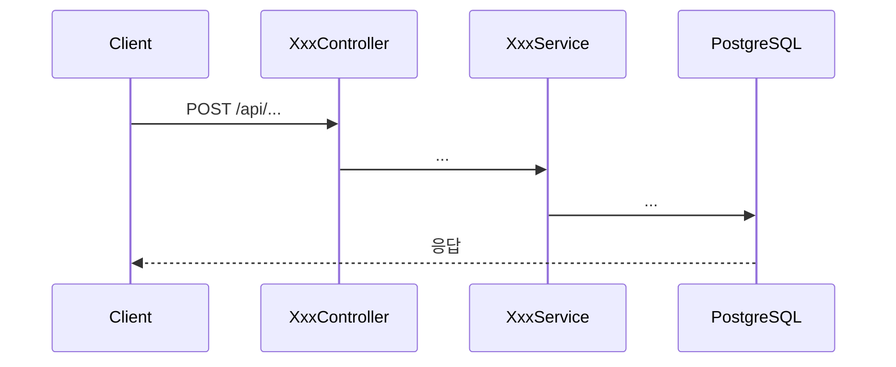
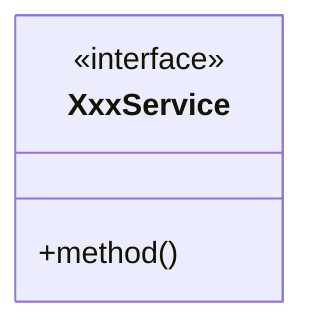

# PRD: {기능 이름}

> 티켓: MSG-{번호} (없으면 "미발행") · 작성일: {YYYY-MM-DD} · 작성: prd-writer
> 상태: 초안  <!-- 수명주기: 초안 → 검토됨(사용자 승인 시 게이트가 갱신) → 확정. 생성 시엔 항상 '초안' 단일값 -->

## 1. 문제 상황

지금 무엇이 안 되거나 불편한가. 사용자/팀이 겪는 실제 문제를 2~5문장으로.
데이터나 사례가 있으면 근거로 붙인다 (예: "재방문 업로드가 전체의 40%인데 구분 표시가 없다").

## 2. 목적 · 목표

- **목적**: 이 기능이 왜 존재해야 하는가 (문제 상황과 연결, 1~2문장).
- **목표**: 완료 시 달성돼야 하는 것. 측정 가능하게.
  - 예: "사용자가 격자 상세에서 방문 이력을 시간순으로 볼 수 있다"
- **비목표(스코프 제외)**: 이번에 하지 않는 것을 명시해 스코프 확장을 막는다.

## 3. 기능 요구사항

각 항목은 검증 가능한 문장으로 — 나중에 테스트 시나리오 하나로 떨어질 수 있어야 한다.

| ID | 요구사항 | 우선순위 |
|----|----------|----------|
| FR-1 | {행위자}는 {조건}에서 {행동}할 수 있다 | Must |
| FR-2 | ... | Must / Should / Could |

엣지 케이스·실패 시나리오도 요구사항이다 (예: "미점령 격자 조회 시 404가 아니라 빈 목록").

## 4. 비기능 요구사항

이 기능에 실제로 해당하는 항목만. 해당 없으면 행을 지운다.

| 분류 | 요구사항 |
|------|----------|
| 성능 | 예: p95 응답 300ms 이내, 예상 데이터 규모 N건 기준 |
| 보안/인가 | 예: 본인 도감만 조회 가능, 토큰 필수 여부 |
| 데이터 정합 | 예: 영상 삭제 시 점령 롤백과의 정합 (glossary 규칙) |
| 운영 | 예: 마이그레이션 필요 여부, 롤백 가능성 |

## 5. 시퀀스 다이어그램

주요 플로우 1~2개. mermaid `sequenceDiagram`.

## 6. 클래스 다이어그램

신규/변경되는 타입이 있을 때만. mermaid `classDiagram`. 기존 타입은 변경점만 표기.

## 7. 변경 파일 목록

리서치(status.md + 실제 코드 확인) 기반으로 작성 — 추측 금지.

| 파일 | 변경 | Owner |
|------|------|-------|
| `src/main/java/com/msg/fillmap/.../Xxx.java` | 신규 / 수정(무엇을) | A / B |
| `src/main/resources/db/migration/V{n}__*.sql` | 신규 마이그레이션 | - |

## 8. 미해결 질문

확정 못 한 결정 사항. 지어내지 않고 여기 남겨서 스펙 단계 전에 해소한다.

- [ ] 예: 정렬 기본값은 최신순? 인기순?
