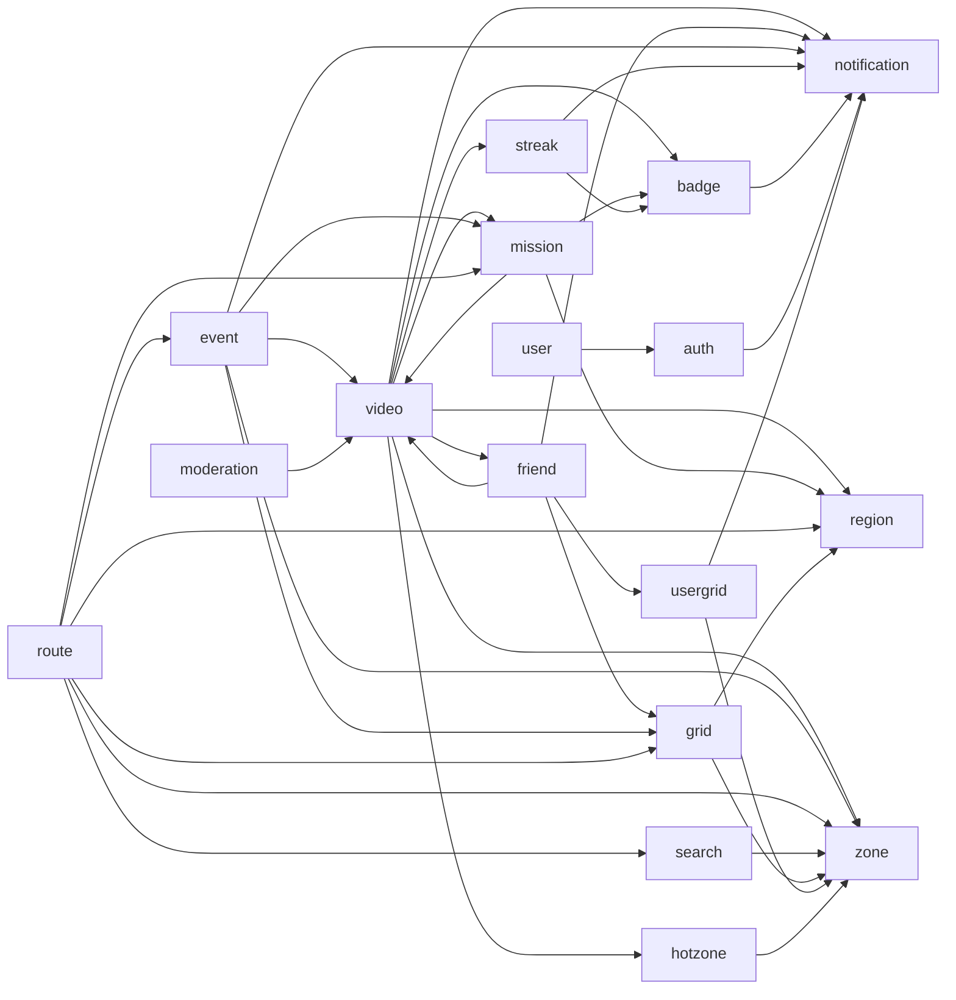

# 백엔드 감사 2026-09-09 (calls)

- 기준 커밋: `74cc9558` (feature/MSG-583-event-notification-performance, 워킹트리 미커밋 변경은 감사 범위 밖)
- 렌즈: calls 하나 (서비스 호출 방향·순환·트랜잭션 진입점). 발단은 "Service가 다른 Service를 부르는 곳을 전수로 보고 계층 구분을 어떻게 개선할지"라는 질문
- 실측 환경: 정적 분석만 (DB 미사용). 미실측 렌즈: 해당 없음 (calls는 실측 대상이 아님)
- 발단: 2026-09-07 박원형 멘토링 후속 (다음 멘토링 10-08). 이전 보고서: [2026-09-08-backend-audit.md](2026-09-08-backend-audit.md) §3.6
- **이 문서는 결함 목록이 아니라 검토 목록이다.** 판단 칸의 "추측:"은 확인 안 된 해석이다.

## 1. 요약

| 렌즈 | 확인 항목 | P1 | P2 | P3 | 한 줄 결론 |
|---|---|---|---|---|---|
| calls | 서비스 계층 주입 간선 76개, 진입점·전파·self-invocation | 0 | 2 | 11 | 클래스 순환 0. **도메인 순환 2개**(video⇄mission, video⇄friend). 업로드 확정은 5단 체인이 한 TX. "리턴으로 다른 서비스를 부른다"의 실체는 인가 가드 뒤 순수 위임 5곳과 뱃지 DTO 반환값 체인 |

가장 먼저 검토할 것 3개 (P1 없음):

1. **video⇄mission 양방향** (#1, P2). `saveVideo`만 미션 판정을 부르고 `confirmAtGrid`는 안 불러서 미션 업로드가 같은 훅을 직접 다시 부른다. 같은 업무가 두 진입점에서 다른 순서로 조립된다.
2. **`VideoServiceImpl.confirmAndStore`의 오케스트레이션** (#3, P2). 5개 도메인을 순서대로 부르고 그 순서(refresh 다음 awardCollectionBadges)가 불변식인데 주석에만 있다.
3. **뱃지 DTO 반환값 체인** (#5, P3). `StreakCommandService.recordUpload`의 반환 타입이 badge 도메인 DTO라 streak 공개 API가 badge에 의존한다.

## 2. 파일별 병합 항목

해당 없음 (렌즈 하나). 이전 감사에서 tx·osiv와 함께 걸린 `VideoServiceImpl`·`EventSubmissionServiceImpl`·`UserServiceImpl`은 [2026-09-08 §2](2026-09-08-backend-audit.md#2-파일별-병합-항목-여러-렌즈에-걸친-것) 참조.

## 3. 렌즈별 발견

### 3.1 native · 3.2 plan · 3.3 tx · 3.4 osiv · 3.5 tz · 3.7 naming · 3.8 iface

이번 감사 범위 밖. 최신 결과는 [2026-09-08](2026-09-08-backend-audit.md).

### 3.6 calls — 호출 구조·진입점

요약: `src/main/java/**/service/**` 안의 서비스 계층 빈 주입 간선 76개를 전수했다(이전 감사 58개는 `*Service*` 타입만 센 값이고 이번엔 Writer·Client·Store·Collector 류까지 포함). 클래스 순환 0건은 그대로지만 **도메인 단위 순환이 2개**(video⇄mission, video⇄friend) 있고, 업로드 확정은 컨트롤러→5단 깊이의 서비스 체인이 REQUIRED로 한 트랜잭션에 합류한다. "리턴으로 다른 서비스를 부른다"의 실체는 두 가지다. 인가 게이트 뒤 `return otherService.x()` 순수 위임(FriendServiceImpl 3곳 등)과, 뱃지 DTO가 streak→video→mission 서비스의 **반환값을 타고 올라오는 응답 조립 체인**(`StreakCommandServiceImpl:33`).

| # | 위치 | 관찰(사실) | 근거(실측값·문서 링크) | 판단 | 우선순위 |
|---|---|---|---|---|---|
| 1 | `video/service/VideoServiceImpl.java:142,194` ↔ `mission/service/impl/MissionVideoServiceImpl.java:45,95,99,129` | video→mission(`MissionAwardService.awardOnUpload`, saveVideo 안)과 mission→video(`VideoService.validateUploadRequest`·`findConfirmedByPendingKey`·`confirmAtGrid`)가 양방향. `awardOnUpload`는 `saveVideo:194`에만 있고 `confirmAtGrid`에는 없어, 미션 경유 업로드는 `MissionVideoServiceImpl:112`가 같은 훅을 직접 다시 부른다 | git `28f1c85b`(MSG-223, 07-30)·`2e141647`(MSG-459, 08-23). [MSG-459](../spec/MSG-459.md) D-10(검증 공개 이유), `VideoService.java:95-102` "B 내부 확장, 계약 아님". 클래스 그래프 순환 0(DFS) | 빈 기동 문제는 없으나 두 도메인은 상하 계층으로 자를 수 없다. 같은 업무(확정+미션 판정)가 두 진입점에서 다른 순서로 조립된다 | P2 |
| 2 | `video/service/VideoServiceImpl.java:146,726` ↔ `friend/service/FriendServiceImpl.java:69,238` | video→friend(`FriendshipQueryService.isFriend`) · friend→video(`VideoService.getFriendGridVideos`) 양방향, 둘 다 읽기 | MSG-312(`27648219`)가 빈 순환(`BeanCurrentlyInCreationException`)을 leaf 인터페이스로 풀고 `ObjectProvider` 제거. [MSG-187](../spec/MSG-187.md):310-313, `FriendshipQueryService.java:8-12` | 결함 없음. 도메인 순환은 잔존하며 읽기 전용이라 위험은 낮다 | P3 |
| 3 | `video/service/VideoServiceImpl.java:237-273` (`confirmAndStore`) | 도메인 서비스 안에 오케스트레이션이 있다: badge(258·263)·region(262)·streak(267)·hotzone(269 afterCommit)·mission(194)·인코딩 enqueue(270). 주석 "순서 중요: awardCollectionBadges의 수집률 판정이 refresh가 방금 저장한 값을 읽는다"(260) | [MSG-239](../spec/MSG-239.md):157 "커밋 후 비동기·이벤트 리스너 기각(응답 동봉 FR-9)", [MSG-223](../spec/MSG-223.md):94, [MSG-179](../spec/MSG-179.md):201(REQUIRED 합류) | 원자성은 의도된 설계. 계층 관점 비용은 **호출 순서가 곧 불변식**(refresh→awardCollectionBadges)인데 그것이 주석에만 있다는 점 | P2 |
| 4 | 호출 깊이 5: `MissionVideoController`→`MissionVideoServiceImpl:93`→`VideoServiceImpl:214`→`StreakCommandServiceImpl:30`→`BadgeAwardServiceImpl:94`→`NotificationCommandServiceImpl:26` (event 업로드도 동일 깊이) | 전 구간 `@Transactional` REQUIRED → 물리 TX 1개. 컨트롤러 직결 서비스가 진입점 | 최장 체인 11개 중 깊이 5가 4개(mission·event·grid·friend 컨트롤러) | 롤백 범위는 명확(전부 함께). 깊이 자체는 결함이 아니고 "누가 TX를 여는가"가 진입점마다 다르다는 것이 #9 | P3 |
| 5 | `streak/service/StreakCommandServiceImpl.java:33` `return badgeAwardService.award(...)`; `mission/service/impl/MissionAwardServiceImpl.java:70-78`; `video/service/VideoServiceImpl.java:273` `ConfirmedVideo(..., newBadges)`; `MissionVideoServiceImpl.java:118-125` 합류 | `StreakCommandService.recordUpload`의 반환 타입이 **badge 도메인 DTO**(`List<EarnedBadgeResponseDto>`). 뱃지가 streak→video→mission/event 반환값을 타고 3~4단 올라가 응답에 실린다 | MSG-239 FR-9(획득 연출 응답 동봉), `MissionVideoServiceImpl.java:115-117` 주석 "합치지 않으면 스탬프로 딴 뱃지가 DB에만 남고 응답에서 빠진다" | "리턴으로 다른 서비스 코드를 부른다"의 실체 ①. 계층이 아니라 **응답 조립 파이프**로 결합돼 있어 streak의 공개 API가 badge에 의존한다 | P3 |
| 6 | `friend/service/FriendServiceImpl.java:214,226,238` · `moderation/service/AdminReportServiceImpl.java:112` · `event/submission/service/EventSubmissionServiceImpl.java:98` | 공개 메서드 본문이 "가드 + `return otherService.x()`" 한 줄인 순수 위임 5곳 (return 형태 호출은 서비스 전체에서 15지점) | [MSG-187](../spec/MSG-187.md) D2·D5 "friend 쪽 검증 코드 0줄", [MSG-193](../spec/MSG-193.md):194 D6 "위임 한 줄" | 실체 ②. 인가 판정(9424 은닉)은 컨트롤러가 못 하는 역할이라 위임 자체는 정당. `unblindVideo:108`만 TX가 피호출자(`unblind:70`)에서 열려 진입점 위치가 메서드마다 다르다 | P3 |
| 7 | `.claude/CLAUDE.md:150` · `badge/service/BadgeAwardService.java` 주석 "B 내부 서비스 — 계약 인터페이스 아님" · `VideoService.java:102` | "접점은 인터페이스로만" 규칙은 **Owner A/B 경계**에만 걸린다. Owner B 안 10개 패키지 사이 타 도메인 **쓰기** 간선 19개(notification 7·badge 3·mission 3·video 2·streak 1·moderation→video 1·auth→notification 1·region 1)에는 규칙이 없다 | 간선 전수표 유형 (4) | 규칙 부재가 결함은 아니다. 다만 (c) ArchUnit로 강제하려면 "패키지 단위로 무엇이 계약인가"를 먼저 정해야 한다 | P3 |
| 8 | `.claude/docs/infrastructure.md:91-97` vs 코드 javadoc | 문서 계약 목록 5개 중 `UserOidcCommandService`는 코드에 없음(0건). 코드에는 문서에 없는 계약 라벨 7개: `RegionStatsCommandService`(MSG-155)·`HotScoreCommandService`·`RegionQueryService`(MSG-93)·`ZoneQueryService`(MSG-468)·`PlaceSearchService` 1인자(MSG-457)·`EventQueryService.getLocationsBulk`(MSG-457)·`FriendshipQueryService`(MSG-312) | 각 인터페이스 파일 헤더 주석 | 문서 드리프트. (c) 채택 시 허용 목록의 정본이 없다 | P3 |
| 9 | `route/service/RouteRecommendServiceImpl.java:135` (route 패키지 `@Transactional` 0건) · `hotzone/service/HotZoneServiceImpl.java:88` · `search/service/impl/PlaceSearchServiceImpl.java:21` | 진입 TX 없이 타 도메인 read 서비스가 각자 readOnly TX를 연다(route: mission·event×2·grid·zone·region 6곳) | `PlaceSearchServiceImpl.java:21` "@Transactional 없음 — 저장을 하지 않는다" 명시 | 읽기 전용이라 원자성 무관. 요청당 짧은 TX가 여러 개라는 사실만 기록(OSIV 렌즈 몫) | 정상 |
| 10 | `streak/service/StreakRemindScheduler.java:61` · `usergrid/service/WeeklySummaryScheduler.java:76` · `event/service/EventNotificationScheduler.java:108-118` | 앞 둘은 스케줄러 TX 없이 `record`가 행마다 자체 TX(주석 "사용자 단위 격리"), 셋째는 `TransactionTemplate`로 루프 전체를 묶고 `acquireEventWriteLock` | 각 파일 주석 | 셋 다 근거 있음. 세 스케줄러의 TX 전략이 서로 다르다는 것만 기록 | 정상 |
| 11 | self-invocation: `auth/service/OidcLoginService.java:44→64` · `badge/service/BadgeAwardServiceImpl.java:77→94` | 같은 클래스의 `@Transactional` 메서드 직접 호출 2건. 양쪽 다 `@Transactional`이라 외부 TX가 이미 열려 있어 무해. 우회를 피한 선례: `VideoStatusWriter.java:24-28`(별도 빈), `PasswordService.java:37-41`(TransactionTemplate) | 스캔 + 본문 확인 | 프록시 미경유 결함 0건 | 정상 |
| 12 | `mission/service/impl/MissionVideoServiceImpl.java:127-134` | 프록시로 부른 `confirmAtGrid`의 `ApiException`을 잡아 12409로 바꿔 던진다. 내부 REQUIRED 프록시가 이미 rollback-only 마킹 | 본문 | 지금은 재던지므로 정상. 이 형태에서 잡고 **계속 진행**하면 커밋 시 `UnexpectedRollbackException`이 난다. 리뷰 주의점 | P3 |
| 13 | `video/service/VideoServiceImpl.java:458` · `user/service/UserServiceImpl.java:436` · `event/submission/service/EventSubmissionImageStore.java:250` · `mission/service/impl/MissionRegistrationServiceImpl.java:91` | `TransactionSynchronization` 수제 afterCommit 헬퍼가 4벌(3벌은 주석으로 서로를 "패턴" 참조). `ApplicationEventPublisher`·`@TransactionalEventListener` 사용 0건 | grep 실측 | (b) 도메인 이벤트 대안의 출발점이 되는 중복 | P3 |
| 14 | `.claude/docs/architecture.md:134` "Worker(배치): Badge·Streak Batch, Region Stats Batch" | 코드는 셋 다 업로드 요청 TX 안 동기 호출(`VideoServiceImpl:258-267`). 문서 3행이 "목표 설계 문서"라고 밝힘 | architecture.md:3, 78-98(표의 `RegionService`·`MissionService`·`SocialService`는 코드에 없는 이름) | 계층 대조 시 오독 지점. 문서 갱신 후보 | P3 |
| 15 | `user/service/UserServiceImpl.java:89` · `user/service/OrgAccountIssueService.java:98` → `auth/service/RefreshTokenService`(구체 클래스) | 크로스 도메인 간선 47개 중 **구체 클래스**를 잡은 것은 이 2개뿐(user→auth, 둘 다 Owner B). 나머지 45개는 인터페이스 | 간선 전수표 | A/B 규칙 위반 아님. (c) 채택 시 예외 목록 후보 | P3 |

#### 간선 전수표

76개 간선 (호출자 → 피호출자 · 도메인 · 계약 · 호출 지점 TX · 피호출 TX · 유형)

유형: (1) 계약 인터페이스 읽기 · (1') 비계약 읽기 · (2) 오케스트레이션 · (3) 인프라/유틸/캐시(DB TX 없는 피호출) · (4) 타 도메인 DB 쓰기 서비스 · (4') 같은 도메인 쓰기 · (5) return 위임. ⟲ = 도메인 순환에 참여. 경로는 `src/main/java/com/msg/fillmap/` 이하, `service/` 생략.

| # | 호출자 | 피호출자 | 도메인 | 계약 | 호출 지점 TX | 피호출 TX | 유형 |
|---|---|---|---|---|---|---|---|
| 1 | video/AiBlurPoller.java:72 | VideoStatusWriter | 같음 | — | 스케줄러, 없음 | REQUIRES_NEW | 4' |
| 2 | video/AiBlurPoller.java:73 | AiClient | 같음 | — | 없음 | 없음(HTTP) | 3 |
| 3 | video/AiBlurPoller.java:82 | VideoProcessingMetrics | 같음 | — | 없음 | 없음 | 3 |
| 4 | video/VideoEncodingServiceImpl.java:43 | VideoStatusWriter | 같음 | — | encode 없음 | REQUIRES_NEW | 4' |
| 5 | video/VideoEncodingServiceImpl.java:48 | VideoProcessingMetrics | 같음 | — | 없음 | 없음 | 3 |
| 6 | video/VideoModerationServiceImpl.java:31 | NotificationCommandService | notification | 비계약(B 내부) | blind/unblind TX | REQUIRED 합류 | 4 |
| 7 | video/RegionExploreServiceImpl.java:37 | ZoneNameQueryService | zone | 계약 A | readOnly | 합류 | 1 |
| 8 | video/VideoServiceImpl.java:138 | RegionStatsCommandService | region | 계약 A | confirmAndStore·deleteVideo TX | 합류 | 4/2 |
| 9 | video/VideoServiceImpl.java:140 | BadgeAwardService | badge | 비계약 | TX 안 | 합류 | 4/2 |
| 10 | video/VideoServiceImpl.java:141 | StreakCommandService | streak | 비계약 | TX 안 | 합류 | 4/2 |
| 11 | video/VideoServiceImpl.java:142 | MissionAwardService | mission | 비계약 | saveVideo:194 TX | 합류 | 4/2 ⟲ |
| 12 | video/VideoServiceImpl.java:143 | HotScoreCommandService | hotzone | 계약 A | afterCommit(TX 밖) | 없음(Redis) | 3 |
| 13 | video/VideoServiceImpl.java:146 | FriendshipQueryService | friend | 비계약 leaf | getVideoPlayback TX | readOnly 합류 | 1' ⟲ |
| 14 | video/VideoServiceImpl.java:148 | ZoneNameQueryService | zone | 계약 A | TX 안 | 합류 | 1 |
| 15 | video/VideoStatusWriter.java:51 | NotificationCommandService | notification | 비계약 | REQUIRES_NEW 안 | 합류 | 4 |
| 16 | video/VideoStatusWriter.java:54 | VideoProcessingMetrics | 같음 | — | — | 없음 | 3 |
| 17 | friend/FriendServiceImpl.java:63 | UserGridQueryService | usergrid | 계약 B | readOnly | 합류 | 1 |
| 18 | friend/FriendServiceImpl.java:65 | GridQueryService | grid | 계약 A | readOnly | 합류 | 1/5 |
| 19 | friend/FriendServiceImpl.java:69 | VideoService | video | 비계약 | readOnly | 합류 | 1'/5 ⟲ |
| 20 | friend/FriendServiceImpl.java:71 | FriendshipQueryService | 같음 | — | readOnly | 합류 | 1' |
| 21 | friend/FriendServiceImpl.java:73 | NotificationCommandService | notification | 비계약 | request TX | 합류 | 4 |
| 22 | video/EncodingJobPoller.java:32 | VideoEncodingService | 같음 | — | 없음 | 없음 | 4' |
| 23 | video/EncodingJobPoller.java:33 | VideoStatusWriter | 같음 | — | 없음 | REQUIRES_NEW | 4' |
| 24 | route/RouteRecommendServiceImpl.java:96 | RouteCandidateCollector | 같음 | — | 없음 | 없음 | 1'/2 |
| 25 | route/RouteRecommendServiceImpl.java:97 | ZoneNameQueryService | zone | 계약 A | 없음 | 자체 readOnly | 1 |
| 26 | route/RouteRecommendServiceImpl.java:98 | GridQueryService | grid | 계약 A | 없음 | 자체 readOnly | 1 |
| 27 | route/RouteRecommendServiceImpl.java:99 | RouteMentionedAreaResolver | 같음 | — | 없음 | 없음 | 1' |
| 28 | route/RouteCandidateCollector.java:65 | MissionQueryService | mission | 라벨 없음 | 없음 | 자체 readOnly | 1' |
| 29 | route/RouteCandidateCollector.java:66 | EventQueryService | event | 계약(getLocationsBulk) | 없음 | 자체 readOnly | 1 |
| 30 | route/RouteCandidateCollector.java:67 | PlaceSearchService | search | 계약 A(1인자) | 없음 | 없음 | 1/5 |
| 31 | route/RouteCandidateCollector.java:68 | GridQueryService | grid | 계약 A | 없음 | 자체 readOnly | 1/5 |
| 32 | route/RouteCandidateCollector.java:70 | InterestMatcher | 같음 | — | 없음 | 없음 | 3 |
| 33 | route/RouteWalkPathServiceImpl.java:53 | RouteWalkSegmentCache | 같음 | — | 없음 | Redis | 3 |
| 34 | route/RouteWalkPathServiceImpl.java:54 | RouteWalkDailyLimiter | 같음 | — | 없음 | Redis | 3 |
| 35 | route/RouteMentionedAreaResolver.java:38 | ZoneQueryService | zone | 계약 A | 없음 | 자체 | 1 |
| 36 | route/RouteMentionedAreaResolver.java:39 | RegionQueryService | region | 계약 A | 없음 | 자체 readOnly | 1 |
| 37 | auth/PasswordService.java:64 | RefreshTokenService | 같음 | — | 커밋 후 | Redis | 3 |
| 38 | auth/OidcLoginService.java:27 | RefreshTokenService | 같음 | — | TX 안 | Redis | 3 |
| 39 | streak/StreakRemindScheduler.java:36 | NotificationCommandService | notification | 비계약 | 없음 | 행마다 자체 TX | 4 |
| 40 | streak/StreakCommandServiceImpl.java:26 | BadgeAwardService | badge | 비계약 | recordUpload TX | 합류 | 4/5 |
| 41 | auth/AuthService.java:30 | RefreshTokenService | 같음 | — | login readOnly / logout TX | Redis | 3 |
| 42 | auth/AuthService.java:32 | PushTokenService | notification | 비계약 | logout TX | 합류 | 4 |
| 43 | user/OrgAccountRequestService.java:66 | OrgAccountIssueService | 같음 | — | TransactionTemplate 안(createAccount)·밖(sendInitialPassword) | 없음 | 2/4' |
| 44 | user/UserServiceImpl.java:89 | RefreshTokenService(구체) | auth | 비계약 | afterCommit | Redis | 3 |
| 45 | user/OrgAccountIssueService.java:98 | RefreshTokenService(구체) | auth | 비계약 | 커밋 후 | Redis | 3 |
| 46 | mission/impl/MissionQueryServiceImpl.java:121 | RegionQueryService | region | 계약 A | readOnly(클래스) | 합류 | 1/5 |
| 47 | mission/impl/MissionRegistrationServiceImpl.java:47 | MissionQueryService | 같음 | — | afterCommit | 없음(캐시) | 3 |
| 48 | mission/impl/MissionAwardServiceImpl.java:45 | BadgeAwardService | badge | 비계약 | awardOnUpload TX | 합류 | 4 |
| 49 | search/impl/PlaceSearchServiceImpl.java:30 | KakaoLocalClient | 같음 | — | 없음 | HTTP | 3 |
| 50 | search/impl/PlaceSearchServiceImpl.java:31 | SearchKeywordCommandService | 같음 | 내부 계약 명시 | 없음 | Redis executor | 3 |
| 51 | search/impl/PlaceSearchServiceImpl.java:32 | ZoneNameQueryService | zone | 계약 A | 없음 | 자체 readOnly | 1 |
| 52 | region/impl/RegionStatsQueryServiceImpl.java:36 | RegionQueryService | 같음 | — | readOnly | 합류 | 1'/5 |
| 53 | mission/impl/MissionVideoServiceImpl.java:45 | VideoService | video | 비계약(B 내부 확장) | upload TX | 합류 | 4/2/5 ⟲ |
| 54 | mission/impl/MissionVideoServiceImpl.java:46 | MissionAwardService | 같음 | — | upload TX | 합류 | 4'/2 |
| 55 | usergrid/WeeklySummaryScheduler.java:42 | NotificationCommandService | notification | 비계약 | 없음 | 행마다 자체 TX | 4 |
| 56 | usergrid/impl/UserGridQueryServiceImpl.java:41 | ZoneNameQueryService | zone | 계약 A | readOnly | 합류 | 1 |
| 57 | hotzone/HotZoneServiceImpl.java:67 | ZoneNameQueryService | zone(A→A) | 계약 | 없음 | 자체 readOnly | 1 |
| 58 | event/EventQueryServiceImpl.java:102 | GridQueryService | grid | 계약 A | readOnly(클래스) | 합류 | 1 |
| 59 | event/EventQueryServiceImpl.java:103 | ZoneNameQueryService | zone | 계약 A | readOnly | 합류 | 1 |
| 60 | event/EventQueryServiceImpl.java:104 | EventNotificationService | 같음 | — | readOnly | 합류 | 1' |
| 61 | event/EventVideoServiceImpl.java:61 | VideoService | video | 비계약 | upload TX | 합류 | 4/2 |
| 62 | event/EventVideoServiceImpl.java:65 | ZoneNameQueryService | zone | 계약 A | TX | 합류 | 1 |
| 63 | event/EventVideoServiceImpl.java:68 | EventVideoInteractionService | 같음 | 내부 계약 명시 | readOnly/TX | 합류 | 1' |
| 64 | event/EventNotificationScheduler.java:54 | NotificationCommandService | notification | 비계약 | TransactionTemplate 안 | 합류 | 4 |
| 65 | event/submission/AdminEventSubmissionService.java:76 | EventSubmissionImageStore | 같음 | — | approve TX / readOnly | 없음(S3) | 3 |
| 66 | event/submission/AdminEventSubmissionService.java:77 | EventSubmissionLocationView | 같음 | — | readOnly | 없음 | 3 |
| 67 | event/submission/AdminEventSubmissionService.java:79 | MissionRegistrationService | mission | 비계약("소유 도메인 경유" 원칙 명시) | approve TX | 합류 | 4/5 |
| 68 | event/submission/EventSubmissionLocationView.java:33 | ZoneNameQueryService | zone | 계약 A | 호출자 TX | 합류 | 1 |
| 69 | event/submission/EventSubmissionLocationView.java:34 | GridQueryService | grid | 계약 A | 호출자 TX | 합류 | 1 |
| 70 | event/submission/AdminApprovedEventService.java:68 | MissionRegistrationService | mission | 비계약 | TransactionTemplate 안 | 합류 | 4 |
| 71 | event/submission/EventSubmissionServiceImpl.java:70 | EventSubmissionImageStore | 같음 | — | submit TX / presign 밖 | 없음 | 3/5 |
| 72 | event/submission/EventSubmissionServiceImpl.java:71 | EventSubmissionLocationView | 같음 | — | readOnly | 없음 | 3 |
| 73 | grid/impl/GridQueryServiceImpl.java:65 | ZoneNameQueryService | zone(A→A) | 계약 | readOnly(클래스) | 합류 | 1 |
| 74 | grid/impl/GridQueryServiceImpl.java:66 | RegionQueryService | region(A→A) | 계약 | readOnly | 합류 | 1/5 |
| 75 | badge/BadgeAwardServiceImpl.java:59 | NotificationCommandService | notification | 비계약 | award TX | 합류 | 4 |
| 76 | moderation/AdminReportServiceImpl.java:45 | VideoModerationService | video | 비계약 | approve TX / unblindVideo 없음 | 합류 / 자체 개시 | 4/5 |

#### 도메인 방향 그래프

- 순환: **video⇄mission**, **video⇄friend** (2-순환 2개, 3자 이상 순환 0). 클래스 수준 순환 0.
- 싱크(아무도 안 부름): notification(7 유입) · zone(10) · badge(3) · region · grid. 소스(컨트롤러 외엔 안 불림): route · moderation · user · auth.
- 계층으로 읽으면 `route/event/friend/moderation → video/mission → badge/streak/region/hotzone → notification/zone` 4단인데, video⇄mission·video⇄friend 두 역방향 간선이 이 층 구분을 깬다.

#### 패턴 분류 집계

| 유형 | 간선 | 비고 |
|---|---|---|
| (1) 계약 인터페이스 읽기 | 22 | ZoneNameQueryService 10 · GridQueryService 5 · RegionQueryService 3 · UserGrid/ZoneQuery/PlaceSearch/EventQuery 각 1. 그중 A→A 4개 |
| (1') 비계약 읽기 | 9 | 크로스 3(video→friend leaf, friend→video, route→mission) + 같은 도메인 6 |
| (2) 오케스트레이션 지점 | 11 클래스 | VideoServiceImpl.confirmAndStore(5 도메인) · MissionVideoServiceImpl · EventVideoServiceImpl · AdminEventSubmissionService.approve · AdminApprovedEventService.unpublish · AdminReportServiceImpl.approve · AuthService.logout · UserServiceImpl.deleteAccount · OrgAccountRequestService.approve · FriendServiceImpl.request · RouteRecommendServiceImpl+Collector(읽기) |
| (3) 인프라/유틸/캐시 | 20 | HTTP 2 · S3 2 · Redis 8 · 계측 3 · 순수 조립 3 · 캐시 무효화 1 |
| (4) 타 도메인 DB 쓰기 서비스 직접 호출 | 19 | notification 7 · badge 3 · mission 3 · video 2 · streak 1 · moderation→video 1 · auth→notification 1 · region 1(계약). **19개 전부 Owner B 내부** → 현행 A/B 규칙의 범위 밖 |
| (4') 같은 도메인 쓰기 | 6 | VideoStatusWriter 3 · EncodingJobPoller→Encoding 1 · MissionVideo→MissionAward 1 · OrgAccountRequest→Issue 1 |
| (5) `return otherService.x()` | 15 지점 | 공개 순수 위임 5(Friend 3·AdminReport·EventSubmission) · 반환값 전파 체인 3종(Streak→badge DTO, MissionAwardResult, ConfirmedVideo.newBadges) · 내부 조회 위임 7 |

크로스 도메인 47 = 계약 24(읽기 22 + RegionStats·HotScore) + 비계약 23. 비계약 23 중 구체 클래스 주입 2(RefreshTokenService).

#### 개선 대안별 영향 범위 (채택 판단은 사람 몫)

| 대안 | 영향 간선 | 이미 있는 선례 | 제약·주의 |
|---|---|---|---|
| (a) 유스케이스/파사드 계층 신설. 오케스트레이션을 `*UseCase`로 빼고 도메인 서비스는 서로 안 부름 | 오케스트레이션 허브의 타 도메인 쓰기 13개 / 8클래스: VideoServiceImpl 5 · MissionVideo 2 · EventVideo 1 · AdminEventSubmission 1 · AdminApprovedEvent 1 · AdminReport 1 · AuthService 1 · Friend→Video 1. 도메인 순환 2개 모두 해소 가능. 반환값 체인 3종(#5) 재설계 동반 | 이름 붙은 UseCase/Facade 0. 사실상 그 역할: `MissionVideoServiceImpl`·`EventVideoServiceImpl`(코어 위 유스케이스, MSG-459·440), `RouteRecommendServiceImpl`+`RouteCandidateCollector`(읽기 파사드), `OrgAccountRequestService` | 알림 outbox(MSG-179 FR-3)와 뱃지 응답 동봉(MSG-239 FR-9)은 **같은 TX·같은 응답**이 요구라 유스케이스가 TX 진입점이 돼야 한다. `refresh→awardCollectionBadges` 순서 불변식이 유스케이스로 옮겨가며 명시된다 |
| (b) 도메인 이벤트. `ApplicationEventPublisher` + `@TransactionalEventListener` | 응답에 결과가 필요 없는 파급만: notification 7(단 `BEFORE_COMMIT` 또는 동기 `@EventListener`여야 원자성 유지) · hotzone 1(이미 afterCommit) · mission 스냅숏 무효화 1(이미 afterCommit) = 9. **불가**: badge 3·streak 1·missionAward 1(응답 동봉), region 1(후속 뱃지 판정이 읽는 순서 의존) | `ApplicationEventPublisher` 0 · `@TransactionalEventListener` 0 · `@EventListener` 2(기동/종료) · 수제 `TransactionSynchronization` 8파일 · `TransactionTemplate` 5파일 | [MSG-239](../spec/MSG-239.md) §D3가 "이벤트 리스너/도메인 이벤트 추상화 — 호출 지점 1곳에 과함"으로 **명시 기각**. 뱃지 축엔 적용 불가이고 알림 축 7개만 후보 |
| (c) 현상 유지 + 계약 인터페이스 강제(ArchUnit 또는 classpath 스캔 테스트) | 검사 대상 크로스 도메인 47. 규칙 초안 "타 패키지 `service` 타입은 인터페이스만 + 허용 목록". 현재 구체 클래스 예외 2(RefreshTokenService). 코드 변경 0 | ArchUnit 의존성 없음. 클래스패스 스캔 가드 2건(`DtoTimeTypeGuardTest`·`ResponseSchemaNullabilityTest`)이 같은 방식의 선례 | 허용 목록 정본이 없다(#8 문서 드리프트). Owner B 내부 19개 쓰기 간선을 "계약"으로 볼지 먼저 결정 필요(#7) |

#### 규칙으로 차단됨

- Owner A/B 경계의 구현체 직접 주입 0건. 크로스 도메인 47개 중 45개 인터페이스, 구체 클래스 2개는 B→B(user→auth). 이전 감사(3.6)와 동일 결론.
- `src/main`의 self-invocation 프록시 우회 결함 0건(#11).

#### 한계·미확인

- 범위는 `src/main/java/**/service/**` 클래스의 `private final` 필드 중 타입이 service 패키지 클래스인 것. **밖의 소비자 8개 주입은 세지 않았다**: `notification/relay/HotZoneEntryDetector.java:46-48`(HotZoneService·UserGridQueryService·NotificationCommandService), `notification/consumer/NotificationConsumer.java:49`, `mission/seed/CourseMissionSeeder.java:59-60`, `mission/seed/CourseSpotNameResolver.java:40`, `event/seed/EventSeeder.java:88`. 정적 호출(`MissionRegistrationServiceImpl:57` → `FestivalMissionSeeder.toUtcStart`)도 간선 밖.
- 호출 지점 TX는 정규식으로 잡고 발견표 15건만 본문으로 검증했다. private 메서드의 TX는 호출자 것을 따르므로 표의 "TX 안"은 호출 경로 기준이다.
- 체인 깊이는 클래스 단위 상한이다(메서드 단위로는 `confirmAtGrid`가 mission 판정을 타지 않아 event 업로드의 실제 최장 경로는 streak 경유 5단).
- 타 도메인 Repository 직접 접근은 이 렌즈 밖이라 "쓰기는 전부 소유 도메인 서비스 경유"를 단정하지 않는다.
- 근거 문서 없음: route 패키지가 TX를 전혀 열지 않는 결정, 세 스케줄러의 TX 전략 차이(#10), 계약 인터페이스 허용 목록의 정본.
- 위키 `04-decisions`에 서비스 계층 구조 ADR은 없고, 멘토 CQRS 제안은 `05-meetings/2026-07-26`·`2026-08-19` 회의록에만 있다(정민이 "명확한 필요 없이 들어온 것" 우려, 멘토는 측정 뒤 채택).

## 4. 팀 설명 자료 — "왜 이렇게 했나"

| 핵심 흐름 | 진입점 | 결정 문서 | 이번 렌즈에서 확인한 것 |
|---|---|---|---|
| 영상 저장 | `VideoServiceImpl.saveVideo` / `confirmAtGrid` → `confirmAndStore` | [MSG-247](../spec/MSG-247.md), [MSG-239](../spec/MSG-239.md), [MSG-223](../spec/MSG-223.md), [MSG-179](../spec/MSG-179.md) | 5개 도메인 순차 호출이 한 TX. 순서 불변식(refresh→뱃지 판정)은 코드 주석에만 있음 |
| 미션·행사 경유 업로드 | `MissionVideoServiceImpl.upload` / `EventVideoServiceImpl.upload` | [MSG-459](../spec/MSG-459.md) D-10, [MSG-440](../spec/MSG-440.md) | 코어(video) 위의 유스케이스 역할. video⇄mission 양방향의 원인 |
| 친구 격자 영상 | `FriendServiceImpl.getFriendGridVideos` | [MSG-187](../spec/MSG-187.md) D2·D5, MSG-312 | 인가 가드 뒤 순수 위임. leaf 인터페이스로 빈 순환 해소 이력 |
| 뱃지 지급 | `BadgeAwardServiceImpl` (streak·mission·video에서 호출) | [MSG-239](../spec/MSG-239.md) FR-9·§D3, [MSG-363](../spec/MSG-363.md) | 응답 동봉 요구가 반환값 체인의 원인. 이벤트 리스너 대안은 명시 기각 |

근거 문서가 없는 흐름: route 패키지 TX 부재, 스케줄러 3종의 TX 전략 차이, 계약 인터페이스 허용 목록. 격자 뷰포트·이벤트 영상 목록은 [2026-09-08 §4](2026-09-08-backend-audit.md) 참조.

## 5. 이전 감사 대비

해소 0 · 신규 0 · 유지 1 (2026-09-08 §3.6의 "쓰기/조회 혼합 서비스" P3 후보 유지). 이번에 새로 적힌 도메인 순환 2개·오케스트레이션 P2 2건은 **감사 기준 확대**(간선 58→76, 도메인 단위 순환 검사, 반환값 체인 추적)로 드러난 것이지 코드가 바뀐 게 아니다. 기준 변경이므로 신규로 세지 않는다.

## 6. 후속 후보 (티켓 아님 — 사람이 결정)

- video⇄mission 순환(#1): `saveVideo`와 `confirmAtGrid`가 미션 판정을 다르게 조립하는 이유를 MSG-459 작업 로그에 남기거나, 두 진입점을 하나의 유스케이스로 합친다.
- `confirmAndStore` 순서 불변식(#3): 주석을 테스트로 옮긴다(refresh 전에 뱃지 판정이 돌면 실패하는 테스트 1건). 계층을 바꾸지 않아도 되는 최소 조치.
- 계약 인터페이스 허용 목록 정본(#7·#8): `infrastructure.md`의 계약 목록을 코드 라벨 11개와 맞추고, Owner B 내부 쓰기 간선 19개를 "계약"으로 볼지 정한다. 이 결정이 (c) 가드 테스트의 전제다.
- 대안 (a)/(b)/(c)는 10-08 멘토링 전 팀 토론 안건. 위 표의 영향 간선 수와 선례가 토론 재료다.
- `architecture.md:134` Worker 표기와 코드 불일치(#14) 갱신.

## 7. 한계

- 정적 분석만. 런타임 프록시·TX 전파는 코드 읽기로 판정했고 실행 실측은 없다.
- 렌즈당 25개 상한으로 발견 15건만 상세화. 간선 76개는 전수표로 접어 뒀다.
- 이전 감사와 간선 수가 다른 것(58 vs 76)은 집계 범위 차이이지 코드 변화가 아니다.
- 오판 가능성: "비계약" 라벨은 인터페이스 헤더 주석 유무 기준이라, 주석 없이 계약으로 쓰이는 인터페이스가 있으면 과소 집계다.
