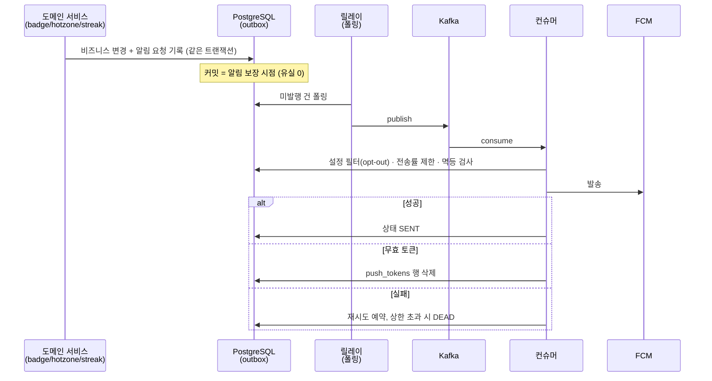

# PRD: 알림 시스템 — FCM 푸시 파이프라인 (공유 PRD)

> 티켓: MSG-178 · MSG-179 · MSG-180 · MSG-181 (알림 에픽 하위 4종 커버) · 작성일: 2026-08-03 · 작성: prd-writer
> 상태: 검토됨 (2026-08-03 성민 승인 — 발송 구조 Kafka 포함·트리거 3종·전송률 제한 확정 반영)  <!-- 수명주기: 초안 → 검토됨(사용자 승인 시 게이트가 갱신) → 확정 -->

## 1. 문제 상황

알림 기능이 전무하다. V1 스키마에 `push_tokens` 테이블(fcm_token 자연키 PK · platform
IOS/ANDROID/WEB)만 있고 소비하는 코드가 0이다(실측: `com.msg.fillmap` 하위에 notification
패키지·FCM 참조 없음). IA "설정 > 알림 설정" 화면과 SA Notification 역할이 정의돼 있으나
미구현이고, 서비스의 리텐션 루프(스트릭·핫구역·뱃지)가 앱 밖의 사용자를 다시 부를 수단이 없다.

이 작업은 단순 FCM 호출 붙이기가 아니다 — **대규모 시스템 설계의 알림 시스템 원칙**(유실 방지 ·
중복 최소화 · opt-out · 전송률 제한 · 재시도)을 실제 서비스 규모에 맞게 적용하는 것이 목표다
(2026-08-03 성민 지시 — 학습·커리어 목적 포함, 측정 가능한 보장 수준을 남긴다).

## 2. 목적 · 목표

- **목적**: 도메인 이벤트(뱃지 발급·핫구역 진입·스트릭 리마인드)를 FCM 푸시로 전달하는
  발송 파이프라인을 유실 없이 구축한다.
- **목표**:
  - 디바이스별 FCM 토큰 등록/해제 API (MSG-178)
  - 커밋된 이벤트의 알림이 유실되지 않는 발송 파이프라인 (MSG-179)
  - 카테고리별 수신 on/off 설정 + 발송 시 필터 (MSG-180)
  - 구현된 이벤트 소스 3종 트리거 연동 (MSG-181)
- **비목표(스코프 제외)**:
  - **친구 활동 알림** — friend 도메인 자체가 미구현. 도메인 구현 후 후속 티켓 (2026-08-03 확정)
  - **알림 이력/읽음 API**(IA의 알림 목록 화면) — 티켓 범위 밖. 발송 기록 테이블이 남으므로
    후속 티켓에서 조회 API만 얹으면 됨
  - SMS·이메일 채널 — MVP는 FCM 푸시 단일 채널. 단 발송기는 채널 추상화 뒤에 둔다
  - FCM vs SSE 논쟁 — 티켓 4종이 FCM 전제로 확정돼 있어 FCM으로 간주

## 3. 기능 요구사항

| ID | 요구사항 | 티켓 | 우선순위 |
|----|----------|------|----------|
| FR-1 | FCM 토큰 등록은 **UPSERT** — fcm_token이 PK라 재로그인·재등록 시 충돌 없이 user_id·last_used_at 갱신 (위키 Notification API 확정) | 178 | Must |
| FR-2 | 토큰 해제는 **멱등** — 없는 토큰 삭제도 성공 응답. 계정 삭제 시 FK CASCADE로 정리 | 178 | Must |
| FR-3 | 커밋된 도메인 이벤트의 알림 요청은 프로세스 재시작·브로커/FCM 장애에도 **유실되지 않는다** — 비즈니스 트랜잭션과 알림 요청 기록이 원자적 | 179 | Must |
| FR-4 | 발송 실패는 재시도된다 — 상한 초과 시 DEAD 상태로 격리(무한 재시도 금지)하고 운영자가 식별 가능 | 179 | Must |
| FR-5 | FCM이 무효 토큰(UNREGISTERED 등)을 응답하면 해당 push_tokens 행을 자동 정리한다 | 179 | Must |
| FR-6 | 같은 이벤트로 같은 사용자에게 중복 발송되지 않는다 — 이벤트 키 기반 멱등 (at-least-once 전달의 짝) | 179 | Must |
| FR-7 | 사용자는 카테고리(BADGE·HOTZONE·REMIND)별 수신 on/off를 저장·조회할 수 있다. 기본값 전부 on (opt-out 모델) | 180 | Must |
| FR-8 | off 카테고리의 알림은 발송 단계에서 걸러진다 — 이벤트 기록은 남되 발송 안 함 | 180 | Must |
| FR-9 | 뱃지 발급 시 해당 사용자에게 알림이 발송된다 | 181 | Must |
| FR-10 | 내 점령 격자가 핫구역에 신규 진입하면 알림이 발송된다 (진입 검출 주기·방식은 스펙 확정 — 핫존은 조회 시점 계산이라 이벤트가 자연 발생하지 않음) | 181 | Must |
| FR-11 | 스트릭이 끊기기 전(당일 미업로드) 리마인드가 배치로 발송된다 | 181 | Must |
| FR-12 | 사용자·카테고리별 발송 상한(전송률 제한)이 적용된다 — 알림 피로로 인한 전체 off 방지. 기본값: HOTZONE 1건/일 · REMIND 1건/일 · BADGE 무제한(사용자 액션 직결·희소). 수치는 설정값으로 조정 가능 | 179 | Must |

## 4. 비기능 요구사항

| 분류 | 요구사항 |
|------|----------|
| 전달 보장 | **at-least-once** + 멱등 dedupe로 중복 최소화. exactly-once는 분산 환경에서 비현실적임을 문서화하고 추구하지 않는다 |
| 실시간성 | 연성 실시간(soft real-time) — 수 분 지연 허용. 리마인드 배치는 시각 정확성보다 발송 보장 우선 |
| 인프라 | Kafka 브로커(KRaft 단일 노드)를 EC2 1대에 컨테이너로 추가 — 메모리 예산 검증 필수. **dev/prod 격리 유지**(멘토 지시) — 토픽 분리 또는 브로커 분리는 스펙에서 확정 |
| 보안 | FCM 서비스 계정 키는 환경변수/파일 마운트로 주입, 레포 커밋 금지 |
| 운영 가시성 | 발송 상태(대기·발송·실패·DEAD)가 집계 쿼리로 확인 가능 — 성공률·유실 여부를 숫자로 말할 수 있어야 함(커리어 목표와 직결) |
| 데이터 정합 | 기존 테이블 소급 없음. push_tokens는 스키마 무변경, 신규 테이블(발송 기록·알림 설정)만 추가 |

## 5. 시퀀스 다이어그램

## 6. 클래스 다이어그램

신규 도메인이라 타입 다수 신설 예상 — 구체 형상(엔티티·인터페이스 분리)은 스펙 몫.
경계만 확정: 발송기는 `NotificationSender` 류 인터페이스 뒤에 두고 FCM은 구현체 하나
(채널 추가·제3자 교체 대비 — 책의 "제3자 서비스 추상화").

## 7. 변경 파일 목록

| 파일 | 변경 | Owner |
|------|------|-------|
| `src/main/java/com/msg/fillmap/notification/**` | 신설 — controller(토큰·설정 API)/service/entity/repository/relay/consumer | B |
| `src/main/resources/db/migration/V18__*.sql` | 신설 — 발송 기록(outbox)·알림 설정 테이블 (V18 번호는 PR 직전 develop 재확인 — V16 선점 사건 재발 방지) | B |
| `build.gradle` | spring-kafka · firebase-admin 의존성 추가 | B |
| `docker-compose*.yml` · 배포 설정 | Kafka(KRaft 단일 노드) 컨테이너 추가 | B(인프라 겸) |
| `src/main/java/com/msg/fillmap/badge/**` · `streak/**` | 수정 — 발급/리마인드 트리거 지점에 알림 요청 기록 | B |
| hotzone 접점 | 기존 조회 인터페이스 소비 우선. 신설 계약 필요 시 스펙에서 Owner A와 협의 | A/B 경계 |

## 8. 확정 사항 (2026-08-03 성민 결정)

- **발송 구조 = Outbox + Kafka 릴레이 + 컨슈머 (이번 묶음에 Kafka 도입)**: 학습 목표 우선 —
  단일 브로커 운영 부담과 구현 복잡도 증가를 인지하고 수용. outbox는 이중 쓰기 문제
  (DB 커밋과 브로커 발행의 원자성) 때문에 Kafka 도입과 무관하게 필수 유지.
- **MSG-181 트리거 = 구현된 소스 3종**: 뱃지 발급 · 핫구역 진입 · 스트릭 리마인드.
  친구 활동은 friend 도메인 구현 후 후속 티켓.
- **전송률 제한 MVP 포함**: 간단한 사용자·카테고리별 상한 (FR-12 기본값).

미해결 질문 없음. 단 **선행 조건**: FCM 프로젝트 셋업(Firebase 콘솔 프로젝트 + 서비스 계정 키
발급)은 성민 수동 작업 — MSG-178 구현 착수 전 필요.
