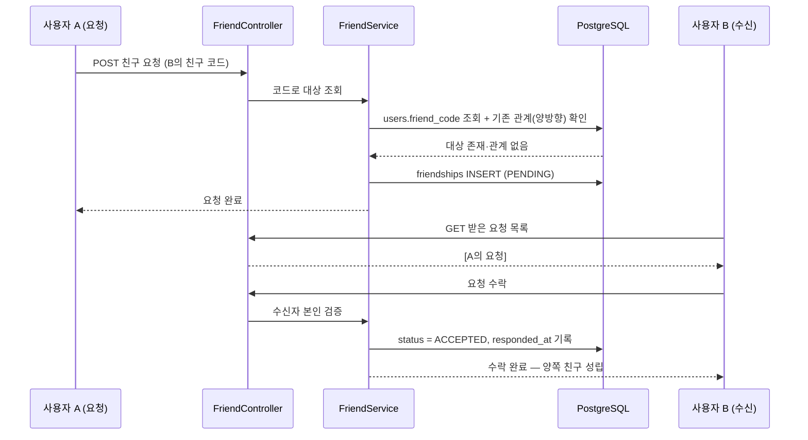
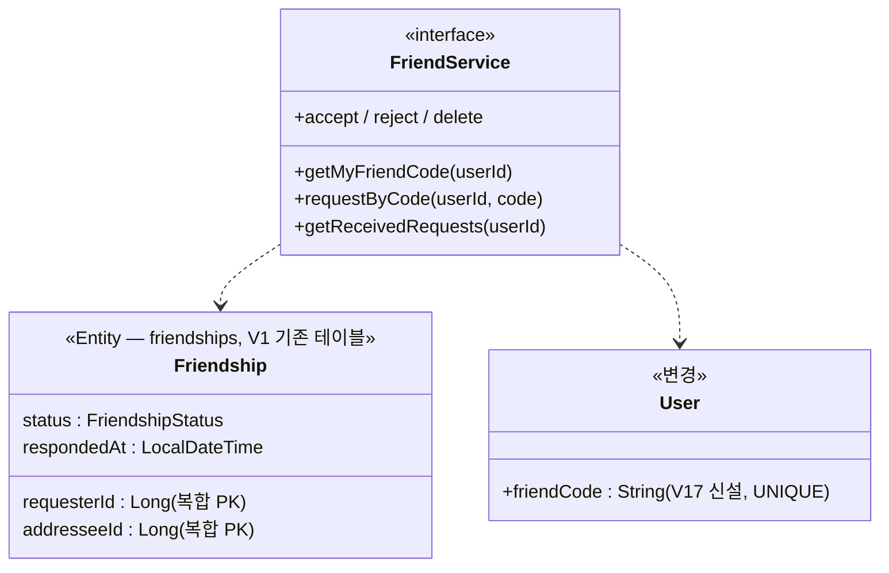

# PRD: 친구 코드·친구 관계 API (요청/수락/거절/삭제)

> 티켓: MSG-185 · 작성일: 2026-08-03 · 작성: prd-writer
> 상태: 검토됨 (2026-08-03 사용자 Q&A로 미해결 질문 전건 확정)

## 1. 문제 상황

친구 에픽(MSG-172)의 모든 기능(친구 도감 레이어·친구 프로필·친구만 보기 공개범위)은 "친구 관계"가
있어야 시작되는데, 현재 백엔드에는 관계를 만들 방법이 없다 — `friendships` 테이블은 V1 스키마에
준비돼 있지만 엔티티·API 등 코드 참조가 0건이다. 친구를 추가할 진입 동선도 없었으나, 2026-08-03
**고정 친구 코드** 방식으로 확정됐다(MSG-172 코멘트): 닉네임은 중복을 허용하므로(MSG-203) 검색으로
상대를 특정할 수 없고, 카카오 친구 연동은 비즈 앱 전환이 선행돼야 해서 배제됐다.

## 2. 목적 · 목표

- **목적**: 친구 관계의 생성(코드 기반 요청)부터 해소(삭제)까지 전체 수명주기 API를 제공해
  친구 에픽 후속 티켓(MSG-186·187·285)의 선행 조건을 해소한다.
- **목표**:
  - 사용자가 내 친구 코드를 확인하고, 상대 코드를 입력해 친구 요청을 보낼 수 있다
  - 받은 요청을 수락/거절할 수 있고, 수락 시 양쪽 모두에게 친구 관계가 성립한다
  - 친구를 삭제하면 관계가 해소된다
- **비목표(스코프 제외)**:
  - 그룹(다인) 개념 — MSG-172 결정 2 미확정, MSG-188 잔여 범위
  - 친구 목록·친구 프로필/도감 조회 — MSG-186 (프라이버시 결정 3 대기)
  - 친구 도감 격자 시각화 — MSG-187 (결정 4 대기)
  - QR·공유 링크 생성 — 코드의 FE 표현형, 서버 작업 없음
  - 일회성 초대 링크(만료 토큰) — 고정 코드 채택으로 배제
  - 차단(BLOCKED) — 후속 (2026-08-03 확정). 스키마 상태는 있으나 MVP 미구현, 거절 후 재요청은 허용
  - 친구 코드 재발급(변경) — 후속 (2026-08-03 확정). 유출 피해는 거절로 대응

## 3. 기능 요구사항

| ID | 요구사항 | 우선순위 |
|----|----------|----------|
| FR-1 | 로그인 사용자는 자신의 친구 코드를 조회할 수 있다 | Must |
| FR-2 | 모든 사용자는 가입 시점부터 고유한 친구 코드를 가진다 (기존 가입자는 마이그레이션으로 일괄 부여) | Must |
| FR-3 | 사용자는 친구 코드로 상대 닉네임을 미리 확인할 수 있다 — 요청 확정 전 "OOO님에게 요청을 보낼까요?" 확인 화면용 (2026-08-03 확정: 제공) | Must |
| FR-4 | 사용자는 상대의 친구 코드를 입력해 친구 요청을 보낼 수 있다 (요청 상태 PENDING) | Must |
| FR-5 | 자신의 코드로 요청하면 실패한다 (자기 자신에게 요청 불가) | Must |
| FR-6 | 존재하지 않는 코드로 요청하면 실패한다 | Must |
| FR-7 | 이미 친구(ACCEPTED)이거나 내가 보낸 요청이 대기(PENDING) 중이면 중복 요청은 실패한다 | Must |
| FR-8 | 상대가 나에게 보낸 요청이 대기 중일 때 내가 상대 코드로 요청하면 **자동 수락**되어 친구가 된다 — 양쪽 다 추가 의사를 밝힌 것 (2026-08-03 확정) | Must |
| FR-9 | 사용자는 자신이 받은 친구 요청 목록(보낸 사람 식별 정보 포함)을 조회할 수 있다 | Must |
| FR-10 | 받은 요청을 수락하면 관계가 ACCEPTED가 되고 양쪽 모두의 친구가 된다 | Must |
| FR-11 | 받은 요청을 거절할 수 있다. 거절해도 보낸 쪽에 별도 통지는 없고, 상대는 재요청할 수 있다 (차단 미도입 확정에 따름) | Must |
| FR-12 | 친구(ACCEPTED) 관계는 어느 쪽이든 삭제할 수 있고, 삭제 즉시 양쪽 모두에서 해소된다 | Must |
| FR-13 | 요청 수락/거절은 그 요청의 수신자만, 삭제는 관계 당사자만 할 수 있다 (타인 관계 조작 불가) | Must |
| FR-14 | 계정이 삭제되면 그 사용자가 얽힌 친구 관계·대기 요청도 함께 사라진다 (MSG-205 CASCADE 정합) | Must |

## 4. 비기능 요구사항

| 분류 | 요구사항 |
|------|----------|
| 보안/인가 | 전 API 토큰 필수. 친구 코드 무차별 대입으로 계정 존재를 열거하기 어렵도록 코드 탐색 공간을 충분히 크게 잡는다 — 제안: 혼동 문자(I·O·0·1) 제외 대문자+숫자 32종 8자(탐색 공간 ≈1.1조), 최종 형식은 스펙에서 확정 |
| 데이터 정합 | 친구 코드는 전역 유일. 동일 쌍의 관계 행은 방향 무관 최대 1개 (A→B와 B→A 동시 존재 금지) |
| 운영 | users 마이그레이션 1건(코드 컬럼 + 기존 가입자 백필 + UNIQUE·NOT NULL) — 가입 경로(LOCAL·KAKAO 양쪽)가 코드 생성을 포함해야 신규 가입자 무결 |

## 5. 시퀀스 다이어그램

## 6. 클래스 다이어그램

## 7. 변경 파일 목록

| 파일 | 변경 | Owner |
|------|------|-------|
| `src/main/resources/db/migration/V17__users_friend_code.sql` | 신규 — friend_code 컬럼·기존 유저 백필·UNIQUE/NOT NULL | - |
| `src/main/java/com/msg/fillmap/user/entity/User.java` | 수정 — friendCode 필드·생성 시 부여 | B |
| `src/main/java/com/msg/fillmap/friend/` (패키지 신설: entity·repository·service·controller·dto·exception) | 신규 — Friendship 엔티티(복합 키)·관계 API 전체 | B |
| `src/main/java/com/msg/fillmap/auth/service/OidcLoginService.java` · `AuthService.java` | 수정 — 가입 시 친구 코드 생성 경로 (User 팩토리 내부화 여부는 스펙 결정) | B |
| `.claude/CLAUDE.md` · `.claude/docs/status.md` | 수정 — Owner B에 `friend.*` 등재·구현 현황 | - |

## 8. 미해결 질문

없음 — 2026-08-03 사용자 Q&A로 전건 확정:

- 역방향 PENDING에서 재요청 → **자동 수락** (FR-8)
- 차단(BLOCKED) → **미포함, 후속** (비목표)
- 코드 재발급 → **미포함, 후속** (비목표)
- 코드 입력 시 상대 닉네임 미리보기 → **제공** (FR-3)
- 코드 형식 → 혼동 문자 제외 8자 제안 승인, 세부는 스펙에서 (비기능 보안)
- REJECTED 후 재요청 → **허용** (FR-11)
