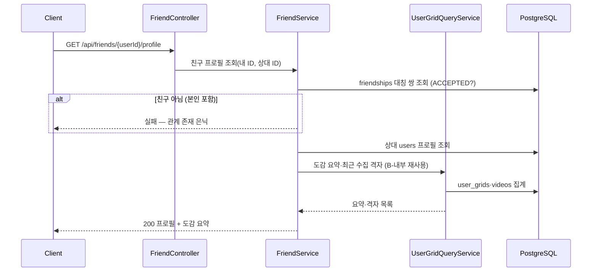
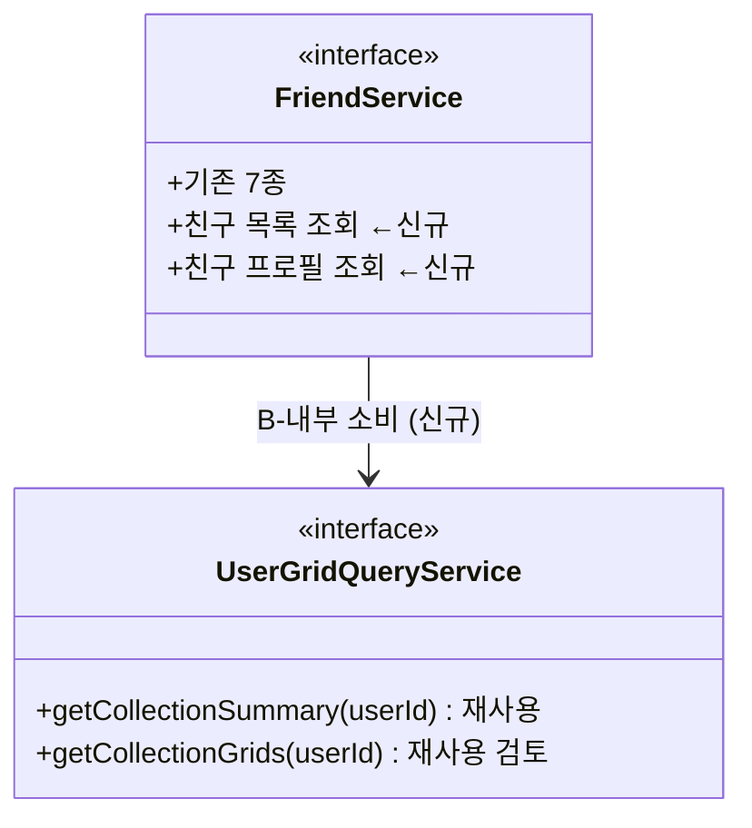

# PRD: 친구 목록 · 친구 프로필(도감 요약) 조회

> 티켓: MSG-186 · 작성일: 2026-08-03 · 작성: prd-writer
> 상태: 검토됨 (2026-08-03 사용자 승인 — 정렬·썸네일·프라이버시 확정 반영)

## 1. 문제 상황

친구 관계 수명주기 API(MSG-185 — 요청/수락/거절/삭제·친구 코드)는 완성됐지만, 정작
**수락된 친구가 누구인지 보는 목록이 없다** (현재는 받은 요청 목록만 존재). 친구의
프로필과 도감(수집 현황)을 열람할 방법도 없어, IA의 "설정 > 친구 관리" 화면과 친구
프로필 화면이 쓸 데이터 소스가 비어 있다.

프라이버시 미확정(친구 에픽 MSG-172 결정 3 — "친구에게 도감을 어디까지 보여줄지")은
**2026-08-03 확정됐다: MVP는 친구면 도감 요약 전부 공개, 공개 범위 설정 없음**
(설정 기능은 Phase 2+ 유예).

## 2. 목적 · 목표

- **목적**: 친구 관계를 맺은 뒤 실제로 "친구를 보는" 화면(목록·프로필·도감 요약)의
  데이터 소스를 제공한다 — 친구 기능이 관계 저장에서 끝나지 않게.
- **목표**:
  - 사용자가 수락된 친구 전체 목록을 볼 수 있다
  - 사용자가 친구의 프로필과 도감 요약(수집 격자 수·영상 수·방문 동 수)을 볼 수 있다
  - 사용자가 친구의 최근 수집 격자를 볼 수 있다
- **비목표(스코프 제외)**:
  - 친구 도감의 지도 격자 시각화 — MSG-187 (에픽 결정 4 대기)
  - 도감 공개 범위 설정 — Phase 2+ (2026-08-03 확정의 유예분)
  - 차단(BLOCKED)·친구 코드 재발급 — MSG-185에서 후속으로 분리된 그대로
  - 비친구 사용자의 공개 프로필 조회 — 친구 관계가 전제
  - 친구 수 상한 — 미도입 (MSG-185 결정 유지)

## 3. 기능 요구사항

| ID | 요구사항 | 우선순위 |
|----|----------|----------|
| FR-1 | 사용자는 수락된(ACCEPTED) 친구 전체 목록을 조회할 수 있다 — 관계 방향(누가 요청했는지) 무관 | Must |
| FR-2 | 사용자는 목록 정렬을 선택할 수 있다 — 기본: 친구가 된(수락) 시각 내림차순, 선택: 닉네임순. 요청 파라미터로 전환 (2026-08-03 확정) | Must |
| FR-3 | 목록 항목에는 상대를 식별·표시할 정보(사용자 ID·닉네임·프로필 이미지·도감 색상)가 담긴다 | Must |
| FR-4 | 친구가 없으면 실패가 아니라 200 + 빈 목록이다 | Must |
| FR-5 | 사용자는 친구의 프로필(닉네임·프로필 이미지·도감 색상)과 도감 요약(수집 격자 수·총 영상 수·방문 동 수)을 조회할 수 있다 | Must |
| FR-6 | 사용자는 친구의 최근 수집 격자 목록(수집 시각 역순, 지역 라벨 포함)을 볼 수 있다 — 본인 도감 갤러리와 동일 형상. 단 썸네일은 재생 허용 공개범위(PUBLIC, MSG-285 이후 FRIENDS 포함) 영상 것만 붙이고, 해당 영상이 없으면 썸네일 없이(null) 격자 사실만 내려준다 (2026-08-03 확정) | Must |
| FR-7 | 친구가 아닌 사용자 ID로 프로필/도감 요약을 조회하면 실패한다 — 관계 존재를 숨긴다 (본인 ID 포함: 본인 도감은 기존 도감 API 몫) | Must |
| FR-8 | 친구 삭제 즉시 상대 프로필/도감 요약은 조회할 수 없다 — 관계는 요청 시점에 실시간 판정한다 | Must |

## 4. 비기능 요구사항

| 분류 | 요구사항 |
|------|----------|
| 성능 | 친구 목록은 MVP 규모(1인당 수십 명)에서 단건 쿼리로 전체 반환 — 페이지네이션 미도입. 규모가 커지면 후속 티켓 |
| 보안/인가 | 토큰 필수. 프로필/도감 요약은 ACCEPTED 관계인 상대만 — 관계 미존재 시 존재 은닉 응답 |
| 데이터 정합 | 친구 도감 요약 수치는 본인 도감 요약(MSG-152/246)과 동일 산식이어야 한다 — 같은 사용자를 본인이 볼 때와 친구가 볼 때 숫자가 다르면 안 된다 |
| 데이터 정합 | 친구에게 내려주는 썸네일은 재생 허용 공개범위 영상으로 한정한다 (2026-08-03 확정 — FR-6). 본인용 갤러리 조회(MSG-153/167)는 공개범위 무관이라 그대로 재사용 금지 |

## 5. 시퀀스 다이어그램

## 6. 클래스 다이어그램

## 7. 변경 파일 목록

| 파일 | 변경 | Owner |
|------|------|-------|
| `src/main/java/com/msg/fillmap/friend/controller/FriendController.java` | 수정 — 친구 목록·친구 프로필 조회 엔드포인트 추가 | B |
| `src/main/java/com/msg/fillmap/friend/repository/FriendshipRepository.java` | 수정 — 양방향 ACCEPTED 목록 쿼리 추가 | B |
| `src/main/java/com/msg/fillmap/friend/service/FriendService.java`(+Impl) | 수정 — 목록·프로필 메서드 추가, usergrid read 소비 | B |
| `src/main/java/com/msg/fillmap/friend/dto/` | 신규 — 목록·프로필 응답 DTO | B |
| `src/main/java/com/msg/fillmap/usergrid/service/UserGridQueryService.java` | 재사용 (userId 파라미터 시그니처 그대로) — 썸네일 공개범위 이슈 해소 방식에 따라 수정 가능성 (미해결 질문 2) | B |

## 8. 미해결 질문

없음 — 정렬(둘 다 지원, 기본 수락 시각 내림차순 — FR-2)·썸네일 정책(재생 허용
공개범위만, 없으면 null — FR-6) 모두 2026-08-03 사용자 결정으로 확정 반영.
