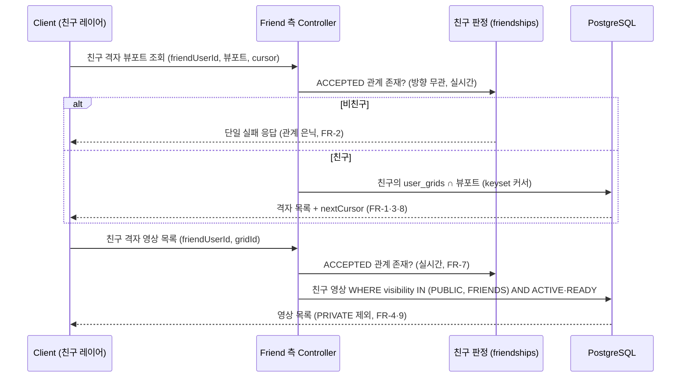
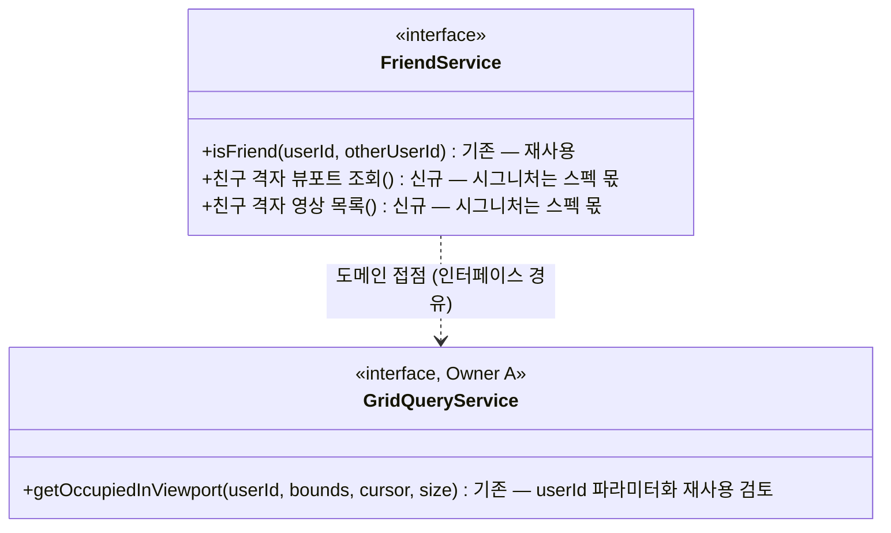

# PRD: 친구 도감 뷰포트 레이어 (친구 격자 지도 보기)

> 티켓: MSG-187 · 작성일: 2026-08-04 · 작성: prd-writer
> 상태: 검토됨  <!-- 2026-08-04 사용자 승인 (수정 없이 원안 승인). 수명주기: 초안 → 검토됨 → 확정 -->

## 1. 문제 상황

친구 기능의 API 축 3종 — 친구 관계(MSG-185), 친구 목록·프로필(MSG-186), 영상 "친구만 보기"
공개범위(MSG-285) — 이 모두 develop에 머지됐지만, 정작 **친구의 도감을 지도에서 보는 화면이
없다.** 친구 프로필에는 도감 요약(수집률·최근 격자 30개)만 있고, "친구가 어디를 채웠는지"를
지도 위 격자로 보는 경로가 없다. 또한 FRIENDS(친구만 보기) 공개범위 영상은 재생 판정만 구현돼
있고 친구에게 목록으로 노출되는 경로가 0개라, 친구에게만 보여주려고 올린 영상을 친구가 발견할
방법이 없다(MSG-285에서 본 티켓으로 명시 이월).

## 2. 목적 · 목표

- **목적**: 친구가 점령한 격자를 내 지도와 같은 방식(격자망 + 채움색)으로 열람하고, 그 격자에서
  친구의 영상(친구에게 허용된 공개범위)을 볼 수 있게 한다 — 친구 에픽(MSG-172)의 마지막 조각.
- **목표**:
  - 사용자가 친구 한 명을 선택해 그 친구의 점령 격자를 지도 뷰포트에서 볼 수 있다.
  - 친구 격자를 선택하면 그 친구의 해당 격자 영상 목록(PUBLIC + FRIENDS)을 볼 수 있다.
  - 친구 프로필 최근 격자 썸네일이 재생 허용 범위(PUBLIC + FRIENDS)와 정합해진다.
- **비목표(스코프 제외)**:
  - 전체 친구 합산 레이어(모든 친구를 한 번에) — Phase 2+.
  - 격자 전역 노출 경로(대표 영상·전역 목록·탐색 집계)의 FRIENDS 확장 — PUBLIC 한정 유지.
  - 친구별 색상 렌더 — 단일색 확정으로 불요(아래 확정 결정).
  - 그룹(다인) 개념 — MSG-188에서 미도입 확정.
  - 격자망(미점령 포함) 렌더링 — FE-local 산술(격자 계산 규칙), 서버 관여 없음.

### 확정된 기획 결정 (2026-08-04)

| # | 항목 | 결정 |
|---|------|------|
| 1 | 친구 격자 색 | **단일색 통일** — 색값은 FE/디자인 몫. 서버는 색 정보를 내려주지 않는다 (친구별 `grid_color` 미사용) |
| 2 | 나+친구 겹침 | **친구 색 우선** — 친구 레이어 열람 중에는 친구 채움색이 위. FE 그리기 순서로 해결, 서버 무영향 |
| 3 | 미점령 격자 | **격자망 상시 표시** — 지도는 항상 점선 격자망을 깔고 점령 격자만 채운다(피그마 ver8 지도 홈, 노드 14094:3981 실측). FE-local 렌더, 서버 무영향. 기존 glossary "미점령 미표시" 정책은 이 결정으로 대체 |
| 4 | 대상·진입 | **특정 친구 1명** — 친구 목록/프로필에서 "도감 보기"로 진입, 그 친구의 레이어만 표시 |
| 5 | FRIENDS 노출 | **친구 격자 영상 목록 신설** — 그 친구의 영상만, PUBLIC + FRIENDS(PRIVATE 제외). 전역 경로 확장 안 함 |

## 3. 기능 요구사항

| ID | 요구사항 | 우선순위 |
|----|----------|----------|
| FR-1 | 사용자는 ACCEPTED 친구(방향 무관)의 점령 격자를 지도 뷰포트 범위로 조회할 수 있다 | Must |
| FR-2 | 친구가 아닌 사용자의 격자를 조회하면 관계·계정 존재를 드러내지 않는 단일 실패 응답을 받는다 (MSG-186 프로필과 동일 정책) | Must |
| FR-3 | 친구 격자 조회 응답은 내 뷰포트 조회와 동일한 계약이다 — 격자 식별자·좌표 인덱스·커서 페이지네이션. 색상 필드는 없다 | Must |
| FR-4 | 사용자는 친구의 특정 격자에서 그 친구의 영상 목록을 볼 수 있다 — 공개범위 PUBLIC·FRIENDS 영상만 포함되고 PRIVATE는 절대 포함되지 않는다 | Must |
| FR-5 | 친구 격자 영상 목록의 각 영상은 기존 재생 판정(MSG-285)을 그대로 통과한다 — 목록에 보인 영상은 재생도 가능하다 (목록·재생 정합) | Must |
| FR-6 | 친구 프로필의 최근 격자 썸네일은 PUBLIC + FRIENDS 영상에서 선택된다 (현재 PUBLIC만 — 재생 허용 범위와 정합화) | Must |
| FR-7 | 친구 삭제 즉시 다음 요청부터 친구 격자 조회·친구 격자 영상 목록이 거부된다 — 판정은 요청 시점 실시간, 캐시 없음 (MSG-285 정합) | Must |
| FR-8 | 친구가 점령한 격자가 없는 뷰포트를 조회하면 실패가 아니라 빈 목록을 받는다 | Must |
| FR-9 | 친구 격자 영상 목록에 삭제된 영상·인코딩 미완료 영상은 포함되지 않는다 (전역 노출과 동일한 ACTIVE·READY 게이트) | Must |
| FR-10 | 뷰포트·커서·페이지 크기 검증은 내 뷰포트 조회와 동일한 규칙·동일한 에러로 동작한다 | Should |

## 4. 비기능 요구사항

| 분류 | 요구사항 |
|------|----------|
| 성능 | 친구 격자 뷰포트 조회는 내 뷰포트 조회와 동급 성능 목표(동일 상한·페이지 규칙 준용). 친구 판정 추가 비용은 요청당 1회 존재 확인 수준 |
| 보안/인가 | 모든 API는 인증 필수. 친구 여부는 요청 시점에 판정하며, 비친구 응답은 관계·계정 존재를 은닉한다(FR-2). PRIVATE 영상은 어떤 친구 경로에도 노출 금지 |
| 데이터 정합 | 점령 롤백(glossary)과 정합 — 친구가 격자의 영상을 모두 삭제하면 그 격자는 친구 레이어에서도 사라진다. 별도 비정규화·캐시 없음 |
| 운영 | DB 마이그레이션 없음(기존 테이블·인덱스 그대로). 전역 노출용 부분 인덱스(`idx_videos_grid_popular`, PUBLIC 한정) 보존 — 전역 쿼리 9곳 무변경 |

## 5. 시퀀스 다이어그램

## 6. 클래스 다이어그램

신규 타입은 스펙 단계에서 확정 — 기존 계약의 재사용 지점만 표기.

## 7. 변경 파일 목록

리서치 실측 기반(2026-08-04). 구체 시그니처·쿼리 배치는 스펙 몫.

| 파일 | 변경 | Owner |
|------|------|-------|
| `src/main/java/com/msg/fillmap/friend/controller/FriendController.java` | 수정 — 친구 격자 뷰포트·친구 격자 영상 목록 진입점 추가 | B |
| `src/main/java/com/msg/fillmap/friend/service/FriendService.java` / `impl/FriendServiceImpl.java` | 수정 — 친구 판정 + 조회 위임 | B |
| `src/main/java/com/msg/fillmap/grid/service/GridQueryService.java` | 재사용 — 기존 4-인자 커서 시그니처가 이미 `userId`를 받음. 접점 변경 여부는 스펙에서 판단 | A |
| `src/main/java/com/msg/fillmap/grid/repository/GridRepository.java` | 재사용 — `findOccupiedPageAfter`(keyset)가 user_id 파라미터라 그대로 활용 가능 | A |
| `src/main/java/com/msg/fillmap/video/repository/VideoRepository.java` | 수정 — 친구 격자 영상 목록 쿼리 신규 (`my-videos` 템플릿 + visibility IN 게이트) | B |
| `src/main/java/com/msg/fillmap/usergrid/repository/UserGridRepository.java` | 수정 — `getCollectionGridsForFriend` 썸네일 게이트 `PUBLIC` → `IN ('PUBLIC','FRIENDS')` (인라인 TODO 기등록, FR-6) | B |
| `.claude/rules/glossary.md` | 수정 — 미점령 격자(격자망 상시 표시)·친구 도감 확정 반영 | - |

DB 마이그레이션: 없음.

## 8. 미해결 질문

- [ ] 친구 격자 영상 목록의 정렬 — 전역 목록(인기순)과 내 도감(최신순) 중 어느 쪽 관례를 따를지 (스펙에서 결정, 기본 최신순 제안)
- [ ] FE 친구 레이어 진입 UI — 탐색 탭 "친구 도감" 섹션 시안 별도 진행 중(디자인 몫, BE 계약 무영향)
