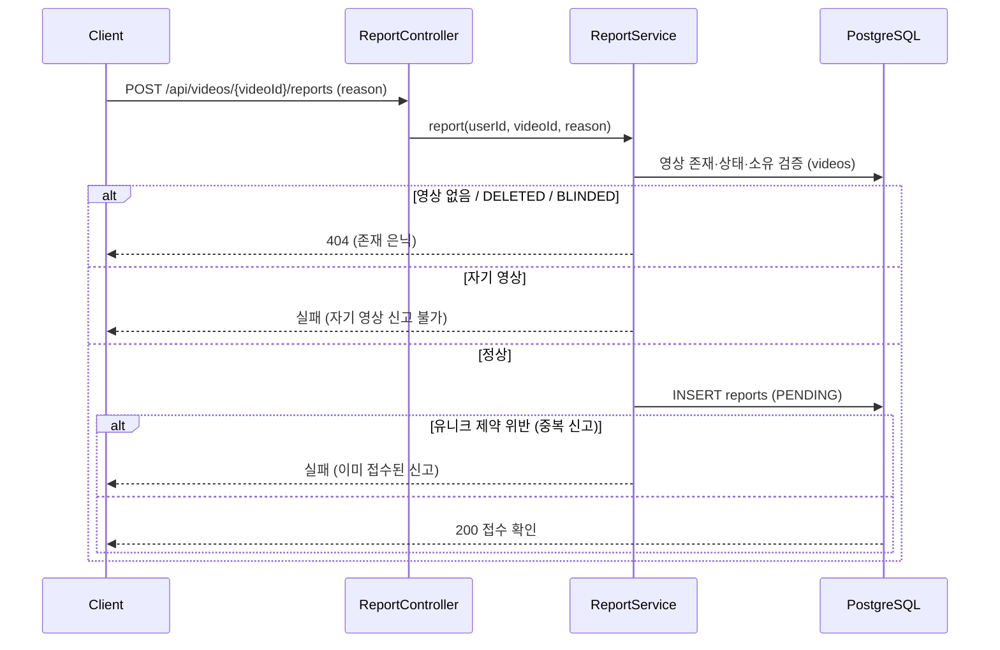
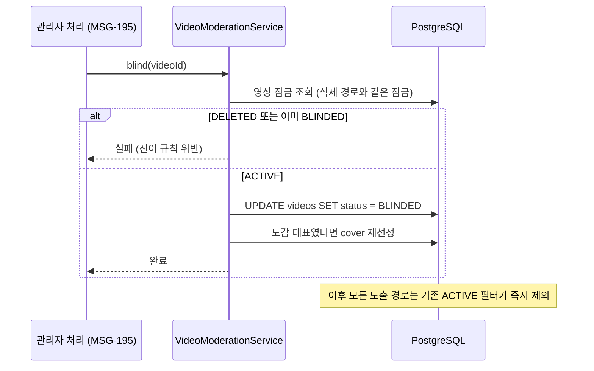
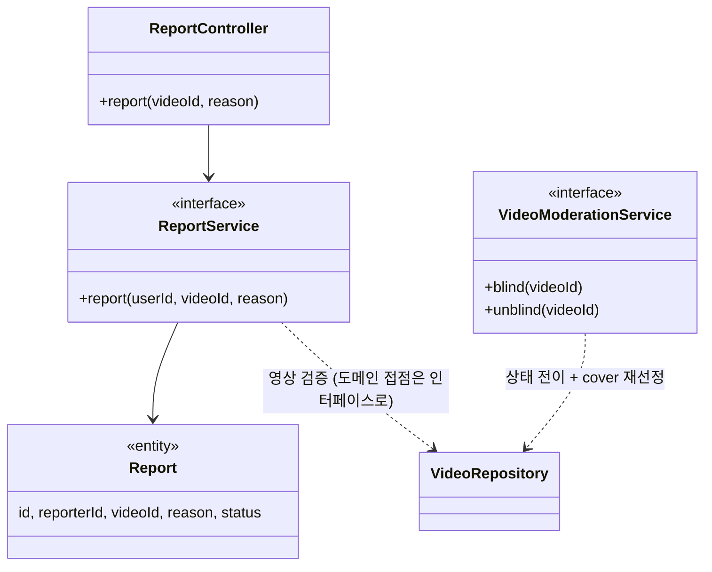

# PRD: 영상 신고 접수와 블라인드 처리 (MSG-192, MSG-193 공유 PRD)

> 티켓: MSG-192, MSG-193 (신고·차단 에픽 MSG-174 하위) · 작성일: 2026-08-06 · 작성: prd-writer
> 상태: 검토됨 (2026-08-06 강정민 승인. 작성 전 확정 2건: 블라인드는 관리자 수동만, 신고 대상은 영상만. 승인 시 확정 1건: OTHER 상세 텍스트 받음)  <!-- 수명주기: 초안 → 검토됨(사용자 승인 시 게이트가 갱신) → 확정 -->

## 1. 문제 상황

부적절한 영상(불법 촬영, 사생활 침해, 스팸 등)이 올라와도 지금은 서비스가 할 수 있는 일이 없다.
구체적으로 세 가지가 비어 있다.

- 피그마 격자 상세 화면에는 더보기 메뉴에 신고 UI(사유 선택 후 접수)가 그려져 있지만,
  대응하는 API 스펙이 0건이다. 2026-07-24 디자인 실사에서 확인된 갭이 그대로 남아 있다.
- `reports` 테이블은 V1 스키마부터 존재하는데, 이 테이블을 읽거나 쓰는 코드가 한 줄도 없다.
- 영상 상태 `BLINDED`[^1]는 재생 경로(타인에게 404 은닉)와 전역 노출 경로(ACTIVE 필터)가
  이미 대비하고 있다. 그런데 정작 영상을 BLINDED로 만들거나 되돌리는 수단이 DB 수동
  UPDATE뿐이다.

사용자에게 웹을 공개하기 전에, 문제 영상을 알릴 통로(신고)와 운영이 조치할 수단(블라인드)의
최소 루프는 갖춰야 한다.

## 2. 목적 · 목표

- **목적**: 신고 접수(MSG-192)와 블라인드 전환·해제(MSG-193)로 모더레이션[^2]의 최소 루프를
  연다. 접수된 신고가 관리자 처리(MSG-195)의 입력이 되는 구조까지가 이번 범위다.
- **목표**:
  - 로그인 사용자가 다른 사람의 영상을 사유와 함께 신고할 수 있다 (MSG-192)
  - 접수된 신고가 reports 테이블에 남아 이후 관리자 처리(MSG-195)에서 조회된다 (MSG-192)
  - 운영 판단으로 영상을 BLINDED로 전환하고, 다시 ACTIVE로 해제할 수 있다 (MSG-193)
  - 전환 즉시 그 영상이 재생과 모든 노출 경로에서 사라진다 (MSG-193)
- **비목표(스코프 제외)**:
  - **사용자 신고**: 신고 대상은 영상만이다 (2026-08-06 확정). V1 reports 테이블이 video_id
    전용이고 피그마에도 영상 신고 UI만 있다. 사용자 단위 대응은 차단(MSG-194)이 담당한다.
    지라 티켓 제목의 "영상/사용자 신고"는 "영상 신고"로 정정이 필요하다.
  - **자동 블라인드 임계**: 신고가 몇 건 쌓여도 자동 전환하지 않는다 (2026-08-06 확정,
    관리자 수동만). 전환과 해제의 트리거는 전부 관리자 API(MSG-195)다.
  - **관리자 API와 관리자 인증**: MSG-195 몫이다. 이번에는 전이 로직을 서비스 레이어로만
    만들어 두고, 이를 호출하는 HTTP 엔드포인트는 열지 않는다.
  - **신고자에게 처리 결과 알림**: 후속 논의 대상이다.
  - **차단**: MSG-194 별도 티켓이다.

## 3. 기능 요구사항

| ID | 요구사항 | 티켓 | 우선순위 |
|----|----------|------|----------|
| FR-1 | 로그인 사용자는 영상을 사유 5종(INAPPROPRIATE, PRIVACY, SPAM, COPYRIGHT, OTHER) 중 하나와 함께 신고할 수 있고, 접수 확인 응답을 받는다 | 192 | Must |
| FR-2 | 같은 사용자가 같은 영상을 두 번 신고할 수 없다. 재신고는 "이미 접수된 신고" 실패 응답을 받는다 | 192 | Must |
| FR-3 | 존재하지 않는 영상, 삭제(DELETED)된 영상, 이미 블라인드된 영상의 신고는 404로 거부한다. 재생 경로의 존재 은닉[^3] 규칙과 같다 | 192 | Must |
| FR-4 | 자기 영상은 신고할 수 없다 (본인 영상 정리는 삭제 기능이 담당한다) | 192 | Must |
| FR-5 | 지원하지 않는 사유 값은 400으로 거부한다 | 192 | Must |
| FR-5a | 신고에 상세 설명 텍스트를 함께 보낼 수 있다. OTHER 사유는 상세 설명이 필수고(없으면 400), 나머지 사유는 선택이다. 최대 500자를 넘으면 400으로 거부한다 | 192 | Must |
| FR-6 | ACTIVE 영상을 BLINDED로 전환할 수 있다. 호출 주체는 서비스 레이어이고 HTTP 노출은 MSG-195에서 한다 | 193 | Must |
| FR-7 | BLINDED 영상을 ACTIVE로 해제할 수 있다 | 193 | Must |
| FR-8 | DELETED 영상이나 이미 목표 상태인 영상에 대한 전환·해제 요청은 실패한다. 잘못된 전이를 조용히 넘기지 않는다 | 193 | Must |
| FR-9 | BLINDED 전환 즉시 타인 재생은 404가 되고, 전역 노출(대표 영상, 전역 목록, 탐색 집계)과 개인 목록에서 제외된다. 소유자의 단건 조회만 상태 확인이 가능하되 재생 URL은 발급되지 않는다 (MSG-206 구현 그대로) | 193 | Must |
| FR-10 | 전환된 영상이 개인 도감 대표(cover)였다면 남은 ACTIVE 영상으로 대표를 재선정한다. 해제해도 대표를 원복하지 않는다 | 193 | Must |
| FR-11 | 블라인드 전환은 점령과 video_count에 영향을 주지 않는다. 점령 롤백은 삭제에만 적용된다 (glossary 규칙) | 193 | Must |

## 4. 비기능 요구사항

| 분류 | 요구사항 |
|------|----------|
| 보안/인가 | 신고 접수는 로그인 필수. 전환·해제 로직은 이번 범위에서 HTTP로 노출하지 않는다. 관리자 인증 체계가 없는 상태에서 엔드포인트를 열면 누구나 남의 영상을 내릴 수 있기 때문이다 |
| 데이터 정합 | 중복 신고 방지는 애플리케이션 검사에 더해 DB 유니크 제약[^4]으로 보장한다 (동시 요청 경쟁 대비). 블라인드 전환은 삭제 경로(MSG-243)와 같은 잠금 규칙으로 상태 전이 경쟁을 막는다 |
| 성능 | 신고 접수는 단건 INSERT라 별도 성능 요구 없음. 기존 조회 경로에 새 조건을 더하지 않는다 (이미 전부 ACTIVE 필터) |
| 운영 | 마이그레이션 1건(V27): 중복 신고 방지 유니크 제약 + 상세 텍스트 컬럼 추가. reports 테이블은 코드 미사용이라 기존 행이 없고, 변경이 실패할 데이터 위험도 없다 |

## 5. 시퀀스 다이어그램

신고 접수 (MSG-192):

블라인드 전환 (MSG-193, 호출 주체는 이후 MSG-195 관리자 API):

## 6. 클래스 다이어그램

신고(Report 계열)는 신규 moderation 패키지에 둔다. 상태 전이(VideoModerationService)는 Video
엔티티의 소유 도메인인 video 패키지에 두고, MSG-195가 이 인터페이스를 호출한다. 도메인 간
접점은 기존 협업 원칙대로 인터페이스로만 연결한다.

## 7. 변경 파일 목록

| 파일 | 변경 | Owner |
|------|------|-------|
| `src/main/java/com/msg/fillmap/moderation/controller/ReportController.java` | 신규 (MSG-192) | B |
| `src/main/java/com/msg/fillmap/moderation/service/ReportService.java` + `Impl` | 신규 (MSG-192) | B |
| `src/main/java/com/msg/fillmap/moderation/entity/Report.java`, `ReportReason.java`, `ReportStatus.java` | 신규 (MSG-192, V1 CHECK 값과 일치) | B |
| `src/main/java/com/msg/fillmap/moderation/repository/ReportRepository.java` | 신규 (MSG-192) | B |
| `src/main/java/com/msg/fillmap/moderation/exception/ReportErrorCode.java` | 신규, developCode 11xxx 대역 (MSG-192) | B |
| `src/main/java/com/msg/fillmap/video/service/VideoModerationService.java` + `Impl` | 신규 (MSG-193, 전환·해제·cover 재선정) | B |
| `src/main/resources/db/migration/V27__reports_detail_and_unique.sql` | 신규 (MSG-192, 상세 텍스트 컬럼 + 중복 신고 방지 유니크 제약) | - |
| `.claude/rules/response-pattern.md` | 수정, 대역표에 11xxx moderation 행 추가 (대역 선점 커밋 선행 규칙) | - |
| `.claude/docs/infrastructure.md`, `.claude/docs/status.md` | 수정, moderation 패키지 Owner 배정 반영 | - |
| `src/test/java/com/msg/fillmap/moderation/...` + `video/.../VideoBlindIntegrationTest.java` | 신규 테스트 | B |

## 8. 미해결 질문

- [x] ~~OTHER 사유 선택 시 자유 텍스트 상세를 받을지~~ 받는다 (2026-08-06 확정). OTHER는 필수,
  나머지 사유는 선택, 최대 500자 (FR-5a). V27 마이그레이션에 컬럼 추가를 포함한다.
- [ ] 관리자 인증 방식. MSG-195에서 확정하면 되고, 이번 범위는 HTTP 미노출이라 블로킹이 아니다.
- [ ] 지라 MSG-192 제목 정정("영상/사용자 신고 접수 API" → "영상 신고 접수 API") 반영 여부.
- [ ] FE 신고 모달에 상세 설명 입력란 추가 요청. 디자인 실사 기록에는 사유 선택만 있어서
  FE와 디자인에 전달이 필요하다.

[^1]: BLINDED: 영상 상태값(videos.status) 중 하나로, 신고 조치로 가려진 상태. 삭제(DELETED)와
    달리 데이터는 남아 있고 운영 판단으로 되돌릴 수 있다.
[^2]: 모더레이션(moderation): 부적절한 콘텐츠를 신고받고 검토해 내리는 커뮤니티 운영 활동 전반.
[^3]: 존재 은닉: 권한 없는 요청에 403(권한 없음) 대신 404(없음)를 돌려줘 리소스의 존재 자체를
    숨기는 응답 방식. 403을 주면 "영상이 있긴 있다"는 정보가 새기 때문이다.
[^4]: 유니크 제약(unique constraint): 같은 값 조합의 행이 두 번 저장되는 것을 DB가 거부하는
    규칙. 애플리케이션 검사만으로는 같은 순간에 들어온 두 요청을 막지 못해 DB 제약이 최종
    방어선이 된다.
