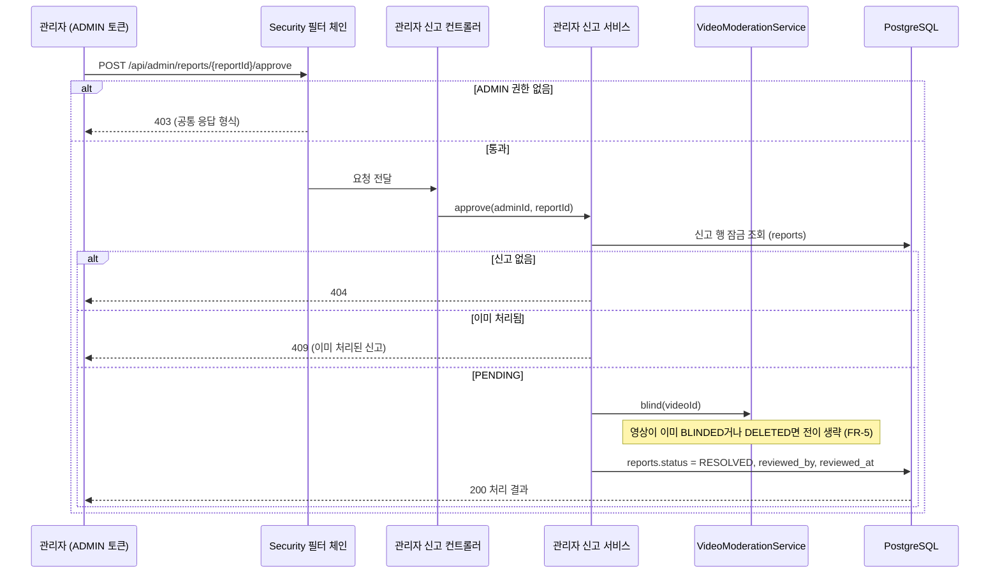
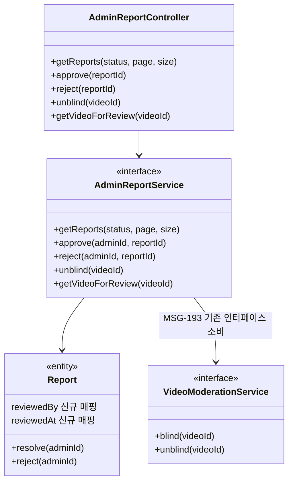

# PRD: 관리자 신고 처리 API (MSG-195)

> 티켓: MSG-195 (신고·차단 에픽 MSG-174 하위) · 작성일: 2026-08-06 · 작성: prd-writer
> 상태: 검토됨 (2026-08-06 강정민 승인. 미해결 질문 4건 전부 확정 반영, 플랜 승인이 PRD 승인을 겸함)  <!-- 수명주기: 초안 → 검토됨(사용자 승인 시 게이트가 갱신) → 확정 -->

## 1. 문제 상황

신고 접수(MSG-192)가 열리면서 reports 테이블에 PENDING 신고가 쌓이기 시작하는데,
이걸 열람하거나 처리할 수단이 하나도 없다. 구체적으로 세 가지가 비어 있다.

- 접수된 신고를 조회하는 API가 없다. 지금은 DB에 직접 SELECT를 날려야 신고가 있는지조차
  알 수 있다.
- 블라인드[^1] 전환과 해제(MSG-193)는 서비스 레이어로만 존재하고 HTTP로 노출되지 않았다.
  문제 영상을 실제로 내리려면 여전히 DB 수동 UPDATE뿐이다. MSG-193 스펙이 "호출 주체는
  MSG-195 관리자 API"라고 명시하며 이 티켓을 기다리고 있다.
- 관리자라는 행위자가 API에 없다. 역할 배관은 완비돼 있다. `UserRole{USER, ADMIN}` enum과
  `users.role` 컬럼이 V1부터 있고, JWT에 role 클레임[^2]이 실리며, 인증 필터가
  `ROLE_ADMIN` 권한까지 SecurityContext에 심는다. 그런데 그 권한을 검사하는 인가[^3]
  지점이 코드 전체에 0곳이다.

신고 접수만 있고 처리가 없으면 모더레이션 루프가 반쪽이다. 웹 공개 전에 접수부터 조치까지
한 바퀴가 돌아야 한다.

## 2. 목적 · 목표

- **목적**: 신고 접수(MSG-192)와 블라인드 서비스(MSG-193)를 잇는 마지막 조각으로,
  관리자가 접수된 신고를 열람하고 승인 또는 기각으로 종결하는 API를 연다. 승인된 신고의
  영상은 즉시 내려간다.
- **목표**:
  - 관리자가 신고 목록을 상태별로 조회하고, 판단에 필요한 정보(사유, 상세 설명, 대상 영상)를
    한 화면 분량으로 받는다
  - 승인하면 신고가 RESOLVED로 종결되고 대상 영상이 블라인드된다. 기각하면 REJECTED로
    종결되고 영상은 그대로다. 두 경우 모두 누가 언제 처리했는지 남는다
  - 오판이었으면 블라인드를 해제해 영상을 복구할 수 있다
  - ADMIN이 아닌 사용자는 관리자 API에 접근할 수 없다
- **비목표(스코프 제외)**:
  - **관리자 계정 생성 수단**: API도 시드도 만들지 않는다 (2026-08-06 확정). 계정 승격은
    DB에서 `UPDATE users SET role = 'ADMIN'`을 수동 실행하는 운영 절차로 갈음하고,
    절차를 문서로만 남긴다.
  - **REVIEWING 상태**: 처리 흐름은 PENDING에서 바로 승인 또는 기각으로 가는 2액션이다
    (2026-08-06 확정). REVIEWING은 스키마에 남아 있지만 이번 흐름에서 쓰지 않는다.
  - **대시보드 화면**: FE 몫이다. 백엔드는 API까지만 만든다.
  - **일괄 처리**: 신고는 한 건씩 종결한다. 여러 신고를 한 번에 처리하는 기능은 SA가
    Phase 2+ 확장으로 분류한 영역이다.
  - **신고자에게 처리 결과 알림**: MSG-192 PRD에서 이월된 후속 논의 대상 그대로다.
  - **Trust Score, 사용자 정지, 사용자 차단**: 정지와 Trust Score는 SA의 확장 유즈케이스고,
    사용자 차단(MSG-194)은 제품 범위에서 제외가 확정됐다 (2026-08-06).

## 3. 기능 요구사항

| ID | 요구사항 | 우선순위 |
|----|----------|----------|
| FR-1 | 관리자는 신고 목록을 상태 필터와 함께 최신 접수 순으로 조회할 수 있다. 필터 기본값은 PENDING이고, 처리된 신고도 필터를 바꿔 조회할 수 있다. 지원하지 않는 상태 값은 400으로 거부한다 | Must |
| FR-2 | 목록 항목에는 처리 판단에 필요한 정보가 담긴다: 신고 사유와 상세 설명, 접수 시각, 신고자 식별자와 닉네임, 대상 영상의 식별자와 현재 상태, 영상 소유자 닉네임 (닉네임 포함은 2026-08-06 확정) | Must |
| FR-3 | 관리자는 신고된 영상을 영상의 공개 범위나 상태와 무관하게 확인(재생)할 수 있다. 일반 재생 경로는 BLINDED 영상을 404로 은닉[^4]하므로 관리자용 확인 수단이 별도로 필요하다. 확인 수단은 목록과 분리된 단건 확인 요청으로 두고, 확인 시점에 재생 URL을 발급한다 (2026-08-06 확정. 목록에 URL을 실으면 발급 시점과 시청 시점이 벌어져 만료 문제가 생기고, 기존 사용자 재생 경로에 관리자 예외를 넣으면 조회수 증가와 은닉 로직이 오염된다) | Must |
| FR-4 | 관리자는 PENDING 신고를 승인할 수 있다. 승인하면 신고가 RESOLVED가 되고 대상 영상이 블라인드되며, 처리자와 처리 시각이 기록된다. 신고 종결과 영상 전이는 하나의 트랜잭션[^5]으로 묶인다 | Must |
| FR-5 | 승인 시 대상 영상이 이미 블라인드 상태면(같은 영상의 다른 신고가 먼저 승인된 경우) 영상 전이는 건너뛰고 신고만 RESOLVED로 종결한다. 영상이 삭제된 상태여도 마찬가지로 신고만 종결한다 | Must |
| FR-6 | 관리자는 PENDING 신고를 기각할 수 있다. 신고가 REJECTED가 되고 처리자와 처리 시각이 기록되며, 영상은 어떤 영향도 받지 않는다 | Must |
| FR-7 | 이미 처리된(RESOLVED 또는 REJECTED) 신고에 대한 승인·기각 요청은 충돌 응답으로 실패한다. 존재하지 않는 신고는 404다 | Must |
| FR-8 | 관리자는 블라인드된 영상을 해제해 ACTIVE로 복구할 수 있다. 해제는 영상 축의 조치라서 신고 상태를 되돌리지 않는다 (RESOLVED는 그대로 남는다) | Must |
| FR-9 | ADMIN이 아닌 로그인 사용자가 관리자 API를 호출하면 권한 없음(403)으로 거부된다. 토큰 없는 요청은 401이다. 두 실패 모두 공통 응답 형식을 유지한다 | Must |
| FR-10 | 같은 신고를 두 관리자가 동시에 처리하면 한 명만 성공하고 나머지는 FR-7의 충돌 응답을 받는다 | Must |

## 4. 비기능 요구사항

| 분류 | 요구사항 |
|------|----------|
| 보안/인가 | `/api/admin` 아래 모든 경로는 ADMIN role 필수. 기존 JWT role 클레임과 `ROLE_ADMIN` 권한 배관을 소비하고 새 인증 체계를 만들지 않는다. 관리자 계정 승격 운영 절차(DB 수동 UPDATE)를 문서화한다 |
| 데이터 정합 | 승인의 신고 종결과 영상 블라인드는 한 트랜잭션. 동시 처리 경쟁은 신고 행 기준으로 직렬화한다. 영상 전이는 MSG-193의 잠금 규칙을 그대로 재사용한다 (삭제, 신고 접수 경로와 같은 행 잠금) |
| 성능 | MVP 신고량은 소규모라 수치 목표는 없다. 다만 목록은 페이지 단위로 끊어 내려주고 전체를 한 번에 반환하지 않는다. 방식은 일반 오프셋 페이징이다 (2026-08-06 확정. 사용자향 목록 API는 전부 keyset 커서지만 관리자 전용 소량 데이터라 커서의 이점이 없다) |
| 운영 | 마이그레이션 불요 예상. `reports.reviewed_by`(FK, 처리자 탈퇴 시 NULL)와 `reviewed_at` 컬럼이 V1부터 있어 엔티티 매핑만 추가하면 된다 |

## 5. 시퀀스 다이어그램

승인 흐름 (핵심 플로우):

## 6. 클래스 다이어그램

관리자 신고 처리는 기존 moderation 패키지(Owner B)에 둔다. 영상 전이는 video 패키지의
`VideoModerationService`를 호출만 하고 video 쪽 코드는 건드리지 않는다. 컨트롤러 분리
여부(신고 축과 영상 해제 축)는 스펙에서 정한다.

## 7. 변경 파일 목록

| 파일 | 변경 | Owner |
|------|------|-------|
| `src/main/java/com/msg/fillmap/moderation/controller/AdminReportController.java` | 신규 | B |
| `src/main/java/com/msg/fillmap/moderation/service/AdminReportService.java` + `Impl` | 신규 | B |
| `src/main/java/com/msg/fillmap/moderation/entity/Report.java` | 수정 (reviewed_by, reviewed_at 매핑과 상태 전이 메서드 추가) | B |
| `src/main/java/com/msg/fillmap/moderation/repository/ReportRepository.java` | 수정 (상태 필터 목록 조회 추가) | B |
| `src/main/java/com/msg/fillmap/moderation/exception/ReportErrorCode.java` | 수정 (이미 처리된 신고 등 처리 실패 코드 추가, 11xxx 대역 내) | B |
| `src/main/java/com/msg/fillmap/moderation/dto/` (목록, 처리 응답) | 신규 | B |
| `src/main/java/com/msg/fillmap/global/config/SecurityConfig.java` | 수정 (`/api/admin/**` ADMIN 전용 matcher) | B |
| 403 응답 형식 핸들러 (AccessDeniedHandler) | 스펙에서 실측 후, 공통 응답 형식이 아니면 신규 추가 확정 (2026-08-06) | B |
| 관리자 계정 승격 운영 절차 문서 | 신규 절 (위치는 스펙에서, deploy 문서 후보) | - |
| `src/test/java/com/msg/fillmap/moderation/...` | 신규 테스트 | B |

마이그레이션 없음 예상. 목록 조회용 인덱스(reports.status, created_at)가 필요해지면
그때 V28로 추가한다 (MVP 신고량 기준 필요성은 스펙에서 판단).

## 8. 미해결 질문

전부 해소됐다 (2026-08-06 강정민 확정).

- [x] ~~신고 목록에 신고자와 영상 소유자의 닉네임을 함께 내려줄지~~ 내려준다. FR-2에 반영.
- [x] ~~FR-3 영상 확인 수단의 형태~~ 목록과 분리된 관리자용 단건 확인 API로 확정하고, 확인
  시점에 재생 URL을 발급한다. 근거는 FR-3에 함께 적었다.
- [x] ~~인가 실패(403) 응답 형식~~ 스펙 단계에서 실측하고, 공통 응답 형식이 아니면
  AccessDeniedHandler를 추가하는 것으로 확정 (현재 커스터마이징이 없는 이유는 403을 만드는
  인가 경로 자체가 없었기 때문).
- [x] ~~신고 목록 페이지네이션 방식~~ 일반 오프셋 페이징으로 확정. 관리자 전용 소량 데이터라
  keyset 커서가 필요 없다. 비기능 요구사항 성능 행에 반영.

[^1]: 블라인드(BLINDED): 영상 상태값 중 하나로, 신고 조치로 가려진 상태. 삭제와 달리
    데이터는 남아 있고 운영 판단으로 되돌릴 수 있다. 전환 즉시 재생과 모든 노출 경로에서
    사라진다 (MSG-193).
[^2]: 클레임(claim): JWT 토큰 안에 담긴 키-값 정보 조각. 이 프로젝트는 로그인 시 발급하는
    액세스 토큰에 사용자 id와 함께 role(USER 또는 ADMIN)을 싣는다.
[^3]: 인가(authorization): 인증(누구인지 확인)과 구분되는 개념으로, 확인된 사용자가 이
    행동을 해도 되는지 판단하는 것. 지금 코드는 인증만 있고 role 기반 인가 검사가 없다.
[^4]: 존재 은닉: 권한 없는 요청에 403 대신 404를 돌려줘 리소스의 존재 자체를 숨기는 응답
    방식. 일반 사용자용 재생 경로가 BLINDED 영상에 이 규칙을 쓴다.
[^5]: 트랜잭션(transaction): 여러 DB 변경을 전부 성공 아니면 전부 취소로 묶는 단위. 신고만
    종결되고 영상은 안 내려가는 어긋난 상태를 막는다.
