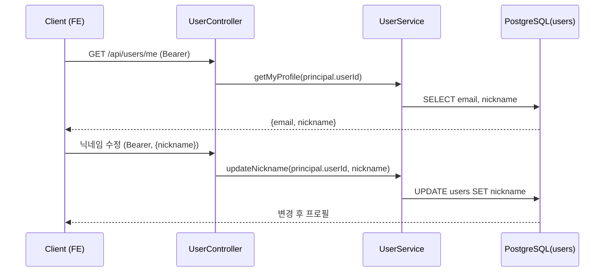
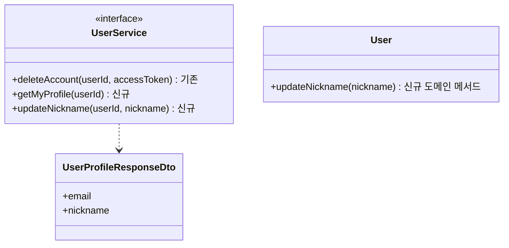

# PRD: 프로필 조회·닉네임 수정 API

> 티켓: MSG-203 · 작성일: 2026-08-03 · 작성: prd-writer
> 상태: 검토됨  <!-- 2026-08-03 사용자 스코프 확정(조회 email·nickname 최소 + 닉네임 수정, 색상 제외) 반영 -->

## 1. 문제 상황

FE 프로필 화면(MSG-124 UI)은 구현돼 있지만 전부 mock 데이터다 — 백엔드 user 패키지에
조회/수정 API가 없어서다 (현재 entity/repository + 계정 삭제(MSG-205)만 존재, dto 디렉터리 없음).
카카오 로그인 시 이메일·닉네임은 id_token 클레임에서 자동 저장되고 있는데, 정작 사용자가
자기 프로필에서 그 값을 확인하거나 닉네임을 바꿀 방법이 없다.

## 2. 목적 · 목표

- **목적**: 소셜 로그인으로 자동 저장된 내 계정 정보를 확인하고, 표시 이름(닉네임)을 바꿀 수 있게 한다.
- **목표**:
  - 로그인 사용자가 자기 이메일·닉네임을 조회할 수 있다
  - 로그인 사용자가 닉네임을 변경할 수 있고, 변경이 즉시 조회에 반영된다
- **비목표(스코프 제외)**:
  - **도감 색상(grid_color) 수정 — 기획에 없음** (2026-08-03 사용자 확정. 티켓 설명·glossary
    "프로필에서 변경 가능" 문구와 상충 — 위키 노트에도 "디자인 ver9에 UI 없음, 범위 재논의 중"으로
    기록돼 있었고 이번에 제외로 확정. glossary 문구 정리는 후속)
  - 프로필 이미지 업로드, 이메일 변경, 계정 삭제(MSG-205 완료), 조회 응답의 추가 필드
    (가입일·provider 등 — 필요해지면 additive 확장)

## 3. 기능 요구사항

| ID | 요구사항 | 우선순위 |
|----|----------|----------|
| FR-1 | 로그인 사용자는 자기 프로필(이메일·닉네임)을 조회할 수 있다 | Must |
| FR-2 | 로그인 사용자는 닉네임을 변경할 수 있다 — 허용 길이는 가입과 동일한 2~20자 | Must |
| FR-3 | 닉네임 검증 실패(빈 값·2자 미만·20자 초과) 시 400과 필드별 메시지를 받는다 | Must |
| FR-4 | 미인증 요청은 401을 받는다 (본인 외 대상 지정 불가 — 경로에 대상 식별자 없음) | Must |
| FR-5 | 닉네임 변경 직후 조회에 변경 값이 반영된다 | Must |
| FR-6 | 닉네임 중복은 허용한다 — 현행 유지 (DB UNIQUE 없음, 카카오 자동 닉네임이 이미 중복 가능. 유니크 강제는 소셜 가입 실패를 만들므로 MVP 비도입) | Must |

## 4. 비기능 요구사항

| 분류 | 요구사항 |
|------|----------|
| 보안/인가 | 인증 필수. 항상 본인 계정만 대상 — 사용자 식별은 토큰 principal에서만 (MSG-205 `DELETE /me` 관례) |
| 데이터 정합 | 소셜 로그인이 저장한 값을 가공 없이 노출. 닉네임 검증 규칙은 가입(SignupRequestDto 2~20자)과 동일 — 두 경로의 허용 범위가 어긋나지 않게 |
| 운영 | 마이그레이션 불요 — 기존 `users.email`·`users.nickname` 컬럼만 사용 |

## 5. 시퀀스 다이어그램

## 6. 클래스 다이어그램

## 7. 변경 파일 목록

| 파일 | 변경 | Owner |
|------|------|-------|
| `src/main/java/com/msg/fillmap/user/dto/UserProfileResponseDto.java` | 신규 (dto 디렉터리 신설) | B |
| `src/main/java/com/msg/fillmap/user/dto/` 닉네임 수정 RequestDto | 신규 | B |
| `src/main/java/com/msg/fillmap/user/entity/User.java` | 수정 — updateNickname 도메인 메서드 | B |
| `src/main/java/com/msg/fillmap/user/service/UserService.java` · `UserServiceImpl.java` | 수정 — 조회·닉네임 변경 메서드 추가 | B |
| `src/main/java/com/msg/fillmap/user/controller/UserController.java` | 수정 — GET /me · 닉네임 수정 엔드포인트 추가 | B |
| `src/test/java/com/msg/fillmap/user/...` | 신규 테스트 | B |

## 8. 미해결 질문

- [ ] 닉네임 수정 엔드포인트 형태 — `PATCH /api/users/me`(부분 수정 확장 여지) vs
  `PUT /api/users/me/nickname`(단일 필드 명시). 스펙 단계에서 결정
