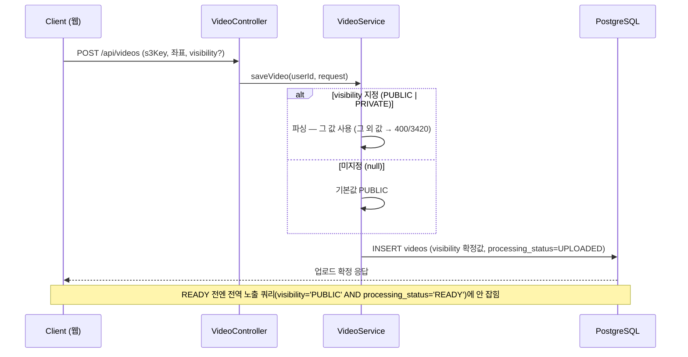
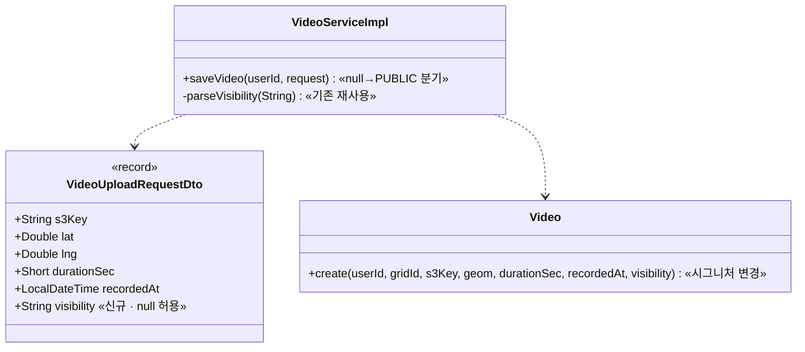

# PRD: 업로드 시 공개범위 지정 (PUBLIC/PRIVATE, 기본 공개)

> 티켓: MSG-204 · 작성일: 2026-08-01 · 작성: prd-writer
> 상태: 검토됨  <!-- 2026-08-01 사용자 승인 — 미해결 질문(BE 선배포 과도기)은 §8 해소 참조 -->

## 1. 문제 상황

영상을 올릴 때 공개 여부를 정할 수 없다. 업로드 확정 요청에 공개범위 입력이 없고 엔티티가 항상
비공개(PRIVATE)로 저장하므로, 올린 사람이 공개하려면 업로드가 끝난 뒤 전환 API
(`PATCH /api/videos/{videoId}/visibility`, MSG-162)를 한 번 더 불러야 한다. 지도에 게시하는
서비스인데 기본이 비공개라, 전환을 잊으면 대표 영상·전역 목록 같은 공개 노출면에 아무것도 안 잡힌다.
MSG-162 스펙 §M3가 "업로드 시 선택은 공개범위 UX 확정 후 별도 티켓"으로 미뤄둔 자리이며,
팀 위키 "PRD FillMap MVP 화면별 기능·API" §4의 미확정 항목(도감 공개 범위 — 공개/비공개 2단?)이
이 문서로 확정된다.

## 2. 목적 · 목표

- **목적**: 업로드 시점에 공개범위를 정하게 해서, "올리면 지도에 게시된다"는 제품 기본 동작을 완성한다.
- **목표**:
  - 사용자가 업로드 확정 한 번으로 공개(PUBLIC)/비공개(PRIVATE)를 정해 게시할 수 있다.
  - 공개범위를 지정하지 않은 업로드는 **공개(PUBLIC)로 게시**된다 (2026-08-01 확정 —
    MSG-162 §M3의 "기본 PRIVATE 안전값"을 제품 결정으로 대체. 업로드 미리보기 4/4 문구
    "확인한 뒤 지도에 게시돼요"와 정합).
  - 업로드 후 변경은 기존 전환 API(영상 "더보기" 메뉴)가 그대로 담당한다 — 신규 개발 없음.
- **비목표(스코프 제외)**:
  - **친구만 보기(FRIENDS)** — 친구 기능(Social) 미구현. MSG-285로 분리 (Phase 2).
  - **설정 화면의 공개범위 기본값 저장** (users 컬럼·설정 API — 이 티켓의 구 설명) — 폐기.
    디자인 ver8_칩수정버전 설정 화면(피그마 14026:8422)에 해당 항목이 없고, 업로드 시 지정으로 대체.
  - **기존 영상 소급 전환** — 과거 비공개 영상을 일괄 공개하지 않는다 (프라이버시).

## 3. 기능 요구사항

| ID | 요구사항 | 우선순위 |
|----|----------|----------|
| FR-1 | 업로더는 업로드 확정 요청에서 공개범위를 PUBLIC 또는 PRIVATE로 지정할 수 있다 | Must |
| FR-2 | 공개범위를 지정하지 않은(필드 생략·null) 업로드는 PUBLIC으로 저장된다 — 구버전 클라이언트 요청도 동일 | Must |
| FR-3 | PUBLIC/PRIVATE 외의 값(FRIENDS 포함)은 400과 도메인 에러 코드로 거부되고 영상은 저장되지 않는다 | Must |
| FR-4 | 업로드 직후 PUBLIC이어도 AI 처리 완료(READY) 전에는 대표 영상·전역 목록 등 공개 노출면에 나타나지 않는다 (기존 동작 유지) | Must |
| FR-5 | 이번 배포 전에 올라간 기존 영상의 공개범위는 변하지 않는다 | Must |
| FR-6 | 영상 교체(파일 재업로드)는 공개범위를 유지한다 (기존 동작 유지) | Must |
| FR-7 | 영상 소유자는 업로드 후 "더보기"에서 공개범위를 변경할 수 있다 — 기존 `PATCH /api/videos/{videoId}/visibility` 재사용, 회귀 확인만 | Should |

## 4. 비기능 요구사항

| 분류 | 요구사항 |
|------|----------|
| 보안/인가 | 업로드 확정은 기존대로 인증 필수 — 공개범위는 업로드 본인 것에만 적용된다 (요청 필드라 타인 영상에 닿을 경로 없음) |
| 데이터 정합 | 공개범위 값은 DB CHECK(`PUBLIC`/`PRIVATE`)와 일치 — 3값째(FRIENDS)를 이번에 넣지 않는다 (MSG-285) |
| 호환성 | 공개범위 필드가 없는 기존 FE 요청도 실패 없이 처리된다 (null 허용). 디자인 ver8 업로드 화면에 칩 UI가 아직 없어 FE 후속 — BE 계약 선행 |
| 운영 | DB 마이그레이션 없음 — CHECK·컬럼 DEFAULT 무변경. 배포 즉시 기본값이 PRIVATE→PUBLIC으로 반전되므로 릴리스 노트에 명시 |

## 5. 시퀀스 다이어그램

## 6. 클래스 다이어그램

## 7. 변경 파일 목록

| 파일 | 변경 | Owner |
|------|------|-------|
| `src/main/java/com/msg/fillmap/video/dto/VideoUploadRequestDto.java` | 수정 — `visibility` 선택 필드(String, null 허용) + Swagger 문서 | B |
| `src/main/java/com/msg/fillmap/video/entity/Video.java` | 수정 — `create(...)` 시그니처에 Visibility 추가, 생성자 PRIVATE 하드코딩 제거 | B |
| `src/main/java/com/msg/fillmap/video/service/VideoServiceImpl.java` | 수정 — `saveVideo` null→PUBLIC 분기, 기존 `parseVisibility` 재사용 | B |
| `src/test/java/com/msg/fillmap/video/...` | 수정 — 업로드 시 지정/미지정/오류값 테스트 + 기존 "저장 결과 PRIVATE" 가정 기대값 갱신 | B |
| 마이그레이션 | **없음** — CHECK(2값)·DEFAULT 무변경 | - |

## 8. 미해결 질문

- [x] **BE 선배포 과도기** — 해소 (2026-08-01): 서비스 미출시 상태라 실사용자 과도기가 존재하지 않는다.
  개발 순서도 "백엔드 완성 → 프론트 착수"로 확정돼 있어 FE 칩 UI 없이 기본 PUBLIC이 적용되는 구간은
  내부 개발 환경뿐 — 과도기 허용, 별도 배포 순서 조율 불요.
