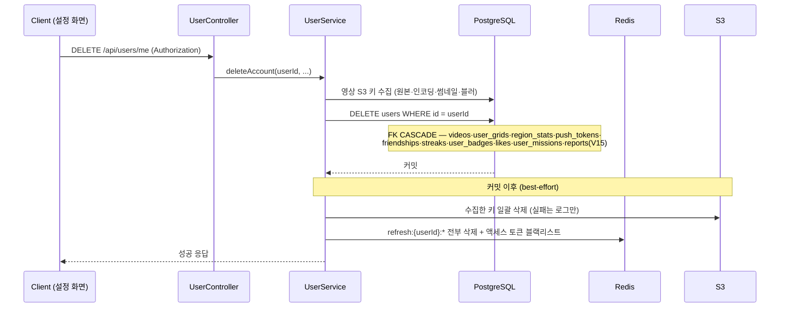
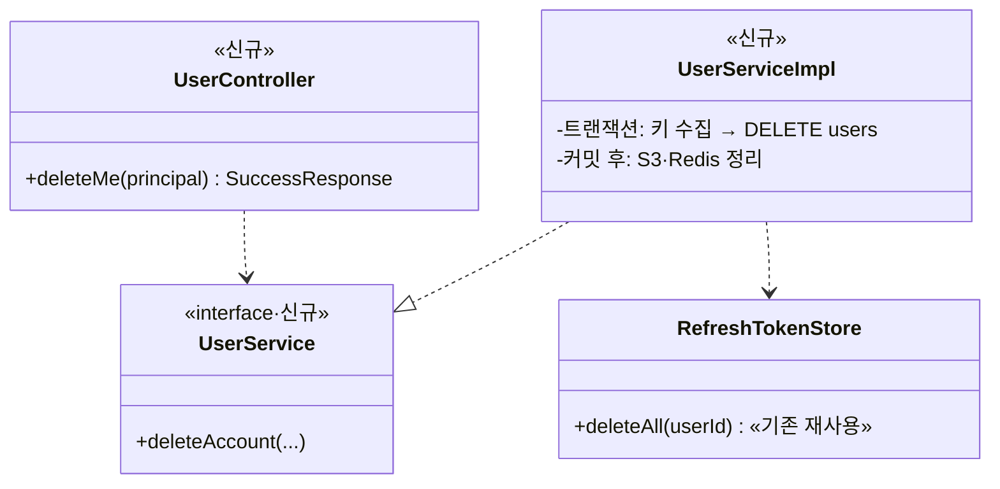

# PRD: 계정 삭제 API (즉시 물리 삭제 + 연쇄 정리)

> 티켓: MSG-205 · 작성일: 2026-08-01 · 작성: prd-writer
> 상태: 검토됨  <!-- 2026-08-01 사용자 승인 — 삭제 정책·reports FK·API 위치 3건 명시 확정(플랜 승인) 기반 -->

## 1. 문제 상황

계정을 삭제할 방법이 없다. user 패키지에 API가 하나도 없고(entity/repository만 존재), IA의
"설정 > 로그아웃/계정 삭제" 중 삭제 쪽은 미구현이다. 개인 위치·영상 기록이 쌓이는 서비스 특성상
"내 데이터를 지우고 나간다"가 성립해야 하며, 위키 "User 프로필 API (예정)"·"FillMap API 스펙 통합"
양쪽에서 열린 질문(⛔ reports FK 때문에 하드 삭제 불가 — 방식 결정 + 마이그레이션 선행)으로
남아 있던 사안이다. 이 문서가 그 방식을 확정한다 (2026-08-01 사용자 결정).

## 2. 목적 · 목표

- **목적**: 사용자가 자기 계정과 그에 딸린 개인 데이터 전부를 한 번에, 즉시 지울 수 있게 한다.
- **목표**:
  - `DELETE /api/users/me` 한 호출로 계정이 **즉시·비가역** 삭제된다 (유예 없음).
  - DB의 개인 데이터 연쇄 제거 + 영상 S3 객체 제거 + 로그인 세션 전부 무효화까지 한 동작으로 끝난다.
  - 같은 이메일·카카오 계정으로 다시 로그인하면 **신규 가입**으로 처리된다 (재가입 차단 없음).
- **비목표(스코프 제외)**:
  - **유예(soft delete)·복구** — 미출시 서비스라 복구 요구가 없고, 행 보존 시 email·oid UNIQUE
    충돌로 재가입이 막히는 문제까지 생겨 채택하지 않음 (2026-08-01 확정).
  - **탈퇴 사유 수집** — 기획 없음.
  - **신고 이력 보존(익명화)** — 신고 기능 자체가 미구현(reports는 테이블만, 코드 참조 0건).
    신고 기능 구현 티켓에서 보존 정책을 재결정할 여지를 남긴다.
  - 로그아웃(기존 `POST /api/auth/logout`)·프로필 조회/수정(MSG-203)은 별개.

## 3. 기능 요구사항

| ID | 요구사항 | 우선순위 |
|----|----------|----------|
| FR-1 | 로그인한 사용자는 `DELETE /api/users/me`로 자기 계정을 삭제할 수 있다 (인증 필수, 본인 외 대상 지정 불가) | Must |
| FR-2 | 삭제 시 users 행과 연쇄 개인 데이터가 모두 제거된다 — videos·user_grids·region_stats·push_tokens·friendships·streaks·user_badges·likes·user_missions | Must |
| FR-3 | 삭제된 사용자의 영상 S3 객체(원본·인코딩본·썸네일·블러본)가 제거된다 — 개별 객체 삭제 실패는 계정 삭제를 막지 않고 로그로 남는다 (기존 영상 삭제와 동일 관례) | Must |
| FR-4 | 삭제 후 그 사용자의 모든 refresh 세션(전 디바이스)이 무효화되고, 요청에 쓰인 액세스 토큰으로는 더 이상 API를 호출할 수 없다 | Must |
| FR-5 | 삭제된 이메일·카카오 계정으로 다시 로그인/가입하면 새 계정이 만들어진다 (UNIQUE 충돌 없음) | Must |
| FR-6 | 신고 이력(reports)이 있는 사용자도 삭제된다 — 그가 한 신고는 함께 삭제, 그가 검토자로 기록된 신고는 검토자만 비워진다 | Must |
| FR-7 | 다른 사용자의 데이터는 영향받지 않는다 — 전역 격자(grids) 행과 타 사용자의 도감·영상·뱃지 보존 | Must |
| FR-8 | 삭제 후 전역 노출면(격자 대표 영상·전역 목록·탐색 집계)은 남은 사용자들의 영상 기준으로 정합하다 | Should |

## 4. 비기능 요구사항

| 분류 | 요구사항 |
|------|----------|
| 보안/인가 | 인증 필수·본인 계정만. 경로에 대상 식별자 없음(`/me`) — 타인 삭제 경로 원천 차단 |
| 데이터 정합 | DB 연쇄 삭제는 단일 트랜잭션(전부 아니면 전무). S3 정리는 커밋 이후 best-effort — 실패해도 DB는 이미 정리돼 있고 고아 객체만 남는다(로그로 추적) |
| 개인정보 | 즉시 삭제 — 서버 DB에 개인 식별 데이터 잔존 없음. S3 고아 객체는 키가 비식별(uuid·videoId 기반)이며 접근 경로(DB) 소멸 |
| 운영 | 마이그레이션 1건(V15 — reports FK ON DELETE 정책 부여, 기존 데이터 무변경이라 롤백 부담 없음). 별도 배치·스케줄러 불요 |

## 5. 시퀀스 다이어그램

## 6. 클래스 다이어그램

## 7. 변경 파일 목록

| 파일 | 변경 | Owner |
|------|------|-------|
| `src/main/resources/db/migration/V15__reports_fk_on_delete.sql` | 신규 — reporter_id ON DELETE CASCADE·reviewed_by ON DELETE SET NULL | B |
| `src/main/java/com/msg/fillmap/user/controller/UserController.java` | 신규 — `DELETE /api/users/me` (user 패키지 첫 컨트롤러) | B |
| `src/main/java/com/msg/fillmap/user/service/UserService.java`(+Impl) | 신규 — 삭제 트랜잭션 + 커밋 후 S3·Redis 정리 | B |
| S3 키 수집 native 쿼리 | 추가 — 위치(UserRepository vs VideoRepository)는 스펙 확정 | B |
| S3 일괄 삭제 헬퍼 | `VideoServiceImpl.deleteQuietly`(private) 재사용 방식 스펙 확정 — 1000키/요청 제한 대응 포함 | B |
| 테스트 | 삭제 통합(연쇄 0행·S3 호출 키·refresh 소멸·재가입)·스키마 테스트 V15 반영 | B |

## 8. 미해결 질문

없음 — 삭제 방식(즉시 물리)·reports FK(V15 CASCADE/SET NULL)·API 위치(`/api/users/me`)는
2026-08-01 사용자 확정. 동시 업로드 경합 잠금·재호출 응답 등 구현 세부는 스펙 단계 몫.
