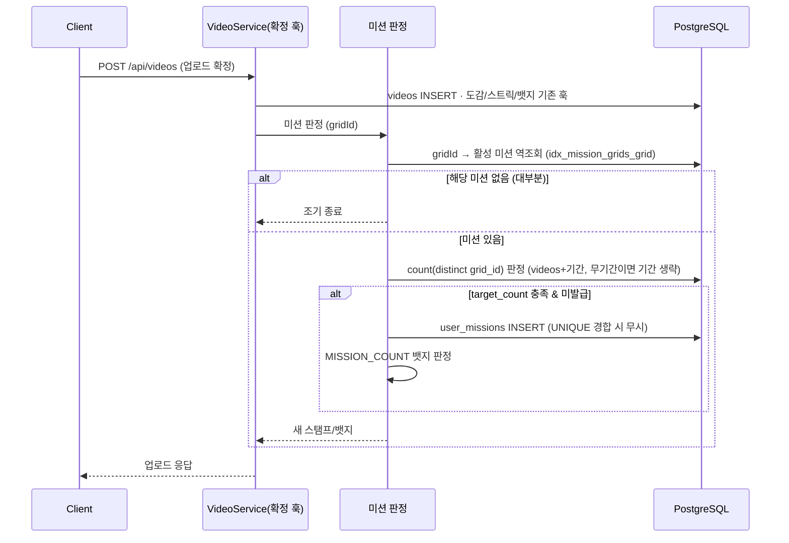
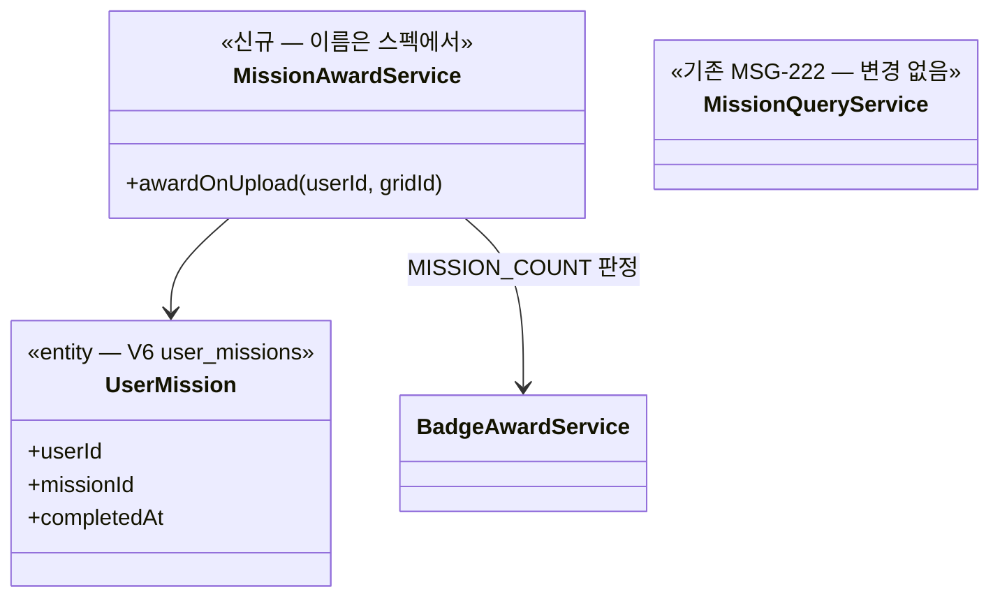

# PRD: 미션·이벤트 — 축제·코스 미션 적재와 스탬프 발급

> 티켓: MSG-219 (에픽) — 스토리 MSG-220·221 / BE MSG-223·224·225 · 작성일: 2026-07-30 · 작성: prd-writer
> 상태: 검토됨 (2026-07-30 성민 승인 — 핵심 질문 3건 답 반영: 응답 포함·뱃지 1/5/10·격주 수동 갱신)

## 1. 문제 상황

도감 수집의 동기가 개인 기록에 갇혀 있다 — "다음엔 어디 가서 찍지"에 대한 제안이 서비스 안에 없다.
미션 인프라는 절반만 있다: V6 스키마(missions·mission_grids·user_missions, MSG-166)와 활성 미션
조회 API(MSG-222), FE 칩 진입 구조(MSG-248 진행 중)까지 준비됐지만 **미션 데이터가 0건**이라
사용자에게 아무것도 보이지 않고, 미션 격자에 영상을 올려도 **아무 일도 일어나지 않는다**(판정·보상
부재). 뱃지 시스템(MSG-239)의 MISSION_COUNT 축도 판정 엔진이 없어 비활성 상태로 예약만 돼 있다
(`V9__badges_seed.sql` 주석·`BadgeConditionType` §D2).

## 2. 목적 · 목표

- **목적**: 발견(지도에서 주변 미션) → 참여(미션 격자에 영상 업로드) → 보상(스탬프)의 미션 루프를
  실데이터로 완성한다. 도감(면적)과 별개의 수집 축(스탬프북=개수)을 연다.
- **목표**:
  - 축제(전국문화축제표준데이터)·코스(두루누비) 미션이 실데이터로 지도에 노출된다
  - 미션 격자에 조건을 충족하는 업로드가 발생하면 자동으로 스탬프(user_missions)가 발급된다
  - 뱃지 MISSION_COUNT 축이 활성화된다 (V9 예약분 이행)
- **비목표(스코프 제외)**:
  - 팝업 미션 적재 — MSG-235 별도 진행 중 (판정은 이 PRD의 엔진이 공통 처리)
  - FE 렌더링(MSG-226~229)·디자인 시안(MSG-232)
  - 미션 노출 반경·정렬 기획(MSG-231) — 조회 API 파라미터 영역, 적재·판정과 독립
  - 스탬프북 전용 조회 API/화면 — 후속 티켓
  - 팝업 크롤링 수집 (법률 자문으로 해소됐으나 MSG-235 범위)

## 3. 기능 요구사항

**축제 미션 적재 (MSG-224)**

| ID | 요구사항 | 우선순위 |
|----|----------|----------|
| FR-1 | 전국문화축제표준데이터(파일 다운로드, API 키 불요)로 진행 중·예정 축제가 missions(EVENT)·mission_grids로 적재된다 | Must |
| FR-2 | 축제 격자 범위는 중심 좌표 기준 9×9 일괄, target_count=1 (관대함으로만 작용) | Must |
| FR-3 | 중복 판정은 이름이 아니라 **좌표+기간** — 시드 재실행이 멱등하다 | Must |
| FR-4 | 2주 1회 **수동** 갱신이 종료 축제를 정리하고 신규 축제를 추가한다 — 상시 스케줄러를 두지 않는다 (코스와 동일 원칙, 2026-07-30 성민 확정) | Must |
| FR-5 | 갱신이 실패해도 기존 미션 데이터는 유지된다 (부분 삭제로 노출 공백을 만들지 않는다) | Must |

**코스 미션 시드 (MSG-225)**

| ID | 요구사항 | 우선순위 |
|----|----------|----------|
| FR-6 | 두루누비 GPX가 missions(COURSE)로 적재된다 — 표시용 경로(missions.path 폴리라인)와 판정용 포토스팟(mission_grids 5~8곳)을 분리 저장 | Must |
| FR-7 | GPX 포인트가 성겨도 경로가 통과한 격자가 누락되지 않는다 (선분 보간) | Must |
| FR-8 | 포토스팟 선정은 수동 큐레이션 없이 자동이다 — ① TourAPI 위치기반 교차 ② 폴백: 시작점+끝점+균등 중간점 | Must |
| FR-9 | 코스 미션은 무기간(start/end null) 상시 미션이다 — 과거 영상도 판정에 인정된다 | Must |
| FR-10 | 시드는 1회 생성 파이프라인 + 분기 수동 재생성이다 — 상시 배치를 두지 않는다 (반영구 데이터) | Must |

**완료 판정·스탬프 발급 (MSG-223)**

| ID | 요구사항 | 우선순위 |
|----|----------|----------|
| FR-11 | 미션 대상 격자에 기간 내 영상 업로드가 확정되면 해당 미션이 자동 판정되고, 충족 시 스탬프(user_missions)가 발급된다 | Must |
| FR-12 | 판정 근거는 videos + 기간 조건이다 — user_grids 판정 금지 (기간 밖 과거 점령 기록으로 오발급 차단). 무기간 미션은 기간 조건을 생략한다 | Must |
| FR-13 | 판정 방식은 유형(5종) 공통 단일 규칙이다: 대상 격자 중 서로 다른 격자 target_count곳 이상에 영상 — 유형별 전략 분기를 두지 않는다 | Must |
| FR-14 | 같은 미션의 스탬프는 사용자당 1개다 — 동시 업로드가 겹쳐도 중복 발급되지 않는다 (V6 UNIQUE) | Must |
| FR-15 | 스탬프는 비회수다 — 영상 삭제로 조건 미달이 돼도 user_missions는 유지된다 (도감 롤백과 의도적으로 다른 규칙, 이벤트 기록 성격) | Must |
| FR-16 | user_grids에 가짜 격자를 삽입하지 않는다 — 스탬프는 도감과 완전 분리 | Must |
| FR-17 | 스탬프 발급 시 MISSION_COUNT 뱃지 판정이 함께 동작한다 — 임계값 **1·5·10개** 시딩 (V9 예약 이행, 2026-07-30 성민 확정) | Must |
| FR-18 | 업로드 격자가 어떤 미션에도 속하지 않으면 판정이 조기 종료된다 — 일반 업로드에 미션 부하를 얹지 않는다 | Must |
| FR-19 | 완료된 미션 스탬프는 **업로드 응답에 포함**돼 화면이 즉시 축하를 띄울 수 있다 (뱃지 newBadges와 동일 방식, 2026-07-30 성민 확정) | Must |

## 4. 비기능 요구사항

| 분류 | 요구사항 |
|------|----------|
| 성능 | 판정은 업로드 확정 경로에 추가된다 — 미션 미해당 격자(대부분의 업로드)는 역조회 1회로 끝나야 한다 (`idx_mission_grids_grid` V6 기존). 코스 전체 시드 규모 ≈ 148코스·경로 27,295격자·스팟 ~1,200행 기준 |
| 데이터 정합 | 시드·배치 재실행 멱등 (좌표+기간 dedupe·플래그 게이트). 스탬프는 발급 시점 영속 — 이후 원본 영상·미션 상태 변화와 무관 |
| 보안/인가 | 스탬프 발급을 클라이언트가 직접 요청하는 API는 없다 — 업로드 확정의 서버 내부 파생만 존재 |
| 운영 | DDL 신규 최소 — user_missions·판정 인덱스는 V6 기존. MISSION_COUNT 뱃지 시딩 V파일 1개 예상. 시더는 플래그 게이트(region GeoJSON/MSG-154 패턴)로 평시 기동 무영향 |

## 5. 시퀀스 다이어그램

업로드 확정 → 미션 판정 → 스탬프·뱃지 (핵심 플로우):

## 6. 클래스 다이어그램

신규 타입 (판정·스탬프 축):

시더 2종(축제·코스)은 region GeoJSON 시더(MSG-154) 패턴의 플래그 게이트 러너 — 구조는 스펙 몫.

## 7. 변경 파일 목록

status.md·코드 확인 기준 (mission 패키지는 MSG-222의 조회 전용 구성만 존재):

| 파일 | 변경 | Owner |
|------|------|-------|
| `mission/entity/UserMission.java` | 신규 (V6 user_missions 매핑) | B |
| `mission/repository/UserMissionRepository.java` | 신규 | B |
| `mission/service/` 판정 서비스 (+impl) | 신규 — 단일 판정 쿼리·스탬프 발급 | B |
| `video/service/VideoServiceImpl.java` | 수정 — 업로드 확정 훅 배선 (badge·streak 지점, :128-137) | B |
| `badge/` MISSION_COUNT 지급 배선 | 수정 — 기존 BadgeAwardService 축 활성화 | B |
| `db/migration/V12__*.sql` | 신규 — MISSION_COUNT 뱃지 시딩 (DDL 없음 예상) | - |
| 축제 시더 + 격주 수동 갱신 러너 (mission 하위) | 신규 — 플래그 게이트 | B |
| 코스 시드 파이프라인 (GPX→path·스팟 변환) | 신규 — 산출물 형식·실행 위치(앱 시더 vs scripts/)는 스펙 몫 | B |

## 8. 미해결 질문

**2026-07-30 성민 확정으로 해소된 것 (3건)** — 본문 FR에 반영 완료

- [x] 미션 완료 알림 방식 → **업로드 응답에 포함** (뱃지와 동일 방식, FR-19)
- [x] 미션 달성 뱃지 임계값 → **1·5·10개** (FR-17)
- [x] 축제 갱신 방식 → **2주 1회 수동 갱신**, 상시 스케줄러 없음 (FR-4)

**나중에(코스 미션 착수 시점에) 해소해도 되는 것 (3건)**

- [ ] **코스 하나에 인증 장소를 몇 곳 두고, 몇 곳을 찍어야 완료로 칠까?**
  시작안은 "코스마다 5~8곳 중 3곳" — 일단 이걸로 가고 나중에 기획이 조정하는 전제.
- [ ] **관광 API 키 재발급** — 코스 경로 파일을 내려받고 인증 장소를 고르는 데 필요한 공공 API
  키가 만료돼 있어서, 코스 데이터 작업을 시작하기 전에 다시 발급받아야 한다.
- [ ] **걷기 코스가 몇 개인지부터 확인** — 자료마다 148개/284개로 다르게 나와서, 어디까지를
  적재 대상으로 삼을지 실제 데이터를 열어 확정해야 한다.
