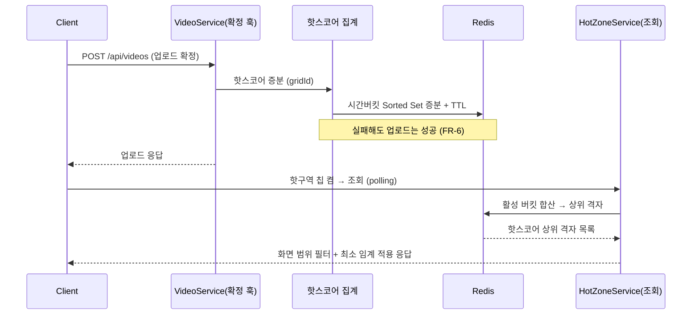
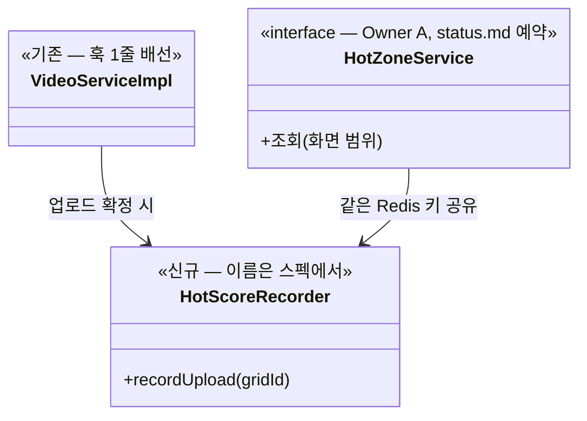

# PRD: 핫구역 — 사용자 업로드 신호로 "지금 뜨는 곳" 감지

> 티켓: MSG-233 (설계) — 에픽 MSG-171 / 후속 MSG-183(집계)·MSG-184(조회) · 작성일: 2026-07-31 · 작성: prd-writer
> 상태: 검토됨 (2026-07-31 성민 확정 — 핵심 질문 3건 답 반영: 상위 K+최소 임계·48시간 윈도우·도배 방어 MVP 생략)

## 1. 문제 상황

축제·코스·팝업 미션은 공공·민간 데이터로 만들지만, 그 데이터에 잡히지 않는 "지금 실제로
사람이 모이는 곳"이 있다 — 팝업 애그리게이터는 88%가 서울이고(부산 6%), 공연행사 표준데이터의
살아있는 야외 행사는 0.3%다(설계검토 2026-07-20 실측). 외부 데이터로는 지역 실시간 커버가
구조적으로 불가능하다. 한편 FillMap에는 위치가 검증된 업로드 이벤트가 격자 단위로 쌓인다 —
팝업이 열리면 사람들이 가서 찍고 그 격자의 업로드가 튄다. **팝업 정보를 수집하는 게 아니라
팝업을 감지할 수 있는** 유일한 신호원인데, 지금은 이 신호를 아무 데도 쓰지 않는다.

지도 홈 개편(2026-07-25 확정)으로 상단 셀 4종 중 "핫구역" 칩이 확정됐지만, 기획회의(07-23)에서
"업로드된 것 기준"이라는 방향만 합의됐고 — 무엇이 핫인지, 점수를 어떻게 매기는지, 어디에
저장하는지가 미정이라 구현 티켓(MSG-183·184)이 착수 불가 상태다.

## 2. 목적 · 목표

- **목적**: 사용자 업로드 신호로 "요즘 뜨는 격자"를 감지해 지도 홈 핫구역 칩에 노출한다 —
  발견의 재미(다음엔 어디 가지)와 발표 서사(외부 데이터 한계를 자체 신호로 돌파)를 함께 챙긴다.
- **목표**:
  - 핫구역 정의·핫스코어 산식·저장 구조·유지 기간이 설계 문서(`docs/spec/MSG-233.md`)로 확정되어
    MSG-183·184가 착수 가능하다 (이 티켓의 완료 조건)
  - 업로드가 발생하면 해당 격자의 핫스코어가 실시간 반영되고, 오래된 신호는 자동 소멸한다
  - 사용자가 핫구역 칩을 켜면 화면 범위의 핫구역이 지도에 표시된다
- **비목표(스코프 제외)**:
  - FE 렌더링·칩 UI(MSG-248 셀 구조, 색/배지/애니메이션 등 UI 정책 — 디자인 몫)
  - 좋아요 API 구현(MSG-275 별도) — 이 PRD는 신호 소비 지점만 예약한다
  - websocket 실시간 push — MSG-134 D2로 Phase 2 유예, 서빙은 polling
  - 도배 방어 — MVP 생략 (2026-07-31 성민 확정). 같은 사용자의 재방문 업로드도 전부 인정한다
    (스트릭의 재방문 인정과 일관). 실사용에서 도배가 관측되면 그때 방어를 설계한다
  - 핫구역 기반 알림·추천(Phase 2+)

## 3. 기능 요구사항

**설계 확정 (MSG-233)**

| ID | 요구사항 | 우선순위 |
|----|----------|----------|
| FR-1 | 핫구역 정의(신호·범위 단위·핫 판정 기준)·핫스코어 산식·저장 구조·유지 기간이 설계 문서로 확정된다 | Must |
| FR-2 | 범위 단위는 격자다 — 별도 "구역" 개념을 만들지 않는다 (glossary 격자 정의 재사용, 인접 격자 묶음 표현은 FE 몫) | Must |
| FR-3 | MVP 신호는 업로드 이벤트만이다. 좋아요는 산식에 확장 지점으로만 예약한다 — 좋아요 API(MSG-275)가 미구현이라 데이터가 없다 | Must |

**핫스코어 집계 (MSG-183)**

| ID | 요구사항 | 우선순위 |
|----|----------|----------|
| FR-4 | 업로드가 확정되면 해당 격자의 핫스코어가 반영된다 — 배치 재계산이 아니라 이벤트 시점 증분 | Must |
| FR-5 | 최근 **48시간** 신호만 핫스코어에 반영된다 (2026-07-31 성민 확정) — 윈도우 밖 신호는 판정에서 자동 제외되고, 만료 데이터는 자동 소멸한다(수동 정리 배치 없음) | Must |
| FR-6 | 집계 실패가 업로드를 실패시키지 않는다 — 핫스코어는 부가 신호이지 업로드 트랜잭션의 일부가 아니다 | Must |

**핫구역 조회 (MSG-184)**

| ID | 요구사항 | 우선순위 |
|----|----------|----------|
| FR-8 | 사용자는 지도 홈 핫구역 칩을 켜서 화면 범위 안의 핫구역을 볼 수 있다 | Must |
| FR-9 | 핫구역이 하나도 없으면 빈 목록을 반환한다 — 에러가 아니다 (초기 데이터 적을 때가 기본 상태) | Must |
| FR-10 | 핫 판정은 **상위 K + 최소 임계 병행**이다 (2026-07-31 성민 확정) — 핫스코어 상위 K개 중 최소 임계를 넘는 격자만 노출한다. 초기 데이터가 적어도 자연스럽고, 업로드 1건이 핫이 되지 않는다 (K·임계값은 설계 문서에서 확정) | Must |
| FR-11 | 조회는 다른 도메인이 `HotZoneService` 계약 인터페이스로만 접근한다 (status.md Owner A 예약 이행) | Must |

## 4. 비기능 요구사항

| 분류 | 요구사항 |
|------|----------|
| 성능 | 핫스코어 증분은 업로드 확정 경로에 O(1) 연산 하나로 얹는다(기존 badge→streak→mission 훅 체인 뒤). 조회는 MSG-134 SLO(p95<300ms) 안에서 Redis 정렬 집합 조회로 처리 |
| 데이터 정합 | 핫스코어는 근사값이다 — 영상 삭제 시 차감하지 않는다(윈도우 만료로 자연 소멸, 스탬프 비회수와 같은 이벤트 기록 성격). Redis 유실 시 핫구역이 비어 보이는 것을 허용한다(원본은 videos, 재적재 불요) |
| 보안/인가 | 핫구역은 집계 결과만 노출한다 — 누가 올렸는지(user_id)는 응답에 포함하지 않는다 |
| 운영 | DDL 없음(저장은 Redis 전용). dev/prod Redis 기존 인스턴스 공유, 키 네임스페이스 분리. 서빙은 polling(MSG-134 D1·D2) — 신규 인프라 없음 |

## 5. 시퀀스 다이어그램

업로드 신호 적재 → 칩 조회 (핵심 플로우):

## 6. 클래스 다이어그램

신규 타입 (구체 시그니처·산식은 설계 문서 몫):

## 7. 변경 파일 목록

status.md·코드 확인 기준. MSG-233 자체는 설계 문서가 산출물이고, 아래는 이 PRD가 커버하는
후속 구현(183·184)의 예상 범위:

| 파일 | 변경 | Owner |
|------|------|-------|
| `docs/spec/MSG-233.md` | 신규 — 설계 확정 문서 (이 티켓 산출물) | - |
| `hotzone/` 신규 패키지 (`HotZoneService` + impl, 집계 컴포넌트) | 신규 — MSG-183·184 | A |
| `video/service/VideoServiceImpl.java` | 수정 — 확정 훅에 핫스코어 증분 1줄 (`:131-149` 체인 뒤) | B |
| Redis 키 설계 (`hotzone:*`) | 신규 — DDL 없음, auth 키(`refresh:*` 등)와 네임스페이스 분리 | A |
| `GET /api/hotzones` 류 조회 API | 신규 — MSG-184 (엔드포인트 형태는 스펙 D-결정) | A |

## 8. 미해결 질문

**2026-07-31 성민 확정으로 해소된 것 (3건)** — 본문 FR·비목표에 반영 완료

- [x] 핫 판정 방식 → **상위 K + 최소 임계 병행** (FR-10)
- [x] 윈도우(유지 기간) → **최근 48시간** (FR-5)
- [x] 도배 방어 → **MVP 생략** — 재방문 업로드도 전부 인정, 도배 관측 시 재설계 (비목표로 이동)

**남은 것 (BE 밖 — 스펙 착수를 막지 않음)**

- [ ] **칩 빈 상태 문구·최소 노출 개수** — FE·디자인 몫(지도 홈 개편 Open Question과 공유)이라
  이 PRD는 답을 강제하지 않는다. BE는 빈 목록 응답만 보장 (FR-9).

산식 세부(버킷 크기·K·임계값·합산 방식)는 설계 문서(`docs/spec/MSG-233.md`) 몫이다.
