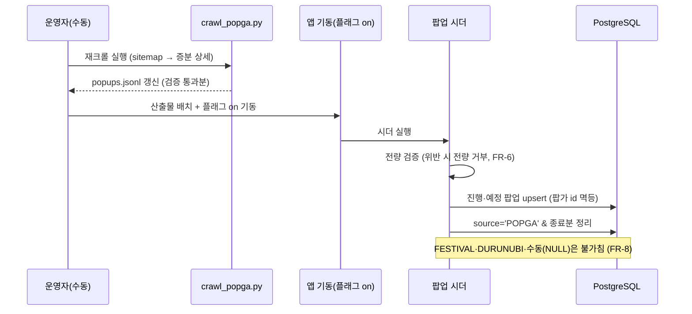
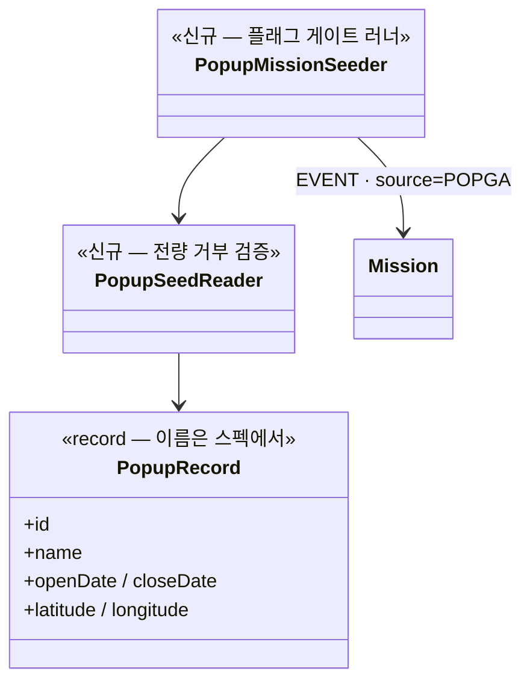

# PRD: 팝업 스토어 미션 적재 — 팝가 수집본 시드와 주기 갱신

> 티켓: MSG-235 · 작성일: 2026-07-31 · 작성: prd-writer
> 상태: 검토됨 (2026-07-31 성민 확정 — 핵심 질문 2건 답 반영: type=POPUP 신설·주 1회 수동 갱신)

## 1. 문제 상황

팝업 스토어는 사용자가 실제로 찾아가는 목적지라 미션 소스로 가치가 높지만, 민간 상업 이벤트라
공공데이터에 없다(문화축제 1,300건 중 실물 팝업 0건 — 설계검토 2026-07-20). 지도 홈 개편(07-25
확정)으로 상단 칩 4종에 "팝업 스토어"가 확정됐는데, 미션 3종 중 축제(MSG-224)·코스(MSG-225)만
적재가 끝났고 팝업은 데이터가 0건이라 칩이 빈 상태다.

수집은 이미 끝나 있다 — 팝가(popga.co.kr) 전국 2,593건 스냅샷(2026-07-23, `~/fillmap-data/popups/`)
이 파싱 실패·좌표 결측·날짜 역전 전부 0건으로 검증 완료됐고, 크롤링 법적 리스크는 자문으로
해소됐다(2026-07-23). 남은 것은 적재 파이프라인과 갱신 절차뿐이다.

## 2. 목적 · 목표

- **목적**: 검증된 팝가 수집본을 팝업 미션으로 적재해 지도 홈 팝업 스토어 칩을 실데이터로 채우고,
  주기 갱신으로 신선도를 유지한다. 미션 3종 축(축제·코스·팝업)이 완결된다.
- **목표**:
  - 수집본의 진행 중·예정 팝업이 missions·mission_grids로 적재돼 활성 미션 조회에 노출된다
  - 주기 갱신이 신규 팝업을 추가하고 종료 팝업을 정리한다
  - 판정·스탬프는 기존 엔진(MSG-223)이 무수정으로 공통 처리한다 (MSG-219 PRD가 명시한 전제)
- **비목표(스코프 제외)**:
  - FE 렌더링(MSG-228 마커·카드)·칩 UI(MSG-248)
  - 판정 엔진 변경 — 판정은 유형 무관 단일 쿼리(MSG-223)라 type=POPUP이 늘어도 무수정이다
  - 참고: 설계검토(2026-07-20)의 "팝업은 이벤트형 통합, 별도 유형 없음" 결정은 그 근거였던
    "별도 칩 없음"이 지도 홈 개편(2026-07-25, 칩 4종)으로 뒤집히면서 함께 갱신된다 —
    type=POPUP 신설이 새 정본 (2026-07-31 성민 확정)
  - 팝가 외 소스(팝플리·스위트스팟 등) 추가 — 커버리지가 부족해지면 그때 판단
  - 크롤러 신규 개발 — `crawl_popga.py`가 이미 있고 재크롤에 그대로 쓴다

## 3. 기능 요구사항

| ID | 요구사항 | 우선순위 |
|----|----------|----------|
| FR-1 | 수집본의 **진행 중·예정** 팝업이 missions(**type=POPUP**, source='POPGA')·mission_grids로 적재된다 — 종료분(2,250건)은 제외 | Must |
| FR-2 | 격자 범위는 축제와 동일하게 중심 좌표 9×9 일괄, target_count=1 — 팝업이 건물 단위로 좁아도 별도 규칙을 만들지 않는다(관대함으로만 작용, 설계검토 §5) | Must |
| FR-3 | 멱등 키는 **팝가 id**다 — 시드·갱신 재실행이 같은 팝업을 중복 적재하지 않는다 (축제의 좌표+기간 dedupe와 달리 외부 안정 id가 있으므로 그것을 쓴다) | Must |
| FR-4 | **주 1회 수동** 갱신(재크롤→재적재)이 신규 팝업을 추가하고 종료 팝업(closeDate 경과)을 정리한다 — 상시 스케줄러를 두지 않는다 (실행 방식은 축제와 동일, 주기만 짧게 — 2026-07-31 성민 확정) | Must |
| FR-5 | 갱신이 실패해도 기존 미션 데이터는 유지된다 — 부분 삭제로 노출 공백을 만들지 않는다 (축제 FR-5와 동일 원칙) | Must |
| FR-6 | 산출물 검증을 위반하면 전량 거부한다 — 좌표 한국 범위(33~39, 124~132), openDate ≤ closeDate, 필수 필드 존재. 축제·코스 reader의 fail-fast 계약과 동일 | Must |
| FR-7 | 팝업 미션은 미션 유형 **type=POPUP**으로 축제(EVENT)와 구분된다 (2026-07-31 성민 확정) — FE는 조회 응답의 type으로 팝업 스토어 칩을 분기한다. V6 CHECK 제약에 'POPUP' 추가(신규 마이그레이션), 판정 엔진은 유형 무관 단일 쿼리라 무수정 | Must |
| FR-8 | 시더는 source='POPGA' 미션만 소유한다 — 수동 등록·축제(FESTIVAL)·코스(DURUNUBI) 미션을 절대 건드리지 않는다 (V13 소유권 규칙) | Must |

## 4. 비기능 요구사항

| 분류 | 요구사항 |
|------|----------|
| 데이터 정합 | 시드·갱신 재실행 멱등(팝가 id upsert). 이미 발급된 스탬프(user_missions)는 팝업 종료·정리와 무관하게 영속(MSG-219 FR-15) |
| 운영 | 크롤(파이썬, 레포 밖 `~/fillmap-data/popups/`)과 적재(자바 시더, 산출물 검증·적재만)의 분리 — 축제·코스와 대칭 구조. 시더는 플래그 게이트로 평시 기동 무영향. DDL 신규 없음(V6·V13 기존) |
| 크롤 매너 | 재크롤 시 robots.txt 준수(전체 Allow 확인됨)·UA 명시·요청 딜레이 0.35s — 기존 `crawl_popga.py` 규칙 유지 |
| 성능 | 적재 규모 ≈ 진행+예정 343건 × 81격자 ≈ 2.8만 행 — 축제(1.9만 행) 수준, 기존 시더 방식으로 충분 |

## 5. 시퀀스 다이어그램

주기 갱신 절차 (수동 실행, 초기 시드도 동일 경로):

## 6. 클래스 다이어그램

축제 시더(MSG-224) 미러 — 신규 타입 3종:

## 7. 변경 파일 목록

status.md·코드 확인 기준 (mission/seed에 축제·코스 시더 6파일 존재):

| 파일 | 변경 | Owner |
|------|------|-------|
| `mission/seed/PopupRecord.java` 등 3종 | 신규 — FestivalRecord/Reader/Seeder 미러 | B |
| `db/migration/V14__*.sql` | 신규 — `chk_missions_type` CHECK에 'POPUP' 추가 | - |
| `mission/entity/MissionType.java` (enum) | 수정 — POPUP 상수 추가 | B |
| `mission/service/impl/MissionQueryServiceImpl.java` | 수정 — POPUP shape 분기 (형태는 스펙 D-결정) | B |
| `mission/dto/MissionResponseDto.java` | 수정 — type allowableValues에 POPUP (문서성) | B |
| `application.yml` | 수정 — 시더 플래그·산출물 경로 (축제 패턴) | - |
| 테스트 (reader·seeder·통합) | 신규 — 축제 테스트 미러 | B |
| `~/fillmap-data/popups/crawl_popga.py` | 재크롤 실행만 — 코드 변경 없음 (레포 밖) | - |

## 8. 미해결 질문

**2026-07-31 성민 확정으로 해소된 것 (2건)** — 본문 FR에 반영 완료

- [x] 축제/팝업 칩 구분 수단 → **type=POPUP 신설** (FR-7 — V6 CHECK 확장, 판정 엔진 무수정)
- [x] 갱신 주기 → **주 1회 수동** (FR-4 — 상시 스케줄러 없음)

**남은 것 (BE 밖 — 스펙 착수를 막지 않음)**

- [ ] **부산 커버리지(진행+예정 25건)로 MVP 시연 충분한가** — 기획 확인 필요(티켓 명시).
  BE 적재는 전국 대상이라 이 답과 무관하게 착수 가능하다.
- [ ] POPUP의 렌더 shape(BOX 재사용 vs 신규 마커형)은 스펙 D-결정 — MSG-228(FE 마커·카드)과
  계약이 맞아야 한다.
