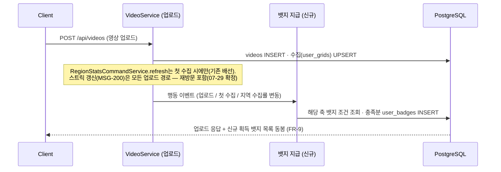
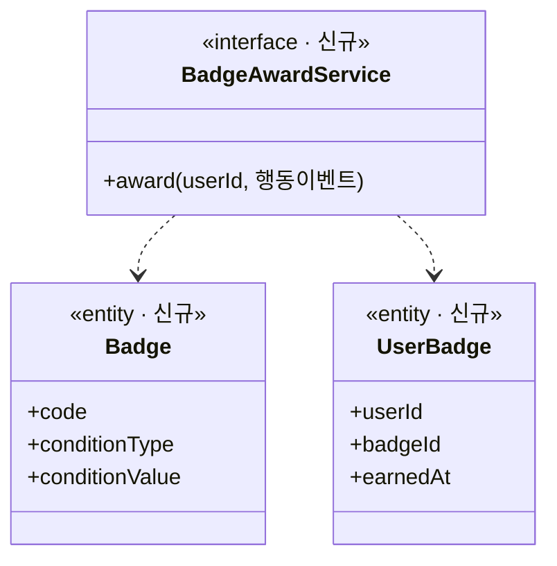

# PRD: 뱃지 시스템 MVP — 마스터 시딩·획득 엔진

> 티켓: MSG-239 · 작성일: 2026-07-29 · 작성: prd-writer
> 상태: 검토됨 (2026-07-29 기획 확정 반영 — 라인업·대표 뱃지·소급 지급·알림 방식)

## 1. 문제 상황

격자를 수집해도 도감에 색이 채워지는 것 외에 명시적 보상이 없다. 디자인 ver 6(최규호버전)에
도감 \[뱃지\] 탭(진열장·획득 4개·전체 보기, 요약 행 "획득 뱃지 N개")이 확정됐는데, DB에는
`badges`/`user_badges` 테이블만 있고 엔티티·시딩·지급 로직이 전무하다. 조회 API(MSG-201)도
마스터 데이터와 획득 엔진이 없어 착수 불가 상태로 막혀 있다.

동일 도메인 선행 사례인 그라운드 플립(걷기 기반 땅 점령 게임)도 "많은 땅을 차지해도 보상받는
느낌이 부족"을 뱃지 도입 배경으로 들었다 — 카테고리 축·이벤트 기반 지급·티어 연쇄 설계를
참고했다 ([기획 글](https://velog.io/@koomin1227/뱃지-시스템을-기획하고-디자인하고-개발하기)).

## 2. 목적 · 목표

- **목적**: 수집·기록·꾸준함·미션 참여에 명시적 보상 축을 만들어 리텐션 동기를 강화한다.
- **목표**:
  - 뱃지 마스터 데이터가 시딩되어 서버가 뱃지 목록을 동적으로 내려줄 수 있다 (하드코딩 금지 — 그라운드 플립 교훈).
  - 사용자의 대상 행동(업로드·수집·스트릭·미션 스탬프) 시점에 뱃지가 자동 지급된다.
  - MSG-201(내 뱃지 조회 API)이 이 데이터 위에서 바로 착수 가능해진다.
- **비목표(스코프 제외)**:
  - 조회 API — MSG-201 소관.
  - 실시간 푸시 인프라(SSE/WebSocket) — 획득 인지는 행동 응답 동봉 + 미확인 플래그로 충분
    (FR-9). 상시 연결은 친구 활동·실시간 피드가 생기는 Phase 2에 재검토.
  - 미획득 뱃지 진행률(progress) 노출 — JSONB 포맷 미정, 위키 쟁점 "빼는 게 안전".
  - 보상(reward)·랭킹/경쟁 뱃지 — 우리 MVP에 리더보드·경쟁 개념 없음.
  - 뱃지 회수 — 비회수 원칙 (아래 FR-5).

## 3. 기능 요구사항

### 뱃지 라인업 (수치는 BE 제안 — 확정 전)

| 축 | condition_type | 티어 | 비고 |
|----|---------------|------|------|
| 탐험가 (격자 수집 수) | `TOTAL_GRIDS` | 1 · 10 · 50 · 100 · 500 | 1개 = "첫 발자국". 첫 업로드 뱃지와 **통합 확정**(첫 업로드 = 첫 수집이라 항상 동시 획득) |
| 기록러 (영상 업로드 수) | `UPLOAD_COUNT` | 10 · 50 · 100 | 재방문 포함. 1은 첫 발자국과 중복이라 제외 확정 |
| 꾸준함 (연속 기록 일수) | `STREAK_DAYS` | 3 · 7 · 30 | **포함 확정** — 스트릭 인정 이벤트 = 아무 업로드(재방문 포함, 07-29 확정). MSG-200 선행 의존 |
| 지역 마스터 (단일 행정동 수집률) | `REGION_PERCENT` | 10% · 25% · 50% | region_stats 재사용 (MSG-155/236) |
| 미션 (완료 스탬프 누적) | `MISSION_COUNT` (신설) | 1 · 5 · 10 | 팝업·축제 미션(V6 `user_missions` 스탬프) 연동. **시딩은 지급 훅(미션 판정 엔진 티켓) 배선과 함께 활성화** — 훅 없이 시딩만 하면 획득 불가 뱃지가 노출되므로 |
| 특수 | `SPECIAL` | 오픈 기념 1개 (선택) | 랜드마크 격자류는 Phase 2 |

티어는 그라운드 플립의 연쇄 구조(`next_achievement_id`) 대신 **티어당 별도 badges row**로
표현한다 — 스키마 변경 없이 동일 효과 (구현 상세는 스펙 몫).

### 요구사항

| ID | 요구사항 | 우선순위 |
|----|----------|----------|
| FR-1 | 위 라인업의 뱃지 마스터 데이터가 시딩되어 있다 (code 유일, 조건 타입·수치 포함 — 수치는 §8 컨펌을 거친 확정값으로 시딩) | Must |
| FR-2 | 사용자가 대상 행동을 완료한 요청 흐름 안에서 조건 충족 뱃지가 지급된다 — 대상 행동으로 도달 가능한 뱃지만 판정한다 (전수 스캔 금지) | Must |
| FR-3 | 이미 획득한 뱃지는 같은 행동을 반복해도 중복 지급되지 않는다 (동시 요청 포함) | Must |
| FR-4 | 하나의 행동으로 여러 티어 조건을 동시에 충족하면 충족한 티어 전부가 지급된다 (예: 소급 시딩 직후) | Must |
| FR-5 | 영상 삭제로 수집이 롤백되어 조건 미달이 되어도 획득한 뱃지는 유지된다 (비회수) | Must |
| FR-6 | 미션 완료 스탬프(`user_missions`)가 생성되는 시점에 미션 뱃지 누적이 판정된다 — 미션 축이 활성화(시딩)되는 순간부터 필수 (라인업 표의 활성화 조건과 세트) | Must |
| FR-7 | 스트릭 갱신 시점에 꾸준함 뱃지가 판정된다 (선행: MSG-200) | Must |
| FR-8 | 사용자는 보유 뱃지 중 최대 2개를 대표 뱃지로 선택/해제할 수 있다 — 닉네임 옆 표시용. 진열장(뱃지 탭 상단 4개)은 이와 별개로 최근 획득 4개 자동 | Must |
| FR-9 | 사용자는 뱃지 획득을 인지할 수 있다 — 행동 직후에는 해당 요청의 응답으로, 비동기 지급분(소급)은 다음 조회 시 미확인 표시로 | Must |
| FR-10 | 새 뱃지가 추가(시딩)되는 시점에 이미 조건을 충족한 사용자에게 일괄 지급된다 (소급) — 1회성 아닌 상시 규칙이며, 반복 가능한 소급 절차의 형태(마이그레이션 동반 vs 재실행 가능 잡)는 스펙에서 결정. 조건이 기존 데이터로 판정 가능한 축(user_grids·videos·streaks·user_missions·region_stats)에 한하며, `SPECIAL`은 정의상 뱃지별 지급 규칙을 개별 명시 | Must |

## 4. 비기능 요구사항

| 분류 | 요구사항 |
|------|----------|
| 성능 | 뱃지 판정이 업로드 응답 체감을 해치지 않는다 — 행동당 추가 판정은 해당 축 뱃지로 한정 |
| 보안/인가 | 대표 뱃지 선택/해제는 본인이 획득한 뱃지에 대해서만 가능 (토큰 필수) |
| 데이터 정합 | 동시 업로드에서도 user_badges 중복 row가 생기지 않는다 (PK 제약이 최후 방어선) |
| 운영 | 마스터 시딩·`badge_condition_type` CHECK 확장(MISSION_COUNT)은 마이그레이션으로 — 로컬 공유 DB 재적용 절차 포함 |

## 5. 시퀀스 다이어그램

## 6. 클래스 다이어그램

## 7. 변경 파일 목록

| 파일 | 변경 | Owner |
|------|------|-------|
| `src/main/java/com/msg/fillmap/badge/**` (entity·repository·service·controller·dto·exception) | 신규 패키지 — controller/dto는 대표 뱃지 선택/해제 API(FR-8)용, 엔드포인트 계약은 스펙에서 확정 | B |
| `src/main/resources/db/migration/V9__badges_seed.sql` | CHECK 확장(MISSION_COUNT) + 마스터 시딩 + user_badges 확장(대표 선택·미확인 표시 — 개념, 구조는 스펙 몫) + 소급 지급 | - |
| `src/main/java/com/msg/fillmap/video/service/VideoServiceImpl.java` | 업로드/첫 수집 경로에 지급 훅 (MSG-155 refresh 배선 자리) | B |
| `src/main/java/com/msg/fillmap/video/dto/VideoUploadResponseDto.java` | 신규 획득 뱃지 목록 필드 추가 (FR-9) | B |
| `CLAUDE.md` 협업 원칙 | Owner B 패키지에 `badge.*` 추가 | - |

스트릭 훅(MSG-200)·미션 스탬프 훅(판정 엔진 티켓 미정)은 각 티켓의 변경 파일에서 배선.
미확인(새 뱃지) 표시·대표 뱃지의 **조회 노출**은 MSG-201 응답 소관 — 이 티켓은 저장·지급까지.
대표 뱃지 선택/해제 API의 엔드포인트·저장 구조는 스펙(MSG-239 스펙 문서)에서 확정.

## 8. 미해결 질문

- [ ] 티어 수치 최종 컨펌 — 표의 수치는 BE 제안값
- [ ] 미션 뱃지 지급 훅 위치 — user_missions 스탬프 생성(미션 판정) 엔진 티켓이 아직 없음. 그 티켓에서 훅 배선 위임이 자연스러움
- [ ] `MISSION_COUNT` condition_type 신설 승인 — DB 기준 문서상 VARCHAR+CHECK라 확장 용이하나 ENUM 10종 정의 문서 갱신 필요

**확정 이력 (2026-07-29)**: 스트릭 축 포함(인정 = 아무 업로드) · 첫 기록/첫 업로드 통합 ·
미션 축 추가 · 대표 뱃지 직접 선택 최대 2개(닉네임 옆) · 진열장은 최근 4개 자동 ·
새 뱃지 추가 시 소급 일괄 지급 · 알림은 응답 동봉+미확인 플래그(SSE 미도입)
