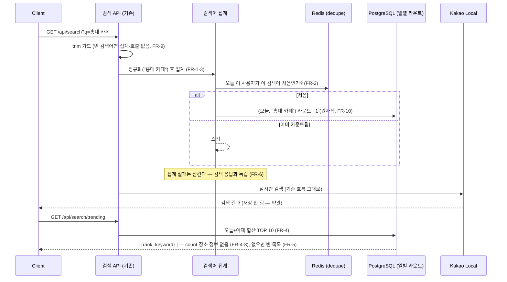
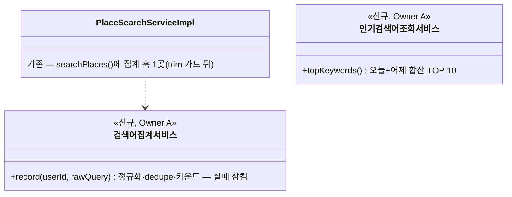

# PRD: 인기 검색어 순위 (사람들이 많이 찾는 장소 검색어 TOP 10)

> 티켓: MSG-258 · 작성일: 2026-08-04 · 작성: prd-writer
> 상태: 검토됨  <!-- 2026-08-04 사용자 승인 (미해결 질문 해소 포함 원안 승인). 수명주기: 초안 → 검토됨 → 확정 -->

## 1. 문제 상황

장소 검색(MSG-251)은 카카오 로컬 프록시로 동작하지만, 사용자가 입력한 검색어라는 관심
신호가 아무 데도 남지 않고 버려진다. 검색 무입력 화면에는 발견 동선이 없고, "다른 사람들은
어디를 찾아보나"를 보여줄 재료가 0이다. 핫구역(업로드가 많은 곳 — 우리 콘텐츠 데이터)과는
다른 축이다: **궁금해하는 곳(검색)과 실제로 채워지는 곳(업로드)은 다를 수 있어** 별도 신호로
가치가 있다.

## 2. 목적 · 목표

- **목적**: 사용자 검색어를 집계해 "사람들이 많이 찾는 장소" TOP 10을 제공하고, 검색 관심
  데이터를 **영구 이력으로 축적**해 향후 배치 확장(주간 집계·트렌드 분석)의 재료로 만든다.
- **목표**:
  - 사용자가 인기 검색어 상위 10개를 조회할 수 있다 (오늘+어제 검색 기준).
  - 검색어 일별 집계가 DB에 영구 저장된다 — 이후 배치 작업이 이 데이터만으로 주간/월간
    순위·트렌드를 만들 수 있다.
  - 카카오 약관 경계를 지킨다 — 저장은 사용자가 입력한 검색어 텍스트와 횟수까지만.
- **비목표(스코프 제외)**:
  - 노출 위치·UI — FE/디자인 후속 (BE는 API만 제공).
  - 배치 작업 자체(주간 집계·트렌드 계산) — 이 티켓은 재료(일별 이력)까지만.
  - 자동완성·개인화 추천.
  - 검색 횟수(count) 노출 — 어뷰징 유도 우려로 rank+keyword만.
  - 카카오 응답 필드(장소명·주소·좌표)의 어떤 저장도 — 약관 위반 (아래 경계).

### 확정된 기획 결정 (2026-08-04)

| # | 항목 | 결정 |
|---|------|------|
| 1 | 노출 | **BE는 API만** — 위치·UI는 FE/디자인 후속 |
| 2 | 저장 방식 | **DB 일별 카운트 테이블** — (날짜, 검색어, 횟수) UPSERT. 순위 이력이 영구 보존돼 배치 확장이 바로 활용. Redis는 일 1회 dedupe 용도만 |
| 3 | 노출 기준 | **오늘+어제 합산 TOP 10** — 자정 직후 순위가 텅 비는 문제 없이 단순 쿼리로 최근 24~48h 신선도 |
| 4 | 형태 | **rank + keyword만** (count 미노출) |
| 5 | 도배 방어 | **사용자·검색어당 일 1회만 카운트** (dedupe) |
| 6 | 정규화 | **trim · 연속 공백 1칸 압축 · 소문자화** 후 같은 검색어로 합산 |
| 7 | 실패 검색 | **카카오 호출 성공 여부와 무관하게 집계** — 검색 의도 자체가 신호. 집계는 호출 전에 수행, 장애 중 특정 검색어 과대 대표 가능성은 수용 |

### 카카오 약관 경계 (불변 원칙)

약관이 금지하는 것은 **검색 결과(장소명·주소·좌표)의 저장**이지, 사용자가 입력한
**검색어(q)의 저장이 아니다** (근거: ADR 장소 검색 카카오 로컬 프록시, 데브톡 150397). 지킬 선 2개:

1. 인기 검색어를 클릭한 뒤의 결과는 **매번 실시간 카카오 호출** (기존 검색 API 재사용) —
   순위 응답에 장소 정보를 미리 붙여 저장하면 그게 곧 캐싱 = 위반.
2. 저장은 **검색어 텍스트 + 날짜 + 횟수까지만** — 카카오 응답에서 온 어떤 필드도 함께 저장하지
   않는다.

주의: `PlaceSearchServiceImpl` javadoc의 "DB·Redis 무접점이 약관 준수의 구조적 증거(MSG-251
§D6)" 문구는 이 기능으로 사실이 바뀐다 — **"카카오 응답 무저장"이 준수의 실체**이고 검색어
집계는 경계 안임을 주석·문서에서 함께 갱신해야 한다(스펙에서 명시).

## 3. 기능 요구사항

| ID | 요구사항 | 우선순위 |
|----|----------|----------|
| FR-1 | 유효한 검색(트림 후 비어있지 않은 검색어)이 실행되면 카카오 호출 성공 여부와 무관하게 그 검색어가 당일 집계에 반영된다 | Must |
| FR-2 | 같은 사용자가 같은(정규화 후 동일한) 검색어를 같은 날 여러 번 검색해도 집계는 1회만 오른다 | Must |
| FR-3 | 검색어는 정규화(트림·연속 공백 1칸 압축·소문자화) 후 합산된다 — "홍대  카페"와 "홍대 카페"는 같은 검색어다 | Must |
| FR-4 | 사용자는 인기 검색어 상위 10개를 순위와 검색어 텍스트로 조회할 수 있다 — 기준은 오늘+어제 집계 합산, 검색 횟수는 응답에 포함되지 않는다 | Must |
| FR-5 | 집계 데이터가 없으면(서비스 초기·무검색일) 조회는 실패가 아니라 빈 목록이다 | Must |
| FR-6 | 집계 실패(저장소 장애 등)가 검색 자체를 실패시키지 않는다 — 검색 응답은 집계와 독립이다 | Must |
| FR-7 | 저장되는 것은 정규화된 검색어 텍스트·날짜·횟수(+일시적 dedupe 표식)뿐이다 — 카카오 응답의 어떤 필드도 저장되지 않는다 | Must |
| FR-8 | 인기 검색어 순위 응답에 장소 정보(이름·주소·좌표)는 포함되지 않는다 — 클릭 후 결과는 기존 검색 API의 실시간 호출로 얻는다 | Must |
| FR-9 | 빈 검색어(트림 후 empty)는 카카오 호출도 집계도 되지 않는다 (기존 trim 가드 유지) | Must |
| FR-10 | 검색어 일별 집계는 삭제되지 않고 축적된다 — 이후 배치 작업이 임의 기간을 재집계할 수 있다 | Must |

## 4. 비기능 요구사항

| 분류 | 요구사항 |
|------|----------|
| 성능 | 집계는 검색 응답 경로에 유의미한 지연을 더하지 않는다(집계 1회 = 소량 쓰기, 실패 허용). 순위 조회는 일별 집계 2일치 합산 — 단순 집계 쿼리 수준 |
| 보안/인가 | 두 경로 모두 인증 필수(기존 전역 정책). 집계는 전역(사용자별 순위 아님) — 저장 테이블에 사용자 식별자를 남기지 않는다. dedupe 표식만 사용자 연계이고 하루 뒤 소멸한다 |
| 데이터 정합 | 동시 검색이 몰려도 카운트 증가가 유실되지 않는다(원자적 증가). dedupe 판정과 카운트 증가 사이 중복 허용 오차는 수용(순위는 근사 지표) |
| 운영 | 신규 테이블 1개(마이그레이션), Redis 키 1종(TTL 자동 소멸). 백필·보관 정책 불요(축적이 요구사항) |

## 5. 시퀀스 다이어그램

## 6. 클래스 다이어그램

신규 타입 명명은 스펙 몫 — 역할 수준만 표기.

## 7. 변경 파일 목록

리서치 실측 기반(2026-08-04, develop 4df090a). 구체 시그니처·테이블 설계는 스펙 몫.

| 파일 | 변경 | Owner |
|------|------|-------|
| `src/main/resources/db/migration/V21__*.sql` | 신규 — 검색어 일별 카운트 테이블 (날짜·검색어·횟수, 유니크) | - |
| `src/main/java/com/msg/fillmap/search/service/impl/PlaceSearchServiceImpl.java` | 수정 — trim 가드 뒤 집계 훅 1~2줄 + §D6 javadoc 갱신 | A |
| `search/service/` 신규 집계·조회 서비스(+entity 또는 repository) | 신규 — 정규화·dedupe·UPSERT·TOP 10 조회 | A |
| `search/controller/PlaceSearchController.java` (또는 신규 컨트롤러) | 수정 — `GET /api/search/trending` | A |
| `search/dto/` 순위 응답 DTO | 신규 — rank·keyword | A |

Redis: dedupe SET 키 1종(일 단위 TTL) — 스키마 변경 아님. 기존 검색 흐름(KakaoLocalClient·
DTO·에러코드)은 무변경.

## 8. 미해결 질문

없음. 티켓 원문의 미확정 4건 + 스펙 위임 1건(실패 검색 집계) 전부 확정 결정 표에 반영
(2026-08-04 사용자 결정). 노출 위치·UI는 미해결이 아니라 비목표(FE/디자인 후속)다.
