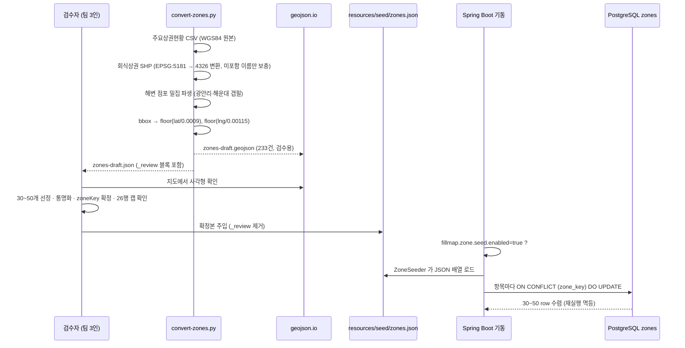
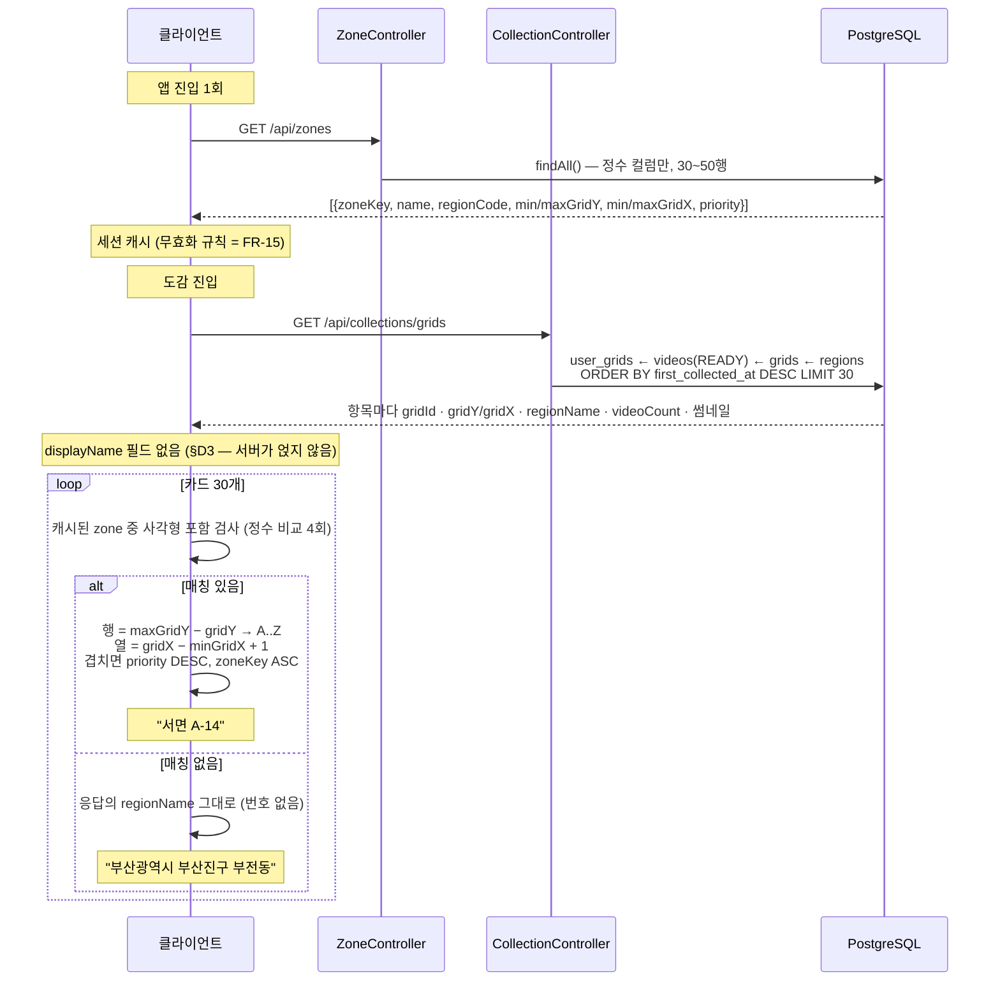

# PRD: 격자 표시명 zone 롤아웃 — 상권 데이터 주입 · 명명 규칙 드리프트 방어

> 티켓: MSG-259 (선행 MSG-234는 **완료** — 기계장치 merge 끝) · 작성일: 2026-07-30 · 작성: prd-writer
> 상태: 초안

## 1. 문제 상황

디자인 ver 6가 `"서면 A-14"` 표기를 전 화면(도감 카드·격자 상세·지역별 갤러리·탐색)에서 채택했는데,
지금 앱에는 **어디에도 그 문자열이 나오지 않는다**. 원인은 코드가 아니다 — MSG-234가 기계장치를
전부 구현해 develop에 merge했고(테이블·API·시더·테스트 23건), `zones` 테이블에 **데이터가 0행**이다
(`src/main/resources/seed/zones.json` = `[]`, `fillmap.zone.seed.enabled` 기본 off).
그래서 모든 격자가 행정동 폴백("부산광역시 부산진구 부전동")으로만 표시된다.

데이터가 없던 이유는 리소스 문제였다 — "상권 30~50개를 누가 며칠 동안 그리나"(zone ADR 쟁점 ③).
이건 2026-07-28에 **해소됐다**: 소상공인시장진흥공단이 전국 상권 경계를 무료·이용허락범위 제한
없이 개방하고 있어서, 사람이 그리는 대신 **자동 변환 후 검수**하면 된다
(Confluence [MSG-234 상권 작도 결정](https://soma17-msg.atlassian.net/wiki/spaces/M/pages/26181633)).
변환 스크립트도 이미 돌려서 **초안 233건**(서울 176 · 부산 55 · 해변 갭필 2)이 나와 있다.

즉 남은 것은 개발이 아니라 **검수 1~2시간 + 데이터 파일 주입**이고, 여기에 롤아웃 과정에서 드러난
구멍 두 개(명명 규칙의 다국어 포팅 드리프트, zone 캐시 무효화 미정의)를 함께 닫는다.

## 2. 목적 · 목표

- **목적**: 이미 만들어진 표시명 기계장치에 실제 상권 데이터를 넣어, 디자인이 확정한 `"서면 A-14"`
  표기를 실제 화면에 띄운다. 그리고 그 규칙이 FE·Android·iOS로 흩어질 때 어긋나지 않게 못박는다.
- **목표**:
  - 서울·부산 주요 상권 30~50개가 `zones`에 시딩되어, 그 사각형 안 격자의 표시명이
    행정동 이름에서 `"서면 A-14"` 형태로 바뀐다.
  - 사용자가 "홍대"·"서면"·"광안리"처럼 **행정동으로는 표현되지 않는 통칭**으로 자기 격자를 인지한다.
  - 명명 규칙이 언어 중립 픽스처로 고정되어, FE/모바일 구현이 BE와 같은 결과를 내는지 검증 가능하다.
  - zone 데이터를 갱신했을 때 클라이언트가 낡은 이름을 계속 쓰지 않는다.
- **비목표(스코프 제외)**:
  - **서버 `ZoneNamer` 유틸 구현** — 표시명 계산은 FE-local(MSG-234 §D3). 서버가 문자열을 만들어야
    하는 경로(검색 결과·알림)가 생길 때 이식한다. 지금 그런 경로 없음.
  - **격자별 zone 저장** — 사각형만 저장하고 판정은 정수 부등식. 초안 233건 기준 42배 압축이고,
    zone 이름/경계 수정 시 백필이 필요해진다.
  - **폴리곤 zone** — 정수 사각형 결정(ADR)의 의도된 손실. 대각선으로 긴 상권의 과대 bbox는 검수에서 조정.
  - **전국 확대** — 서울·부산만. 다른 시도는 같은 파이프라인 재실행으로 후속.
  - **격자 검색 역파싱**(`"서면 A-14"` → 격자 이동) — 미확정, MSG-234 미해결 Q3.
  - **작도 내부 도구(드래그 UI)** — 공공데이터 변환이 대체했으므로 만들지 않는다.
  - **장소 검색** — MSG-251 카카오 로컬 프록시 소관(구현 완료).

## 3. 기능 요구사항

### 데이터 확정

| ID | 요구사항 | 우선순위 |
|----|----------|----------|
| FR-1 | 팀은 **유명 통칭 목록(30~50개)을 먼저 임의 선정**하고, 초안 233건 중 그 목록에 해당하는 것만 확정본에 넣는다 — 우체국·지구대·호텔류 비상권 이름(초안 중 51건)과 안 유명한 이웃 상권(역삼·합정 등)은 선정하지 않는 것으로 겹침을 원천 차단한다 (확정 2026-07-30) | Must |
| FR-2 | 같은 통칭의 원본 여러 건은 **같은 시/도 안에서만 합집합 bbox로 합친다** (`"서면역7번/8번/13번 출구"` → `"서면"` 1건). 시/도가 다르면 동명이라도 합치지 않는다 — 서울시청·부산시청을 합치면 265km 사각형이 된다 (실측: 시/도 조건 하에 33개 통칭 전부 26행 캡 통과) | Must |
| FR-2a | 목록에 있는데 초안에 없는 유명지는 **수동 작도**로 보강한다 — 공공 상권 데이터가 상가 밀집 기준이라 통칭 유명세와 어긋나는 구멍. 드라이런 실측 13곳: 가로수길·연남·대학로·샤로수길·여의도·망원·노량진·문래·성신여대·혜화 외 + 부산 광복·동래·경성대부경대·사직 (후보 생성기 `build-candidate.py` 출력 기준, 목록 확정 시 변동) | Must |
| FR-3 | 확정본의 각 zone은 **재시딩·환경 무관 안정 slug**를 `zoneKey`로 갖는다 — 초안의 `draft-major-{상권번호}`를 그대로 쓰지 않고 의미 있는 값(`seomyeon`·`hongdae`)으로 확정한다 | Must |
| FR-4 | 해변 관광 상권(광안리·해운대)이 확정본에 포함된다 — 두 공공 데이터셋 모두에 없어 점포 밀집 파생으로 만든 갭필 2건이라 **검수 우선 대상**이다 | Must |
| FR-5 | 확정본은 검수용 `_review` 블록이 제거된 형태로 `src/main/resources/seed/zones.json`에 들어간다 | Must |
| FR-6 | 남북 26행(2.6km) 캡을 넘는 사각형은 확정본에 **0건**이다 — 넘으면 DB CHECK가 시딩을 거부하므로 검수 단계에서 걸러야 한다 | Must |
| FR-7 | 확정본의 zone 사각형은 **서로 겹치지 않는다** (Should→Must 격상, 2026-07-30). 큐레이션 후 남는 겹침(드라이런 실측 **2쌍** — 서면↔전포·홍대입구↔신촌, 둘 다 한 열 침범)은 두 zone을 모두 살리고 **침범한 쪽의 min/max 정수를 경계 열/행에서 조정**해 분리한다 (서면 `maxGridX` 112230→112229 · 홍대입구 `maxGridX` 110376→110375, 각각 정수 하나). 앞서 추정한 강남↔압구정 겹침은 통칭 부분문자열 과매칭이 만든 허상 — 정확 매칭으로 소멸. `priority`는 전원 0 유지 — 서열 기준을 만들지 않고, 실수 겹침 시 표시가 안 흔들리는 보험(§D5)으로만 남긴다 | Must |
| FR-7a | 확정본은 시딩 전 **검증 스크립트를 PASS**해야 한다 (`scripts/zones-draft/validate-zones.py` — 26행 캡·사각형 겹침·zone_key 중복·min>max 역전을 기계 검사, 위반 시 exit 1). 사람 눈은 geojson.io 오버레이로 위치·이름만 본다 | Must |

### 시딩 · 표시

| ID | 요구사항 | 우선순위 |
|----|----------|----------|
| FR-8 | 운영자는 플래그(`fillmap.zone.seed.enabled=true`)로 시딩을 1회 실행할 수 있고, **같은 파일을 재실행하면 결과가 수렴한다**(이름·사각형·priority 수정도 반영) | Must |
| FR-9 | 시딩 후 사용자는 자기 도감 카드에서 zone 사각형 안 격자를 `"서면 A-14"`로 본다 (행 A=사각형 북단, 열 1=서단) | Must |
| FR-10 | 어느 zone에도 들지 않는 격자는 **행정동 이름 폴백을 유지한다** — 번호를 붙이지 않는다. 행정동도 없으면(해안·미판정) 표시명이 없다 | Must |
| FR-11 | 한 격자가 둘 이상 zone에 들면 표시명이 **항상 같은 하나로 결정된다** (`priority` 높은 쪽, 동률은 `zoneKey` 순) — 조회할 때마다 이름이 바뀌지 않는다 | Must |
| FR-12 | 시딩 전(0행) 환경에서도 전 화면이 **에러 없이 행정동 폴백으로 동작한다** (현재 상태 = 회귀 금지 기준) | Must |
| FR-13 | 사각형 하나만 추가 시딩해도 그 안 격자만 바뀌고 나머지는 폴백을 유지한다 (점진 롤아웃) | Should |

### 드리프트 방어 · 문서

| ID | 요구사항 | 우선순위 |
|----|----------|----------|
| FR-14 | FE·Android·iOS 구현자가 **언어 중립 픽스처**(입력 `gridId` + zone 사각형 → 기대 표시명 표)로 자기 구현을 검증할 수 있다. 현재 `ZoneNamingContractTest`(7건)가 규칙의 실행형 정본이지만 **Java 전용**이라 다른 플랫폼이 참조할 수 없다 | Must |
| FR-15 | zone 데이터를 갱신한 뒤 클라이언트가 **낡은 표시명을 계속 쓰지 않는다** — 현재 FE는 앱 진입 시 1회만 `/api/zones`를 받고 무효화 규칙이 정의되어 있지 않다 | Should |
| FR-16 | `glossary.md`에 **"구역(zone)"·"표시명(display name)"** 정의가 등재된다 (MSG-234 §D8 미완 항목) | Must |
| FR-17 | 위키 `ADR 격자 표시명 zone`의 상태가 실제와 일치한다 — 현재 "MSG-234로 개발 보류"로 적혀 있어 정반대다. 확정된 쟁점 3건(폴백 번호 없음·priority 결정성·공공데이터 변환)과 폐기된 후속(`GET /api/search`·서버 명명 유틸)을 반영한다 | Must |

## 4. 비기능 요구사항

| 분류 | 요구사항 |
|------|----------|
| 성능 | 표시명 산술이 화면 렌더를 지연시키지 않는다 — 카드 30개 전체 계산이 1프레임(16ms) 훨씬 안쪽. 실측 **7.1µs**(zone 233건 선형 스캔, 카드 30개, Node) |
| 성능 | 조회 핫패스에 zone 비용이 붙지 않는다 — `/api/grids` 뷰포트 폴링(SLO p95<300ms, `ADR viewport polling SLO`)에 zone 조인·산술 **0**. `displayName`을 응답에 얹으면 200~500셀당 +9~23KB가 팬마다 발생하므로 얹지 않는다(MSG-234 §D3) |
| 성능 | `GET /api/zones`는 세션당 1회 조회로 충분한 크기 — 233건 기준 41KB(gzip 약 8KB). 확정본 30~50건이면 그 1/5 |
| 데이터 정합 | `zoneKey`가 자연키라 재시딩이 멱등하다. 확정 후 `zoneKey`를 바꾸면 **기존 row가 남고 새 row가 생긴다**(겹침 발생) — 이름 변경은 안전하나 키 변경은 정리가 필요하다 |
| 데이터 정합 | `zones.region_code`는 `regions` FK — 신선한 DB에서 함께 시딩하면 `RegionSeeder`(order 10)가 `ZoneSeeder`(20)보다 먼저 커밋돼야 한다(기존 보장) |
| 운영 | **DB 마이그레이션 없음** — V8이 이미 배포됨. 이번 변경은 데이터 파일 + 문서뿐 |
| 운영 | 롤백 = `zones.json`을 비우고 재시딩하는 것으로는 **되돌아가지 않는다**(UPSERT라 기존 row 유지). 잘못 시딩하면 해당 `zone_key` row를 지우거나 올바른 값으로 재UPSERT해야 한다 |
| 라이선스 | 상권 원천 데이터는 공공데이터포털 소진공 데이터셋으로 **이용허락범위 제한 없음** — DB 저장 가능. 카카오 로컬 응답은 저장 금지라 이 용도로 쓸 수 없다(MSG-251 ADR) |

## 5. 시퀀스 다이어그램

### 5-1. 오프라인 데이터 파이프라인 (사람 개입 1회)

### 5-2. 런타임 — "서면 A-14"가 도감 카드에 찍히기까지

## 6. 클래스 다이어그램

**해당 없음** — 신규/변경 타입이 없다. `Zone`·`ZoneSeed`·`ZoneRepository`·`ZoneQueryService`·
`ZoneController`·`ZoneResponseDto`는 MSG-234에서 이미 구현·merge됐고, 이번 스코프는 데이터 파일과
문서·픽스처다. 서버 `ZoneNamer`는 비목표(§2).

## 7. 변경 파일 목록

| 파일 | 변경 | Owner |
|------|------|-------|
| `src/main/resources/seed/zones.json` | 수정 — `[]` → 확정 30~50건 | A |
| `scripts/zones-draft/convert-zones.py` | 커밋 — 재수집 재현용으로 레포에 남긴다 (스펙 D-6) | A |
| `scripts/zones-draft/zones-draft.json` · `.geojson` | `.gitignore` 대상 — 미커밋, 재생성 가능 (스펙 D-6) | A |
| `scripts/zones-draft/validate-zones.py` | 신규(작성됨) — 시딩 전 캡·겹침·키중복 기계 검증(FR-7a) | A |
| `scripts/zones-draft/build-candidate.py` | 신규(작성됨) — 검수 규칙 1·2·4단계를 초안에 적용해 후보 생성 (드라이런 17건 PASS) | A |
| `scripts/zones-draft/zones-candidate.json` · `.geojson` | 신규(생성됨) — 팀 검수 입력물 (시딩 포맷 + geojson.io 오버레이용). **미커밋** — `.gitignore` 대상, 재생성 가능 (스펙 D-6) | A |
| `src/test/java/com/msg/fillmap/zone/ZoneNamingContractTest.java` | 수정 — 픽스처 표를 언어 중립 리소스(JSON)에서 읽도록(FR-14) | A |
| `src/test/resources/fixtures/zone-naming.json`(가칭) | 신규 — FE·모바일이 참조하는 명명 계약 픽스처(FR-14) | A |
| `.claude/rules/glossary.md` | 수정 — "구역(zone)"·"표시명(display name)" 등재(FR-16) | 공통 |
| `.claude/docs/status.md` | 수정 — zone 패키지 🟡 부분 → 데이터 주입 반영 | 공통 |
| `../LLM-WIKI/04-decisions/ADR 격자 표시명 zone.md` | 수정 — 보류 표기 정정·쟁점 3건 확정 반영(FR-17) | 공통 |
| `../LLM-WIKI/06-research/` 신규 노트 | 신규 — 상권 공공데이터 변환 방법(3소스·좌표계 판별·한계) | 공통 |

**변경 없음**: DB 마이그레이션(V8 배포 완료) · zone 패키지 Java 소스 전체 · Owner B DTO
(`CollectionGridResponseDto`·`RegionVideoResponseDto` — §D3에 따라 `displayName` 미추가) ·
`/api/grids` 뷰포트 경로.

## 8. 미해결 질문

- [x] **FR-14 픽스처 형식** — **스펙 D-4로 확정**: `src/test/resources/fixtures/zone-naming.json`
      신설(레포 파일이 정본), FE는 위키 [[zone 표시명 FE 계약]] 노트로 참조. 계약 레포 신설 기각
- [x] **FR-15 캐시 무효화 방식** — **스펙 D-5로 확정**: 앱 진입 1회 fetch로 충분, 버전/ETag
      불신설. 승격 조건(운영 편집 도구 등장 시 ETag 재검토)까지 명문화
- [x] **통명화 기준** — **확정(2026-07-30)**: 유명 통칭 목록 선정 → 같은 시/도 안에서만 합집합
      bbox(FR-1·FR-2). 26행 캡 위험은 실측으로 해소(시/도 조건 하 초과 0건), 겹침은 큐레이션으로
      3쌍만 남아 경계 정수 조정으로 분리(FR-7). priority 서열 기준은 만들지 않는다
- [x] **초안 파일 보존 여부** — **스펙 D-6로 확정**: 스크립트 3종만 커밋, JSON/GeoJSON 산출물은
      `.gitignore`(재생성 가능 — 출처·방법은 위키 06-research 노트에 게시 완료)
- [x] **`zones.region_code` 채움** — **스펙 D-7로 스코프 제외 확정**: 소비처 0이라 전건 null 시딩.
      후속 필요 시 채워서 재시딩(UPSERT)만으로 반영
- [x] **티켓 발행 단위** — **MSG-259 한 건으로 확정**(2026-07-30). 잔여 작업이 하루치라 3분할은
      오버헤드. 검수가 팀 일정에 밀리면 그때 픽스처·문서만 분리한다
