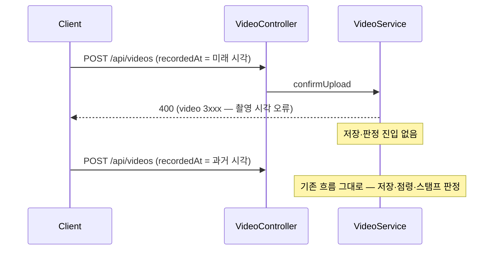

# PRD: 미션 스탬프 판정의 촬영 시각 위조 방어

> 티켓: MSG-278 · 작성일: 2026-08-03 · 작성: prd-writer
> 상태: 검토됨 (2026-08-03 성민 승인 — 미해결 질문 2건 확정 반영)  <!-- 수명주기: 초안 → 검토됨(사용자 승인 시 게이트가 갱신) → 확정 -->

## 1. 문제 상황

미션(축제·팝업) 스탬프 판정은 영상의 촬영 시각(`recorded_at`)을 미션 기간과 비교한다
(`MissionRepository.findCompleted`의 `v.recorded_at >= m.start_at AND <= m.end_at`). 그런데 이
값은 클라이언트가 업로드 요청 body에 적어 보내는 값이고, 서버 검증은 `@NotNull`뿐이다(실측:
`VideoUploadRequestDto.recordedAt`). 요청을 조작해 "축제 기간 안 시각"을 적으면 **축제가 끝난
뒤에도 스탬프를 딸 수 있다**. 교체(PUT) 경로도 `recordedAt`을 그대로 반영한다(MSG-242).

방금 실적재(MSG-290)로 dev에 기간형 미션 416건(축제 238·팝업 178)이 실제로 깔려, 이 구멍이
라이브 판정에 그대로 노출된 상태다. (Codex 커밋 리뷰 2026-07-31 파생, MSG-223 판정 코드 대상)

## 2. 목적 · 목표

- **목적**: 트리비얼한 촬영 시각 위조(미래 시각·기간 밖→안 조작)로 스탬프를 따는 것을 막는다.
- **목표**:
  - 업로드 시점보다 미래인 `recordedAt`이 서버에서 거부된다 (업로드·교체 양쪽)
  - 정상 사용자(갤러리 과거 영상, 시계 오차 수준)는 거부되지 않는다
- **비목표(스코프 제외)**:
  - **완전한 위조 차단** — 갤러리 업로드의 메타데이터 진위를 서버가 검증할 수단이 없다.
    과거 시각을 기간 안으로 적는 위조는 이 티켓으로 막을 수 없음을 명시적으로 수용
  - GPS·촬영 플로우 토큰 등 신뢰 신호 신설 — 요구가 생기면 별도 티켓(PRD부터)
  - 스탬프 소급 회수 — 이미 발급된 스탬프는 비회수 원칙(MSG-223) 유지

## 3. 기능 요구사항

| ID | 요구사항 | 우선순위 |
|----|----------|----------|
| FR-1 | 업로드 확정 요청의 `recordedAt`이 서버 현재 시각보다 미래면 400으로 거부된다 | Must |
| FR-2 | 교체(PUT) 요청의 `recordedAt`도 동일하게 검증된다 — 교체로 우회 불가 | Must |
| FR-3 | 정상 사용자의 단말 시계 오차 수준(수 분)은 거부되지 않는다 — 허용 오차를 둔다 | Must |
| FR-4 | 거부는 video 도메인 에러 코드(3xxx)로 구분 가능하다 — FE가 "촬영 시각 오류" 안내 가능 | Must |
| FR-5 | 과거 시각은 기존대로 통과한다 — 갤러리 업로드(과거 촬영 정상)의 도감 수집은 불변 | Must |

엣지: `recordedAt`은 시간대 표기가 없는 `LocalDateTime`이다 — 서버 비교 기준(UTC/KST)의 해석을
스펙이 실측으로 확정하고, 잘못된 기준으로 정상 업로드가 9시간 스큐 오거부되지 않아야 한다
(MSG-222 KST 스큐 전례).

## 4. 비기능 요구사항

| 분류 | 요구사항 |
|------|----------|
| 보안 | 목적은 트리비얼 위조 차단이다 — 서명·메타데이터 검증 없는 값이므로 "기간 안 과거 시각" 위조는 잔존 위험으로 수용하고 문서화한다 |
| 데이터 정합 | 기존 저장 행 소급 없음. 판정 쿼리(`findCompleted`)·스탬프 발급 로직 무수정 — 방어는 입력 경계에서 |
| 운영 | 마이그레이션 없음. 기존 클라이언트가 정상 시각을 보내는 한 동작 변화 없음 |

## 5. 시퀀스 다이어그램

## 6. 클래스 다이어그램

신규 타입 없음 — 기존 업로드·교체 경로에 검증 1종과 에러 코드 상수 추가 수준.

## 7. 변경 파일 목록

| 파일 | 변경 | Owner |
|------|------|-------|
| `src/main/java/com/msg/fillmap/video/service/VideoServiceImpl.java` | 수정 — 업로드·교체 경로 미래 시각 검증 (정확한 지점은 스펙 확정) | B |
| `src/main/java/com/msg/fillmap/video/exception/VideoErrorCode.java` | 수정 — 촬영 시각 오류 상수 추가 | B |
| `src/test/java/com/msg/fillmap/video/**` | 수정 — 거부·통과·오차 경계 테스트 | B |

## 8. 확정 사항 (2026-08-03 성민 결정)

- **이벤트 미션 인정 범위 = 갤러리 포함 인정 (현행 유지)**: 트리비얼 위조(미래 시각)만 차단한다.
  근거 — 서버가 입력 소스(갤러리/카메라)를 구분할 수단이 현재 요청 계약에 없고(실측), "현장
  촬영만 인정"은 클라 신고 필드를 받아도 같은 방식으로 위조된다. 도감·스트릭이 갤러리 업로드를
  인정하는 기존 결정과도 일관. 현장 촬영 한정이 필요해지면 GPS 검증 등 신뢰 신호 신설을 별도
  티켓(PRD부터)으로 진행한다.
- **허용 오차 = 5분**: 서버 현재 시각 + 5분까지의 `recordedAt`은 통과 — 일반적인 단말 시계
  스큐 커버, 위조 실익 없음.

미해결 질문 없음.
