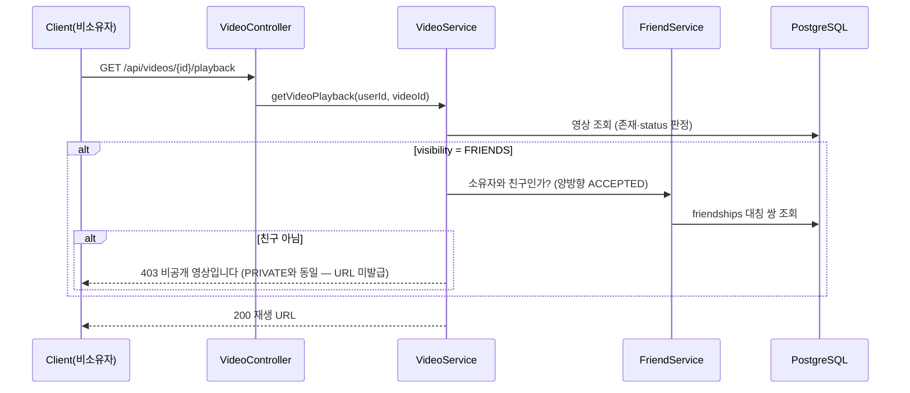
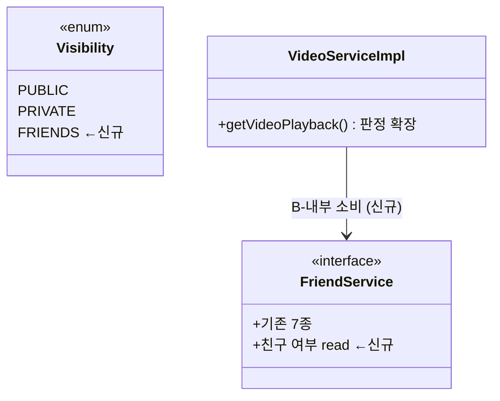

# PRD: 영상 공개범위 FRIENDS(친구만 보기) 확장

> 티켓: MSG-285 · 작성일: 2026-08-03 · 작성: prd-writer
> 상태: 검토됨 (2026-08-03 사용자 승인 — 미해결 질문 0)

## 1. 문제 상황

영상 공개범위는 PUBLIC/PRIVATE 2값뿐이다. 업로드 시 지정(MSG-204)과 더보기 변경(MSG-162)은
2값으로 먼저 출시됐고, 3값째(FRIENDS)는 친구 기능이 생기면 이 티켓으로 확장하기로 결정돼
있었다(2026-08-01, Phase 2). 이제 친구 관계 API(MSG-185)가 완료돼 선행 조건이 해소됐다.
현재 사용자는 "아는 사람에게만 보여주고 싶은" 영상을 PRIVATE(아무도 못 봄)나
PUBLIC(전원 공개) 중 하나로만 올릴 수 있다.

## 2. 목적 · 목표

- **목적**: 전체 공개와 비공개 사이의 중간 단계 — 영상을 친구에게만 공개할 수 있게 한다.
- **목표**:
  - 사용자가 업로드 확정·공개범위 변경에서 FRIENDS를 지정할 수 있다
  - FRIENDS 영상은 소유자 본인과 수락된(ACCEPTED) 친구만 재생할 수 있다
  - 친구가 아닌 사용자에게는 PRIVATE와 동일하게 존재 자체가 숨겨진다
- **비목표(스코프 제외)**:
  - **FRIENDS 영상의 목록 노출** (격자 상세 영상 목록·격자 대표 영상·탐색 집계 등에
    "친구의 FRIENDS 영상"을 포함시키는 조회 경로) — 친구 도감 레이어(MSG-187) 기획과 함께
    재설계. 이번 티켓은 값·지정·재생 판정의 계약 선행이다 (미해결 질문 1 참조)
  - 기존 영상 소급 전환 (MSG-204와 동일 원칙)
  - 공개범위 기본값 설정 저장 (MSG-204에서 폐기된 항목)
  - 차단(BLOCKED) 관계의 특수 처리 — 차단 기능 자체가 후속(MSG-185 비목표)

## 3. 기능 요구사항

| ID | 요구사항 | 우선순위 |
|----|----------|----------|
| FR-1 | 사용자는 업로드 확정 시 공개범위로 FRIENDS를 지정할 수 있다 | Must |
| FR-2 | 사용자는 내 영상의 공개범위를 FRIENDS로, FRIENDS에서 다른 값으로 변경할 수 있다 | Must |
| FR-3 | FRIENDS 영상의 소유자 본인은 항상 재생할 수 있다 (status 등 기존 조건은 그대로) | Must |
| FR-4 | 소유자와 ACCEPTED 친구 관계인 사용자는 FRIENDS 영상을 재생할 수 있다 — 관계 방향(누가 요청했는지) 무관 | Must |
| FR-5 | 친구가 아닌 사용자가 FRIENDS 영상 재생을 요청하면 PRIVATE 비소유자와 완전 동일하게 처리한다 — 403 "비공개 영상입니다"(기존 에러 재사용, MSG-206 확정 정책 계승). 재생 URL이 발급되어서는 안 된다 (2026-08-03 정정 — 당초 404 은닉 안은 PRIVATE 실제 동작이 403인 사실 확인으로 폐기) | Must |
| FR-6 | 친구 삭제 즉시 상대의 FRIENDS 영상은 재생할 수 없다 — 관계는 요청 시점에 실시간 판정한다 | Must |
| FR-7 | FRIENDS 영상은 전역 노출 경로(격자 대표 영상·전역 목록·탐색 집계 등)에 노출되지 않는다 — 기존 PUBLIC 한정 조회가 유지됨을 검증 | Must |
| FR-8 | 허용되지 않는 공개범위 값 요청은 기존 INVALID_VISIBILITY 에러로 실패하고, 에러 메시지·API 문서가 3값(PUBLIC/PRIVATE/FRIENDS)을 반영한다 | Must |
| FR-9 | 공개범위는 노출 정책일 뿐 기록 사실을 바꾸지 않는다 — FRIENDS 영상도 점령·도감·스트릭·핫스코어 판정에 기존(PUBLIC/PRIVATE)과 동일하게 반영된다 | Must |

## 4. 비기능 요구사항

| 분류 | 요구사항 |
|------|----------|
| 보안/인가 | **핵심 회귀 지점**: 재생 판정이 현재 "PRIVATE && 비소유자만 차단" 형태라, FRIENDS를 단순 추가하면 비친구에게 재생 URL이 발급된다. 비친구에게 사전서명 URL이 새는 경로가 없어야 하며, 실패 응답은 PRIVATE와 동일한 403이다 |
| 성능 | 재생 판정에 친구 관계 조회가 1회 추가된다 — 복합 PK/유니크 인덱스 수준의 단건 조회여야 하며 재생 API p95에 유의미한 영향이 없어야 한다 |
| 데이터 정합 | DB CHECK 제약(PUBLIC/PRIVATE)의 3값 확장 마이그레이션 필요. 기존 행 데이터 무변경. 친구 판정은 friendships의 대칭 쌍(방향 무관) 기준 |
| 운영 | 마이그레이션 1건(CHECK 교체). FRIENDS 행이 생긴 뒤 구버전으로 롤백하면 CHECK 위반 — 릴리스 노트에 명시. 인덱스 무변경(목록 노출이 비목표라 PUBLIC partial index 영향 없음) |

## 5. 시퀀스 다이어그램

## 6. 클래스 다이어그램

## 7. 변경 파일 목록

| 파일 | 변경 | Owner |
|------|------|-------|
| `src/main/java/com/msg/fillmap/video/entity/Visibility.java` | 수정 — FRIENDS 상수 추가 | B |
| `src/main/java/com/msg/fillmap/video/service/VideoServiceImpl.java` | 수정 — getVideoPlayback 재생 판정 확장(친구 판정 소비) | B |
| `src/main/java/com/msg/fillmap/friend/service/FriendService.java`(+Impl) | 수정 — 친구 여부 read 메서드 추가 (video↔friend 둘 다 Owner B — 계약 인터페이스 불요) | B |
| `src/main/java/com/msg/fillmap/video/exception/VideoErrorCode.java` | 수정 — INVALID_VISIBILITY(3420) 메시지 3값 반영 | B |
| `src/main/java/com/msg/fillmap/video/dto/VideoVisibilityRequestDto.java` · `VideoController.java` | 수정 — Swagger 문구 3값 반영 | B |
| `src/main/resources/db/migration/V20__videos_visibility_friends.sql` | 신규 — chk_videos_visibility 3값 확장 | - |
| `.claude/rules/glossary.md` | 수정 — "친구 공개(FRIENDS)" 용어 등재 | - |

## 8. 미해결 질문

없음 — 유일 쟁점이었던 "친구 대상 목록 노출 포함 여부"는 **제외로 확정**
(2026-08-03 사용자 결정). 이번 티켓은 값·지정·재생 판정의 계약 선행이며, MVP에서
친구가 FRIENDS 영상에 도달할 UI 경로는 아직 없다(BE 계약 선행 — MSG-204와 동일 패턴).
노출 경로는 MSG-187 친구 레이어와 함께 재설계한다 (§2 비목표 반영).
