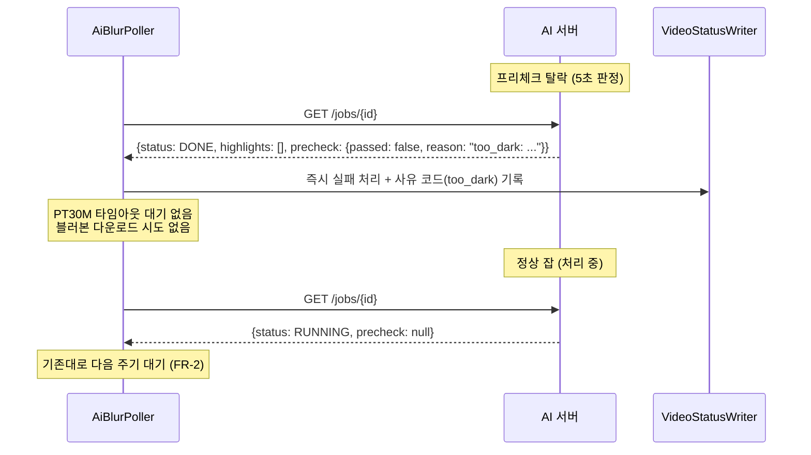
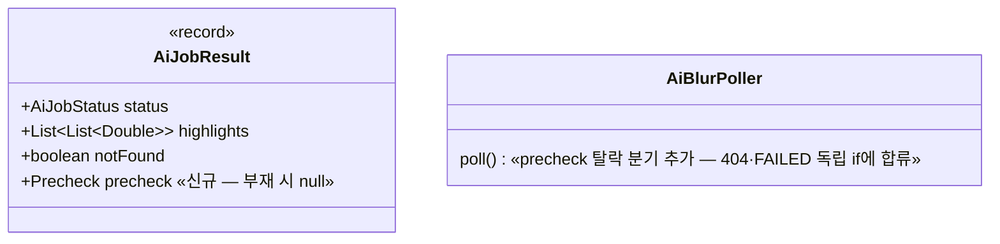

# PRD: AI 프리체크 탈락 영상 즉시 실패 처리 (BE 소비)

> 티켓: MSG-286 · 작성일: 2026-08-03 · 작성: prd-writer
> 상태: 검토됨 (2026-08-03 성민 승인)  <!-- 수명주기: 초안 → 검토됨(사용자 승인 시 게이트가 갱신) → 확정 -->

## 1. 문제 상황

AI가 MSG-284로 무의미 영상 프리체크를 붙였다. 암흑·렌즈 가림 영상은 추론 없이 약 5초 만에
판정되고 `status=DONE` + `precheck={passed:false, reason}` + `highlights=[]`로 끝난다. 블러본을
만들지 않으므로 `GET /jobs/{id}/video`는 409다(원본 유출 차단 — 의도된 동작, MSG-284 FR-6).

문제는 BE가 이 409를 "아직 완료 전"으로 오해하는 것이다. `AiClient.downloadBlurred()`는 409를
미완료 신호로 보고 null을 반환하고, `AiBlurPoller`는 null이면 타임아웃 경로로 넘긴다. 그래서
**AI에서 5초에 끝난 잡이 BE에서는 PT30M을 기다린 뒤에야 FAILED로 수렴한다.** AI 워커 큐 절감은
이미 유효하다(BE가 잡을 재제출하지 않아 워커는 5초 만에 다음 잡으로 넘어간다) — 손해는 그
사용자의 대기 시간이다: 3분 만에 봤을 실패를 30분 뒤에 본다.

## 2. 목적 · 목표

- **목적**: 촬영이 잘못된 영상을 올린 사용자가 실패를 수 분 안에 알게 한다. 30분 침묵 후
  "AI 처리 실패"는 시스템 오류로 오해되고 재업로드 유도도 못 한다.
- **목표**:
  - 프리체크 탈락 영상이 다음 폴링 주기 안에 실패로 확정된다 (30분 타임아웃 대기 제거)
  - 탈락 사유가 시스템 오류와 구분 가능하게 남는다 (추후 FE가 "촬영이 잘못된 영상" 안내 가능)
- **비목표(스코프 제외)**:
  - 탈락 영상의 FE 안내 문구·재업로드 유도 UX — FE 몫, 노출 방식은 별도 협의 (티켓 명시)
  - 프리체크 판정 로직·임계값 — AI 레포 소관 (MSG-284)
  - `reason`의 콜론 뒤 진단 수치 파싱 — 형식이 바뀔 수 있는 진단용 (MSG-284 계약)
  - 새 ProcessingStatus 상태 신설 — 탈락도 FAILED로 수렴하고 사유 코드로 구분한다

## 3. 기능 요구사항

| ID | 요구사항 | 우선순위 |
|----|----------|----------|
| FR-1 | 폴링 응답의 `precheck.passed == false`면 타임아웃을 기다리지 않고 즉시 실패 처리된다 | Must |
| FR-2 | 정상 처리 중 잡의 409("아직 완료 전")는 기존대로 대기한다 — 409를 무조건 즉시 실패로 바꾸지 않는다. 판정은 반드시 precheck 필드로 가른다 | Must |
| FR-3 | `precheck` 필드가 없는 응답(AI 구버전·배포 시차)에서는 기존 타임아웃 경로가 유지된다 — 필드 부재 = 판정 안 함 | Must |
| FR-4 | 탈락 사유 코드(`reason`의 콜론 앞 안정 식별자, 예 `too_dark`)가 영상 단위로 조회 가능하게 남는다 — 시스템 오류로 인한 FAILED와 구분된다 | Must |
| FR-5 | AI 명시 `FAILED` 즉시 실패·404 재제출(MSG-283) 등 기존 폴러 동작은 변하지 않는다 | Must |
| FR-6 | 탈락 판정 후 해당 잡에 대한 영상 다운로드 시도가 반복되지 않는다 | Should |

엣지: `reason`이 null이거나 알 수 없는 코드여도 실패 처리 자체는 동작한다(사유는 원문 코드
보존, 매핑 실패가 실패 처리를 막지 않는다).

## 4. 비기능 요구사항

| 분류 | 요구사항 |
|------|----------|
| 계약 호환 | AI 응답 계약은 MSG-284 FR-4~6이 정본 — 통과 `{passed:true, reason:null}` · 탈락 `{passed:false, reason:"too_dark: std 3.18 < 10.0"}` · 판정 전 `null`. `AiClient`는 JsonNode 트리 파싱이라 필드 추가로 기존 동작이 깨지지 않는다 |
| 데이터 정합 | 탈락 실패는 기존 FAILED 경로(상태 전이·가드)와 일관되게 수렴한다 — 별도 상태 기계를 만들지 않는다 |
| 운영 | 사유 저장 공간이 현재 없다(`videos`에 사유 컬럼 부재 — 실측). 저장 방식(컬럼 신설 vs 대안)은 스펙이 확정하고, 마이그레이션이 생기면 스펙에 명시한다 |
| 판정 성격 | AI 임계값은 오탐 0 우선 보수적(샘플 14종 오탐 0·미탐 0) — BE에 탈락이 올라오면 실제로 못 쓰는 영상일 가능성이 높다. BE가 판정을 재검증하지 않는다 |

## 5. 시퀀스 다이어그램

## 6. 클래스 다이어그램

## 7. 변경 파일 목록

| 파일 | 변경 | Owner |
|------|------|-------|
| `src/main/java/com/msg/fillmap/video/service/AiClient.java` | 수정 — `AiJobResult`에 precheck 탑재(트리 파싱 확장) | B |
| `src/main/java/com/msg/fillmap/video/service/AiBlurPoller.java` | 수정 — 탈락 즉시 실패 분기 (MSG-283이 분리한 독립 if 형태에 합류) | B |
| `src/main/java/com/msg/fillmap/video/service/VideoStatusWriter.java` | 수정 — 실패 사유 코드 기록 경로 (방식은 스펙 확정) | B |
| `src/main/java/com/msg/fillmap/video/entity/Video.java` | 수정 가능 — 사유 저장 공간 (스펙 확정) | B |
| `src/main/resources/db/migration/V{n}__*.sql` | 가능 — 사유 컬럼 신설 시 (스펙 확정) | - |

## 8. 미해결 질문

없음 — FE 노출 방식은 비목표(별도 협의)로 명시했고, 사유 저장 방식은 스펙 단계 결정 사항이다.
