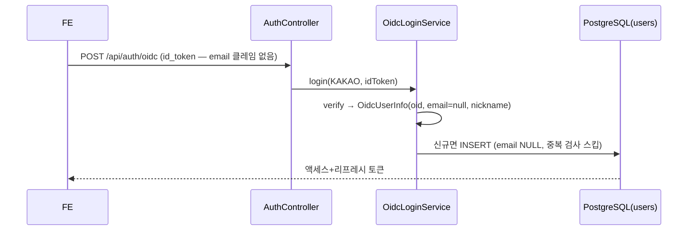

# PRD: 카카오 가입 이메일 미수집

> 티켓: MSG-310 · 작성일: 2026-08-03 · 작성: prd-writer
> 상태: 검토됨  <!-- 2026-08-03 사용자 결정("카카오에서 이메일은 받지 않는다") 반영 -->

## 1. 문제 상황

카카오 로그인에서 이메일 동의항목(account_email)을 쓰려면 비즈 앱 전환이 선행돼야 하는데(콘솔 실측
"권한 없음"), MVP에 이메일의 실제 용도가 없어 수집하지 않기로 했다 (2026-08-03 확정). 그런데 현재
백엔드는 `users.email NOT NULL` + 가입 시 이메일 중복 검사 구조라, 이메일 클레임이 없으면 카카오
가입이 서버 에러로 터진다. 이메일 가입/로그인(`AuthService`)은 로컬 테스트용으로만 쓰인다.

## 2. 목적 · 목표

- **목적**: 이메일 없이 카카오 가입/로그인이 정상 동작하게 한다.
- **목표**: email 클레임 없는 id_token으로 가입 성공 (email null 저장), 기존 기능 회귀 없음.
- **비목표(스코프 제외)**: 이메일 가입/로그인(로컬 테스트용) 변경, 이메일 수집 재개 대비 설계,
  프로필 API 응답 형태(MSG-203에서 email null 가능으로 별도 반영).

## 3. 기능 요구사항

| ID | 요구사항 | 우선순위 |
|----|----------|----------|
| FR-1 | email 클레임이 없는 카카오 id_token으로 가입하면 email null로 저장되고 로그인이 완료된다 | Must |
| FR-2 | email 클레임이 있으면 기존과 동일 — 중복 검사 후 저장 (동작 불변) | Must |
| FR-3 | 이메일 가입(로컬 테스트용)은 계속 이메일 필수다 — 요청 DTO 검증 불변 | Must |

## 4. 비기능 요구사항

| 분류 | 요구사항 |
|------|----------|
| 데이터 정합 | `uq_users_email` UNIQUE 유지 — PostgreSQL은 NULL 중복을 허용하므로 email 있는 유저 간 중복만 계속 차단 |
| 운영 | V16 마이그레이션(NOT NULL 해제)은 기존 데이터 무변경·즉시 적용, 롤백은 NULL 행 부재 시 SET NOT NULL |

## 5. 시퀀스 다이어그램

## 6. 클래스 다이어그램

신규/변경 타입 없음 — 기존 `OidcLoginService` 분기 하나와 스키마 제약만 변경.

## 7. 변경 파일 목록

| 파일 | 변경 | Owner |
|------|------|-------|
| `src/main/resources/db/migration/V16__users_email_nullable.sql` | 신규 — NOT NULL 해제 | B |
| `src/main/java/com/msg/fillmap/auth/service/OidcLoginService.java` | 수정 — email null이면 중복 검사 스킵 | B |
| `src/test/java/com/msg/fillmap/auth/service/OidcLoginServiceTest.java` | 테스트 추가 | B |
| `src/test/java/com/msg/fillmap/user/repository/UserEmaillessPersistenceTest.java` | 신규 — V16 실 DB 검증 | B |

## 8. 미해결 질문

없음.
