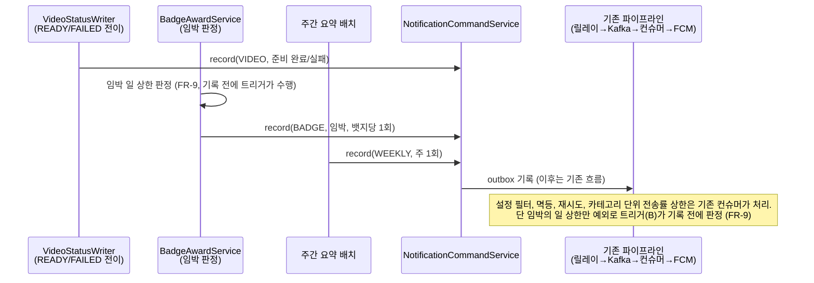

# PRD: 알림 다양화 (영상 준비 완료 · 뱃지 임박 · 주간 요약, 공유 PRD)

> 티켓: MSG-313 · MSG-314 · MSG-315 (알림 에픽 MSG-170 하위 3종 커버) · 작성일: 2026-08-05 · 작성: prd-writer
> 상태: 검토됨 (2026-08-05 성민 승인, 미해결 질문 4건 확정 반영: 실패도 알림 · BADGE 재사용 · 업로드 직후 판정 · 일요일 저녁)  <!-- 수명주기: 초안 → 검토됨(사용자 승인 시 게이트가 갱신) → 확정 -->

## 1. 문제 상황

알림 파이프라인(MSG-178~181)이 완성됐지만 카테고리가 3종(뱃지 획득, 핫구역, 스트릭 리마인드)뿐이라
리텐션 커버리지가 좁다. 구체적으로:

- 업로드 UX가 "올리면 끝, 확인은 나중에" 모델로 정리됐는데(디자인 갭 검토 결정 1, 2026-08-04)
  정작 "나중"이 왔음을 알려줄 수단이 없다. 사용자가 앱을 다시 열어야 처리 결과를 안다.
- 뱃지는 획득한 뒤에만 알림이 간다. 목표까지 1개 남은 순간이 행동 전환 확률이 가장 높은
  시점인데, 그때는 아무것도 하지 않는다.
- 활동이 쌓여도 주간 단위로 되짚어 주는 장치가 없어, 앱을 며칠 안 열면 도감의 재미가 잊힌다.

2026-08-05 성민 확정: 확장 3종 = 영상 준비 완료 + 뱃지 임박 + 주간 요약.

## 2. 목적 · 목표

- **목적**: 기존 발송 파이프라인이 이미 보장하는 것(유실 방지, 멱등[^1], 옵트아웃[^2],
  전송률 제한) 위에 트리거만 얹어 알림의 리텐션 커버리지를 넓힌다.
- **목표**:
  - 영상이 재생 가능해지는 순간 업로더가 푸시로 안다 (MSG-313)
  - 다음 뱃지까지 1개 남은 사용자가 그 사실을 푸시로 안다 (MSG-314)
  - 지난주 활동이 있던 사용자가 주 1회 요약 푸시를 받는다 (MSG-315)
  - 세 종류 모두 알림 설정에서 개별로 끌 수 있다
- **비목표(스코프 제외)**:
  - **위치 기반 업로드 유도(지오펜싱[^3])**: 앱(Android/iOS) 단계 기능이라 이번엔 방향만
    기록한다. 서버는 위치를 수집하지 않고 "핫스팟 목록 API"만 제공하며, 근접 판정과 로컬
    알림은 앱의 OS 지오펜싱이 담당한다(위치정보법 부담을 최소화하는 구조). 앱 티켓 생성 시
    별도 PRD로.
  - **친구 활동 알림**: friend 도메인은 완성됐으나 이번 묶음 밖. 후속 티켓.
  - **주간 조회수 통계**: `view_count`가 누적값이라 주간 증분은 스냅숏 테이블을 새로 만들지
    않는 한 산출할 수 없다. 이번 요약 수치에서 제외한다(아래 FR-8).
  - 알림 이력/읽음 API: 기존 비목표 유지.

## 3. 기능 요구사항

| ID | 요구사항 | 티켓 | 우선순위 |
|----|----------|------|----------|
| FR-1 | 영상 처리가 완료돼 재생 가능해지면(인코딩만 경로, 블러 경로 모두) 업로더에게 알림이 기록된다 | 313 | Must |
| FR-2 | 이미 처리 완료 알림이 간 영상의 재처리(교체 업로드)는 새 알림으로 간주한다. 교체본 준비 완료도 알 가치가 있다 | 313 | Should |
| FR-2b | 처리 **실패**(FAILED, AI 프리체크 탈락 포함) 시에도 업로더에게 알림이 기록된다. 문구는 재업로드 유도형(2026-08-05 확정). 실패 화면과 사유 노출 API가 없으므로 문구가 안내를 전담하며, 상세는 스펙에서 | 313 | Must |
| FR-3 | 다음 뱃지 티어까지 진행 수치가 정확히 1 남으면 **업로드 직후 즉시** 해당 사용자에게 알림이 기록된다. 발급 판정과 같은 재료, 같은 시점(2026-08-05 확정) | 314 | Must |
| FR-4 | 같은 뱃지에 대한 임박 알림은 사용자당 생애 1회다. 임박 상태를 오가도 반복되지 않는다. 카테고리는 **기존 BADGE 재사용**으로, 설정에서 획득과 임박이 한 토글이다(2026-08-05 확정) | 314 | Must |
| FR-5 | 매주 1회 **일요일 저녁(KST)**, 지난주(KST 월~일) 활동이 있던 사용자에게 요약 알림이 기록된다. 같은 주에 두 번 가지 않는다(재실행 멱등). 리마인드(매일 20시)와 겹치지 않는 시각은 스펙에서 확정(2026-08-05 요일 확정) | 315 | Must |
| FR-6 | 지난주 활동이 없던 사용자에게는 주간 요약을 보내지 않는다. 빈 요약은 리텐션이 아니라 소음이다 | 315 | Must |
| FR-7 | 신규 알림 종류가 알림 설정 조회와 토글 대상에 포함된다 (기존 옵트아웃 모델 그대로, 기본 on) | 공통 | Must |
| FR-8 | 주간 요약 수치는 지난주 수집 격자 수와 올린 영상 수로 한다 (조회수는 비목표: 누적값이라 주간 증분 불가) | 315 | Must |
| FR-9 | 전송률 상한: 준비 완료는 무제한(사용자 행동에 직결되고 업로드 수만큼만 발생), 뱃지 임박은 1건/일, 주간 요약은 주 1회 자체가 상한. **임박의 일 상한은 기록 단계(트리거)에서 건다.** 발송 단계의 상한 판정은 카테고리 단위라(컨슈머 실측: `countSentSince(userId, category)`), BADGE를 재사용(FR-4)하면 획득(무제한)과 임박(1건/일)을 발송 쪽에서 구분할 수 없다. 트리거 측 판정 방식은 스펙 몫 | 공통 | Must |

## 4. 비기능 요구사항

| 분류 | 요구사항 |
|------|----------|
| 전달 보장 | 기존 파이프라인 승계: at-least-once[^4] + 이벤트 키 멱등. 커밋 = 기록 보장 시점(트리거가 비즈니스 트랜잭션에 참여하는 FR-3 계열에 해당) |
| 데이터 정합 | 기존 테이블 소급 없음. 카테고리 확장은 notifications(V21)와 notification_opt_outs(V22) 양쪽 CHECK 제약[^5] 재정의 마이그레이션으로 하며, 기존 행은 무변경 |
| 운영 | 배치(주간 요약)는 기존 게이트(`fillmap.notification.enabled`) 안. 부분 실패 회복은 MSG-181 리마인드에서 확립한 방식(재발화 + 멱등 흡수 + 사용자 단위 격리)을 따른다 |
| 호환 | 설정 API(GET/PATCH preferences)는 카테고리 enum 순회 합성이라 신규 카테고리가 자동 포함된다(코드 수정 없이 응답이 늘어남). FE에 카테고리 추가 사실 공유 필요 |

## 5. 시퀀스 다이어그램

## 6. 클래스 다이어그램

신규 도메인 없음. 기존 notification 파이프라인을 소비하며, 카테고리 enum 확장과 트리거 3종
(기존 클래스 배선 2곳 + 배치 1개 신설)뿐이라 타입 구조 변화가 없어 생략한다. 구체 형상은 스펙 몫.

## 7. 변경 파일 목록

리서치 기반 (2026-08-05 develop 실측 2차, Codex 스톱 리뷰 지적 반영: 완료·실패 전이는
`VideoStatusWriter`의 4개 메서드가 전부다. 완료 = `markReady`(인코딩만 경로) +
`markBlurReady`(블러 경로), 실패 = `markFailed`(인코딩 실패) + `markBlurFailed`(블러 실패).
설정 API는 enum 순회 합성이라 자동 확장되지만, 컨슈머의 전송률 판정은 카테고리 switch라
case 추가가 필요하다):

| 파일 | 변경 | Owner |
|------|------|-------|
| `src/main/resources/db/migration/V25__*.sql` | 신규: V21과 V22의 CHECK 재정의(카테고리 확장). 번호는 착수 시점 develop 재확인 | B |
| `notification/entity/NotificationCategory.java` | 수정: 카테고리 추가(VIDEO 등, 명명은 스펙) | B |
| `video/service/VideoStatusWriter.java` | 수정: 완료 전이 2메서드(`markReady`·`markBlurReady`)와 실패 전이 2메서드(`markFailed`·`markBlurFailed`)에 record 배선 (313) | B |
| `badge/service/BadgeAwardServiceImpl.java` 또는 판정 신설 | 수정: 임박 판정 + record (314. condition_value 접근 방식은 스펙 몫, Badge 엔티티는 conditionValue 미매핑) | B |
| `notification/relay/` 또는 `streak` 류 배치 위치 | 신규: 주간 요약 스케줄러 (315, 집계 쿼리 포함) | B |
| `notification/consumer/NotificationConsumer.java` | 수정: `rateLimited()`의 카테고리 switch가 exhaustive라 VIDEO·WEEKLY case 추가 필수(누락 시 컴파일 실패). 두 case 모두 발송 단계 상한 없음(VIDEO 무제한, WEEKLY는 배치가 주 1회). **임박 상한은 여기가 아니라 트리거에서** (FR-9) | B |
| `badge` 트리거(위 임박 판정 행) | FR-9의 일 상한 판정 포함. 방식(당일 임박 기록 존재 확인 등)은 스펙 | B |
| `notification/config/NotificationProperties.java` 등 설정 | 수정: 임박 상한 키의 위치(트리거 측)와 추가 여부는 스펙 | B |

설정 API, 릴레이, FCM 센더는 무변경. 컨슈머 변경은 전송률 switch의 case 추가뿐이고 처리
흐름은 그대로다. 단 그 case들은 상한을 걸지 않으므로, FR-9의 임박 상한은 전적으로 트리거
책임이다.

## 8. 미해결 질문

없음. 초안의 4건은 2026-08-05 성민 확정으로 해소:

- 실패 알림: **보낸다** (FR-2b). 실패 화면과 사유 API 부재는 문구 설계로 흡수하고, 갭 검토의
  "실패 분기 화면 없음" 항목과 함께 디자인 백로그에 전달한다.
- 임박 카테고리: **BADGE 재사용**. 신규 CHECK 확장은 VIDEO, WEEKLY(명명은 스펙) 2종만.
- 임박 판정 시점: **업로드 직후 즉시**. 발급 판정(award)과 같은 트랜잭션, 같은 재료.
- 주간 요약: **일요일 저녁**. 시각은 리마인드(매일 20시)와 분산해 스펙에서 확정.

[^1]: 멱등: 같은 요청을 여러 번 실행해도 결과가 한 번 실행과 같다. 알림에서는 사건마다 붙는
  이벤트 키(예: `REMIND:2026-08-05`)를 DB UNIQUE 제약이 흡수해서, 배치 재실행이나 메시지
  재전달이 중복 발송으로 이어지지 않는 근거다.
[^2]: 옵트아웃(opt-out): 기본은 켜져 있고 사용자가 원할 때 끄는 모델. 반대는 옵트인. 알림
  설정(MSG-180)이 이 모델이라, 새 카테고리는 별도 동의 절차 없이 기본 on으로 추가된다.
[^3]: 지오펜싱: 지도 위에 가상 울타리(좌표 + 반경)를 정해 두고 단말이 그 안에 들어오면
  동작을 트리거하는 기술. iOS와 Android가 OS 차원에서 제공하므로 앱이 위치를 서버로 보내지
  않고도 "핫한 곳 근처" 판정이 가능하다.
[^4]: at-least-once: 메시지가 최소 1회는 반드시 전달되지만 재시도 과정에서 같은 메시지가
  두 번 올 수 있다는 보장 수준. 유실 방지를 우선하는 대신 중복 처리는 수신 측 멱등이 맡는다.
[^5]: CHECK 제약: 컬럼에 들어갈 수 있는 값을 DB가 직접 검사하는 규칙. 카테고리 컬럼이
  `IN ('BADGE','HOTZONE','REMIND')`로 잠겨 있어서, enum에 값을 추가해도 DB 규칙을 함께
  고치는 마이그레이션이 없으면 INSERT가 거부된다. 이 PRD가 마이그레이션을 필수로 두는 이유.
