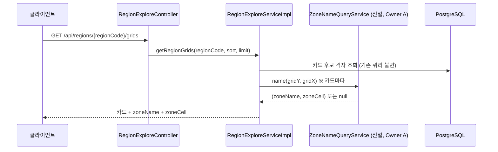
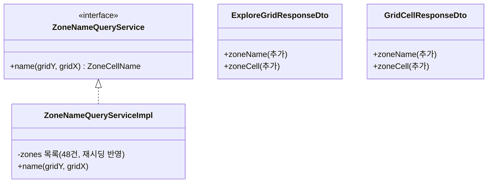

# PRD: 격자 표시명 서버 응답 포함 (zoneName + zoneCell)

> 티켓: MSG-341 · 작성일: 2026-08-07 · 작성: prd-writer
> 상태: 검토됨 (2026-08-07 정민 승인 — 범위 전체 응답 확장, FE 폴백 미유지 확정 반영)

## 1. 문제 상황

지도 홈(피그마 노드 14062-10362)의 격자 카드는 제목이 "서면 A-14"인데, 현재 카드 리스트 응답에는 이 이름이 없다. 확정 계약(MSG-234 §D3)이 표시명을 클라이언트 로컬 산술로 정했기 때문이다. FE는 zones 캐시와 대조하는 명명 규칙을 자체 구현해야 하고, 앞으로 Android와 iOS도 같은 규칙을 각자 한 벌씩 더 구현해야 한다. MSG-325(지도 홈 API 연동) 진행 중에 FE가 "조립만 하고 규칙은 갖지 않게 해달라"고 요청했다.

서버 관점에서도 이름 계산 유틸이 없으면 앞으로 서버가 문자열을 만들어야 하는 경로(푸시 알림 문구, 공유 미리보기 등)가 생길 때마다 같은 논의가 반복된다. §D3도 그 경우 서버 포팅을 각주로 열어 뒀다.

## 2. 목적 · 목표

- **목적**: 격자 이름("서면 A-14")의 계산 주체를 서버로 옮겨, 클라이언트(웹, Android, iOS)는 응답 필드 조립만 하게 한다.
- **목표**:
  - 격자를 담아 내려가는 모든 조회 응답에서 클라이언트가 명명 규칙 없이 격자 이름을 만들 수 있다.
  - 서버와 클라이언트가 같은 정본(`zone-naming.json` 픽스처[^1])으로 검증되어 어느 쪽이 계산해도 같은 이름이 나온다.
- **비목표(스코프 제외)**:
  - 행정동 기반 번호 부여("부전 B-07")는 하지 않는다. 행렬 번호는 구역(zone) 사각형 안에서만 존재하고, 구역 밖 격자는 행정동 이름만 쓴다는 명명 규칙 자체는 불변이다.
  - 이름 문자열을 DB에 저장(비정규화[^2])하지 않는다. 항상 현재 zones 데이터로 계산한다.
  - FE의 zones 캐시 제거는 목표가 아니다. 검색바의 구역 이름 이동(MSG-234 §D6, FE 로컬 필터)은 그대로 남는다.
  - 격자 클릭 직후의 선행 표시를 위한 FE 로컬 산술 폴백은 두지 않는다. 이름은 서버 응답 도착 후 표시한다 (응답 지연 감수, 2026-08-07 확정).

## 3. 기능 요구사항

| ID | 요구사항 | 우선순위 |
|----|----------|----------|
| FR-1 | 격자를 담는 조회 응답 전부에 구역 이름(`zoneName`)과 구역 내 위치 코드(`zoneCell`, 예 "A-14")가 포함된다. 대상: 행정동 격자 카드 리스트, 단일 격자 조회, 뷰포트 격자 조회(내 격자와 친구 격자 공용 DTO), 도감 목록, 지역별 갤러리, 친구 프로필 최근 수집 격자, 핫구역, 장소 검색 결과, 영상 업로드 확정과 재생 응답 | Must |
| FR-2 | 구역 안 격자의 두 필드 값은 `zone-naming.json` 픽스처의 기대값과 정확히 일치한다 (행 A는 사각형 북단, 열 1은 서단) | Must |
| FR-3 | 구역 밖 격자는 두 필드가 모두 null이다. 클라이언트는 기존 `regionName`으로 폴백하며, 폴백에 번호를 붙이지 않는 기존 규칙은 그대로다 | Must |
| FR-4 | 미점령 격자를 단일 격자 조회(`GET /api/grids/{gridId}`)로 보면(occupied=false) 두 필드가 동일하게 계산된다. 격자의 DB 행 존재 여부와 무관하게 이름이 나온다 | Must |
| FR-5 | 한 격자가 두 구역에 겹치면 priority 내림차순, 같으면 zoneKey 사전순으로 하나만 선택된다 (기존 타이브레이크[^3]와 동일) | Must |
| FR-6 | zones 데이터가 재시딩으로 바뀌면 서버 재배포나 별도 배치 없이 다음 응답부터 새 이름이 반영된다 | Must |
| FR-7 | OpenAPI 명세에 두 필드의 의미와 null 조건(구역 밖)이 기술되어, 생성된 클라이언트 타입만 보고도 폴백 분기를 알 수 있다 | Should |

## 4. 비기능 요구사항

| 분류 | 요구사항 |
|------|----------|
| 성능 | 이름 계산 추가로 기존 응답 시간 목표가 흔들리지 않는다. 뷰포트 최대 페이지(5,000건)와 카드 리스트 limit 생략(전체) 기준에서도 응답 시간 증가가 측정 오차 수준이어야 한다 (구역 48건과의 정수 비교라 격자당 비용이 상수) |
| 데이터 정합 | 명명 규칙의 단일 정본은 계속 `zone-naming.json` 하나다. 서버 테스트가 이 픽스처를 직접 소비해, 서버 계산과 클라이언트 로컬 산술이 갈라질 수 없게 한다 |
| 운영 | DB 스키마 변경과 마이그레이션이 없다. zones 재시딩(기존 절차)만으로 이름이 반영된다 |
| 계약 절차 | MSG-234 §D3(서버는 표시명 문자열을 만들지 않는다)의 결정 변경이다. 스펙 단계에서 §D3 결정 변경 배너와 위키 ADR[^4] 갱신을 함께 처리한다 |

## 5. 응답 형태 (FE 착수용 계약)

필드는 통짜 문자열이 아니라 쪼갠 두 개다. 화면마다 "서면 A-14"(상세 타이틀)와 "A-14"(마커, 칩)를 다르게 쓰는 FE 요청을 반영했다. 아래는 대표 2개 응답의 예시고, FR-1의 나머지 대상 응답에도 같은 두 필드가 같은 규칙으로 추가된다.

`GET /api/regions/{regionCode}/grids` 응답의 `grids[]` 항목:

```json
{
  "gridId": "39064_112225",
  "gridY": 39064,
  "gridX": 112225,
  "videoCount": 138,
  "coverThumbnailUrl": "https://...(presigned)",
  "coverDurationSec": 84,
  "zoneName": "서면",
  "zoneCell": "I-6"
}
```

`GET /api/grids/{gridId}` 응답:

```json
{
  "gridId": "39064_112225",
  "occupied": true,
  "videoCount": 3,
  "zoneName": "서면",
  "zoneCell": "I-6"
}
```

구역 밖 격자는 두 필드가 null이고, 클라이언트 조립 규칙은 한 줄이다:

```js
const label = zoneName ? `${zoneName} ${zoneCell}` : regionName;  // regionName은 기존 필드
```

## 6. 시퀀스 다이어그램



## 7. 클래스 다이어그램



크로스 오너 접점 규칙에 따라 인터페이스로 노출한다. 소비자(video 패키지, Owner B)는 인터페이스만 본다.

## 8. 변경 파일 목록

| 파일 | 변경 | Owner |
|------|------|-------|
| `zone/service/ZoneNameQueryService.java` | 신규 (인터페이스) | A |
| `zone/service/impl/ZoneNameQueryServiceImpl.java` | 신규 (사각형 매칭 + 행렬 산술) | A |
| `src/test/java/.../zone/service/ZoneNameQueryServiceImplTest.java` | 신규 (`zone-naming.json` 픽스처 소비) | A |
| `grid/dto/GridCellResponseDto.java` · `grid/dto/OccupiedGridResponseDto.java` | 수정 (필드 2개 + Schema 설명) | A |
| `grid/service/impl/GridQueryServiceImpl.java` | 수정 (단일 격자, 뷰포트 조회에 이름 계산) | A |
| `hotzone/dto/HotZoneResponseDto.java` | 수정 (필드 2개) | A |
| `hotzone/service/HotZoneServiceImpl.java` | 수정 (핫구역 항목 매핑) | A |
| `search/dto/PlaceSearchResponseDto.java` | 수정 (필드 2개) | A |
| `search/service/impl/PlaceSearchServiceImpl.java` | 수정 (검색 결과 매핑) | A |
| `video/dto/ExploreGridResponseDto.java` | 수정 (필드 2개 + Schema 설명) | B |
| `video/service/RegionExploreServiceImpl.java` | 수정 (ZoneNameQueryService 주입, 카드 매핑) | B |
| `video/dto/VideoUploadResponseDto.java` · `video/dto/VideoPlaybackResponseDto.java` | 수정 (필드 2개) | B |
| `video/service/VideoServiceImpl.java` | 수정 (업로드 확정, 재생 응답 매핑) | B |
| `usergrid/dto/CollectionGridResponseDto.java` · `usergrid/dto/RegionVideoResponseDto.java` | 수정 (필드 2개) | B |
| `usergrid/service/impl/UserGridQueryServiceImpl.java` | 수정 (도감 목록, 지역별 갤러리 매핑) | B |
| `friend/dto/FriendCollectionGridResponseDto.java` | 수정 (필드 2개) | B |
| `friend/service/FriendServiceImpl.java` | 수정 (친구 격자 뷰포트, 최근 수집 격자 매핑) | B |
| `docs/MSG-234.md` | 수정 (§D3 결정 변경 배너) | 문서 |
| `.claude/rules/glossary.md` | 수정 (표시명 항목의 "계산은 FE-local" 문구 개정) | 문서 |
| `../LLM-WIKI/04-decisions/ADR 격자 표시명 zone.md` | 수정 (결정 변경 기록) | 문서 |

DB 마이그레이션 없음. 서비스 계층의 조회 뷰 객체(`OccupiedGridPage`, `CollectionGridView` 등)는 필드 통과를 위한 수정이 따라올 수 있다. 정확한 범위는 스펙에서 확정한다.

## 9. 미해결 질문

- 없음. (티켓 MSG-341 발행 및 리네임 완료, 2026-08-07)

확정 반영(2026-08-07, 정민): ① 적용 범위는 격자가 실리는 조회 응답 전부(FR-1 목록) ② 격자 클릭 직후의 FE 로컬 산술 폴백은 두지 않고 응답 지연을 감수한다.

[^1]: 픽스처: 테스트가 읽는 고정 입력과 기대값 데이터 파일. `src/test/resources/fixtures/zone-naming.json`이 명명 규칙의 실행형 정본으로, FE와 모바일과 (이번부터) 서버가 같은 파일로 각자 구현을 검증한다.
[^2]: 비정규화: 계산으로 얻을 수 있는 값을 컬럼에 미리 적어 두는 것. 읽기는 빨라지지만 원본(zone 사각형)이 바뀌면 저장값이 낡아 갱신 배치가 필요해진다. 이 기능은 계산이 뺄셈 두 번이라 저장으로 아낄 비용이 없어 채택하지 않는다.
[^3]: 타이브레이크: 동률일 때 순서를 하나로 확정하는 보조 규칙. 한 격자가 두 구역 사각형에 겹칠 때 어느 구역 이름을 쓸지 결정한다. 현재 데이터는 겹침 0쌍이라 보험 성격이다.
[^4]: ADR(아키텍처 결정 기록): 왜 그렇게 설계했는지를 남기는 문서. 팀 위키의 [[ADR 격자 표시명 zone]]이 "표시명은 클라이언트 계산"을 확정한 문서라, 이번 변경 시 결정 변경 이력을 그 문서에 남겨야 한다.
