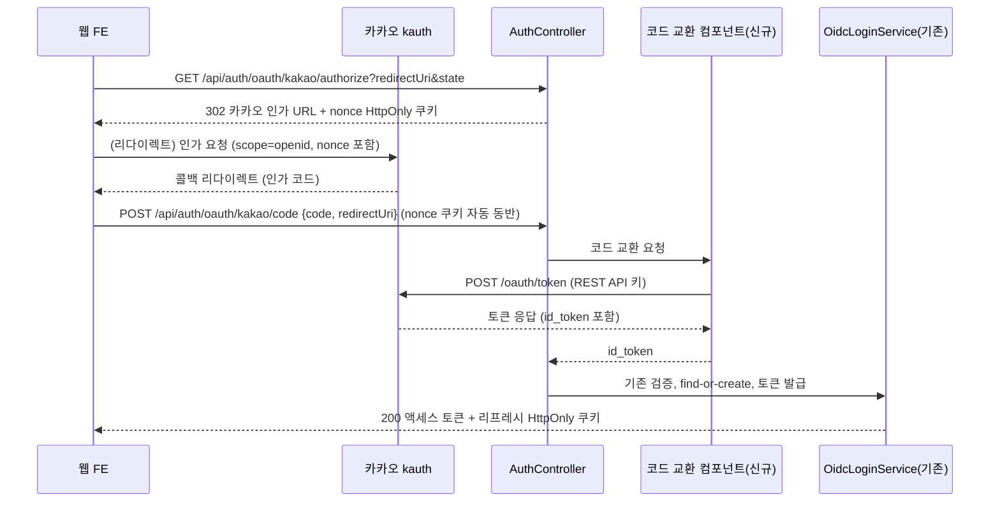
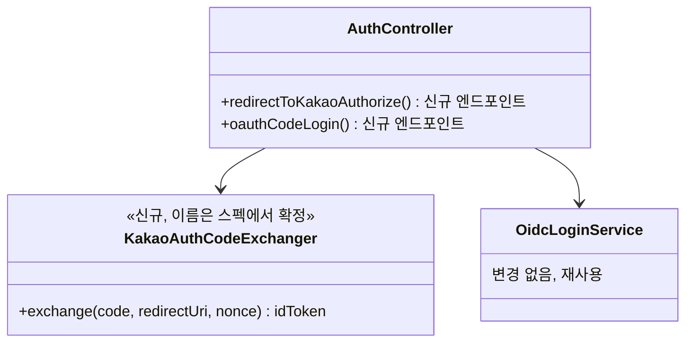

# PRD: 웹 카카오 로그인 인가 코드 교환

> 티켓: MSG-345 (발단: FE 티켓 MSG-325 코멘트, 2026-08-07 최규호 · 별건 스키마 정정은 MSG-346 분리) · 작성일: 2026-08-08 · 작성: prd-writer
> 상태: 검토됨 (2026-08-08 승인)

## 1. 문제 상황

웹에서 카카오 간편 로그인이 성립하지 않는다. 현재 소셜 로그인 API(`POST /api/auth/oauth/{provider}`)는 OIDC ID 토큰[^1]을 입력으로 받는데, 웹 프론트는 이 토큰을 얻을 방법이 없다. 카카오 JS SDK는 브라우저에 인가 코드[^2]까지만 돌려주고, 코드를 토큰으로 바꾸는 호출은 카카오 정책상 서비스 서버가 REST API 키[^3]로 수행해야 한다. REST API 키는 프론트 번들에 넣을 수 없으므로(VITE_ 접두사 환경변수는 번들에 그대로 노출된다) 교환 구간이 웹에서만 끊긴다.

```text
모바일:  네이티브 SDK가 내부에서 교환까지 수행 → id_token → /api/auth/oauth/kakao   (성립)
웹:      JS SDK → 인가 코드 → (교환할 곳이 없음)                                  (끊김)
```

모바일은 기존 계약으로 충분하다. 서버에도 교환 경로가 없다. 의존성은 `oauth2-resource-server`(ID 토큰 검증 전용)뿐이고, 카카오 콘솔에 등록된 `http://localhost:8080/login/oauth2/code/kakao`는 동작하지 않는 잔재다.

## 2. 목적 · 목표

- **목적**: 웹 클라이언트가 카카오 간편 로그인으로 가입하고 로그인할 수 있게 한다. MSG-325(지도 홈 실연동)를 포함한 웹 전체가 로그인 위에서만 성립하므로 선행 과제다.
- **목표**:
  - 웹 프론트가 인가 코드 수신 후 서버 호출 한 번으로 기존 소셜 로그인과 동일한 토큰 세트를 받는다.
  - 기존 모바일 경로(ID 토큰 입력)는 변경 없이 그대로 동작한다.
- **비목표(스코프 제외)**:
  - 카카오 외 제공자(구글, 애플)의 코드 교환. 제공자가 실제로 추가될 때 다룬다.
  - `spring-boot-starter-oauth2-client` 도입과 서버 주도 리다이렉트 로그인(`/login/oauth2/code/*` 콜백 방식). 지금 방식은 프론트가 콜백을 받고 서버는 교환만 대행한다.
  - 가입 규칙 변경. 기존 find-or-create와 이메일 없는 가입 허용(MSG-310)을 그대로 따른다.

## 3. 기능 요구사항

| ID | 요구사항 | 우선순위 |
|----|----------|----------|
| FR-1 | 웹 클라이언트는 서버가 제공하는 인가 진입점으로 이동해 카카오 로그인을 시작하고(인가 URL의 scope, nonce, 앱 키는 서버가 조립, 2026-08-08 편입), 콜백으로 받은 카카오 인가 코드와 redirect URI를 보내 로그인 또는 가입할 수 있다. 전용 엔드포인트로 받는다(FE 제안: `POST /api/auth/oauth/kakao/code`, 최종 경로는 스펙에서 확정). | Must |
| FR-2 | 성공 응답의 형태와 전송 방식은 기존 소셜 로그인과 같다. 액세스 토큰은 body, 웹(X-Client-Type: web, 기본)은 리프레시가 HttpOnly 쿠키[^4], X-Device-Id 발급 규칙도 동일하다. | Must |
| FR-3 | 서버는 REST API 키로 카카오 토큰 엔드포인트를 호출해 ID 토큰을 얻고, 기존 ID 토큰 검증(서명, issuer, audience)과 가입 경로를 그대로 태운다. 검증 완화 없음. | Must |
| FR-4 | redirect URI는 요청 body로 받아 교환 호출에 그대로 사용한다. 서버 고정값을 두지 않는다(dev와 운영의 프론트 도메인이 다르다). 서버측 별도 화이트리스트도 두지 않는다. 카카오가 콘솔 등록 목록과 정확 일치를 검증하는 주체다. | Must |
| FR-5 | 무효한 인가 코드(만료, 재사용, redirect URI 불일치)로는 로그인할 수 없고, 이 계열의 교환 실패는 401 도메인 에러 하나로 응답한다. 사용자가 다시 로그인해도 해소되지 않는 카카오 거절(레이트 리밋, 앱 설정 오류)은 FR-7의 제공자 오류로 분류한다. 카카오의 상세 사유(KOE 코드[^5])는 서버 로그에만 남긴다. | Must |
| FR-6 | 카카오 토큰 응답에 ID 토큰이 없으면(인가 요청에 `scope=openid` 누락) FR-5와 같은 401 에러로 응답한다. | Must |
| FR-7 | 카카오 서버 무응답, 5xx, 그리고 사용자 입력과 무관한 교환 거절 시 제공자 오류를 뜻하는 5xx 대역 에러로 응답한다. 타임아웃 없이 무한 대기하지 않는다. | Must |
| FR-8 | 서버는 인가 진입점에서 nonce를 발급해 HttpOnly 쿠키로 브라우저에 결속하고, 로그인 때 ID 토큰의 nonce 클레임을 쿠키 값과 대조한다. 쿠키 부재, 클레임 부재, 불일치는 FR-5와 같은 401로 거절한다. 클라이언트가 요청 body에 자기 nonce를 실어 보내는 방식은 자기 증명이라 배제한다 (2026-08-08 리뷰 4차 반영, 사용자 확정). | Must |

## 4. 비기능 요구사항

| 분류 | 요구사항 |
|------|----------|
| 보안 | REST API 키(그리고 도입 시 client_secret[^6])는 서버 환경변수로만 보관한다. 인가 코드, ID 토큰, 액세스 토큰 원문을 로그에 남기지 않는다. 로그인 CSRF 방어의 state 생성과 콜백 대조는 콜백을 소유한 FE 책임이다. 재생 공격 방지의 nonce는 서버가 발급해 HttpOnly 쿠키로 브라우저에 결속하고 로그인 때 대조한다(FR-8). |
| 성능 | 로그인 1회당 카카오 왕복 1회가 추가된다. 연결과 읽기 타임아웃을 둬 카카오 지연이 서버 스레드 고갈로 번지지 않게 한다. |
| 운영 | DB 변경 없음. 신규 설정(토큰 엔드포인트 URI 등)은 프로파일 4종과 배포 문서에 반영한다. |

## 5. 시퀀스 다이어그램



## 6. 클래스 다이어그램



## 7. 변경 파일 목록

전부 Owner B(auth 도메인)다.

| 파일 | 변경 | Owner |
|------|------|-------|
| `auth/controller/AuthController.java` | 수정: 인가 진입점과 코드 교환 로그인 엔드포인트 추가 | B |
| `auth/dto/` 신규 요청 DTO | 신규: 로그인 요청(code, redirectUri) | B |
| `auth/support/` nonce 쿠키 헬퍼 | 신규: 발급·만료 (기존 리프레시 쿠키 헬퍼 미러) | B |
| `auth/oidc/KakaoOidcProperties.java` | 수정: 토큰 엔드포인트 URI 추가 | B |
| `auth/` 코드 교환 컴포넌트 | 신규: 카카오 토큰 엔드포인트 호출(RestClient), 타임아웃 | B |
| `auth/exception/AuthErrorCode.java` | 수정: 교환 실패, 제공자 오류 상수 추가(2xxx 대역 내) | B |
| `src/main/resources/application*.yml` | 수정: 토큰 엔드포인트 설정 | B |
| 테스트 (controller, 교환 컴포넌트) | 신규 | B |

## 8. 미해결 질문

없음. 승인 시 확정된 결정 하나를 남긴다.

- client_secret은 이번에 도입하지 않는다 (2026-08-08 승인). 콘솔 실측(2026-08-03) 기준 카카오 로그인 시크릿이 OFF라 없이도 교환이 되고, 나중에 켜더라도 코드 변경은 프로퍼티 추가 수준이다. 운영 배포 전 재검토를 후속 과제로 남긴다.

[^1]: OIDC ID 토큰: OpenID Connect 표준의 신원 증명 JWT. 누가 로그인했는지(sub, 닉네임 등)를 제공자가 서명해 담아 준다. 현 서버 계약의 유일한 입력이라 이 토큰을 못 얻는 웹이 끊긴 것이다.
[^2]: 인가 코드: OAuth 인가 서버가 로그인 직후 콜백 URL로 돌려주는 1회용 짧은 코드. 그 자체로는 신원 정보가 없고, 토큰 엔드포인트에서 진짜 토큰으로 바꿔야 쓸 수 있다.
[^3]: REST API 키: 카카오가 서비스 서버용으로 발급하는 앱 키. 카카오는 코드를 토큰으로 바꾸는 호출을 이 키로 하도록 요구하며, 브라우저 번들에 넣으면 누구나 꺼내 쓸 수 있어 서버 보관이 전제다.
[^4]: HttpOnly 쿠키: 자바스크립트에서 읽을 수 없는 쿠키. XSS로 스크립트가 뚫려도 리프레시 토큰을 탈취당하지 않게 하는 웹 전용 전송 방식으로, 기존 로그인 3종이 이미 쓰고 있다.
[^5]: KOE 코드: 카카오 인증 서버가 실패 응답에 담는 자체 에러 코드(KOE320 무효 코드 등). 원인 추적에 필요하지만 클라이언트에 그대로 내리면 카카오 내부 사정이 계약에 새므로 로그 전용이다.
[^6]: client_secret: 토큰 교환 때 앱 키와 함께 내는 비밀값. 켜면 키만 아는 제3자가 교환을 못 하지만, 브라우저처럼 비밀을 못 지키는 곳에서는 교환 자체가 불가능해진다.
