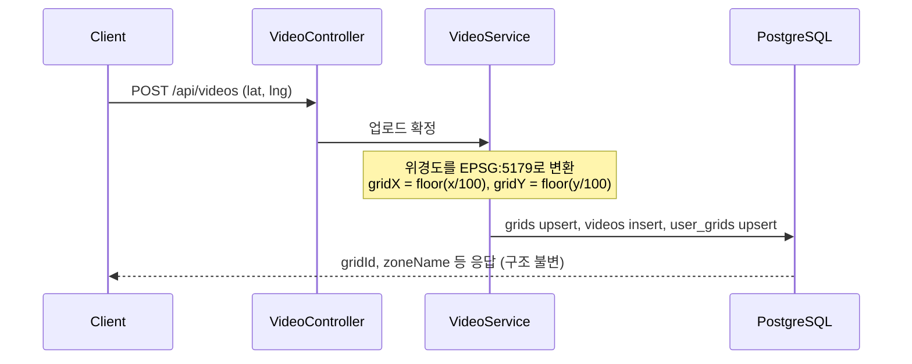
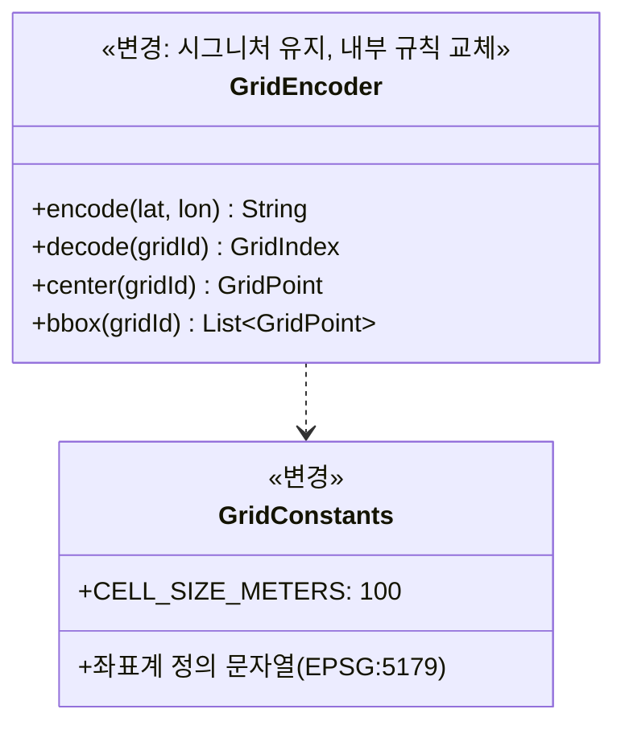

# PRD: 격자 계산 규칙 EPSG:5179 전환

> 티켓: MSG-347 · 작성일: 2026-08-08 · 작성: prd-writer
> 상태: 검토됨

## 1. 문제 상황

현재 격자는 위도와 경도를 고정 상수(0.0009도, 0.00115도)로 나누어 만든다. 위경도는 각도 단위라서 같은 각도 차이라도 지역마다 실제 거리가 다르고, 그 결과 셀의 동서 폭이 서울에서 약 101.6m, 부산에서 약 104.7m로 달라진다. 지금 규칙은 "약 100m" 근사일 뿐 정확한 100m × 100m를 보장하지 못한다.

8/8 김민수 멘토님 멘토링에서 이 방식을 지적받았고, GPS 좌표를 미터 단위 평면 좌표계인 EPSG:5179[^1]로 변환한 뒤 100으로 나누는 방식으로 바꾸기로 결정했다. 서버와 프론트가 같은 변환 규칙을 공유해서 같은 위치에 항상 같은 격자가 나오게 하는 것까지가 이번 결정의 범위다. (멘토링 정리: [cf-33685514](https://soma17-msg.atlassian.net/wiki/spaces/M/pages/33685514), [cf-33685556](https://soma17-msg.atlassian.net/wiki/spaces/M/pages/33685556))

## 2. 목적 · 목표

- **목적**: 전국 어디서나 정확한 100m × 100m 격자 위에서 점령과 방문이 판정되고, 프론트가 그리는 격자와 서버가 판정하는 격자가 항상 일치하게 한다.
- **목표**:
  - 같은 위경도 입력에 대해 서버와 프론트가 항상 같은 gridId를 계산한다. 전국 분산 샘플 200건의 교차 검증이 전부 일치하면 달성이다.
  - 셀 한 변이 전국 어디서나 100m다(투영 오차 수준은 제외).
  - 기존 저장 데이터가 전량 새 격자 기준으로 이행되고 영상 유실이 0건이다.
- **비목표(스코프 제외)**:
  - grid_id 포맷 변경. "y_x" 문자열을 유지한다. 단일 정수 ID 전환은 기각했다. 뷰포트 조회가 이미 정수 컬럼 범위 스캔(MSG-90 실측)이라 얻을 성능이 측정 불가 수준인 반면, 전 계층 타입 변경과 프론트 계약 파괴 비용이 확실하기 때문이다.
  - 장소 검색 provider 변경. Kakao Local API를 유지한다.
  - 줌 아웃 집계와 클러스터링(H3 등). 멘토링에서 제안됐지만 후속 과제로 분리한다.
  - 프론트 구현 자체. 이 PRD는 백엔드 몫과 프론트에 제공할 검증 자료까지만 다룬다.
  - (2026-08-08 비목표에서 제외) 이 자리에 있던 "좌표 범위 제한을 신설하지 않는다"는 FR-13으로 뒤집었다. 경위는 8절 참조.

## 3. 기능 요구사항

| ID | 요구사항 | 우선순위 |
|----|----------|----------|
| FR-1 | 서버는 업로드 좌표(위경도)를 EPSG:5179 미터 좌표로 변환해 격자를 판정한다. gridX = floor(x/100), gridY = floor(y/100)이다 | Must |
| FR-2 | 셀 경계는 반열림 구간[^2]이다. 경계선 위의 좌표는 정확히 한 셀에만 속한다(현행 floor 규칙과 같은 방식) | Must |
| FR-3 | grid_id는 "{gridY}_{gridX}" 문자열이다(현행 포맷 유지, 값만 새 체계) | Must |
| FR-4 | 저장되는 격자 중심점과 경계 도형은 새 셀의 경계를 위경도로 되돌린 값이다. 새 셀은 위경도 축과 평행하지 않으므로 경계 도형은 꼭짓점 4점으로 만든다 | Must |
| FR-5 | 기존 데이터를 전량 이행한다. grids, videos, user_grids, sponsor_ads, mission_grids의 격자 참조를 저장된 원본 좌표에서 새 규칙으로 재계산하고, 영상은 한 건도 잃지 않는다 | Must |
| FR-6 | 이행 후 user_grids는 각 사용자의 영상이 실제 속한 새 셀 기준으로 재구성된다. 최초 점령 시각은 그 셀에 속한 영상들의 가장 이른 업로드 시각이다. 셀 재편으로 사용자별 점령 격자 수는 달라질 수 있다 | Must |
| FR-7 | 격자의 행정동 라벨(region_code[^3])은 새 중심점 기준으로 다시 판정한다 | Must |
| FR-8 | zone 사각형과 표시명 데이터는 새 격자 인덱스 기준으로 재산출한다. 명명 규칙("{zone명} {행}-{열}", 행은 북단부터 A, 열은 서단부터 1)은 바꾸지 않는다 | Must |
| FR-9 | 프론트 검증용으로 전국에 분산된 샘플 200건을 제공한다. 각 건은 입력 위경도, gridX, gridY, gridId, 셀 꼭짓점 위경도 4점을 담는다 | Must |
| FR-10 | 기존 API의 경로, 파라미터, 응답 구조는 바꾸지 않는다. gridId와 gridY/gridX 값만 새 체계 값으로 바뀐다 | Must |
| FR-11 | 핫구역 집계는 새 격자 기준으로만 한다. 전환 이전에 쌓인 신호는 폐기해도 된다(핫스코어는 근사값이라는 기존 정책 그대로) | Should |
| FR-12 | 이행으로 점령 격자 수가 줄어도 이미 획득한 뱃지는 회수하지 않는다(정식 배포 전이라 소급 조정 없음) | Must |
| FR-13 | 서비스 범위 밖 좌표(위도 33~39, 경도 124~132 바깥)의 업로드는 거부된다. 경계값은 허용한다 | Must |

## 4. 비기능 요구사항

| 분류 | 요구사항 |
|------|----------|
| 성능 | 격자 판정은 요청 처리 중 DB 왕복 없이 앱 서버 안에서 끝난다(현행 동등). 뷰포트 조회는 기존 정수 범위 스캔 경로가 그대로라 기존 성능 기준을 유지한다 |
| 데이터 정합 | 서버와 프론트가 같은 좌표계 정의 문자열[^4]을 공유하고, 그 문자열 자체를 계약으로 삼는다. 정의가 조금이라도 다르면 경계 근처 셀이 어긋날 수 있다. 이행 전후로 영상 총수가 같아야 하고, 각 영상의 새 gridId는 원본 좌표에서 재계산한 값과 일치해야 한다 |
| 운영 | 이행은 Flyway[^5] 마이그레이션 1회로 반영한다. 원본 좌표(videos.geom)가 보존되므로 같은 이행을 다시 실행해도 결과가 같다. 정식 출시 전이라 구버전 클라이언트와의 혼재 호환은 요구하지 않되, dev 환경에서 프론트 전환과 배포 시점을 맞춘다 |

## 5. 시퀀스 다이어그램

업로드 시 격자 판정(변경 후). 굵은 부분만 바뀌고 나머지 흐름은 현행 그대로다.

## 6. 클래스 다이어그램

신규 타입 없이 기존 두 클래스의 내부만 바뀐다. 시그니처가 유지되므로 호출부 약 30개 파일은 수정이 없다.

## 7. 변경 파일 목록

| 파일 | 변경 | Owner |
|------|------|-------|
| `build.gradle` | 좌표 변환 라이브러리 의존성 추가 | - |
| `src/main/java/com/msg/fillmap/grid/GridConstants.java` | STEP 상수 제거, 좌표계 정의와 셀 크기로 교체 | A |
| `src/main/java/com/msg/fillmap/grid/GridEncoder.java` | 내부 계산 교체(시그니처 유지) | A |
| `src/main/resources/db/migration/V28__*.sql` | 신규 마이그레이션: grids 재구축(중심점, 경계 도형, region_code 재판정 포함), videos.grid_id 재계산, user_grids 재구성, sponsor_ads와 mission_grids 재계산 | - |
| `src/main/resources/seed/zones.json` | zone 사각형 재산출(확정 시드 48건을 위경도로 역산해 새 인덱스로 재양자화) | A |
| `src/test/resources/fixtures/zone-naming.json` | 갱신 불요 확인(합성 인덱스 기반이라 좌표계 전환과 무관, 2026-08-08 실측 정정) | A |
| `src/test/resources/fixtures/` (신규) | 프론트 정합성 샘플 200건 픽스처와 생성 검증 테스트 | A |
| 격자 ID를 하드코딩한 테스트 전반 | 기대값 갱신 | A/B |
| `.claude/rules/glossary.md`, `.claude/docs/grid-system.md` | 격자 계산 규칙 항목 개정 | - |

참고: 축제와 코스 미션의 시드 원천 JSONL은 레포 밖(fillmap-data 파이프라인)에 있어 이 목록에 없다. DB에 이미 적재된 행은 마이그레이션이 재계산하지만, 원천 파일의 gridId 재산출은 미션 기능을 다시 쓰는 시점으로 미루기로 확정했다(8절). 그 전에 시드를 다시 돌리면 구 체계 값이 들어오므로 시딩 플래그는 꺼 둔 상태를 유지한다.

## 8. 미해결 질문

남은 질문 없음. 초안의 4건은 2026-08-08 다음과 같이 확정했다.

- 뱃지 소급: 회수하지 않는다. 정식 배포 전이라 소급 조정이 필요 없다(FR-12로 반영).
- zone 재작도: 확정 시드 48건의 사각형을 위경도로 역산해 새 격자 인덱스로 다시 양자화한다. 처음엔 원천 데이터 파이프라인 재실행으로 정했으나, 작도 산출물에 위경도 원본이 보존돼 있음을 확인하고 검수 반복이 없는 역산 방식으로 같은 날 재확정했다.
- 미션 시드 원천 JSONL: 지금은 재산출하지 않고, 미션 기능을 다시 쓰는 시점에 한다.
- FE 티켓: 발행하지 않는다. 프론트 작업 시점에 백엔드 레포(계약과 픽스처)를 입력으로 진행한다.
- 좌표 범위(2026-08-08 추가 확정): Codex 교차 리뷰가 EPSG:5179의 한국 한정 성격과 무제한 좌표 계약의 충돌(원거리 좌표에서 변환 발산, 비정상 격자 ID)을 지적했다. 비목표였던 "범위 제한 신설 안 함"을 뒤집어 한국 범위 검증을 FR-13으로 세웠다. 이후 실측에서 같은 범위의 검증이 MSG-193에서 이미 구현돼 있음이 확인돼(KoreaCoordinates, 에러코드 3400), FR-13은 신규 구현이 아니라 기존 구현 확인과 데이터 이행 사전 검사로 충족된다.

[^1]: EPSG:5179. 한국 전역을 하나의 원점으로 미터 단위로 다루는 국가 표준 평면 좌표계. 좌표가 미터라서 "100으로 나누면 100m 격자"가 정확히 성립한다. 네이버 지도가 내부적으로 쓰는 좌표계이기도 하다.
[^2]: 반열림 구간. 하한은 포함하고 상한은 제외하는 구간 [a, b). 셀 경계선 위의 점이 두 셀에 동시에 속하는 일을 막는다.
[^3]: region_code. 격자 중심점이 속한 행정동 코드. 격자를 "성수동1가"처럼 부르는 폴백 표시와 탐험률 집계에 쓰인다.
[^4]: 좌표계 정의 문자열. 투영법, 원점, 타원체 같은 좌표계의 수학적 정의를 한 줄로 적은 것(proj4 형식). 서버와 프론트가 이 문자열이 글자 단위로 같아야 같은 계산 결과가 나온다.
[^5]: Flyway. DB 스키마와 데이터 변경을 번호 붙은 SQL 파일로 관리해 순서대로 자동 적용하는 도구.
