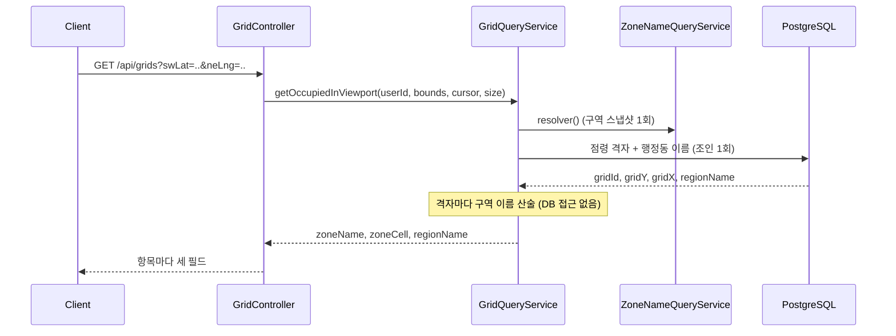
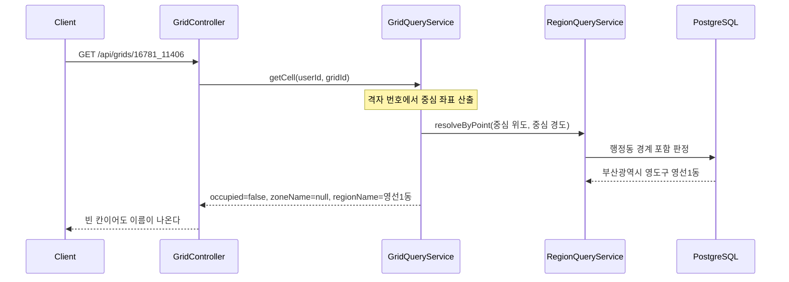

# PRD: 구역 밖 격자도 이름이 나오게 하기

> 티켓: MSG-349 · 작성일: 2026-08-09 · 작성: prd-writer
> 상태: 검토됨 (2026-08-09 승인)

## 1. 문제 상황

지도에서 격자를 눌렀는데 이름이 안 나오는 경우가 많다.

격자 이름 규칙은 "유명 구역[^zone] 안이면 서면 A-14, 밖이면 행정동[^dong] 이름"이다. 그런데 서버는 구역 안쪽만 계산해서 내려주고, 구역 밖일 때 쓸 행정동 이름은 지도가 쓰는 응답 세 개에 담겨 있지 않다. 그래서 이런 응답이 나간다.

```json
{ "gridId": "16781_11406", "zoneName": null, "zoneCell": null }
```

구역 밖은 예외가 아니라 다수다. 전국에 등록된 구역은 48개뿐이라, dev에 넣은 시드 격자 109칸 중 90칸이 구역 밖이었다. 지도에 칠해진 칸 대부분이 이름 없는 칸이라는 뜻이다.

프론트가 지금 이름을 얻으려면 이렇게 해야 한다. 격자 하나를 눌렀을 때는 탐험률 API를 한 번 더 부르고, 뷰포트[^viewport]나 핫구역처럼 여러 칸이 한 번에 오는 화면에서는 칸마다 단건 조회를 돌린다. 500칸이면 500번이다.

MSG-341에서 이름 계산을 서버로 옮긴 계기가 프론트의 "조립만 하고 명명 규칙은 갖지 않게 해달라"는 요청이었다. 그런데 다수 경로에 "이름이 없으면 다른 API를 호출하라"는 규칙이 남았고, 이건 문자열 두 개를 잇는 것보다 무거운 규칙이다. 옮기려던 부담을 절반만 덜어낸 상태다.

설계 문서 안에서도 이미 앞뒤가 안 맞는다. 핫구역 응답에는 "마커를 누르면 단일 격자 조회가 라벨을 준다"고 적혀 있는데, 단일 격자 조회에 행정동 이름이 없어서 사실이 아니다.

## 2. 목적 · 목표

**목적**: 격자를 담은 응답 하나만 받으면 그 격자의 이름을 만들 수 있게 한다. 이름을 얻으려고 API를 더 부르는 일이 없어야 한다.

**목표**

- 지도가 쓰는 응답 세 개(뷰포트 격자 조회, 단일 격자 조회, 핫구역)에서 구역 밖 격자도 이름을 만들 수 있다
- 프론트의 조립 규칙이 응답 종류와 무관하게 한 줄로 같아진다: `zoneName이 있으면 "zoneName zoneCell", 없으면 regionName`
- 이름 때문에 추가로 나가는 API 호출이 0이 된다
- 같은 격자를 어느 화면에서 보든 이름이 같다

**비목표**

- 조립까지 끝낸 단일 필드(`displayName`)를 만드는 일. 프론트가 구역 이름과 칸 번호를 각각 다르게 그리려면 분리된 두 필드가 필요하고, 조립본까지 같이 내리면 같은 값이 두 벌 돌아다니다 어긋난다
- 응답 맨 위에 행정동 코드와 이름 대응표를 두고 항목에는 코드만 싣는 방식. 아래 실측대로 이득이 없다
- 명명 규칙 자체를 바꾸는 일. 행 A는 구역 북단, 열 1은 서단, 폴백[^fallback]에는 번호를 붙이지 않는다는 규칙은 그대로다
- 나머지 응답 여섯 종. 이미 행정동 이름을 갖고 있거나(도감 목록, 친구 최근 격자, 업로드 확정과 재생) 화면 문맥으로 해결된다(행정동 카드 리스트, 지역별 갤러리, 장소 검색)
- 구역을 더 등재하는 일. 구역이 늘면 이름 있는 칸이 늘지만 밖은 여전히 남으므로 이 문제와 별개다

## 3. 기능 요구사항

| ID | 요구사항 | 우선순위 |
|----|----------|----------|
| FR-1 | 뷰포트 격자 조회 응답의 격자 항목마다 그 격자가 속한 행정동 이름이 실린다. 내 격자 조회와 친구 격자 조회 모두 해당한다 | Must |
| FR-2 | 단일 격자 조회 응답에 그 격자가 속한 행정동 이름이 실린다 | Must |
| FR-3 | 단일 격자 조회는 아직 아무도 영상을 올리지 않은 격자를 조회해도 행정동 이름을 준다. 지도에서 빈 칸을 누르는 경우가 여기 해당한다 | Must |
| FR-4 | 핫구역 응답의 격자 항목마다 그 격자가 속한 행정동 이름이 실린다 | Must |
| FR-5 | 어느 행정동에도 속하지 않는 격자(바다 위 등)는 행정동 이름이 비어 있다. 이때 화면에 이름이 없는 것이 정상 동작이다 | Must |
| FR-6 | 같은 격자를 도감 목록, 업로드 확정, 재생, 그리고 이번에 바뀌는 세 응답 중 어디서 보더라도 행정동 이름이 같다 | Must |
| FR-7 | 응답 스키마에 이 필드가 비어 있을 수 있다는 표기와 어떤 경우에 비는지 설명이 붙는다 | Must |
| FR-8 | 기존 필드와 응답 구조는 그대로 두고 필드만 늘린다. 이번 변경 때문에 기존 클라이언트가 깨지지 않는다 | Must |
| FR-9 | 구역 안 격자에도 행정동 이름이 실린다. 화면 위치줄("부산 부산진구 서면")이 시/구를 행정동 이름에서 얻기 때문이다 | Must |

## 4. 비기능 요구사항

| 분류 | 요구사항 |
|------|----------|
| 성능 | 격자 항목 수가 늘어도 쿼리 수가 따라 늘지 않는다. 뷰포트 조회는 지금과 같은 쿼리 1회를 유지하고, 핫구역은 조회 1회 추가로 끝낸다 |
| 성능 | 응답 크기 증가가 격자당 압축[^gzip] 후 10바이트 이내다. 부산 62칸 기준 실측은 gzip 746바이트에서 1,283바이트로 격자당 8.7바이트였다 |
| 데이터 정합 | 행정동 판정은 격자 중심점이 어느 행정동 경계 안에 있는지로 정한다. 격자에 저장해 둔 라벨을 읽든 중심점으로 다시 판정하든 같은 술어를 쓰므로 결과가 같다 |
| 운영 | DB 마이그레이션이 없다. 필드 가산이라 이전 버전 클라이언트와 함께 굴러가고, 되돌리기도 배포 하나로 끝난다 |

## 5. 값을 어디서 가져오나

행정동 이름의 출처가 두 가지인데, 둘은 같은 규칙으로 정해지므로 결과가 어긋나지 않는다.

**저장된 라벨**: 격자가 처음 만들어질 때 중심점이 어느 행정동에 속하는지 판정해서 격자에 함께 저장해 둔다. 읽는 비용이 가장 싸다.

**중심점 재판정**: 격자 번호에서 중심 좌표를 구해 행정동 경계와 겹치는지 그 자리에서 판정한다. 격자가 아직 저장되지 않았어도 이름이 나온다.

두 방법의 판정 조건이 코드상 동일하게 유지되고 있어서 경계 격자에서도 답이 갈리지 않는다. 그래서 응답별로 싼 쪽을 고르면 된다.

| 응답 | 저장된 격자만 담기나 | 고를 출처 |
|------|---------------------|-----------|
| 뷰포트 격자 조회 | 그렇다. 누군가 점령한 격자만 반환한다 | 저장된 라벨. 이미 격자 테이블을 조인하므로 조인 하나만 더 붙이면 된다 |
| 핫구역 | 그렇다. 업로드가 일어난 격자만 올라온다 | 저장된 라벨. 상위 50칸을 한 번에 읽는다 |
| 단일 격자 조회 | 아니다. 아무도 안 올린 격자도 조회 대상이다 | 중심점 재판정. 저장된 라벨만 보면 빈 칸을 눌렀을 때 이름이 안 나온다 |

단일 격자 조회가 지금도 이 방식을 쓰고 있는 탐험률 API와 같은 비용을 갖게 된다. 프론트는 이름을 얻으려고 그 API를 부르던 호출을 없앨 수 있다.

### 행정동 이름은 구역 안 격자에도 싣는다 (디자인 근거)

앱 디자인 정본(피그마 MVP ver 5, 2026-08-09 실측)을 보면 같은 화면에서 이름 조각이 두 가지 조합으로 쓰인다. 셀 선택 바텀시트와 격자 상세 모두 제목은 "서면 A-14"(구역 이름 + 칸 번호)이고, 그 아래 위치줄은 "부산 부산진구 서면"(시/구 + 구역 이름, 칸 번호 없음)이다.

위치줄의 시/구는 행정동 데이터에서만 나온다. 그래서 `regionName`은 구역 밖 폴백 전용이 아니라 **구역 안 격자에도 항상** 실려야 한다. 조회 방식이 조인이라 어차피 항상 채워지므로 구현 부담은 없고, 이 요구를 명시하는 것이 목적이다.

이 관찰이 비목표 두 건의 기각을 다시 확인해 준다. 조립본 필드 하나(`displayName`)로는 제목과 위치줄 두 조합을 만들 수 없고, 행정동 이름을 `zoneName`에 얹는 방식은 구역 안 격자에서 위치줄에 붙일 시/구의 출처를 없앤다. 시 이름 축약("부산광역시"를 "부산"으로)과 문자열 조립은 프론트 표시 몫이다.

디자인의 카드 제목 예시("홍대입구 A-14", "성수동 C-02", "망원동 B-07", "연남동 A-03")는 전부 등재된 구역(홍대, 성수, 망원, 연남)이라 "폴백에는 번호를 붙이지 않는다" 규칙과 충돌하지 않는다. 디자인에 구역 밖 격자 예시는 없으며, 그 경우는 확정 규칙(행정동 이름만)을 따른다.

### 기각한 응답 모양: 행정동 대응표

여러 칸이 한 번에 오는 응답에서 같은 동 이름이 반복되니, 응답 맨 위에 코드와 이름 대응표를 한 번만 두고 항목에는 코드만 싣는 방식을 검토했다. 쿼리는 어느 쪽이든 같고(조인 1회) 차이는 JSON 모양뿐이다.

압축 후 크기를 재보니 이득이 없었다. 단위는 바이트다.

| 격자 수 | 서로 다른 동 수 | 이름 반복 | 대응표 | 차이 |
|---:|---:|---:|---:|---|
| 100 | 3 | 953 | 955 | +2 |
| 100 | 10 | 1,197 | 1,191 | −6 |
| 100 | 50 | 1,372 | 1,549 | +177 |
| 500 | 10 | 3,814 | 3,821 | +7 |
| 500 | 50 | 4,739 | 4,964 | +225 |
| 500 | 500 | 5,105 | 7,954 | +2,849 |

격자가 몇 개 동에 뭉쳐 있는 경우, 그러니까 대응표가 가장 유리해야 할 조건에서도 차이가 20바이트 안쪽이다. gzip이 반복 문자열을 이미 사전으로 잡아내기 때문에 대응표가 하려던 일을 압축이 먼저 해버린다. 반대로 항목마다 새로 붙는 10자리 행정동 코드는 숫자열이라 압축이 잘 듣지 않고 그대로 비용이 된다.

정리하면 잘해야 본전이고 격자가 흩어질수록 손해가 커진다. 프론트에는 대응표를 찾아보는 규칙이 새로 생긴다. 항목마다 이름을 그대로 싣는다.

## 6. 시퀀스 다이어그램

**뷰포트 격자 조회**



**단일 격자 조회 (아직 아무도 안 올린 격자)**



## 7. 변경 파일 목록

| 파일 | 변경 | Owner |
|------|------|-------|
| `grid/dto/OccupiedGridResponseDto.java` | 수정. `regionName` 필드와 스키마 설명 추가 | A |
| `grid/dto/GridCellResponseDto.java` | 수정. `regionName` 필드와 스키마 설명 추가 | A |
| `hotzone/dto/HotZoneResponseDto.java` | 수정. `regionName` 필드 추가, 현재 사실과 다른 주석 정정 | A |
| `grid/service/OccupiedGridView.java` | 수정. `regionName` 추가 | A |
| `grid/service/GridCellView.java` | 수정. `regionName` 추가 | A |
| `hotzone/service/HotZoneView.java` | 수정. `regionName` 추가 | A |
| `grid/repository/OccupiedGridProjection.java` | 수정. `getRegionName()` 추가 | A |
| `grid/repository/GridRepository.java` | 수정. 뷰포트 쿼리 3종에 행정동 조인 추가, 격자 여러 개의 행정동 이름을 한 번에 읽는 쿼리 신설 | A |
| `grid/service/impl/GridQueryServiceImpl.java` | 수정. 단일 격자 조회에 중심점 판정 경로 연결 | A |
| `hotzone/service/HotZoneServiceImpl.java` | 수정. 상위 격자들의 행정동 이름 일괄 조회 | A |
| `grid/controller/GridController.java` | 수정. 두 엔드포인트 설명에 폴백 규칙 명시 | A |
| `hotzone/controller/HotZoneController.java` | 수정. 설명에 폴백 규칙 명시 | A |
| `zone/controller/ZoneController.java` | 수정. "FE 가 캐시해 로컬 명명"이라는 낡은 설명 정정. 표시명 계산이 서버로 넘어온 뒤 이 API의 용도는 검색바 구역 이동과 구역 범위 오버레이뿐이다 | A |
| 테스트 (grid, hotzone, friend) | 수정과 신설. 구역 안팎, 빈 격자, 무귀속 격자, 쿼리 수 고정 검증 | A |

친구 격자 조회는 별도 파일 변경이 없다. 이미 내 격자 조회와 같은 서비스를 부르고 있어서 그 변경이 그대로 반영된다.

DB 마이그레이션은 없다.

## 8. 미해결 질문

없다. 유일하게 열려 있던 응답 모양 선택은 5절의 실측으로 닫았다.

[^zone]: 구역(zone). 서면이나 광안리처럼 행정동 이름으로는 표현되지 않는 유명한 통칭. 격자 사각형 범위로 등록해 두며 현재 48개다.
[^dong]: 행정동. 주민센터 단위의 행정 구역이다. 전국 3,558개가 경계 도형과 함께 DB에 들어 있다.
[^viewport]: 뷰포트. 지도에서 지금 화면에 보이는 사각형 영역이다. 클라이언트가 네 모서리 좌표를 보내면 서버가 그 안의 격자만 골라 준다.
[^fallback]: 폴백. 앞의 방법이 안 될 때 대신 쓰는 값이다. 여기서는 구역 이름이 없을 때 행정동 이름을 쓰는 것을 말한다.
[^gzip]: gzip 압축. 서버가 응답을 압축해서 보내는 방식이다. 같은 문자열이 반복되면 크게 줄어들기 때문에, 동 이름이 여러 번 반복되는 이번 경우에 잘 듣는다.
