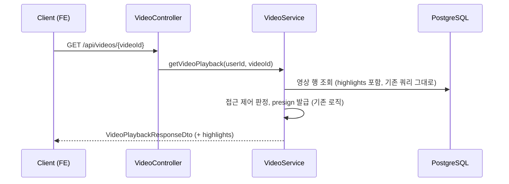
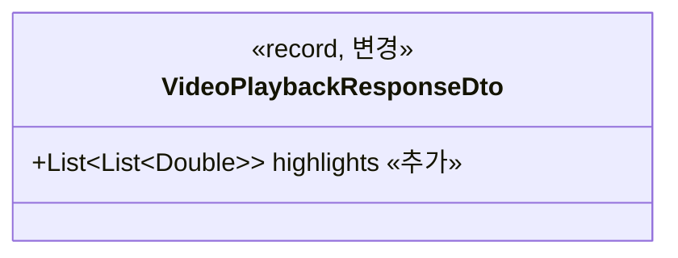

# PRD: AI 추천 하이라이트 구간을 영상 조회 응답에 포함

> 티켓: MSG-350 · 작성일: 2026-08-10 · 작성: prd-writer
> 상태: 검토됨 (2026-08-10 성민 승인)  <!-- 수명주기: 초안 → 검토됨(사용자 승인 시 게이트가 갱신) → 확정 -->

## 1. 문제 상황

AI가 영상마다 하이라이트 구간을 최대 3개 뽑아 주는 파이프라인은 이미 끝까지 돌고 있다.
AI 서버가 구간을 계산하고(MSG-159), 백엔드 폴러[^1]가 결과를 받아 `videos.highlights`
jsonb[^2] 컬럼에 저장한다(MSG-145, MSG-150). 그런데 이렇게 쌓인 값을 꺼내 주는 조회 API가
하나도 없다. 상위 스토리 MSG-141의 완료 조건은 "추천 구간을 저장하고 응답에 포함한다"인데,
뒤쪽 절반인 "응답에 포함"이 빠진 채로 남아 있다.

그 결과 프론트의 하이라이트 추천 화면(MSG-303)은 mock 데이터[^3]로만 동작한다. 실데이터
연동을 하려면 백엔드가 먼저 값을 내려 줘야 한다.

## 2. 목적 · 목표

- **목적**: 저장까지만 돼 있는 AI 하이라이트 구간을 프론트가 받아갈 수 있게 해서,
  하이라이트 파이프라인의 마지막 조각을 채운다.
- **목표**:
  - 단건 영상 조회 API(`GET /api/videos/{videoId}`) 응답으로 하이라이트 구간을 받을 수 있다
  - 하이라이트가 없는 영상에서 무엇이 내려가는지가 계약으로 명시되고 Swagger[^4] 스키마에
    반영된다
- **비목표(스코프 제외)**:
  - 격자 영상 목록, 전역 목록 등 목록성 응답에는 넣지 않는다. 하이라이트를 쓰는 화면이
    단건 흐름이라 목록에는 쓸 곳이 없고, 필요해지면 별도 티켓으로 뗀다 (티켓 명시)
  - 구간별 추천 사유 라벨 생성은 하지 않는다. AI 계약에 라벨이 없어서 백엔드가 만들 수 없는
    값이다 (2026-08-10 확정: 목업의 라벨은 계약에서 제외)
  - 하이라이트 구간의 재계산이나 수정 API는 다루지 않는다
  - 프론트의 구간 선택 UX와 직접 구간 지정 기능은 FE 몫이다. **영상 길이별 카드 노출 개수
    티어**(5초 이하 스킵, 5~10초 카드 없이 밴드 위치만, 10~15초 2개, 15초 이상 3개)도 FE
    정책이다 (2026-08-10 성민 확정). 백엔드는 항상 저장된 전체(최대 3구간)를 내려주고, FE가
    이미 응답에 있는 `durationSec`으로 몇 개를 쓸지 자른다
  - **구간 자체의 품질 보정은 별도 티켓 MSG-351이 흡수한다** (2026-08-10 성민 확정).
    현재 AI는 장면 전환 기반이라 구간 길이가 제각각이고, 장면이 없으면 균등 3분할 폴백이라
    짧은 영상에서 5초 미만 구간이 나온다. 구간 최소 길이 5초와 시작점 간격 보정은 AI 쪽
    산출 로직 조정이라 이 티켓과 무관하다
  - **업로드 확정 전 원본 선분석 플로우는 MSG-351이다.** 디자인의 위저드 단계(확정 전 추천)는
    이 티켓의 사후 조회로는 시점이 안 맞아서, 블러 없이 하이라이트만 계산하는 선분석 API를
    따로 뺐다. 이 티켓(MSG-350)은 확정된 영상의 READY 후 조회 노출만 다룬다

## 3. 기능 요구사항

| ID | 요구사항 | 우선순위 |
|----|----------|----------|
| FR-1 | `GET /api/videos/{videoId}` 응답에 `highlights` 필드가 추가된다. 값은 저장 형식 그대로 `[[시작초, 끝초], ...]` 형태이고 최대 3구간, 초는 소수점 둘째 자리다 | Must |
| FR-2 | 하이라이트가 없는 영상(READY 이전, FAILED, AI 비활성 시절 처리분, 5초 이하라 AI가 0구간을 반환한 경우)은 **null로 통일해** 내려간다. 저장 값이 빈 배열이어도 응답은 null로 정규화하고, 이 계약을 Swagger 스키마에 명시한다 | Must |
| FR-3 | 값이 계약상 보장되는 것은 AI 처리를 거쳐 READY가 된 영상뿐이다. 접근 제어, 조회수 증가, 기존 응답 필드 등 단건 조회의 나머지 동작은 변하지 않는다 | Must |
| FR-4 | 기존 단건 조회 테스트 관례에 맞춰 하이라이트 유무 각각의 응답을 검증하는 테스트가 추가된다 | Must |
| FR-5 | 배열 순서가 추천 우선순위임을 계약에 명시한다(첫 요소가 최우선 추천). AI가 장면 길이 내림차순으로 정렬해 반환하는 현재 동작을 계약으로 승격하는 것으로, FE의 길이별 티어(상위 N개만 노출, 5~10초 영상은 첫 요소를 밴드 초기 위치로 사용)가 이 순서에 기댄다 | Must |

## 4. 비기능 요구사항

| 분류 | 요구사항 |
|------|----------|
| 성능 | 추가 쿼리 없이 이미 읽고 있는 행의 컬럼을 노출하는 작업이므로, 단건 조회의 응답 시간 특성이 변하지 않는다 |
| 보안/인가 | 기존 접근 제어(MSG-206의 first-match 순서)를 그대로 따른다. 하이라이트 값이 접근 제어를 우회해 노출되는 경로를 새로 만들지 않는다 |
| 데이터 정합 | 저장 계약(MSG-145)상 "AI가 안 돈 영상"과 "AI가 돌았지만 0구간인 영상"은 컬럼 값만으로 구분되지 않을 수 있다(null 또는 빈 배열 혼재). 응답 계약도 이 구분을 약속하지 않는다 |

## 5. 시퀀스 다이어그램

## 6. 클래스 다이어그램

## 7. 변경 파일 목록

| 파일 | 변경 | Owner |
|------|------|-------|
| `src/main/java/com/msg/fillmap/video/dto/VideoPlaybackResponseDto.java` | 수정: `highlights` 필드와 Swagger 스키마 추가, `of()` 팩토리에서 전달 | B |
| `src/main/java/com/msg/fillmap/video/service/VideoServiceImpl.java` | 수정 가능성: 없음 케이스 정규화를 서비스에서 하기로 결정되는 경우만 | B |
| `src/test/java/com/msg/fillmap/video/service/VideoPlaybackServiceTest.java` | 수정: 하이라이트 유무 케이스 테스트 추가 | B |

마이그레이션은 없다. `videos.highlights` 컬럼은 MSG-145에서 이미 만들어져 있다.

## 8. 미해결 질문

없음 (2026-08-10 성민 확인으로 모두 해소). 결정 기록:

- [x] **디자인과 데이터 계약의 갭**: 피그마 정본(웹 ver 9)의 "AI 하이라이트 추천" 모달
  (노드 14062:12414)은 추천 구간 5개와 구간별 추천 사유 라벨을 보여주지만, 데이터 계약은
  **최대 3구간, 라벨 없음으로 확정**했다. 카드 노출 개수는 FE가 영상 길이별 티어로 조절하고
  (비목표 절 참조), 라벨은 계약에서 제외한다. 목업의 5개 구간과 라벨은 참고용이다.
- [x] **없음 케이스의 표현**: **null 통일로 확정**했다. 기존 DTO의 nullable 관례(playbackUrl,
  thumbnailUrl)와 맞고, 저장 값이 null과 빈 배열로 혼재해도 응답이 한 가지로 고정된다.
  FE가 "짧아서 없음"을 구분하고 싶으면 응답의 `durationSec`으로 판단할 수 있어 빈 배열을
  보존할 이유가 없다.
- [x] **구간 최소 길이 5초**: 이 티켓이 아니라 별도 티켓으로 분리했고, 업로드 확정 전
  선분석 API와 함께 **MSG-351**로 발행했다 (2026-08-10, 비목표 절 참조).

[^1]: 폴러(poller): 주기적으로 AI 서버에 작업 상태를 물어 결과를 받아오는 백엔드 백그라운드 작업. 이 프로젝트에서는 `AiBlurPoller`가 하이라이트를 DB에 저장하는 주체다.
[^2]: jsonb: PostgreSQL의 JSON 컬럼 타입. 하이라이트 구간은 별도 테이블 없이 `videos.highlights` 한 컬럼에 배열 그대로 저장돼 있다.
[^3]: mock 데이터: 실제 서버 응답 대신 프론트 코드에 하드코딩해 둔 가짜 데이터. 화면 개발을 서버보다 먼저 진행할 때 쓴다.
[^4]: Swagger: API의 요청과 응답 형식을 자동 문서화하는 도구. 이 프로젝트는 springdoc으로 생성한다.
