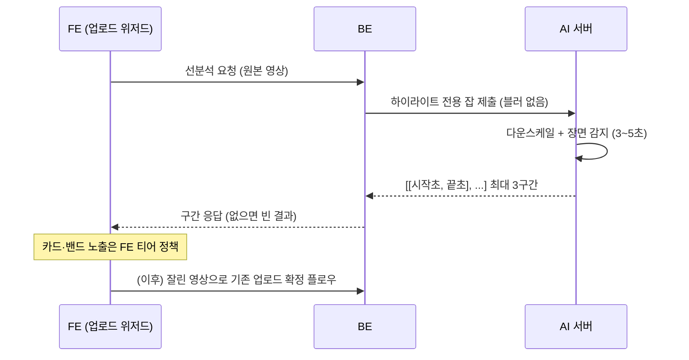

# PRD: 업로드 확정 전 하이라이트 선분석 API

> 티켓: MSG-351 · 작성일: 2026-08-10 · 작성: prd-writer
> 상태: 검토됨 (2026-08-10 성민 승인)  <!-- 수명주기: 초안 → 검토됨(사용자 승인 시 게이트가 갱신) → 확정 -->

## 1. 문제 상황

업로드 위저드의 "AI 하이라이트 추천" 단계(디자인 웹 ver 9, 4단계 중 2단계)는 사용자가 영상을
확정하기 전에 추천 구간을 보여주고 고르게 하는 화면이다. 그런데 현재 파이프라인에서
하이라이트는 업로드 확정 뒤 블러 파이프라인[^1] 안에서만 계산된다. READY까지 웜 기준 약
4분이 걸리는데, 그 대부분은 하이라이트가 아니라 얼굴과 번호판 블러 추론이다. 하이라이트
계산만 떼면 30초 1080p 영상 기준 실측 3~5초다.

시점 말고 대상도 어긋난다. 디자인의 트리머[^2]는 30초 넘는 원본에서 올릴 구간을 고르는
용도인데, 서버는 이미 30초 이하로 잘린 확정본만 본다. 원본의 하이라이트는 지금 아무도
계산하지 않는다. 그래서 FE 추천 화면(MSG-303)은 mock 데이터로만 동작한다.

참고로 팀 위키 IA 문서에는 이 단계가 "미구현, MVP 여부 결정 필요"로 남아 있었다. 디자인
ver 9에 화면이 확정 반영됐고 이 PRD가 그 결정(MVP 편입)을 명문화한다.

## 2. 목적 · 목표

- **목적**: 업로드 위저드 안에서 사용자가 몇 초만 기다리면 AI 추천 구간을 받게 한다.
  추천이 확정 후에야 나오는 지금 구조로는 위저드 화면 자체가 성립하지 않는다.
- **목표**:
  - 업로드 확정 전의 원본 영상(30초 초과 가능)에 대해 하이라이트 구간을 요청하고 받을 수 있다
  - 30초 1080p 원본 기준 요청부터 결과까지 수 초 안에 끝난다 (하이라이트 단계 실측 3~5초 근거)
  - 구간 출력이 FE의 영상 길이별 노출 티어를 지탱한다 (구간 최소 길이, 시작점 간격)
- **비목표(스코프 제외)**:
  - 블러 처리는 지금처럼 업로드 확정 후 파이프라인에 남는다. 선분석은 하이라이트만 계산한다
  - 선분석 결과를 저장하거나 확정 업로드와 연결하지 않는다. 위저드가 소비하고 버리는 임시
    결과다 (확정본의 하이라이트는 기존 파이프라인이 따로 계산해 저장하고, MSG-350이 노출한다)
  - 영상 길이별 카드 노출 개수(5초 이하 스킵, 5~10초 밴드만, 10~15초 2개, 15초 이상 3개)는
    FE 정책이다. 서버는 계산된 구간을 전부 내려준다
  - 구간별 추천 사유 라벨은 만들지 않는다 (MSG-350 PRD에서 확정된 제외 사항 유지)

## 3. 기능 요구사항

| ID | 요구사항 | 우선순위 |
|----|----------|----------|
| FR-1 | 인증된 사용자는 업로드 확정 전 원본 영상에 대해 하이라이트 추천을 요청할 수 있다 | Must |
| FR-2 | 응답은 `[[시작초, 끝초], ...]` 최대 3구간, 초는 소수점 둘째 자리, 배열 순서는 추천 우선순위다 (MSG-350과 동일 표현 규약) | Must |
| FR-3 | 각 구간은 최소 5초 길이이고, 구간 시작점끼리 5초 이상 벌어진다. 영상이 짧아 이 조건으로 3구간을 못 채우면 개수를 줄여 반환한다 (후보끼리 절반 이상 겹치면 선택이 무의미해진다는 FE 티어 근거) | Must |
| FR-4 | 5초 미만 영상은 빈 결과를 반환한다 (AI 현행 경계 `duration >= 5`와 정합. FE는 이 경우 추천 단계를 스킵) | Must |
| FR-5 | 원본이 1080p를 넘으면 다운스케일[^3] 후 분석한다 (4K 직분석은 실측 약 31초라 지연 목표가 무너진다) | Must |
| FR-6 | 선분석이 실패해도(AI 서버 다운, 분석 오류) 위저드는 진행 가능해야 한다. FE가 직접 구간 지정으로 폴백할 수 있게 실패 응답 계약을 명시한다 | Must |
| FR-7 | 블러 잡이 처리 중인 시간대에도 선분석 지연 목표가 유지된다 (현재 AI 워커 1개의 큐 뒤에 줄 세우면 수 초 목표가 수 분이 된다) | Must |
| FR-8 | 서버는 3분 초과 원본의 선분석 요청을 거부한다. 1차 차단은 FE가 갤러리 선택 단계에서 하지만(3분 초과 원본은 선택 불가), 서버 검증이 방어선이다 | Must |

## 4. 비기능 요구사항

| 분류 | 요구사항 |
|------|----------|
| 성능 | 30초 1080p 원본 기준 요청부터 결과까지 p50 5초 내외, p95 10초 안. 분석 시간은 원본 길이에 비례하므로 상한(3분) 원본은 최대 20~30초까지 허용한다. 근거 실측: 하이라이트 단계 2.9~4.7초(EC2 2코어), YOLO 모델 로드 불요라 콜드 페널티 없음 |
| 보안/인가 | 기존 JWT 인증 필수. AI 서버는 지금처럼 공개 인터넷에 노출하지 않는다 (현행 BE와 AI의 내부 통신 구조 유지) |
| 운영 | 선분석용 임시 파일(원본, 잡 디렉터리)은 자동 정리된다. S3 pending 경로를 재사용하면 기존 1일 만료 라이프사이클(MSG-133)에 편승 가능 |
| 데이터 정합 | 선분석 결과와 확정본의 저장 하이라이트는 서로 독립이다. 사용자가 원본을 잘라 올리면 확정본 기준으로 파이프라인이 다시 계산하므로 두 값이 달라도 정상이다 |

## 5. 시퀀스 다이어그램

전달 경로(원본이 AI에 도달하는 방법)는 스펙 결정 사항이라 중립으로 그린다.

## 6. 클래스 다이어그램

전달 경로와 동기·폴링이 스펙에서 정해진 뒤에야 타입이 확정되므로 이 PRD에서는 그리지 않는다.

## 7. 변경 파일 목록

두 레포에 걸치며, AI 몫은 MSG-353으로 분리됐다 (미해결 질문 절 결정 기록 참조).
아래는 리서치 기반 예상 지점이고 확정은 스펙 몫이다.

| 파일 | 변경 | 담당 티켓 |
|------|------|------|
| `server.py` | 하이라이트 전용 잡 타입 또는 엔드포인트 신설, 워커 경합 해결 | MSG-353 (FillMap-AI) |
| `bench.py` (`detect_highlights`) | FR-3 구간 품질 보정 반영 | MSG-353 (FillMap-AI) |
| `src/main/java/com/msg/fillmap/video/...` | 선분석 요청 API (컨트롤러·서비스·AiClient 확장), 3분 상한 검증 | MSG-351 (BE) |

## 8. 미해결 질문

없음 (2026-08-10 성민 확인으로 모두 해소). 결정 기록:

- [x] **원본 길이 상한 = 3분**: 1차 차단은 FE다. 갤러리 선택 단계에서 3분 초과 원본을
  선택할 수 없게 막는다 (FE 몫, FE 레포에 공유 필요). 서버는 같은 상한을 방어선으로
  검증한다 (FR-8). 상한 안에서도 분석 시간이 길이에 비례하므로 성능 요구는 30초 기준
  수 초, 3분 기준 최대 20~30초로 잡는다.
- [x] **티켓 분해 = AI 몫 별도 티켓**: AI 레포 작업(하이라이트 전용 잡, 구간 품질 보정)을
  **MSG-353**으로 발행했고 MSG-351은 BE 몫만 남는다. 작업 순서는 MSG-353이 먼저다 (BE가
  붙을 계약이 있어야 한다). MSG-159, MSG-284처럼 AI 레포 티켓을 따로 두는 기존 관례와 같다.

[^1]: 블러 파이프라인: 업로드 확정 후 도는 AI 처리 전체. 얼굴과 번호판 블러 추론이 약 90%를 차지하고 하이라이트 계산은 2% 수준이다. 선분석은 이 중 하이라이트만 떼어 확정 전에 돌리는 것.
[^2]: 트리머: 긴 원본에서 업로드할 30초 이하 구간을 고르는 FE 슬라이더 UI. 선분석 결과가 추천 카드와 트리머 초기 위치에 쓰인다.
[^3]: 다운스케일: 해상도를 낮춰 처리하는 것. 기존 파이프라인도 1080p 30fps 다운스케일이 전제다 (ADR). 하이라이트 계산이 1080p에서 3~5초, 4K 직분석이면 31초까지 늘어난다.
