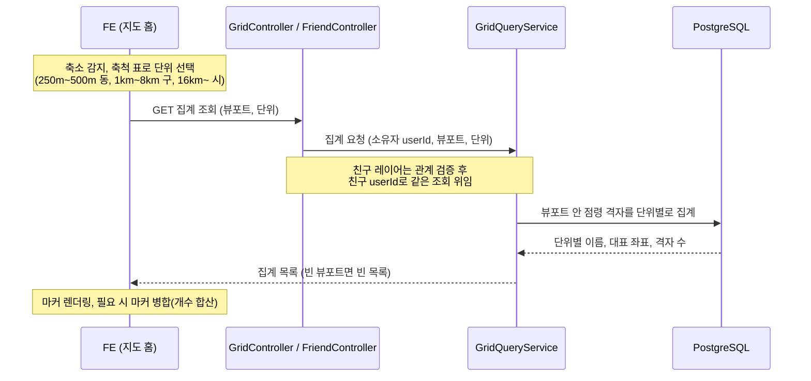
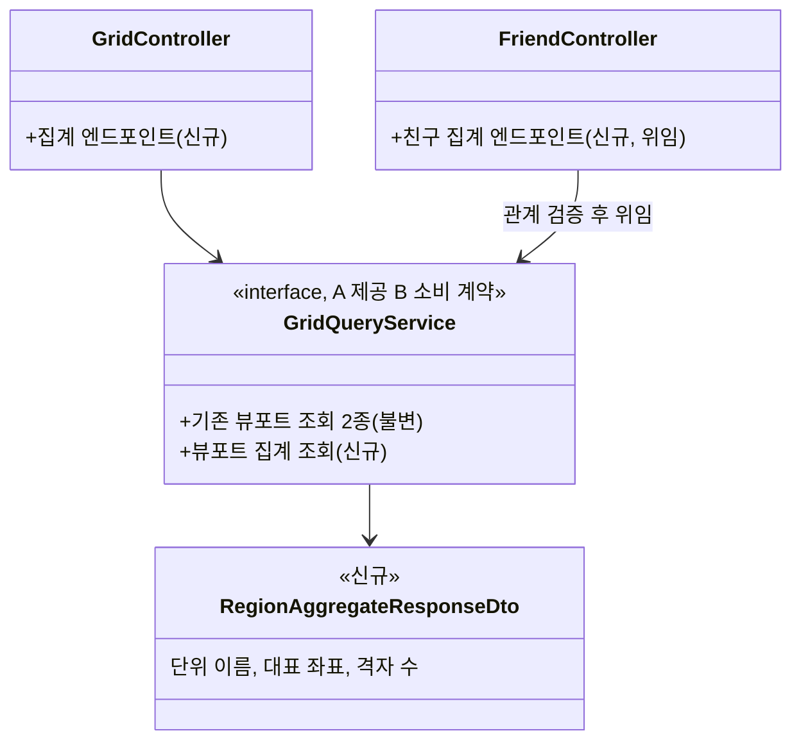

# PRD: 지도 축소 시 격자 집계 조회 (줌아웃 클러스터링)

> 티켓: MSG-356 · 작성일: 2026-08-10 · 작성: prd-writer
> 상태: 검토됨 (2026-08-10 정민 승인 — 집계 단위는 행정 3단(동/구/시), 레이어는 점령 격자 조회 경로만, bbox는 단위별 차등으로 확정. 500m 묶음은 실측 후 확장 지점)  <!-- 수명주기: 초안 → 검토됨(사용자 승인 시 게이트가 갱신) → 확정 -->

## 1. 문제 상황

지도 홈을 축소해도 서버에는 개별 100m 격자 조회밖에 없다. 넓은 시야에서 점령 격자가
수백에서 수천 개면 전량을 내려보내며 페이지를 넘기는데, 화면은 그 밀도를 읽지 못하고
전송량만 커진다. 지도 홈 디자인에는 줌아웃 클러스터링[^1] 화면이 있는데 그걸 받쳐 줄
조회가 서버에 없는 상태다.

2026-08-08 김민수 멘토링(정리 cf-33685556, 13·14·15·18절)이 방향을 확정했다. 축소 상태에서
100m 격자 전량 전송은 비효율이므로 축척에 따라 집계 표현으로 전환하고, 서버가 적당히 압축한
집계를 내려주면 프론트가 마커[^2] 병합으로 마무리한다. 전환 지점은 줌 레벨 숫자가 아니라
화면당 약 100객체 기준으로 실측해 정한다.

기존에 FE 연동 가이드(8/7)가 적어 둔 "클러스터는 프론트 로컬 산술" 서술은 멘토링 이전
결정이라 이 티켓이 대체한다 (2026-08-10 사용자 지시).

## 2. 목적 · 목표

- **목적**: 축소한 시야에서도 도감 분포를 한눈에 보여주되, 전송량과 화면 객체 수를 읽을 수
  있는 수준으로 유지한다.
- **목표**:
  - FE가 집계 단위(동, 구, 시)를 파라미터로 골라, 뷰포트[^3] 안 점령 격자의 단위별 집계
    목록(이름, 대표 좌표, 격자 수)을 한 번에 받는다
  - 친구 도감 레이어도 같은 조회로 집계를 받는다
  - 어느 단위로 묶어 세어도 개별 격자 조회와 총합이 일치한다
  - 구현 후 FE와 함께 전환 기준(화면당 객체 수)을 실측해 기록으로 남긴다 (티켓 완료 조건)
- **비목표(스코프 제외)**:
  - 서버가 전환 줌을 정하는 것: 전환은 FE 몫이다. 합의된 축척[^4] 기준은 100m대 개별 격자,
    250m~500m 동, 1km~8km 구, 16km~전체 시 (2026-08-10 FE 합의). 서버는 단위 파라미터만 받고
    전환점을 갖지 않는다
  - 격자 시프트(500m 묶음) 클러스터: 이번에 만들지 않는다. 멘토링 사다리(13절)의 "중간 집계"
    단계를 의도적으로 생략하는 결정이라, 서버가 내려주는 가장 촘촘한 집계는 동 단위가 된다.
    동 마커가 너무 성기다는 실측이 나오면 집계 단위 하나를 추가하는 확장으로 대응한다
    (2026-08-10 확정)
  - 핫구역 집계: 상위 50개 제한이라 화면당 객체 수 기준을 이미 만족한다. 묶을 것이 없다
  - 전체 공개 지도(타인 데이터 합산): 프라이버시 미확정 그대로 Phase 2
  - 개별 격자 조회의 계약 변경: MSG-73/90 계약 불변

## 3. 기능 요구사항

| ID | 요구사항 | 우선순위 |
|----|----------|----------|
| FR-1 | 사용자는 뷰포트와 집계 단위(동, 구, 시)를 지정해 그 범위 안 자기 점령 격자의 단위별 집계 목록을 페이지 없이 한 번에 받는다 | Must |
| FR-2 | 집계 항목마다 단위 이름(예: 부전2동, 부산진구, 부산광역시), 마커 표시용 대표 좌표, 점령 격자 수가 담긴다 | Must |
| FR-3 | 집계의 격자 수 합은 같은 뷰포트 개별 격자 조회의 총 개수와 일치한다. FE가 항목을 더 묶어 합산해도 값이 어긋나지 않는다 | Must |
| FR-4 | 친구 도감 레이어도 같은 집계를 받는다. 친구 관계 검증은 기존 친구 뷰포트 조회와 동일하게 요청 시점 실시간이다 | Must |
| FR-5 | 점령 격자가 없는 단위는 응답에 포함되지 않는다. 뷰포트 안에 점령 격자가 하나도 없으면 빈 목록으로 200 응답한다 | Must |
| FR-6 | 집계 조회의 뷰포트 허용 폭은 단위별로 다르게 두며, 시 단위는 전국 시야까지 허용한다. 개별 격자 조회의 0.5도 상한은 그대로다 (구체 수치는 스펙에서) | Must |
| FR-7 | 행정동이 판정되지 않은 격자(해상 등)도 집계 총합에서 누락되지 않는다. 어떤 항목으로 묶을지는 스펙에서 정한다 | Must |

## 4. 비기능 요구사항

| 분류 | 요구사항 |
|------|----------|
| 성능 | 시 단위 전국 시야가 가장 많은 행을 스캔한다. 이 경우에도 기존 뷰포트 조회 응답 목표(p95 300ms)를 준용한다. 신규 성능 목표는 세우지 않는다 |
| 보안/인가 | 본인 집계는 로그인 토큰으로, 친구 집계는 ACCEPTED 관계를 요청 시점에 검증한다 (기존 친구 레이어와 동일 정책) |
| 데이터 정합 | 집계와 개별 조회의 총합 일치(FR-3), 미판정 격자 포함(FR-7)이 정합 기준이다 |
| 운영 | 스키마 변경 없이 기존 데이터(격자의 행정동 라벨과 인덱스)로 성립할 것으로 본다. 마이그레이션이 필요해지면 스펙에서 판단한다 |

## 5. 시퀀스 다이어그램

## 6. 클래스 다이어그램

신규와 변경 타입만. 이름은 스펙에서 확정한다.

## 7. 변경 파일 목록

| 파일 | 변경 | Owner |
|------|------|-------|
| `src/main/java/com/msg/fillmap/grid/controller/GridController.java` | 수정 (집계 엔드포인트 추가) | A |
| `src/main/java/com/msg/fillmap/grid/service/GridQueryService.java` (+Impl) | 수정 (계약 메서드 추가, 기존 2종 불변) | A |
| `src/main/java/com/msg/fillmap/grid/repository/` | 수정 (집계 쿼리 추가) | A |
| `src/main/java/com/msg/fillmap/grid/dto/` | 신규 (집계 응답 DTO) | A |
| `src/main/java/com/msg/fillmap/friend/controller/FriendController.java` | 수정 (친구 집계 엔드포인트, 위임) | B |
| `src/main/java/com/msg/fillmap/friend/service/FriendServiceImpl.java` | 수정 (위임 추가) | B |
| `src/test/java/com/msg/fillmap/grid/`, `friend/` | 신규 테스트 | A / B |

마이그레이션 없음 예상. 집계 재료는 이미 있다. 격자마다 행정동 코드가 저장되어 있고
(MSG-167), 행정동 이름이 "부산광역시 부산진구 부전2동" 전체 경로 형식이라 구와 시 이름도
저장된 데이터에서 나온다 (코드 앞자리가 구와 시를 가리키는 행정동 코드[^5] 체계).

## 8. 미해결 질문

- [ ] **디자인 미확인**: 피그마 월 조회 한도 소진(2026-08-07)으로 줌아웃 클러스터 화면을 실측하지
  못했다. 마커 표기 형식(이름과 개수 병기 여부 등)은 FE 몫이지만, 응답 필드가 그 조립에
  충분한지 스펙 전에 확인한다
- [ ] 행정동 미판정 격자(FR-7)를 어떤 항목으로 묶을지 (별도 항목으로 낼지, 제외 불가만
  보장할지)
- [ ] 구와 시 마커의 대표 좌표 산출 기준. 스펙 몫이되 FE 마커 위치와 얽히면 FE와 합의

[^1]: 클러스터링: 지도를 축소했을 때 낱개 마커를 개수 딸린 묶음 마커로 합쳐 보여주는 기법.
[^2]: 마커: 지도 위에 찍는 표시점. 여기서는 "부전2동 31"처럼 이름과 개수를 단 집계 표시.
[^3]: 뷰포트: 지금 화면에 보이는 지도 영역. 남서와 북동 두 모서리 좌표로 표현한다.
[^4]: 축척: 지도 축소 정도를 나타내는 눈금(스케일 바). 250m, 1km처럼 화면 눈금 길이가 실제
    몇 미터인지로 읽는다.
[^5]: 행정동 코드: 행정안전부의 10자리 행정동 식별 코드. 앞 2자리가 시도, 앞 5자리가 시군구를
    가리켜 코드만으로 상위 단위를 알 수 있다.
