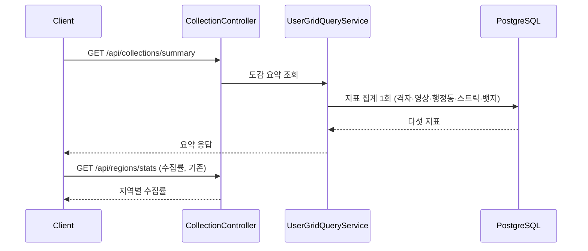
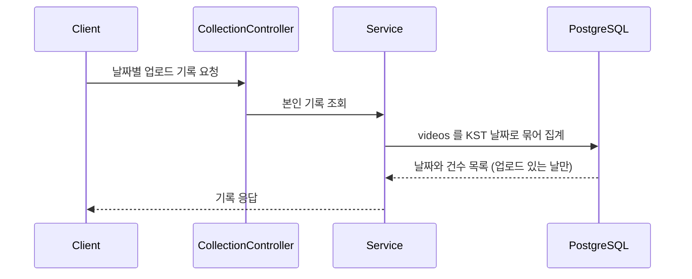

# PRD: 도감에 스트릭과 기록 이력 노출

> 티켓: MSG-362 · 작성일: 2026-08-10 · 작성: prd-writer
> 상태: 검토됨 (2026-08-11 성민 승인)
> 관련 SRS: FR-STREAK-08(이 티켓 대상), FR-STREAK-01~03(집계 규칙), FR-COLLECT 영역(도감 요약)

## 1. 문제 상황

스트릭[^1]은 업로드마다 갱신되고 꾸준함 뱃지 판정에도 쓰이는데 **사용자가 자기 스트릭을 볼 방법이 없다.** 집계와 저장까지만 구현돼 있고 내려주는 경로가 없어서다. `streaks` 테이블에 값은 쌓이고 있지만 어디에도 나가지 않는다.

앱 디자인 정본(개인 도감 뱃지 탭, 노드 14176:7136)은 상단 요약 카드에 "현재 스트릭 12일"을 이미 그려 두었고 그 아래 "스트릭 전체 기록 보기" 링크도 있다. 화면은 준비됐는데 서버가 막고 있는 상태다.

같은 카드의 나머지 두 칸도 확인해 보니 수집률은 `/api/regions/stats`로, 획득 뱃지 수는 뱃지 목록을 받아 세면 얻을 수 있다. 다만 **뱃지 수는 목록 전체를 받아야 알 수 있어서** 숫자 하나를 위해 26행짜리 응답을 받는 셈이다.

기존 도감 요약(`/api/collections/summary`)은 점령 격자 수와 영상 총합, 방문 행정동 수 셋을 준다. 위키의 Collection API 설계 초안(2026-07-17)은 이 응답에 뱃지 수와 스트릭까지 담기로 했는데 구현(MSG-152)에서 앞의 셋만 나갔다. 이번 작업은 새 설계가 아니라 그때 빠진 절반을 채우는 것이다.

## 2. 목적 · 목표

- **목적**: 사용자가 자기 꾸준함을 확인하고 이어 가고 싶게 만든다. 스트릭은 볼 수 없으면 동기로 작동하지 않는다.
- **목표**
  - 도감 화면이 상단 요약 카드를 **서버 호출 두 번**으로 그릴 수 있다(도감 요약 하나와 수집률 하나).
  - 사용자가 지난 기록을 날짜 단위로 되돌아볼 수 있다.
  - SRS `FR-STREAK-08`이 계획에서 구현됨으로 넘어간다.
- **비목표**
  - 수집률을 도감 요약에 합치는 것. Collection API 설계가 수집률을 Region API 소관으로 갈라 뒀고 그 분담을 유지한다.
  - 마지막 기록 날짜 노출. 위키 설계에는 있었으나 디자인에 쓰이는 자리가 없다.
  - 스트릭 끊김 유예나 소급 보정. 이번에도 도입하지 않는다(FR-STREAK-06).
  - 기록 화면의 시각 표현. 색 단계나 칸 크기는 FE와 디자인 몫이다.

## 3. 기능 요구사항

| ID | 요구사항 | 우선순위 |
|----|----------|----------|
| FR-1 | 도감 요약 응답에 현재 스트릭과 최장 스트릭[^2]이 포함된다 (SRS FR-STREAK-08) | Must |
| FR-2 | 도감 요약 응답에 획득한 뱃지 수가 포함된다 | Must |
| FR-3 | 아직 업로드가 없어 스트릭 기록 자체가 없는 사용자도 오류 없이 0을 받는다. 기존 세 지표가 점령 0건 사용자에게 0을 주는 것과 같은 방식이다 | Must |
| FR-4 | 친구 프로필을 볼 때도 같은 값이 보인다. 지금도 격자 수와 영상 수와 행정동 수를 친구에게 공개하고 있어 스트릭만 가릴 이유가 없다 | Must |
| FR-5 | 사용자는 가입일부터 오늘까지 날짜별로 자기가 영상을 올렸는지, 몇 개 올렸는지 조회할 수 있다 | Must |
| FR-6 | 기록 조회는 업로드가 있었던 날만 담는다. 업로드가 없는 날을 빈 값으로 채워 보내지 않는다 | Must |
| FR-7 | 날짜 경계는 스트릭 판정과 같은 KST 자정이다. 같은 업로드가 스트릭에서는 어제로, 기록에서는 오늘로 잡히는 일이 없어야 한다 (SRS FR-STREAK-02) | Must |
| FR-8 | 삭제한 영상의 업로드 날짜도 기록에 남는다. 스트릭이 삭제로 소급 차감되지 않으므로(FR-STREAK-05) 기록도 같은 규칙을 따라야 둘이 어긋나지 않는다 | Must |
| FR-9 | 업로드가 한 건도 없는 사용자는 오류가 아니라 빈 기록을 받는다 | Must |

## 4. 비기능 요구사항

| 분류 | 요구사항 |
|------|----------|
| 성능 | 도감 요약은 지금처럼 **한 번의 DB 왕복**으로 끝난다. 지표가 늘어도 왕복이 늘지 않아야 한다. 기록 조회는 사용자 영상 수에 비례하지만 날짜 단위로 접혀서 나가므로, 매일 올린 사용자도 1년에 365건을 넘지 않는다 |
| 보안·인가 | 요약과 기록 모두 로그인이 필요하다. 기록 조회는 본인 것만 볼 수 있다. 친구에게 공개하는 것은 요약의 숫자까지이고 날짜별 기록은 아니다 |
| 데이터 정합 | 요약의 현재 스트릭과 기록의 마지막 연속 구간이 서로 맞아야 한다. 둘 다 KST 날짜를 쓰고 삭제 영상을 같게 다루면 자동으로 맞는다 |
| 운영 | 마이그레이션이 필요 없다. 필요한 데이터가 `streaks`와 `videos`에 이미 있다 |

## 5. 시퀀스 다이어그램

도감 화면 진입. 요약 한 번과 수집률 한 번으로 상단 카드가 채워진다.

기록 보기 화면.

## 6. 변경 파일 목록

| 파일 | 변경 | Owner |
|------|------|-------|
| `usergrid/repository/UserGridRepository.java` | 요약 집계 쿼리에 스트릭과 뱃지 수 추가. 지금 스칼라 서브쿼리 셋을 한 왕복으로 묶는 구조라 같은 방식으로 늘린다 | B |
| `usergrid/repository/CollectionSummaryProjection.java` | 필드 추가 | B |
| `usergrid/service/CollectionSummaryView.java` | 필드 추가 | B |
| `usergrid/dto/CollectionSummaryResponseDto.java` | 필드 추가 | B |
| `usergrid/controller/CollectionController.java` | 기록 조회 엔드포인트 추가 | B |
| 기록 조회용 리포지토리·서비스·DTO | 신규 | B |
| `friend/dto/FriendProfileResponseDto.java` | 확인만. 요약 DTO를 중첩 재사용하므로 수정이 없을 가능성이 높다 | B |
| 관련 테스트 | 요약 필드 추가분과 기록 조회 | B |

마이그레이션은 없다.

## 7. 미해결 질문

없다. 요구사항 수준에서 정할 것은 다 정했다.

스펙 단계로 넘기는 구현 판단 둘을 여기 적어 둔다. 요구사항이 아니라 어떻게 만들지의 문제다.

- 기록 조회 경로를 도감 아래 둘지 스트릭 아래 둘지. 화면은 도감에 속하는데 데이터 성격은 스트릭이다.
- 요약 집계가 다른 도메인 테이블(`streaks`, `user_badges`)을 직접 읽을지, 각 도메인 서비스를 거칠지. 셋 다 같은 Owner 안이라 어느 쪽도 경계를 넘지는 않는다.

화면 쪽에도 둘을 남긴다. 서버 응답은 어느 쪽이든 같으므로 결정을 기다리지 않는다.

- 잔디[^3]에 색 단계를 쓸지. 응답에 건수가 실리므로(FR-5) 쓸 수 있고, 켜짐과 꺼짐만 써도 된다.
- 가입일부터 그릴지 첫 업로드부터 그릴지. 가입 직후 한동안 안 올린 사용자는 그 구간이 통째로 빈 칸이다.

[^1]: 스트릭. 영상을 올린 날이 연속으로 이어진 일수다. 새 격자를 채우지 않아도 되고 이미 다녀온 곳에 다시 올려도 인정된다. 하루를 걸르면 다음 업로드에서 1로 돌아간다.
[^2]: 최장 스트릭. 지금까지 기록한 연속 일수 중 가장 긴 값이다. 현재 스트릭이 끊겨도 이 값은 줄지 않는다.
[^3]: 잔디. 깃허브 프로필에 있는 것처럼 날짜를 작은 사각형으로 늘어놓고 활동이 있던 날을 칠하는 표현이다. 한 해의 활동 밀도가 한눈에 보인다.
