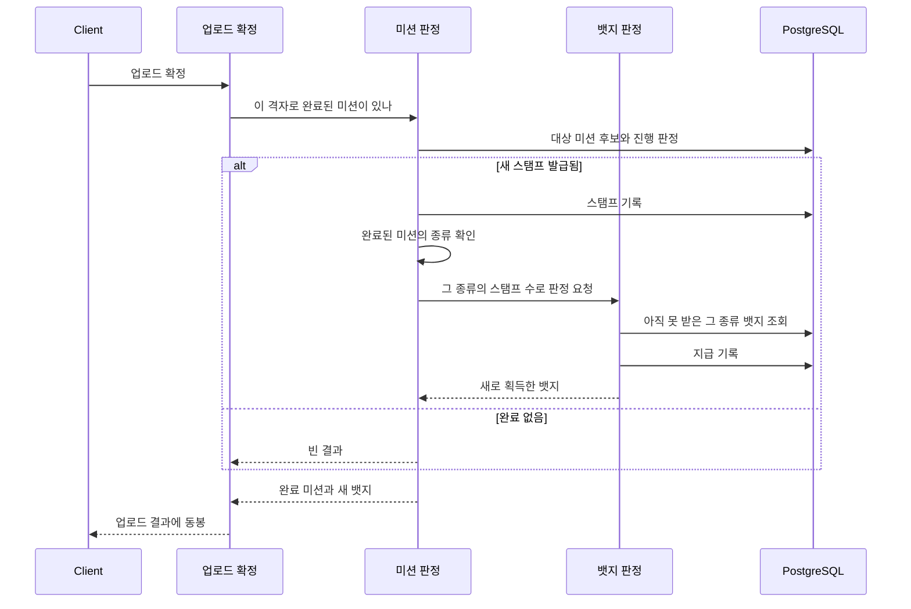

# PRD: 뱃지 체계 정비

> 티켓: MSG-363 · 작성일: 2026-08-10 · 작성: prd-writer
> 상태: 검토됨 (2026-08-10 성민 승인. 뱃지 이름은 칭호 통일형, 그림은 S3 확정)
> 선행 정본: `docs/srs.md` BADGE 영역(FR-BADGE-01~11), MISSION 영역(FR-MISSION-07)

## 1. 문제 상황

뱃지 판정 엔진과 시드 17종은 이미 동작하는데, 사용자가 보는 쪽이 셋 다 준비되지 않았다.

첫째, **미션 뱃지가 사용자에게 없는 단위를 쓴다.** 시드는 "미션 5개 완료"처럼 종류를 합산하는데,
화면에서 미션은 축제와 팝업스토어, 코스추천 칩으로 나뉘어 있다. 사용자는 축제를 다녔지 "미션"을
한 적이 없으므로 뱃지 이름이 자기 행동과 연결되지 않는다.

둘째, **모든 뱃지에 그림이 없다.** `badges.icon_url`이 17건 전부 비어 있어 진열장이 회색 사각형
플레이스홀더로 남아 있다. 뱃지는 보여주는 것이 목적인 기능이라 이 상태로는 기능이 성립하지 않는다.

셋째, **디자인 시안의 뱃지 이름이 실제와 다르다.** 진열장 시안에는 "서울 정복"이 있는데 수집률
뱃지는 행정동 단위이고 "정복"은 용어집이 금지한 표현이다[^1]. 다른 시안에는 "첫 기록"과 "첫
업로드"가 따로 있는데 첫 업로드가 곧 첫 격자 수집이라 실제로는 한 뱃지다.

다만 이 셋째 문제는 서버가 고칠 것이 아니다. 진열장 전용 API가 없고 클라이언트가 전체 목록에서
골라 그리므로, 화면에 뜨는 이름은 언제나 서버가 내려준 뱃지 이름이다. 시안의 라벨은 디자이너가
채운 예시 텍스트이고 진열장 칸 수도 클라이언트 정책이다. 서버가 할 일은 내려주는 이름 자체를
용어집에 맞게 유지하는 것뿐이며, 시안 텍스트 수정은 디자인에 전달한다.

## 2. 목적 · 목표

**목적**: 뱃지를 화면에 내보낼 수 있는 상태로 만든다. 사용자가 자기 행동으로 알아볼 수 있는
단위로 뱃지를 나누고, 각 뱃지에 그림을 붙이고, 화면 라벨과 실제 데이터를 일치시킨다.

**목표**

- 미션 뱃지가 축제, 코스, 팝업 종류별로 지급되어 화면의 칩 구분과 대응한다.
- 진열장과 전체 목록의 모든 뱃지가 그림으로 표시된다.
- 서버가 내려주는 뱃지 이름이 전부 용어집을 지킨다.

**비목표 (이번에 하지 않는 것)**

- 시/도 단위 수집률 뱃지 신설. 디자인의 "서울 정복"은 기존 행정동 뱃지로 라벨을 맞춘다
  (2026-08-10 성민 결정). 시/도 집계는 계속 MVP 밖이다(SRS FR-REGION-13).
- 스트릭 조회 API와 "스트릭 전체 기록 보기" 화면. 도감 요약 화면에 필요하지만 뱃지와 도메인이
  달라 별도 티켓으로 분리한다(2026-08-10 성민 결정, SRS FR-STREAK-08).
- SPECIAL 축 뱃지(오픈 기념 등) 시딩. 지급 시점이 서비스 오픈에 묶여 있다(SRS FR-BADGE-11).
- 뱃지 진행률 노출. 현재 목록은 조건 수치와 진행률을 내리지 않으며 이 방침은 유지한다.
- 진열장 칸 수와 배치. 서버에 진열장 전용 응답이 없고 클라이언트가 전체 목록에서 골라 그리므로
  클라이언트 정책이다. 앱 정본은 6칸이고 다른 시안은 8칸인데 서버는 어느 쪽이든 영향이 없다.

## 3. 기능 요구사항

기존 SRS 항목을 상세화하는 것은 ID를 참조로 달았고, 나머지는 이 PRD가 승인되면 신규 등재한다.

| ID | 요구사항 | 우선순위 | SRS |
|----|----------|----------|-----|
| FR-1 | 미션 뱃지는 축제, 코스, 팝업 세 종류로 나뉘어 각각 독립으로 지급된다. 종류가 다른 미션을 완료해도 서로의 진행에 합산되지 않는다 | Must | FR-MISSION-07 대체 |
| FR-2 | 각 종류의 임계값은 1개, 3개, 10개이고 이름은 아래 표대로다 | Must | 신규 |
| FR-3 | 기존 미션 합산 뱃지 3종(첫 스탬프, 스탬프 수집가, 미션 마스터)은 더 이상 지급되지 않는다 | Must | 신규 |
| FR-4 | 이미 합산 뱃지를 받은 사용자는 그것을 잃지 않는다. 비회수 원칙[^2]이 폐지된 뱃지에도 적용된다 | Must | FR-BADGE-04 |
| FR-5 | 종류별 뱃지 도입 시점에 이미 조건을 충족한 사용자에게 소급 지급[^3]한다. 스탬프 이력에 종류 정보가 남아 있어 역산이 가능하다 | Must | FR-BADGE-06 |
| FR-6 | AREA, THEME, CONTINUOUS 유형의 미션 완료는 어느 뱃지에도 집계되지 않는다. 화면에 대응하는 칩이 없어 사용자가 진행을 확인할 수 없기 때문이다 | Must | 신규 |
| FR-7 | 모든 뱃지는 획득 여부와 무관하게 고유한 그림을 가진다. 미획득 뱃지는 같은 그림을 흐리게 표시하며, 그림 없는 뱃지가 목록에 나오지 않는다 | Must | 신규 |
| FR-8 | 뱃지 그림은 서버가 목록 응답으로 내려주는 주소로 표시한다. 클라이언트가 뱃지 코드로 그림을 하드코딩하지 않는다 | Must | FR-BADGE-01 |
| FR-9 | 서버가 내려주는 뱃지 이름은 용어집 금지 표현("점령", "정복")을 쓰지 않는다 | Must | 신규 |

**확정된 뱃지 이름과 임계값** (2026-08-10 성민 확정, 칭호 통일형)

| 종류 | 1개 | 3개 | 10개 |
|------|-----|-----|------|
| 축제 (EVENT) | 축제 입문 | 축제 단골 | 축제 마스터 |
| 코스 (COURSE) | 코스 입문 | 코스 단골 | 코스 마스터 |
| 팝업 (POPUP) | 팝업 입문 | 팝업 단골 | 팝업 마스터 |

기존 행정동 뱃지("동네 입문", "동네 단골", "동네 마스터")와 같은 패턴이라 목록에서 규칙이 한눈에
보인다. 설명 문구는 "축제 3곳을 다녀왔어요"처럼 종류에 맞는 동사를 쓴다.

**엣지 케이스**

| 상황 | 기대 동작 |
|------|----------|
| 한 번의 업로드로 축제 미션과 팝업 미션을 동시에 완료 | 두 종류의 뱃지가 각각 판정되어 둘 다 지급될 수 있다 |
| 종류별 뱃지 도입 전에 축제 5곳을 완료한 사용자 | 소급 지급으로 축제 1개와 3개 뱃지를 받는다. 10개 뱃지는 조건 미달이라 안 받는다 |
| 합산 뱃지를 이미 3종 다 받은 사용자 | 그 3종은 목록에 계속 보이고 새 종류별 뱃지는 조건에 따라 별도로 받는다 |
| 그림 주소가 있는데 이미지 로딩에 실패 | 클라이언트가 대체 표시를 하되 뱃지 항목 자체를 감추지 않는다 |

## 4. 비기능 요구사항

| 분류 | 요구사항 |
|------|----------|
| 성능 | 미션 판정 축이 1개에서 3개로 늘어도 업로드 응답 시간에 체감 변화가 없어야 한다. 미션을 완료하지 않은 대부분의 업로드는 판정 자체가 일어나지 않는 현재 특성을 유지한다 |
| 데이터 정합 | 소급 지급은 여러 번 실행해도 결과가 같아야 한다(멱등[^4]). 종류별 판정은 동시 업로드에서도 중복 지급되지 않는다 |
| 운영 | 그림 파일은 기존 영상 저장소(S3)에 올리고 주소만 마이그레이션으로 채운다(2026-08-10 확정). 뱃지가 늘어도 같은 방식이고, 배포와 그림 등록이 서로를 기다리지 않는다 |
| 보안 | 뱃지 그림은 로그인 없이도 읽히는 공개 자원이다. 영상과 달리 사용자별 접근 제어가 없으므로 서명 URL을 쓰지 않는다 |

## 5. 시퀀스 다이어그램

미션 완료 시 종류별 뱃지가 판정되는 흐름이다. 축이 3개로 갈리는 지점이 이번 변경의 핵심이다.

## 6. 변경 파일 목록

실제 코드 확인 기반이다. 판정 축을 늘리는 방식(뱃지 축 enum 확장 대 조건 값에 종류 담기)은
스펙에서 정한다.

| 파일 | 변경 | Owner |
|------|------|-------|
| `src/main/resources/db/migration/V{n}__*.sql` | 신규. 종류별 뱃지 9종 시딩, 합산 뱃지 3종 비활성, 소급 지급, 그림 주소 등록 | - |
| `src/main/java/com/msg/fillmap/badge/entity/BadgeConditionType.java` | 수정. 종류별 판정 축 추가 | B |
| `src/main/java/com/msg/fillmap/mission/service/impl/MissionAwardServiceImpl.java` | 수정. 53행의 단일 판정 호출을 완료 미션 종류별 판정으로 | B |
| `src/main/java/com/msg/fillmap/mission/repository/UserMissionRepository.java` | 수정. 종류별 스탬프 수 집계 추가 | B |
| `src/main/java/com/msg/fillmap/badge/service/BadgeAwardServiceImpl.java` | 수정. 임박 판정 대상 축 목록에 종류별 축 반영 | B |
| `src/test/java/.../badge/`, `.../mission/` | 수정. 종류별 지급과 소급, 합산 뱃지 비지급 검증 | B |
| 뱃지 그림 에셋 | 신규. 확정 시안을 파일로 내보내 저장소에 올린다 | - |

## 7. 미해결 질문

- [ ] 그림 파일 형식. 저장 위치는 S3로 확정했지만 벡터(SVG) 한 벌로 둘지 화면 배율별 PNG를
      함께 낼지 정하지 않았다. 클라이언트 렌더링 방식에 달려 있어 FE 확인이 필요하다.

**디자인에 전달할 사항** (서버 변경 없음)

- 진열장 시안의 뱃지 라벨이 실제 뱃지와 다르다. "서울 정복"은 수집률이 행정동 단위이고 "정복"이
  금지 표현이라 "동네 마스터" 계열로, "첫 기록"과 "첫 업로드"는 같은 뱃지라 한 칸으로 정리한다.
  실제 화면에서는 서버가 준 이름이 뜨므로 시안 텍스트만 바꾸면 된다.
- 진열장 칸 수가 앱 정본 6칸과 다른 시안 8칸으로 갈려 있다. 어느 쪽이든 서버는 영향이 없다.

[^1]: 용어집(`.claude/rules/glossary.md`)은 화면 문구에서 "점령"과 "정복"을 쓰지 않기로 정했다.
      정복 뉘앙스가 기획 톤과 맞지 않아서다. 코드와 설계 논의에서는 "점령"을 쓴다.
[^2]: 비회수. 한 번 받은 뱃지는 조건이 다시 미달이 되어도 회수하지 않는다는 규칙. 영상을 지워
      격자 수가 줄어도 뱃지는 남는다.
[^3]: 소급 지급. 새 뱃지를 도입하는 시점에 이미 조건을 충족한 사용자에게 한꺼번에 지급하는 것.
      안 하면 기존 사용자는 그 뱃지를 영원히 못 받는다.
[^4]: 멱등. 같은 작업을 여러 번 해도 결과가 한 번 한 것과 같은 성질. 마이그레이션이 재실행되거나
      배포가 반복돼도 뱃지가 중복 지급되지 않아야 한다는 뜻이다.
