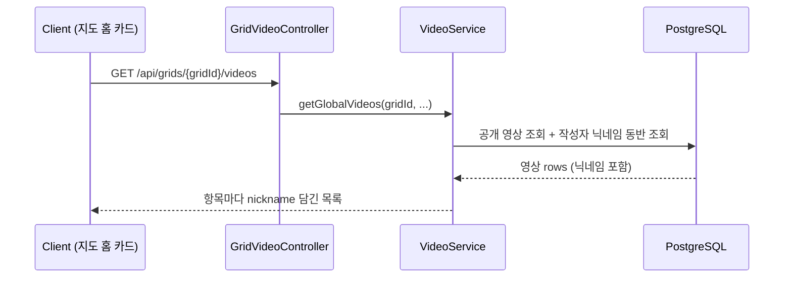
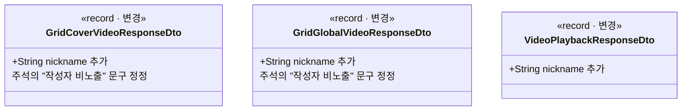

# PRD: 전역 영상 카드에 작성자 닉네임 표시

> 티켓: MSG-371 · 작성일: 2026-08-11 · 작성: prd-writer
> 상태: 검토됨 (2026-08-11 정민 승인, 미해결 질문 3건 답변 반영)

## 1. 문제 상황

지도 홈의 전역 노출 영상 카드에 작성자 닉네임을 표시하기로 2026-08-04에 확정했다(웹 디자인 ver 9
대조에서 성민 확정, glossary 정책 결정 이력에 기록). 웹 디자인 ver 11에서도 카드에 `@busan.vlog`
형태의 작성자 표기가 그대로 있다(2026-08-10 실측). 그런데 전역 영상 응답 2종, 즉 격자 대표 영상
1건과 격자 전역 영상 목록에는 작성자 정보가 전혀 없다. 오히려 두 DTO[^1]의 주석은 "작성자 식별
정보는 프라이버시상 담지 않는다"라는, 이미 폐기된 방침을 아직 정본처럼 말하고 있다. FE는 카드에
닉네임을 그릴 재료가 없는 상태다.

## 2. 목적 · 목표

- **목적**: 확정된 지 일주일이 지난 "전역 영상 카드 작성자 닉네임 표시" 결정을 실제 응답 계약에
  반영해서, FE가 추가 호출 없이 카드에 작성자를 그릴 수 있게 한다.
- **목표**:
  - 격자 대표 영상 응답과 격자 전역 영상 목록 응답에 작성자 닉네임이 담긴다.
  - 폐기된 방침을 말하는 DTO 주석 2곳이 현재 정책으로 정정된다.
- **비목표(스코프 제외)**:
  - 작성자 프로필로 이동하는 기능(타인 프로필 조회 API는 별도 논의).
  - 친구 축 응답(친구 격자 영상 목록)의 변경. 친구 화면은 보고 있는 친구가 곧 작성자라 표기
    재료가 이미 문맥에 있다.
  - 닉네임 외의 작성자 정보(도감 색상 등)는 담지 않는다.
  - 탐색 격자 카드와 사이드 패널 격자 카드. 격자 단위 카드에는 작성자 표기가 없음을
    확인했다(2026-08-11 정민).
  - 카드의 작성자 프로필 이미지. 디자인에 그려지지 않음을 확인해(2026-08-11 정민)
    이미지 URL 동봉도 하지 않는다.
  - 영상 제목은 MSG-240 소관이라 여기서 다루지 않는다.

## 3. 기능 요구사항

전역 요구사항 명세의 해당 항목은 `docs/srs.md`의 FR-VIDEO-18이다.

| ID | 요구사항 | 우선순위 |
|----|----------|----------|
| FR-1 | 격자 대표 영상 조회(`GET /api/grids/{gridId}/cover`) 응답에 작성자 닉네임이 담긴다 | Must |
| FR-2 | 격자 전역 영상 목록(`GET /api/grids/{gridId}/videos`)의 각 항목에 작성자 닉네임이 담긴다 | Must |
| FR-3 | 닉네임은 조회 시점의 현재 값이다. 작성자가 닉네임을 바꾸면 다음 조회부터 바뀐 값이 나온다 (응답에 저장해 두는 비정규화[^2] 금지) | Must |
| FR-4 | 서버는 닉네임 원문만 준다. `@` 접두 등 화면 표기는 FE가 붙인다 | Must |
| FR-5 | 단건 재생 응답(`GET /api/videos/{videoId}`)에도 작성자 닉네임이 담긴다. 재생 화면에 작성자 표기가 있음을 확인했다(2026-08-11 정민) | Must |

작성자가 없는 전역 영상은 엣지 케이스가 아니다. 탈퇴 시 영상이 함께 삭제되므로(`videos.user_id`
FK[^3]의 ON DELETE CASCADE, V1) 전역 목록에 남은 영상은 항상 살아 있는 작성자를 가진다.

## 4. 비기능 요구사항

| 분류 | 요구사항 |
|------|----------|
| 성능 | 목록 조회에 작성자 정보가 붙어도 항목 수만큼 사용자 조회가 반복되면 안 된다 (N+1[^4] 금지). 기존 응답 시간 수준 유지 |
| 데이터 정합 | FR-3과 동일. 닉네임 변경이 전역 카드에 즉시 반영된다 |

## 5. 시퀀스 다이어그램

## 6. 클래스 다이어그램

## 7. 변경 파일 목록

| 파일 | 변경 | Owner |
|------|------|-------|
| `video/dto/GridCoverVideoResponseDto.java` | 수정(nickname 필드 추가, 주석 정정) | B |
| `video/dto/GridGlobalVideoResponseDto.java` | 수정(nickname 필드 추가, 주석 정정) | B |
| `video/dto/VideoPlaybackResponseDto.java` | 수정(nickname 필드 추가) | B |
| `video/repository/VideoRepository.java` | 수정(대표·목록·단건 조회에 작성자 닉네임 동반 조회) | B |
| `video/service/VideoServiceImpl.java` | 수정(닉네임 매핑) | B |
| 관련 테스트 (`GridVideoControllerTest`, `VideoControllerTest` 등) | 수정(응답 필드 검증 추가) | B |

마이그레이션 없음. `users.nickname`과 `videos.user_id`는 V1부터 있다.

## 8. 미해결 질문

없음. 초안의 질문 3건은 2026-08-11 정민 답변으로 해소됐다.

- [x] 격자 카드(탐색, 사이드 패널)의 커버 작성자 표기: 없음. 격자 카드는 대상에서 제외 (비목표에 반영)
- [x] 단건 재생 화면의 작성자 표기: 있음. 재생 응답도 추가 대상 (FR-5로 반영)
- [x] 카드의 작성자 프로필 이미지: 안 그려짐. 이미지 URL 동봉 안 함 (비목표에 반영)

[^1]: DTO(Data Transfer Object): API 응답의 형태를 정의하는 자료 구조. 여기서는 자바 record로 선언된 응답 클래스를 말한다.
[^2]: 비정규화: 조회를 빠르게 하려고 원본(users 테이블)의 값을 다른 곳(영상 행이나 응답 캐시)에 복사해 두는 것. 복사본은 원본이 바뀔 때 낡는다.
[^3]: FK(Foreign Key, 외래 키): 다른 테이블의 행을 가리키는 참조 제약. ON DELETE CASCADE는 가리키던 행이 지워지면 이 행도 함께 지워지는 옵션이다.
[^4]: N+1 문제: 목록 1번 조회 후 각 항목마다 연관 데이터를 1번씩 또 조회해서, N개 항목에 N+1번의 쿼리가 나가는 성능 함정.
