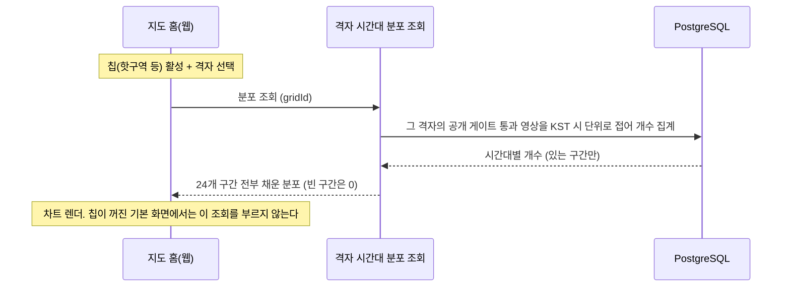
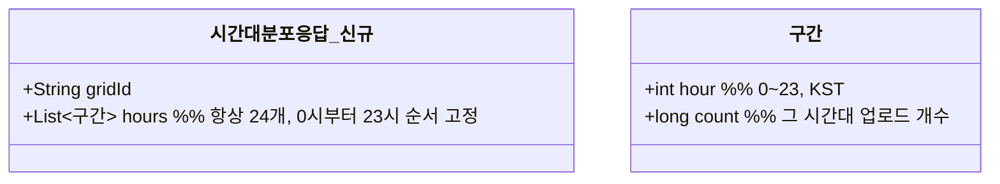

# PRD: 격자 활발한 시간대 차트 재료

> 티켓: MSG-372 · 작성일: 2026-08-13 · 작성: prd-writer
> 상태: 검토됨 (2026-08-13 사용자 승인, 집계 윈도우 전체 누적과 24구간 고정 응답 확정 포함)

## 1. 문제 상황

지도 홈에서 핫구역이나 지역축제 같은 칩[^1]을 켜고 격자를 선택하면, 패널에 "활발한 시간대" 차트가 뜬다(웹 디자인 ver 11 셀 선택 패널). 이 장소에 언제 사람들이 다녀갔는지를 시간대별 업로드 분포로 보여주는 그림인데, 재료가 되는 API가 서버에 없다. 격자 하나에 대해 0시부터 23시까지 어느 시간대에 업로드가 몰렸는지를 내려주는 조회가 필요하다.

노출 위치는 2026-08-13에 좁혀졌다. 처음 티켓은 지도 홈 격자 패널 전반을 전제했지만, 지도 홈 기본 화면(내 도감)에서는 차트 디자인 자체가 빠지고 칩이 활성일 때의 격자 선택에서만 보여주기로 했다. 칩이 보여주는 콘텐츠가 전역(모든 사용자)이므로, 차트도 전역 업로드를 세는 것이 맥락에 맞는다.

티켓 본문의 "지도 홈은 전역 기준(2026-08-11 확정)"이라는 전제는 같은 날 번복된 낡은 서술이다(지도 홈 기본은 내 격자 기준, SRS FR-MAP-07). 다만 위 노출 위치 확정으로 차트가 전역 콘텐츠 맥락에만 붙게 되어, 전역 공개 게이트[^2]로 센다는 집계 기준 자체는 유효하다.

## 2. 목적 · 목표

- **목적**: 칩 맥락에서 격자를 골랐을 때 "이 장소는 언제 활발한가"를 보여줄 데이터를 서버가 제공한다.
- **목표**:
  - 격자 하나의 시간대별 업로드 분포를 조회 한 번으로 받을 수 있다.
  - 분포의 세는 기준이 같은 패널의 전역 영상 카드와 일치한다. 카드에 보이는 영상은 차트에도 세어지고, 안 보이는 영상은 차트에도 없다.
- **비목표(스코프 제외)**:
  - 차트의 시각 형태(막대, 강조 구간, 요약 문구)는 화면 몫이다. 서버는 구간별 개수만 준다.
  - 지도 홈 기본 화면(내 도감)의 격자 패널은 이 티켓과 무관하다. 차트가 그 화면에서 빠졌다.
  - 내 업로드만 세는 개인 기준 분포는 만들지 않는다. 요구된 적이 없다.

## 3. 기능 요구사항

| ID | 요구사항 | 우선순위 |
|----|----------|----------|
| FR-1 | 격자 하나를 지정해 시간대별 업로드 분포를 조회할 수 있다. 응답은 0시부터 23시까지 24개 구간이 항상 전부 있고, 구간마다 업로드 개수가 담긴다 | Must |
| FR-2 | 세는 대상은 전역 공개 게이트를 통과한 영상 전부다(모든 사용자). 같은 격자의 전역 영상 목록과 세는 기준이 글자 단위로 같아, 두 화면의 숫자가 어긋나지 않는다 | Must |
| FR-3 | 시간대 구간은 KST[^3] 기준이다. 저장 시각이 UTC이므로 변환 후 시(0~23)를 뽑는다. 기준 시각은 업로드 시각[^4]이다 | Must |
| FR-4 | 집계 윈도우는 전체 누적이다. 서비스 초기에 데이터가 희소해 최근 며칠로 자르면 빈 차트가 대부분이 되기 때문이며, 최근 N일 윈도우는 데이터가 쌓인 뒤 별도 요구로 다룬다 | Must |
| FR-5 | 공개 영상이 하나도 없는 격자도 실패가 아니다. 24개 구간이 전부 0인 정상 응답을 준다. 존재하지 않는 gridId도 같은 형태다(격자 전역 영상 목록의 빈 페이지 정책과 동일) | Must |
| FR-6 | 영상 삭제, 블라인드, 비공개 전환은 다음 조회부터 분포에서 빠진다. 게이트 판정은 조회 시점 실시간이다 | Must |
| FR-7 | 차트를 칩 활성 상태에서만 띄우는 것은 화면 규칙이라 클라이언트가 판정한다. 서버는 칩 상태를 파라미터로 받지 않고, 격자만 지정하면 언제든 응답한다 | Must |

## 4. 비기능 요구사항

| 분류 | 요구사항 |
|------|----------|
| 성능 | 칩 맥락의 격자 선택마다 1콜이 추가된다. 지도 화면 계열 조회이므로 같은 SLO[^5](p95 300ms 미만)를 지킨다. 격자 하나로 거르는 조회라 기존 격자 축 인덱스를 탈 수 있는지 스펙에서 확인한다 |
| 보안/인가 | 토큰 필수(기존 격자 조회 관례). 세는 대상이 전역 공개 게이트 통과분뿐이라 비공개·미완 영상의 존재가 개수로도 새지 않는다 |
| 데이터 정합 | 게이트 조건이 격자 전역 영상 목록·대표 영상 조회와 같은 프래그먼트여야 한다. 여기만 조건이 달라지면 카드 개수와 차트 합이 어긋난다 |
| 운영 | 스키마 변경 없음 예상. 신규 인덱스 필요 여부는 스펙의 실행계획 확인 몫 |

## 5. 시퀀스 다이어그램

## 6. 클래스 다이어그램

## 7. 변경 파일 목록

리서치 실측 기반. video 도메인이라 전부 Owner B다.

| 파일 | 변경 | Owner |
|------|------|-------|
| `src/main/java/com/msg/fillmap/video/controller/GridVideoController.java` | 격자 시간대 분포 조회 엔드포인트 추가 (`/api/grids/{gridId}` 하위, 기존 3개와 동거) | B |
| `src/main/java/com/msg/fillmap/video/service/VideoService.java`, `impl` | 분포 조회 메서드 추가 | B |
| `src/main/java/com/msg/fillmap/video/repository/VideoRepository.java` | 격자 하나의 게이트 통과 영상을 KST 시 단위로 접는 집계 쿼리 추가 | B |
| `src/main/java/com/msg/fillmap/video/dto/` | 분포 응답 DTO 신규 | B |
| `src/test/java/...` | 위 변경의 테스트 신규 | B |

마이그레이션은 없다.

## 8. 미해결 질문

- [x] 집계 윈도우와 응답 형태는 2026-08-13 사용자 확정: 전체 누적(FR-4), 24구간 고정(FR-1).
- [ ] 디자인 재확인: 노출 위치가 오늘 칩 한정으로 바뀌면서 셀 선택 패널의 차트 형태가 ver 11 실측(2026-08-10, 티켓 기록) 그대로인지 불확실하다. 레포 보존 캡처에 해당 패널이 없어 확정하지 못했다. 서버 재료(24구간 개수)는 형태 변화에 둔감해 진행에는 지장이 없다.

## 9. 이력

2026-08-13 노출 위치 확정으로 문제 상황을 다시 썼다. 차트는 지도 홈 기본(내 도감) 격자 패널에서 빠지고 칩 활성 상태의 격자 선택에서만 보인다. 이로써 티켓 본문의 낡은 전제(지도 홈 전역 기준, 번복됨)와 무관하게 집계 기준이 전역 공개 게이트로 정리됐다. 지라 티켓 본문도 함께 정정해야 한다.

---

[^1]: 칩: 지도 홈 상단의 토글 버튼 4종(핫구역, 지역축제, 팝업스토어, 경로추천). 한 번에 하나만 켜지고, 켜면 전역(모든 사용자) 콘텐츠가 지도에 얹힌다.
[^2]: 전역 공개 게이트: 전역 노출 경로가 공유하는 영상 필터. 살아 있고(ACTIVE) 전체 공개(PUBLIC)이며 처리 완료(READY)인 영상만 통과한다. 프로젝트 원칙상 이 조건은 모든 전역 조회에서 글자 단위로 같아야 한다.
[^3]: KST: 한국 표준시(Asia/Seoul). DB 저장 시각은 UTC라 시간대 라벨을 만들 때 변환이 필요하며, 스트릭의 일 경계 판정과 같은 원칙이다.
[^4]: 업로드 시각: 영상이 서버에 확정된 시각(videos.created_at). 촬영 시각(recordedAt)은 클라이언트가 신고하는 값이라 검증할 수 없어 기준으로 쓰지 않는다(티켓 명시).
[^5]: SLO: 서비스가 지키기로 정한 응답 성능 목표. 지도 화면 계열 조회는 p95 300ms 미만으로 확정돼 있다.
