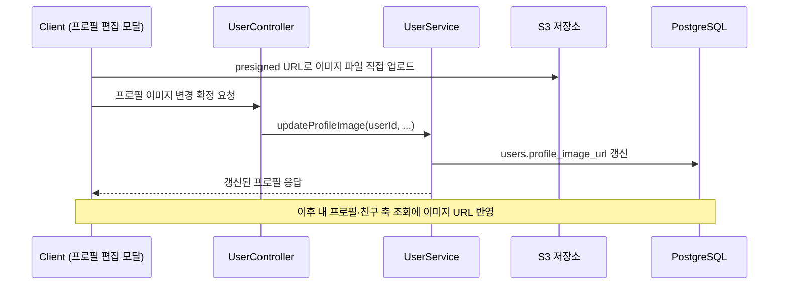
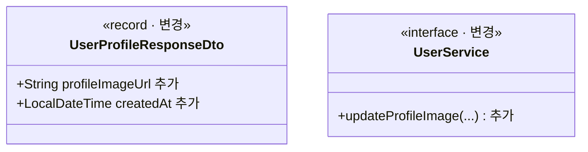

# PRD: 프로필 이미지 변경과 가입일 노출

> 티켓: MSG-373 · 작성일: 2026-08-11 · 작성: prd-writer
> 상태: 검토됨 (2026-08-11 정민 승인, 미해결 질문 5건 중 4건 답변 반영, 1건 보류 확정)

## 1. 문제 상황

웹 디자인 ver 11의 프로필 편집 모달에는 프로필 이미지 "변경" 버튼이 있고, 프로필 화면에는
가입일(표기 예: 2026.01.12)이 있다(2026-08-10 실측). 서버는 둘 다 지원하지 않는다.
내 프로필 조회(`GET /api/users/me`) 응답은 email과 nickname 두 필드뿐이다.

더 어색한 점은 반쪽만 존재하는 프로필 이미지다. `users.profile_image_url` 컬럼은 초기
스키마(V1)부터 있고 User 엔티티에도 매핑돼 있으며, 친구 목록과 친구 프로필과 받은 친구 요청
응답 3종은 이미 `profileImageUrl` 필드를 내려주고 있다. 그런데 값을 채울 방법(업로드나 설정
API)이 없어서 그 필드는 항상 null이다. 읽는 쪽만 있고 쓰는 쪽이 없다.

## 2. 목적 · 목표

- **목적**: 프로필 편집 화면이 실제로 동작하도록 이미지의 "쓰는 쪽"을 만들고, 프로필 조회에
  디자인이 요구하는 재료(이미지 URL, 가입일)를 채운다.
- **목표**:
  - 사용자가 프로필 이미지를 등록하고 변경할 수 있다.
  - 내 프로필 조회에 프로필 이미지 URL과 가입 시각이 담긴다.
  - 이미 필드가 있는 친구 축 응답 3종의 `profileImageUrl`이 실제 값으로 채워진다.
- **비목표(스코프 제외)**:
  - 도감 색상 변경(MSG-203에서 기획 제외로 확정).
  - 카카오 프로필 사진 자동 가져오기. 초기값은 그냥 기본 프로필(서버 값 null)로 확정했다
    (2026-08-11 정민). 기본 이미지 표시는 FE 몫이다.
  - 프로필 이미지 신고와 제재. 신고 대상은 영상만이라는 확정(2026-08-06)이 있고, 부적절
    이미지 대응은 기획 보류로 확정했다(2026-08-11 정민).
  - 닉네임 관련 변경 없음.

## 3. 기능 요구사항

전역 요구사항 명세의 해당 항목은 `docs/srs.md`의 FR-USER-12(등록·변경·제거·한도)와
FR-USER-13(조회 노출·친구 축 반영)이다.

| ID | 요구사항 | 우선순위 |
|----|----------|----------|
| FR-1 | 사용자는 이미지 파일을 올려 프로필 이미지를 등록하거나 변경할 수 있다. 업로드 전달은 영상 업로드와 같은 presigned URL 직접 업로드 방식이다(기존 인프라 재사용, 2026-08-11 확정) | Must |
| FR-2 | 내 프로필 조회 응답에 프로필 이미지 URL이 담긴다. 미설정이면 null | Must |
| FR-3 | 내 프로필 조회 응답에 가입 시각(`users.created_at`)이 담긴다. "2026.01.12" 같은 화면 표기는 FE가 만든다 | Must |
| FR-4 | 친구 목록, 친구 프로필, 받은 친구 요청 응답의 `profileImageUrl`에 설정한 이미지가 반영된다 | Must |
| FR-5 | 허용 형식은 jpg, png, webp에 아이폰 기본 사진 형식(heic, heif)을 더한 5종, 크기는 최대 5MB다. 한도를 벗어난 업로드는 명확한 실패 응답을 받는다 | Must |
| FR-6 | 프로필 이미지를 제거해 기본 상태로 되돌릴 수 있다 | Must |

heic 파일은 브라우저가 직접 표시하지 못한다. 아이폰 사진을 받으려면 표시 가능한 형식으로의
변환이 클라이언트나 서버 어느 한쪽에 필요하다. 변환 위치와 방식은 스펙에서 확정한다.

## 4. 비기능 요구사항

| 분류 | 요구사항 |
|------|----------|
| 보안/인가 | 본인만 자기 프로필 이미지를 변경할 수 있다. 토큰 필수 |
| 데이터 정합 | 계정 삭제(MSG-205) 시 프로필 이미지 파일도 정리 대상에 들어간다. 지금 삭제 트랜잭션의 S3[^1] 키 수집은 영상 키만 모은다 |
| 데이터 정합 | 이미지를 변경하면 이전 이미지 파일이 저장소에 방치되지 않는다(즉시든 지연이든 정리 방침 필요) |
| 운영 | DB 마이그레이션 없음. 컬럼과 엔티티 매핑이 이미 있다 |

## 5. 시퀀스 다이어그램

업로드 전달은 영상처럼 presigned URL[^2] 직접 업로드로 확정했다(2026-08-11). 키 경로 설계와
확정 요청의 형태는 스펙에서 정한다.

## 6. 클래스 다이어그램

## 7. 변경 파일 목록

| 파일 | 변경 | Owner |
|------|------|-------|
| `user/dto/UserProfileResponseDto.java` | 수정(profileImageUrl, createdAt 필드 추가) | B |
| `user/controller/UserController.java` | 수정(이미지 변경 엔드포인트 추가) | B |
| `user/service/UserService.java` · `UserServiceImpl.java` | 수정(이미지 변경, 삭제 트랜잭션의 S3 키 수집에 프로필 이미지 포함) | B |
| `user/exception/UserErrorCode.java` | 수정(형식·크기 위반 등 실패 코드 추가) | B |
| 업로드 인프라 | video의 presign 인프라 재사용(확정). 프로필 이미지 키 경로 등 상세는 스펙 | B |
| 관련 테스트 (`UserControllerTest` 등) | 수정 | B |

친구 축 응답 3종은 코드 변경이 없다. 프로젝션[^3]이 이미 `u.profileImageUrl`을 읽고 있어서
값이 채워지는 순간 자동으로 반영된다.

## 8. 미해결 질문

없음. 초안의 질문 5건은 2026-08-11 정민 답변으로 해소됐다(5번은 보류 확정).

- [x] 업로드 전달 방식: presigned URL 직접 업로드, 기존 인프라 재사용 (FR-1에 반영)
- [x] 허용 형식과 크기: jpg, png, webp에 아이폰 형식(heic, heif) 추가, 최대 5MB (FR-5에 반영)
- [x] 카카오 프로필 사진 초기값: 안 가져옴. 초기값은 기본 프로필 (비목표에 반영)
- [x] 이미지 제거 기능: 넣는다 (FR-6을 Must로 승격)
- [x] 부적절 이미지 대응: 기획 보류 (비목표에 반영)

[^1]: S3: AWS의 파일 저장소 서비스. FillMap은 영상과 썸네일을 여기에 저장하고, DB에는 파일을 가리키는 키만 둔다.
[^2]: presigned URL: 서버가 서명해 발급하는 한시적 업로드/다운로드 주소. 클라이언트가 파일을 서버를 거치지 않고 S3에 직접 올릴 수 있게 한다. 영상 업로드(MSG-133)가 이 방식이다.
[^3]: 프로젝션(projection): 조회 쿼리가 필요한 컬럼만 골라 응답 형태로 바로 매핑하는 방식. 친구 목록 쿼리가 users 테이블의 profileImageUrl 컬럼을 이미 SELECT 목록에 넣고 있다.
