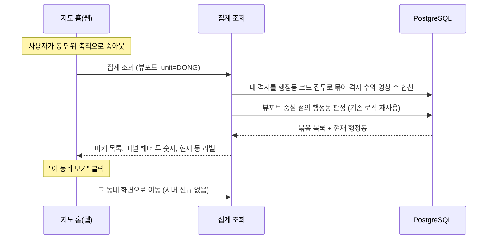
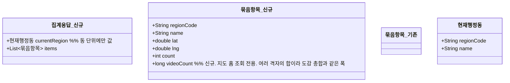

# PRD: 지도 홈 줌아웃 집계에 영상 수와 현재 행정동 더하기

> 티켓: MSG-374 · 작성일: 2026-08-11 · 작성: prd-writer
> 상태: 검토됨 (2026-08-11 사용자 승인, 지도 홈 개인 기준 번복 반영본)

## 1. 문제 상황

지도 홈은 내 격자를 보여주는 화면이다(SRS FR-MAP-01). 전역 데이터는 상단 칩을 켰을 때만 나오고, 핫구역 칩이 모든 사용자의 업로드로 뽑은 구역을 보여주는 식이다(FR-MAP-07).

지도를 축소하면 낱개 격자 대신 행정 단위로 묶은 이름 마커가 뜬다. 이 집계는 이미 있다(MSG-356). 다만 묶음마다 격자 수만 세고 영상 수는 세지 않아서, 사이드 패널 헤더의 "이 지역 격자 5개, 영상 355개" 가운데 뒤쪽 숫자를 만들 재료가 없다.

여기에 더해 네이버 지도 UX를 참조한 결정(SRS FR-MAP-06)으로, 동 단위 시야에서는 뷰포트[^1] 중심이 속한 현재 행정동 이름을 화면 라벨과 "이 동네 보기" 진입 버튼에 써야 한다. 이 값을 조회마다 따로 물어보지 않고 받을 방법이 없다.

## 2. 목적 · 목표

- **목적**: 지도 홈의 줌아웃 화면이 필요로 하는 재료 두 가지를 기존 집계 조회에 채운다.
- **목표**:
  - 사이드 패널 헤더가 격자 수와 영상 수를 함께 표시한다. 두 숫자 모두 내 것을 센다.
  - 동 단위 시야에서 지도를 움직이면 현재 행정동 라벨과 "이 동네 보기" 버튼이 따라 바뀐다.
- **비목표(스코프 제외)**:
  - 전역 기준 집계는 만들지 않는다. 2026-08-11 오전에 지도 홈을 전역으로 바꾸려던 방향이 같은 날 번복돼(SRS FR-MAP-05 폐기) 필요가 사라졌다.
  - 사이드 패널의 영상 카드 목록은 이 티켓이 다루지 않는다. 아래 미해결 질문 참조.
  - 상단 칩이 켜졌을 때 보이는 전역 데이터(핫구역 등)는 기존 조회가 담당한다.

## 3. 기능 요구사항

| ID | 요구사항 | 우선순위 |
|----|----------|----------|
| FR-1 | 줌아웃 집계의 묶음마다 영상 수가 함께 실린다. 세는 대상은 그 묶음 안 내 격자에 내가 올린 영상이다 (SRS FR-MAP-07) | Must |
| FR-2 | 동 단위 조회 응답에는 뷰포트 중심이 속한 현재 행정동의 코드와 이름이 함께 실린다. 이름은 서버가 구 이름과 동 이름을 붙인 한 줄("동구 초량1동")로 조립해 주고 화면은 표시만 한다. 구와 시 단위 응답에는 싣지 않는다 (SRS FR-MAP-06) | Must |
| FR-3 | 뷰포트 중심이 어느 행정동에도 속하지 않거나(해상) 서비스 좌표 범위 밖이어도 조회는 실패하지 않는다. 현재 행정동만 빈 값이고 묶음 목록은 정상 응답한다. 재사용하는 점 판정은 범위 밖 좌표에 실패 응답을 던지도록 만들어져 있으므로, 이 조회는 그 실패를 밖으로 내보내지 않고 빈 값으로 흡수한다 | Must |
| FR-4 | 영상 수는 격자 수와 같은 범위를 센다. 화면을 덮는 격자 범위 안이면 세고 밖이면 빼며, 어느 단위로 묶어도 영상 수 합이 같다 | Must |
| FR-5 | 영상 수는 도감이 쓰는 격자별 영상 수를 그대로 합한 값이다. 삭제로만 줄고 신고 블라인드로는 줄지 않으며(SRS FR-MOD-08), 비공개나 인코딩 중인 영상도 포함한다. 도감 요약의 영상 총합과 세는 규칙이 같아야 한다. 총합끼리 같아진다는 뜻은 아니다. 도감 요약은 내 전체를, 이 집계는 화면 범위를 세므로 값은 다르고, 같아야 하는 것은 같은 격자를 어느 화면에서 보든 그 격자에 매겨진 영상 수다 | Must |
| FR-5a | 영상 수는 격자 하나의 값이 아니라 여러 격자를 합한 값이라 큰 수를 담을 수 있는 자리여야 한다. 도감 요약의 영상 총합이 이미 그렇게 다루고 있으므로 같은 폭을 쓴다 | Must |
| FR-6 | 친구 기준 집계의 응답은 필드 하나까지 지금 그대로다. 영상 수는 친구 도감이 요구한 적이 없어 담지 않는다. 그러려면 두 조회가 함께 쓰는 묶음 항목 타입을 나눠야 한다. 친구 조회는 지금 타입을 계속 쓰고 영상 수가 붙는 타입은 지도 홈 조회에만 둔다. 한 타입에 필드를 더하면 이 티켓과 무관한 친구 도감의 응답 스키마까지 바뀐다 | Must |
| FR-7 | 집계 결과가 없는 뷰포트는 오류가 아니라 빈 목록이고, 이때도 현재 행정동은 판정해 담는다 | Must |

## 4. 비기능 요구사항

| 분류 | 요구사항 |
|------|----------|
| 성능 | 지도 뷰포트 조회 SLO[^2](p95 300ms 미만)를 지킨다. 영상 수는 이미 격자마다 들고 있는 값을 합하는 것이라 새로 훑을 테이블이 늘지 않는다. 그래도 채택 전에 EXPLAIN으로 확인한다 |
| 보안/인가 | 토큰 필수. 집계는 토큰 주인의 격자만 세며 남의 기준을 요청할 파라미터는 두지 않는다. 친구 기준은 지금처럼 별도 주소가 친구 관계를 검증한다 |
| 데이터 정합 | 영상 삭제와 점령 롤백은 다음 조회부터 반영된다. 같은 격자를 도감 화면에서 봤을 때의 영상 수와 이 집계의 영상 수가 같은 기준이어야 한다 |
| 데이터 정합 | 묶음 판정은 저장된 행정동 코드의 접두[^3] 산술만 쓴다(SRS FR-REGION-12). 현재 행정동 판정만 예외로, 임의의 중심점에는 저장된 값이 없어 이미 구현된 점 경계 판정(SRS FR-REGION-02)을 재사용한다. 동 단위 요청당 점 하나를 판정하는 비용이며, 그 판정의 실패 응답은 FR-3대로 흡수한다 |

## 5. 시퀀스 다이어그램

## 6. 클래스 다이어그램

기존 타입을 넓히는 변경이라 새 타입은 응답 겉면 하나다.

## 7. 변경 파일 목록

리서치 실측 기반. Owner는 A다(grid, region 모두 A 도메인).

| 파일 | 변경 | Owner |
|------|------|-------|
| `src/main/java/com/msg/fillmap/grid/controller/GridController.java` | 집계 조회 응답을 묶음 목록과 현재 행정동을 함께 담는 형태로 바꾼다 | A |
| `src/main/java/com/msg/fillmap/grid/service/GridQueryService.java`, `impl/GridQueryServiceImpl.java` | 집계 결과에 현재 행정동을 더해 반환한다 | A |
| `src/main/java/com/msg/fillmap/grid/repository/GridRepository.java` | 기존 집계 쿼리에 격자별 영상 수 합산을 더한다. 이미 조인하고 있는 점령 기록이 그 값을 들고 있어 테이블 추가가 없다 | A |
| `src/main/java/com/msg/fillmap/grid/dto/` | 응답 겉면 타입 신규, 묶음 항목에 영상 수 추가 | A |
| `src/main/java/com/msg/fillmap/friend/controller/FriendController.java` | 친구 집계는 기존 항목 타입을 계속 쓴다(FR-6). 그 조회의 API 설명이 "응답이 내 집계 조회와 완전히 같다"고 적고 있어 사실과 어긋나므로, 묶음 항목의 공통 부분이 같다는 뜻으로 문장만 정정한다. 동작과 응답 스키마는 불변 | B |
| `src/test/java/...` | 위 변경의 테스트 신규 | A |

마이그레이션은 없다.

## 8. 미해결 질문

- [ ] 성능 실측이 SLO를 못 지키는 경우의 대응. 스펙에서 EXPLAIN 근거로 판정한다.

영상 수의 기준은 2026-08-11에 확정했다. 격자 수와 마찬가지로 내 것을 센다. 디자인 시안의 숫자(격자 5개에 영상 355개, 카드 한 장이 138개 영상)는 예시 값이라 실제 비율의 근거로 읽지 않는다.

### 이 티켓 밖에서 확인할 것

지도 홈 사이드 패널의 영상 카드 3장을 무엇으로 채우는지가 아직 정해지지 않았다. 카드를 주는 기존 조회(`GET /api/regions/{regionCode}/grids`, MSG-238)는 전역 공개 콘텐츠를 반환하는데, 지도 홈이 내 기준으로 돌아오면서 그 조회의 용처가 탐색 화면 쪽으로 옮겨간다. 지도 홈 카드가 내 격자 카드라면 뷰포트 기준으로 내 격자를 주는 조회가 따로 필요하다. 이 티켓은 마커와 헤더 숫자만 다루므로 카드는 별도 티켓으로 다룬다.

## 9. 이력

2026-08-11 오전에는 지도 홈을 전역 기준으로 바꾸는 전제로 이 문서를 썼고, 전역 집계 조회 신설이 범위였다. 같은 날 그 방향이 번복돼(SRS FR-MAP-05 폐기, FR-MAP-01 복원) 지도 홈은 원래대로 내 격자 기준이 됐다. 남은 요구는 기존 집계에 영상 수와 현재 행정동을 더하는 것뿐이라 문서를 다시 썼다. 지라 티켓 본문도 전역 집계 신설로 적혀 있어 함께 고쳐야 한다.

---

[^1]: 뷰포트: 지도 화면에 지금 보이는 사각형 범위. 최소와 최대 위도, 경도 네 값으로 서버에 전달한다.
[^2]: SLO: 서비스가 지키기로 정한 응답 성능 목표. 지도 뷰포트 조회는 p95 300ms 미만으로 확정돼 있다.
[^3]: 행정동 코드 접두: 행정동 코드 10자리의 앞부분. 앞 5자리가 시군구, 앞 2자리가 시도라서 코드를 자르는 산술만으로 상위 단위 묶음이 된다.
