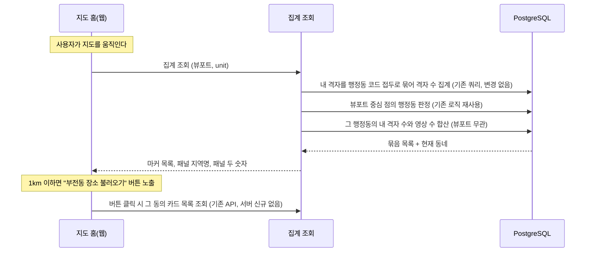
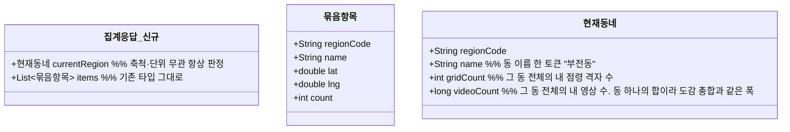

# PRD: 지도 홈 집계 응답에 현재 동네 싣기

> 티켓: MSG-374 · 작성일: 2026-08-11 · 작성: prd-writer
> 상태: 검토됨 (2026-08-12 사용자 승인, 패널 기준을 동 전체로 바꾼 반영본)

## 1. 문제 상황

지도 홈은 내 격자를 보여주는 화면이다(SRS FR-MAP-01). 전역 데이터는 상단 칩을 켰을 때만 나오고, 핫구역 칩이 모든 사용자의 업로드로 뽑은 구역을 보여주는 식이다(FR-MAP-07).

사이드 패널은 네이버 지도처럼 **지도 중심이 속한 동네 하나를 기준으로 선다**(SRS FR-MAP-06). 지역명("부전동")과 "이 지역 격자 5개 · 영상 355개"를 보여주고, 하단에 "부전동 장소 불러오기" 버튼이 붙는다. 지금 이 세 재료를 주는 조회가 없다. 좌표를 동 이름으로 바꾸려면 역지오코딩[^1]을 따로 불러야 하고, 그 동에서 내가 점령한 격자 수와 올린 영상 수는 어느 API도 주지 않는다.

지도를 축소하면 낱개 격자 대신 행정 단위로 묶은 마커가 뜬다. 이 집계는 이미 있다(MSG-356). 패널은 그 위에 겹쳐 있으므로, 마커가 뜨는 시야에서도 같은 세 재료가 계속 필요하다.

## 2. 목적 · 목표

- **목적**: 사이드 패널이 필요로 하는 현재 동네 정보를 기존 집계 조회 하나에 실어 보낸다.
- **목표**:
  - 지도를 움직이면 패널의 지역명과 두 숫자가 중심이 속한 동을 따라 갱신된다. 두 숫자 모두 내 것을 센다.
  - 그 숫자는 화면에 걸친 범위가 아니라 **동 전체**를 센다. 같은 동 안에서 지도를 움직이면 숫자가 흔들리지 않는다.
  - 축척과 집계 단위에 관계없이 같은 재료가 온다. 줌아웃해서 마커 화면이 되어도 패널 기준은 여전히 중심 동 하나다.
- **비목표(스코프 제외)**:
  - 전역 기준 집계는 만들지 않는다. 2026-08-11 오전에 지도 홈을 전역으로 바꾸려던 방향이 같은 날 번복돼(SRS FR-MAP-05 폐기) 필요가 사라졌다.
  - 사이드 패널의 영상 카드 목록은 이 티켓이 다루지 않는다. 아래 미해결 질문 참조.
  - 상단 칩이 켜졌을 때 보이는 전역 데이터(핫구역 등)는 기존 조회가 담당한다.

## 3. 기능 요구사항

| ID | 요구사항 | 우선순위 |
|----|----------|----------|
| FR-1 | 집계 조회 응답에 현재 동네가 함께 실린다. 행정동 코드, 동 이름 한 토큰("부전동"), 그 동에서 내가 점령한 격자 수, 그 동에 내가 올린 영상 수 네 값이다. 화면은 이름을 지역명과 "부전동 장소 불러오기" 버튼 라벨에 그대로 쓰고, 두 숫자를 "이 지역 격자 5개 · 영상 355개"에 쓴다 (SRS FR-MAP-06) | Must |
| FR-2 | 두 숫자는 **그 동 전체**를 센다. 화면 밖에 있는 내 격자도 그 동이면 포함되고, 화면에 걸쳤어도 다른 동이면 빠진다. 같은 동 안에서 지도를 움직이거나 줌을 바꿔도 값이 변하지 않는다 | Must |
| FR-3 | 뷰포트 중심이 어느 행정동에도 속하지 않거나(해상) 서비스 좌표 범위 밖이어도 조회는 실패하지 않는다. 현재 동네만 빈 값이고 묶음 목록은 정상 응답한다. 재사용하는 점 판정은 범위 밖 좌표에 실패 응답을 던지도록 만들어져 있으므로, 이 조회는 그 실패를 밖으로 내보내지 않고 빈 값으로 흡수한다 | Must |
| FR-4 | 현재 동네는 축척과 집계 단위에 관계없이 항상 실린다. 구·시 단위로 묶어 보는 시야에서도 패널은 중심 동 하나를 기준으로 서기 때문이다. "장소 불러오기" 버튼을 1km 이하에서만 띄우는 것은 화면 표시 규칙이라 클라이언트가 판정한다 (SRS FR-MAP-08) | Must |
| FR-5 | 영상 수는 도감이 쓰는 격자별 영상 수를 그대로 합한 값이다. 삭제로만 줄고 신고 블라인드로는 줄지 않으며(SRS FR-MOD-08), 비공개나 인코딩 중인 영상도 포함한다. 같은 격자를 도감 화면에서 보든 이 패널에 반영되든 세는 규칙이 같아야 한다 | Must |
| FR-5a | 영상 수는 격자 하나의 값이 아니라 동 하나를 합한 값이라 큰 수를 담을 수 있는 자리여야 한다. 도감 요약의 영상 총합이 이미 그렇게 다루고 있으므로 같은 폭을 쓴다 | Must |
| FR-6 | 묶음 목록(마커)은 지금 그대로다. 마커는 지역명과 점령 격자 수만 표시하므로 묶음마다 영상 수를 더하지 않는다. 항목의 필드도 값도 바뀌지 않는다 | Must |
| FR-7 | 친구 기준 집계가 내보내는 응답은 필드 하나까지 지금 그대로다. 현재 동네는 지도 홈 화면의 재료라 친구 도감이 요구한 적이 없다 | Must |
| FR-8 | 중심 동에 내 점령 격자가 하나도 없어도 오류가 아니다. 현재 동네는 이름과 함께 두 숫자를 0으로 담는다. 묶음 목록은 이것과 무관하다. 같은 화면의 이웃 동에 내 격자가 있으면 목록은 비어 있지 않다 | Must |

## 4. 비기능 요구사항

| 분류 | 요구사항 |
|------|----------|
| 성능 | 지도 뷰포트 조회 SLO[^2](p95 300ms 미만)를 지킨다. 기존 집계 쿼리는 손대지 않고 조회 하나에 점 판정 하나와 동 단위 카운트 하나가 붙는다. 카운트는 저장된 행정동 코드로 거르는 조회라 이미 있는 인덱스를 탄다. 채택 전에 EXPLAIN으로 확인한다 |
| 보안/인가 | 토큰 필수. 집계는 토큰 주인의 격자만 세며 남의 기준을 요청할 파라미터는 두지 않는다. 친구 기준은 지금처럼 별도 주소가 친구 관계를 검증한다 |
| 데이터 정합 | 영상 삭제와 점령 롤백은 다음 조회부터 반영된다. 같은 격자를 도감 화면에서 봤을 때의 영상 수와 이 패널의 영상 수가 같은 기준이어야 한다 |
| 데이터 정합 | 동 소속 판정은 격자에 저장된 행정동 코드를 쓴다. 도감 수집률(SRS FR-REGION-12)과 같은 축이라 "부전동 격자 5개"가 두 화면에서 같은 값이 된다. 현재 동 판정만 예외로, 임의의 중심점에는 저장된 값이 없어 이미 구현된 점 경계 판정(SRS FR-REGION-02)을 재사용한다. 요청당 점 하나를 판정하는 비용이며, 그 판정의 실패 응답은 FR-3대로 흡수한다 |

## 5. 시퀀스 다이어그램

## 6. 클래스 다이어그램

묶음 항목은 그대로 두고 응답 겉면 하나가 늘어난다.

## 7. 변경 파일 목록

리서치 실측 기반. Owner는 A다(grid, region 모두 A 도메인).

| 파일 | 변경 | Owner |
|------|------|-------|
| `src/main/java/com/msg/fillmap/grid/controller/GridController.java` | 집계 조회 응답을 묶음 목록과 현재 동네를 함께 담는 형태로 바꾼다 | A |
| `src/main/java/com/msg/fillmap/grid/service/GridQueryService.java`, `impl/GridQueryServiceImpl.java` | 집계 결과에 현재 동네를 더해 반환한다 | A |
| `src/main/java/com/msg/fillmap/grid/repository/GridRepository.java` | 한 행정동의 내 격자 수와 영상 수를 세는 조회를 더한다. 기존 집계 쿼리는 건드리지 않는다 | A |
| `src/main/java/com/msg/fillmap/grid/dto/` | 응답 겉면 타입과 현재 동네 타입 신규. 묶음 항목 타입은 그대로 | A |
| `src/main/java/com/msg/fillmap/friend/controller/FriendController.java` | 친구 집계는 응답이 통째로 불변이다(FR-7). 다만 그 조회의 API 설명이 "응답이 내 집계 조회와 완전히 같다"고 적고 있는데 내 집계에 겉면이 생기므로, 묶음 항목은 같고 겉면은 이 조회에 없다는 뜻으로 문장만 정정한다 | B |
| `src/test/java/...` | 위 변경의 테스트 신규 | A |

마이그레이션은 없다.

## 8. 미해결 질문

- [ ] 성능 실측이 SLO를 못 지키는 경우의 대응. 스펙에서 EXPLAIN 근거로 판정한다.

영상 수의 기준은 2026-08-11에, 세는 범위는 2026-08-12에 확정했다. 격자 수와 마찬가지로 내 것을 세고 범위는 동 전체다. 디자인 시안의 숫자(격자 5개에 영상 355개, 카드 한 장이 138개 영상)는 예시 값이라 실제 비율의 근거로 읽지 않는다. 클러스터 프레임 3종에 그려진 헤더 숫자(131·348·438)는 화면 범위를 세던 시안 시점의 값이라 이 결정 이후로는 근거가 아니다.

### 이 티켓 밖에서 확인할 것

사이드 패널의 카드 3장은 지금 `GET /api/regions/{regionCode}/grids`(MSG-238)가 채운다. 그 조회는 전역 공개 콘텐츠를 반환하므로, 패널 안에서 지역명과 두 숫자는 내 것을 세고 카드는 전역을 보여주는 상태가 된다. 카드도 내 것으로 맞출지는 별도 티켓에서 정한다. 이 티켓은 지역명과 두 숫자만 다룬다.

## 9. 이력

2026-08-12에 패널 숫자의 기준을 화면 범위에서 **동 전체**로 바꿨다. 네이버 지도가 좌측 패널을 중심 동 하나로 세우는 방식을 따르기로 한 결정이다. 이 하나로 티켓 모양이 꽤 바뀌었다. 묶음마다 영상 수를 붙이려던 계획은 쓸 곳이 없어져 빠졌고(마커는 격자 수만 표시한다), 기존 집계 쿼리는 손대지 않게 됐고, 친구 집계는 응답 타입을 나눌 필요 없이 통째로 불변이 됐다. 대신 한 행정동의 내 격자 수와 영상 수를 세는 조회가 새로 필요하다.

같은 날 1km 상한도 서버에서 뺐다. 처음에는 이 값의 유일한 소비처가 "장소 불러오기" 버튼이라고 보고 버튼이 뜨지 않는 축척에서는 판정을 건너뛰려 했는데, 패널 지역명과 두 숫자가 같은 값을 쓰게 되면서 모든 축척에서 필요해졌다. 1km는 버튼 노출을 가르는 화면 규칙으로 남았다(SRS FR-MAP-08).

이름은 동 이름 한 토큰("부전동")이다. 피그마 지도 홈 default(노드 14357:18822)의 버튼 라벨 형식이고, 패널 지역명도 같은 값을 쓴다.

2026-08-11 오전에는 지도 홈을 전역 기준으로 바꾸는 전제로 이 문서를 썼고, 전역 집계 조회 신설이 범위였다. 같은 날 그 방향이 번복돼(SRS FR-MAP-05 폐기, FR-MAP-01 복원) 지도 홈은 원래대로 내 격자 기준이 됐다. 남은 요구는 기존 집계에 영상 수와 현재 행정동을 더하는 것뿐이라 문서를 다시 썼다. 지라 티켓 본문도 전역 집계 신설로 적혀 있어 함께 고쳐야 한다.

---

[^1]: 뷰포트: 지도 화면에 지금 보이는 사각형 범위. 최소와 최대 위도, 경도 네 값으로 서버에 전달한다.
[^2]: SLO: 서비스가 지키기로 정한 응답 성능 목표. 지도 뷰포트 조회는 p95 300ms 미만으로 확정돼 있다.
[^3]: 행정동 코드 접두: 행정동 코드 10자리의 앞부분. 앞 5자리가 시군구, 앞 2자리가 시도라서 코드를 자르는 산술만으로 상위 단위 묶음이 된다.
