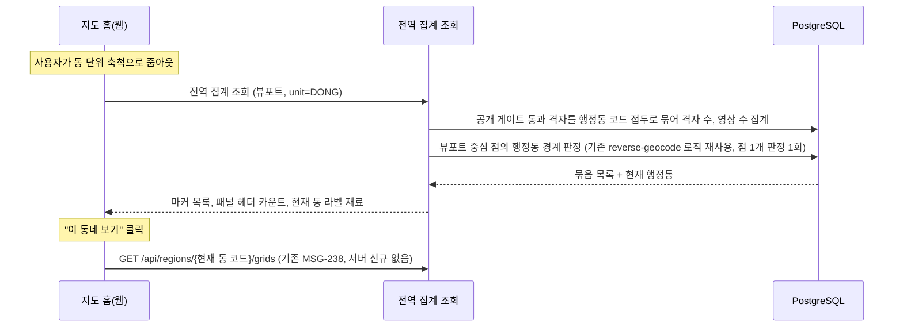
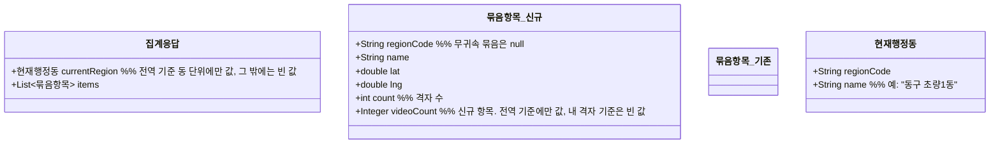

# PRD: 지도 홈 줌아웃 마커와 사이드 패널 카운트의 전역 기준 제공

> 티켓: MSG-374 · 작성일: 2026-08-11 · 작성: prd-writer
> 상태: 초안

## 1. 문제 상황

지도 홈의 표시 기준이 전역으로 확정됐다(2026-08-11 정민 확정, SRS FR-MAP-05). 지도 홈에서는 누가 올렸는지와 무관하게 공개 노출 가능한 영상이 있는 격자를 보여주고, 내 도감 기준 표시는 도감 화면으로 옮긴다.

그런데 서버의 줌아웃 클러스터링[^1] 집계(MSG-356)는 내 도감 축과 친구 도감 축 두 개뿐이라, 지도 홈이 쓸 전역 축 집계가 없다. 사이드 패널 헤더의 "이 지역 격자 131개 · 영상 892개" 카운트(웹 디자인 ver 11, 캡처 `blog-images/msg356-cluster-dong.png`)도 지금은 행정동 단위 조회(MSG-238)만 있어서 구나 시 규모 시야에서는 만들 수 없다.

여기에 더해 네이버 지도 UX를 참조한 결정(2026-08-11, SRS FR-MAP-06)으로, 동 단위 시야에서는 뷰포트[^2] 중심이 속한 현재 행정동 이름을 화면 상단 라벨과 "이 동네 보기" 진입 버튼에 써야 한다. 이 재료를 조회마다 별도 호출 없이 받을 방법이 없다.

## 2. 목적 · 목표

- **목적**: 지도 홈이 전역 기준으로 동작하는 데 필요한 서버 재료를 조회 하나로 제공한다.
- **목표**:
  - 사용자가 지도를 축소하면 동, 구, 시 단위의 이름 마커(지역 이름과 격자 수)가 전역 기준으로 보인다.
  - 사이드 패널 헤더가 같은 응답으로 "이 지역 격자 N개, 영상 M개"를 표시한다. 이 숫자는 화면에 보이는 묶음들의 합이다(디자인 실측: 동 시야 헤더 131은 마커 42, 19, 31, 27, 12의 합이고 구 시야 348, 시 시야 438도 각 시야 마커 합과 일치한다). 합산은 클라이언트 산술이라 서버는 묶음별 값만 주고 총합 항목을 따로 두지 않는다.
  - 동 단위 시야에서 지도를 움직이면 현재 행정동 라벨과 "이 동네 보기" 버튼이 따라 바뀐다.
- **비목표(스코프 제외)**:
  - 개별 격자(최대 줌) 색칠의 전역 전환은 MSG-189 담당이다. 이 티켓은 상위 단위 집계만 다룬다.
  - 동 단위 패널의 영상 카드 목록과 동 헤더는 기존 MSG-238 조회가 담당한다. "이 동네 보기" 클릭 시 패널 갱신도 기존 `GET /api/regions/{regionCode}/grids`를 현재 동 코드로 부르면 끝이라 서버 신규가 없다. 그 조회는 행정동 전체를 세므로 화면 범위를 세는 이 집계와 숫자가 다를 수 있고, 그건 의도한 차이다(FR-13).
  - 개인 수집률의 시/도 상위 집계(SRS FR-REGION-13, MVP 범위 밖)는 이 티켓과 무관하며 그대로 범위 밖이다. 이 티켓의 집계는 수집률이 아니라 전역 격자 수와 영상 수다.

## 3. 기능 요구사항

| ID | 요구사항 | 우선순위 |
|----|----------|----------|
| FR-1 | 사용자는 뷰포트와 행정 단위(동, 구, 시)를 주고 전역 기준 묶음 집계를 조회할 수 있다. 묶음마다 지역 코드, 표시 이름, 마커 대표 좌표, 격자 수, 영상 수가 실린다 (SRS FR-MAP-05) | Must |
| FR-1a | 집계 조회의 기본 기준은 전역이다. 기준을 고르는 파라미터를 주지 않으면 전역으로 응답한다. 도감 화면이 쓰는 내 격자 기준은 그 파라미터로 따로 요청한다 (2026-08-11 확정, 아래 "축과 주소" 참조) | Must |
| FR-2 | 격자는 공개 게이트[^3] 통과 영상이 1건 이상인 것만 센다. 비공개 영상만 있는 격자는 어느 단위에서도 잡히지 않는다 | Must |
| FR-3 | 영상 수도 공개 게이트 통과 영상만 센다. 같은 뷰포트라면 어느 단위로 묶어도 격자 수 합과 영상 수 합이 각각 같다 | Must |
| FR-4 | 행정동이 판정되지 않은 격자(바다 등)는 버리지 않고 코드와 이름이 빈 무귀속 묶음 한 항목으로 포함한다. MSG-356의 무귀속 버킷 규칙과 같다 | Must |
| FR-5 | 동 단위 조회 응답에는 뷰포트 중심이 속한 현재 행정동의 코드와 이름이 함께 실린다. 이름은 서버가 구 이름과 동 이름을 붙인 한 줄("동구 초량1동")로 조립해 주고 FE는 표시만 한다(2026-08-11 확정, MSG-341의 서버 계산 선례와 일관). 구와 시 단위 응답에는 싣지 않는다 (SRS FR-MAP-06) | Must |
| FR-6 | 뷰포트 중심이 어느 행정동에도 속하지 않는 경우(해상)는 물론, 서비스 좌표 범위(한국) 밖인 경우에도 조회는 실패하지 않는다. 현재 행정동만 빈 값이고 묶음 목록은 정상 응답한다. 기존 reverse-geocode 단독 API가 범위 밖 좌표에 내는 400(6400)을 이 조회가 그대로 전파하면 안 된다 | Must |
| FR-7 | 집계 결과가 없는 뷰포트는 오류가 아니라 빈 목록이다 | Must |
| FR-8 | 단위 값 검증, 뷰포트 좌표 검증, 단위별 뷰포트 폭 상한은 기존 개인 축 집계(MSG-356)와 같은 규칙과 같은 실패 응답을 따른다 | Must |
| FR-9 | 한 주소가 기준에 따라 다른 모양을 내지 않는다. `/api/grids/aggregation`의 응답은 전역이든 내 격자든 묶음 목록과 현재 행정동을 함께 담는 한 형태이고, 값이 없는 경우(내 격자 기준, 구·시 단위)에는 현재 행정동만 빈 값이다 | Must |
| FR-10 | 영상 수는 전역 기준에서만 값을 갖는다. 같은 주소의 내 격자 기준에서는 빈 값이고, 친구 기준 응답에는 이 항목 자체가 없다. 사이드 패널의 영상 수는 지도 홈(전역)의 요구이고 도감 화면과 친구 도감은 요구한 적이 없어, 없는 요구를 위해 세는 대상을 새로 정의하지 않는다 | Must |
| FR-11 | 현재 행정동도 전역 기준 동 단위에서만 값을 갖는다. 도감 화면은 지역 헤더가 없는 화면이라(디자인 실측) 내 격자 기준 요청에는 담지 않는다 | Must |
| FR-12 | 묶음의 격자 수와 영상 수는 뷰포트 안에 들어온 격자만 센다. 행정동이 화면 경계에 걸치면 그 동의 화면 밖 격자는 빠지고, 지도를 움직이면 같은 동의 숫자도 달라진다. 기존 집계(MSG-356)가 이미 이렇게 동작하며 그 동작을 유지한다 | Must |
| FR-13 | 기존 탐색 조회(`GET /api/regions/{regionCode}/grids`, MSG-238)의 헤더 카운트는 행정동 전체를 세므로 같은 동이라도 이 집계의 숫자와 다를 수 있다. 두 값을 일치시키지 않는다. 세는 범위가 다르기 때문이고, 화면도 이 집계를 "이 지역"(보이는 범위)으로, 탐색 조회를 그 동네 전체로 부른다 | Must |

### 축과 주소 (2026-08-11 확정)

집계는 세는 대상이 셋이다. 내 격자, 친구 격자, 전역이다. 묶는 방식은 셋 다 같고 대상만 다르다.

지도 홈이 전역으로 확정되면서 기존 `GET /api/grids/aggregation`(MSG-356)의 수요처가 전역으로 옮겨갔고, 프론트가 이미 그 주소를 지도 홈에 연결해 두었다. 그래서 그 주소를 전역 기준으로 바꾸고, 도감 화면이 쓰는 내 격자 기준은 같은 주소의 파라미터로 요청한다. 파라미터를 안 주면 전역이라 프론트의 현재 호출은 주소도 파라미터도 그대로 둔 채 원하는 결과를 받는다.

친구 기준 주소(`GET /api/friends/{userId}/grids/aggregation`)는 응답이 필드 하나까지 지금 그대로다. 그러려면 응답 타입을 나눠야 한다. 친구 조회는 지금 쓰는 묶음 항목 타입을 계속 쓰고, 영상 수가 붙는 새 항목 타입은 `/api/grids/aggregation` 쪽에만 둔다. 한 타입에 영상 수를 더하면 그 타입을 재사용 중인 친구 응답의 스키마까지 바뀌어, 이 티켓과 무관한 화면의 계약을 건드리게 된다.

친구 쪽에서 바뀌는 것은 문장 하나뿐이다. 그 조회의 API 설명이 "응답이 내 집계 조회와 완전히 같다"고 적고 있는데 내 집계 응답이 바뀌므로 사실과 어긋난다. 묶음 항목의 공통 부분이 같다는 뜻으로 정정한다. 동작과 응답 스키마는 그대로다.

이 전환으로 도감 화면의 기존 호출은 전역 결과를 받게 되므로, 기준 파라미터를 붙이도록 프론트에 함께 알린다. 응답도 FR-9의 단일 형태로 바뀌어 목록을 꺼내는 자리가 한 단계 깊어진다.

## 4. 비기능 요구사항

| 분류 | 요구사항 |
|------|----------|
| 성능 | 지도 뷰포트 조회 SLO[^4](p95 300ms 미만)를 지킨다. 개인 축은 스캔 행이 그 사용자의 점령 격자 수로 유계였지만 전역 축은 전역 등록 격자 전수가 상한이라 조건이 다르다. 채택 전에 EXPLAIN 실측으로 확인하고, 실측이 SLO를 못 지키면 사전집계를 검토한다 |
| 보안/인가 | 토큰 필수(기존 지도 조회와 동일). 전역 기준 결과는 누가 조회해도 같다. 내 격자 기준은 지금처럼 토큰 주인의 격자만 세며, 남의 기준을 요청할 수 있는 파라미터는 두지 않는다(친구 기준은 별도 주소가 친구 관계를 검증한다) |
| 데이터 정합 | 영상 삭제, 비공개 전환, 점령 롤백은 다음 조회부터 집계에 반영된다. 사전집계를 도입하는 경우에도 반영 지연은 30초를 넘지 않아야 한다(뷰포트 신선도 기준과 일치) |
| 데이터 정합 | 묶음 집계 자체는 공간 연산 없이 저장된 행정동 코드의 접두[^5] 산술만 쓴다(SRS FR-REGION-12의 격자 라벨 원칙 유지). 현재 행정동 판정은 예외다. 임의의 뷰포트 중심점에는 미리 저장된 행정동 값이 없어서, 이미 구현돼 있는 점 경계 판정(reverse-geocode, SRS FR-REGION-02)을 재사용한다. 이는 동 단위 요청당 점 1개의 GIST 인덱스 판정 1회이며, 같은 성격의 공간 연산이 이미 단독 API로 서비스 중이다 |

## 5. 시퀀스 다이어그램

## 6. 클래스 다이어그램

타입 이름과 필드 배치는 스펙에서 확정한다. 요구 수준의 응답 형태만 그린다.

## 7. 변경 파일 목록

리서치 실측 기반. 구현은 Owner A(grid, region)가 주도하고 계약 인터페이스 신설 없이 닫힌다. friend 패키지는 Owner B 소관이라 별도 표기했는데, 그 몫은 API 설명 문장 한 줄 정정이고 동작 변경이 아니다.

전역 집계 쿼리가 Owner B 소관인 videos 테이블을 읽는 것은 경계 위반이 아니다. "접점은 인터페이스로만" 원칙은 클래스 수준 결합을 막는 규칙이고(project-conventions의 MSG-334 절), native SQL의 테이블 수준 참조는 MSG-356 쿼리가 user_grids(Owner B)를 조인하는 선례로 이미 허용돼 있다. 공개 게이트 조건은 MSG-238의 단일 정의와 글자 단위로 일치시킨다(프로젝트 원칙).

| 파일 | 변경 | Owner |
|------|------|-------|
| `src/main/java/com/msg/fillmap/grid/controller/GridController.java` | 기존 `GET /api/grids/aggregation`에 기준 파라미터를 더해 전역을 기본값으로 삼는다. 응답은 FR-9의 단일 형태로 바뀐다(파라미터 이름과 값 표기는 스펙 확정) | A |
| `src/main/java/com/msg/fillmap/grid/service/GridQueryService.java`, `impl/GridQueryServiceImpl.java` | 전역 기준 집계 메서드 추가. 기존 내 격자 기준 메서드는 그대로 두고 컨트롤러가 기준에 따라 고른다 | A |
| `src/main/java/com/msg/fillmap/grid/repository/GridRepository.java` | 전역 기준 native 집계 쿼리 신설. MSG-356 쿼리의 대상 교체 변형으로, 점령 조인 대신 공개 게이트 영상 존재 조건과 영상 수 합산을 쓴다 | A |
| `src/main/java/com/msg/fillmap/grid/dto/` (RegionAggregate 계열) | 묶음 목록과 현재 행정동을 함께 담는 응답 타입 신규, 영상 수를 가진 묶음 항목 타입 신규. 기존 `RegionAggregateResponseDto`는 친구 조회가 계속 쓰므로 필드를 건드리지 않는다 | A |
| `src/main/java/com/msg/fillmap/friend/controller/FriendController.java` | 친구 집계 조회의 API 설명에서 "응답이 내 집계 조회와 완전히 같다"는 문장을 묶음 항목 구조가 같다는 뜻으로 정정한다. 코드 동작 변경 없음 | B |
| `src/main/java/com/msg/fillmap/region/` | 현재 행정동 판정은 기존 `RegionQueryService.resolveByPoint`(reverse-geocode 경로)를 재사용한다. 판정 로직 신규 없음, 호출 접점과 "동구 초량1동" 한 줄 조립만 생긴다 | A |
| `src/test/java/...` | 위 변경의 테스트 신규 | A |

마이그레이션은 없다. 사전집계로 가는 판정이 나올 때만 생기며 그 여부는 스펙의 EXPLAIN 실측이 정한다.

## 8. 미해결 질문

- [ ] 성능 실측이 SLO를 못 지키는 경우의 사전집계 방식. 스펙에서 EXPLAIN 근거로 판정한다(MSG-89, MSG-134 자산 참조).
- [ ] 구와 시 시야에서 사이드 패널의 영상 카드 3장을 무엇으로 채우는지. 디자인에는 세 시야 모두 카드가 있는데, 카드를 주는 기존 조회(MSG-238)는 행정동 하나를 받는 구조라 구나 시 시야에서는 부를 대상이 없다. 헤더 카운트는 이번 집계의 합으로 해결되지만 카드는 아니다. 이 티켓 범위로 볼지, 별도 티켓으로 낼지 확인이 필요하다.

2026-08-11에 확정해 본문에 반영한 것: 주소는 기존 `GET /api/grids/aggregation`을 쓰고 기준 파라미터를 더하며 기본값이 전역이라는 것(§3 "축과 주소"), 응답은 기준과 단위에 상관없이 한 형태라는 것(FR-9), 현재 행정동 이름은 서버가 한 줄로 조립한다는 것(FR-5).

프론트에 알릴 것 두 가지가 따라온다. 지도 홈은 지금 호출 그대로 전역 결과를 받지만 목록을 꺼내는 자리가 한 단계 깊어지고, 도감 화면은 기준 파라미터를 붙여야 내 격자 결과를 계속 받는다.

---

[^1]: 클러스터링: 지도를 축소했을 때 낱개 격자 대신 행정 단위로 묶어 센 이름 마커("부전2동 31")를 보여주는 방식. H3 육각형 기각과 행정 단위 채택 경위는 위키 ADR "줌아웃 클러스터링 행정 단위 집계 H3 기각" 참조.
[^2]: 뷰포트: 지도 화면에 지금 보이는 사각형 범위. 최소와 최대 위도, 경도 네 값으로 서버에 전달한다.
[^3]: 공개 게이트: 영상이 전역 노출 경로에 잡히는 세 조건(삭제 안 됨 ACTIVE, 전체 공개 PUBLIC, 재생 준비 완료 READY)을 함께 부르는 말. MSG-238에서 단일 정의로 확정됐다.
[^4]: SLO: 서비스가 지키기로 정한 응답 성능 목표. 지도 뷰포트 조회는 p95 300ms 미만, 신선도 30초 이내로 확정돼 있다(위키 ADR "viewport polling SLO").
[^5]: 행정동 코드 접두: 행정동 코드 10자리의 앞부분. 앞 5자리가 시군구, 앞 2자리가 시도라서 코드를 자르는 산술만으로 상위 단위 묶음이 된다.
