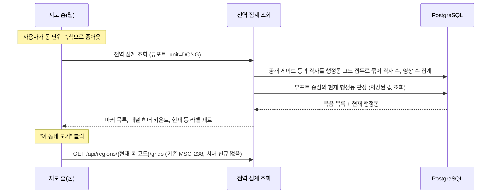
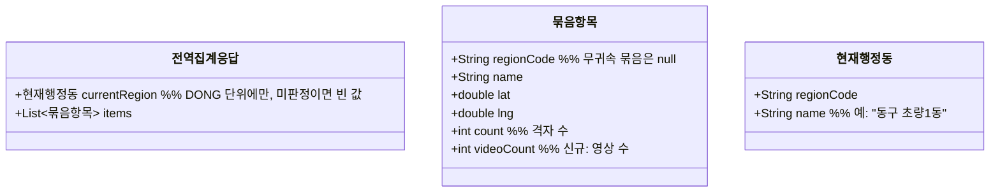

# PRD: 지도 홈 줌아웃 마커와 사이드 패널 카운트의 전역 기준 제공

> 티켓: MSG-374 · 작성일: 2026-08-11 · 작성: prd-writer
> 상태: 초안

## 1. 문제 상황

지도 홈의 표시 기준이 전역으로 확정됐다(2026-08-11 정민 확정, SRS FR-MAP-05). 지도 홈에서는 누가 올렸는지와 무관하게 공개 노출 가능한 영상이 있는 격자를 보여주고, 내 도감 기준 표시는 도감 화면으로 옮긴다.

그런데 서버의 줌아웃 클러스터링[^1] 집계(MSG-356)는 내 도감 축과 친구 도감 축 두 개뿐이라, 지도 홈이 쓸 전역 축 집계가 없다. 사이드 패널 헤더의 "이 지역 격자 131개 · 영상 892개" 카운트(웹 디자인 ver 11, 캡처 `blog-images/msg356-cluster-dong.png`)도 지금은 행정동 단위 조회(MSG-238)만 있어서 구나 시 규모 시야에서는 만들 수 없다.

여기에 더해 네이버 지도 UX를 참조한 결정(2026-08-11, SRS FR-MAP-06)으로, 동 단위 시야에서는 뷰포트[^2] 중심이 속한 현재 행정동 이름을 화면 상단 라벨과 "이 동네 보기" 진입 버튼에 써야 한다. 이 재료를 조회마다 별도 호출 없이 받을 방법이 없다.

## 2. 목적 · 목표

- **목적**: 지도 홈이 전역 기준으로 동작하는 데 필요한 서버 재료를 조회 하나로 제공한다.
- **목표**:
  - 사용자가 지도를 축소하면 동, 구, 시 단위의 이름 마커(지역 이름과 격자 수)가 전역 기준으로 보인다.
  - 사이드 패널 헤더가 같은 응답으로 "이 지역 격자 N개, 영상 M개"를 표시한다.
  - 동 단위 시야에서 지도를 움직이면 현재 행정동 라벨과 "이 동네 보기" 버튼이 따라 바뀐다.
- **비목표(스코프 제외)**:
  - 개별 격자(최대 줌) 색칠의 전역 전환은 MSG-189 담당이다. 이 티켓은 상위 단위 집계만 다룬다.
  - 동 단위 패널의 영상 카드 목록과 동 헤더는 기존 MSG-238 조회가 담당한다. "이 동네 보기" 클릭 시 패널 갱신도 기존 `GET /api/regions/{regionCode}/grids`를 현재 동 코드로 부르면 끝이라 서버 신규가 없다.
  - 개인 수집률의 시/도 상위 집계(SRS FR-REGION-13, MVP 범위 밖)는 이 티켓과 무관하며 그대로 범위 밖이다. 이 티켓의 집계는 수집률이 아니라 전역 격자 수와 영상 수다.

## 3. 기능 요구사항

| ID | 요구사항 | 우선순위 |
|----|----------|----------|
| FR-1 | 사용자는 뷰포트와 행정 단위(동, 구, 시)를 주고 전역 기준 묶음 집계를 조회할 수 있다. 묶음마다 지역 코드, 표시 이름, 마커 대표 좌표, 격자 수, 영상 수가 실린다 (SRS FR-MAP-05) | Must |
| FR-2 | 격자는 공개 게이트[^3] 통과 영상이 1건 이상인 것만 센다. 비공개 영상만 있는 격자는 어느 단위에서도 잡히지 않는다 | Must |
| FR-3 | 영상 수도 공개 게이트 통과 영상만 센다. 같은 뷰포트라면 어느 단위로 묶어도 격자 수 합과 영상 수 합이 각각 같다 | Must |
| FR-4 | 행정동이 판정되지 않은 격자(바다 등)는 버리지 않고 코드와 이름이 빈 무귀속 묶음 한 항목으로 포함한다. MSG-356의 무귀속 버킷 규칙과 같다 | Must |
| FR-5 | 동 단위 조회 응답에는 뷰포트 중심이 속한 현재 행정동의 코드와 이름이 함께 실린다(이름 예: "동구 초량1동"). 구와 시 단위 응답에는 싣지 않는다 (SRS FR-MAP-06) | Must |
| FR-6 | 뷰포트 중심이 어느 행정동에도 속하지 않으면 현재 행정동은 빈 값이고 묶음 목록은 정상 응답한다 | Must |
| FR-7 | 집계 결과가 없는 뷰포트는 오류가 아니라 빈 목록이다 | Must |
| FR-8 | 단위 값 검증, 뷰포트 좌표 검증, 단위별 뷰포트 폭 상한은 기존 개인 축 집계(MSG-356)와 같은 규칙과 같은 실패 응답을 따른다 | Must |

## 4. 비기능 요구사항

| 분류 | 요구사항 |
|------|----------|
| 성능 | 지도 뷰포트 조회 SLO[^4](p95 300ms 미만)를 지킨다. 개인 축은 스캔 행이 그 사용자의 점령 격자 수로 유계였지만 전역 축은 전역 등록 격자 전수가 상한이라 조건이 다르다. 채택 전에 EXPLAIN 실측으로 확인하고, 실측이 SLO를 못 지키면 사전집계를 검토한다 |
| 보안/인가 | 토큰 필수(기존 지도 조회와 동일). 요청에 사용자별 파라미터는 없고 누가 조회해도 같은 결과다 |
| 데이터 정합 | 영상 삭제, 비공개 전환, 점령 롤백은 다음 조회부터 집계에 반영된다. 사전집계를 도입하는 경우에도 반영 지연은 30초를 넘지 않아야 한다(뷰포트 신선도 기준과 일치) |
| 데이터 정합 | 실시간 조회 경로에서 공간 연산을 하지 않는다는 기존 원칙(SRS FR-REGION-12)을 지킨다. 묶음 판정은 저장된 행정동 코드의 접두[^5] 산술만 쓴다 |

## 5. 시퀀스 다이어그램

## 6. 클래스 다이어그램

타입 이름과 필드 배치는 스펙에서 확정한다. 요구 수준의 응답 형태만 그린다.

## 7. 변경 파일 목록

리서치 실측 기반. Owner는 전부 A다(grid, region 모두 Owner A 도메인이라 계약 인터페이스 신설 없이 닫힌다).

| 파일 | 변경 | Owner |
|------|------|-------|
| `src/main/java/com/msg/fillmap/grid/controller/GridController.java` | 전역 축 집계 엔드포인트 추가(형태는 미해결 질문 1) | A |
| `src/main/java/com/msg/fillmap/grid/service/GridQueryService.java`, `impl/GridQueryServiceImpl.java` | 전역 축 집계 메서드 추가 | A |
| `src/main/java/com/msg/fillmap/grid/repository/GridRepository.java` | 전역 축 native 집계 쿼리 신설. MSG-356 쿼리의 축 교체 변형으로, 점령 조인 대신 공개 게이트 영상 존재 조건과 영상 수 합산을 쓴다 | A |
| `src/main/java/com/msg/fillmap/grid/dto/` (RegionAggregate 계열) | 영상 수 필드와 현재 행정동을 담는 응답 타입 확장 또는 신규 | A |
| `src/main/java/com/msg/fillmap/region/` | 현재 행정동 판정은 기존 reverse-geocode 경로(`RegionController` 하위 서비스)를 재사용한다. 신규 로직 없이 호출 접점만 생긴다 | A |
| `src/test/java/...` | 위 변경의 테스트 신규 | A |

마이그레이션은 없다. 사전집계로 가는 판정이 나올 때만 생기며 그 여부는 스펙의 EXPLAIN 실측이 정한다.

## 8. 미해결 질문

- [ ] 엔드포인트 형태: 기존 `GET /api/grids/aggregation`에 축 파라미터를 넓힐지, 전역 전용 경로를 새로 둘지. FE가 부를 주소라 스펙 확정 후 FE 통보가 필요하다.
- [ ] 현재 행정동 이름을 서버가 "동구 초량1동"으로 조립해 줄지, 구 이름과 동 이름을 나눠 줄지. 디자인 표기는 "동구 초량1동" 한 줄이다.
- [ ] 성능 실측이 SLO를 못 지키는 경우의 사전집계 방식. 스펙에서 EXPLAIN 근거로 판정한다(MSG-89, MSG-134 자산 참조).

---

[^1]: 클러스터링: 지도를 축소했을 때 낱개 격자 대신 행정 단위로 묶어 센 이름 마커("부전2동 31")를 보여주는 방식. H3 육각형 기각과 행정 단위 채택 경위는 위키 ADR "줌아웃 클러스터링 행정 단위 집계 H3 기각" 참조.
[^2]: 뷰포트: 지도 화면에 지금 보이는 사각형 범위. 최소와 최대 위도, 경도 네 값으로 서버에 전달한다.
[^3]: 공개 게이트: 영상이 전역 노출 경로에 잡히는 세 조건(삭제 안 됨 ACTIVE, 전체 공개 PUBLIC, 재생 준비 완료 READY)을 함께 부르는 말. MSG-238에서 단일 정의로 확정됐다.
[^4]: SLO: 서비스가 지키기로 정한 응답 성능 목표. 지도 뷰포트 조회는 p95 300ms 미만, 신선도 30초 이내로 확정돼 있다(위키 ADR "viewport polling SLO").
[^5]: 행정동 코드 접두: 행정동 코드 10자리의 앞부분. 앞 5자리가 시군구, 앞 2자리가 시도라서 코드를 자르는 산술만으로 상위 단위 묶음이 된다.
