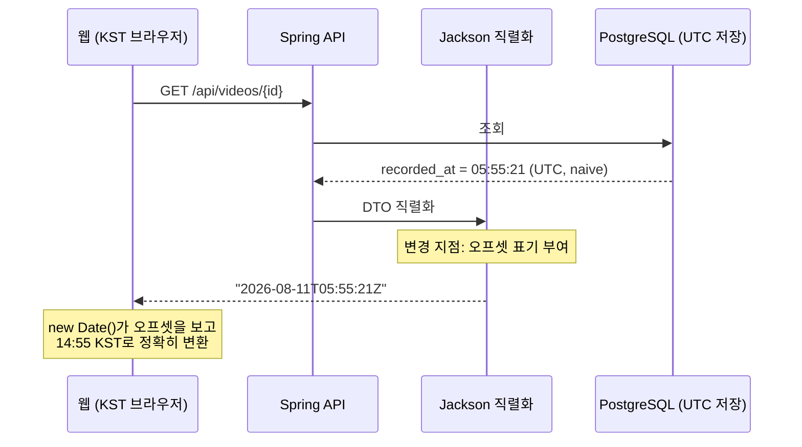

# PRD: API 시각 응답의 시간대 표기

> 티켓: MSG-376 · 작성일: 2026-08-11 · 작성: prd-writer
> 상태: 검토됨 (2026-08-11 승인)

## 1. 문제 상황

FE 연동 실측(2026-08-11)에서 모든 화면의 시각이 9시간 밀려 보였다. 서버가 시각을
`"2026-08-11T05:55:21"`처럼 시간대 표기 없는 문자열로 내려주기 때문이다. DB는 시각을
UTC로 저장하는데(스키마 공통 기준: TIMESTAMP는 UTC 저장, 표시만 KST) 직렬화[^1] 단계에서
그 사실이 사라져, 웹의 `new Date()`는 문자열을 브라우저 로컬 시간으로 해석한다. 한국
브라우저에서는 UTC 값이 KST로 읽혀 정확히 9시간 어긋난다.

FE의 요구는 하나다. 날짜 문자열 끝에 시간대 표기(오프셋[^2])만 붙여 달라. `Z`(UTC)든
`+09:00`(KST)든 표기만 있으면 브라우저가 알아서 정확히 변환하므로 FE 수정은 없다.

## 2. 목적 · 목표

- **목적**: 시각의 해석이 받는 쪽 환경에 좌우되지 않도록, 시각 계약에 시간대 정보를 명시한다.
- **목표**:
  - 시각을 담는 모든 API 응답 필드가 시간대 표기를 포함한다 (예: `"2026-08-11T05:55:21Z"`
    또는 `"2026-08-11T14:55:21+09:00"`).
  - FE는 코드 수정 없이 모든 화면에서 정확한 시각을 표시한다.
- **비목표(스코프 제외)**:
  - DB 저장 방식 변경. UTC 저장은 그대로 둔다.
  - 사용자별 타임존 설정. MVP는 한국 대상이라 사용자 타임존 개념이 없다 (glossary 스트릭 항목).
  - 화면 표시 포맷("3시간 전", "8월 11일" 등). FE 몫이다.

## 3. 기능 요구사항

> SRS 참조: **NFR-DATA-06** (API가 주고받는 모든 시각은 시간대 표기를 포함한 ISO 8601
> 문자열이다). 아래 FR은 그 전역 요구를 이 티켓 범위로 상세화한 것이다.

| ID | 요구사항 | 우선순위 |
|----|----------|----------|
| FR-1 | 시각을 담는 모든 응답 필드(`recordedAt`, `createdAt`, `earnedAt`, `updatedAt` 등)는 시간대 표기를 포함한 ISO 8601[^3] 문자열이다. 특정 API가 아니라 전 API 공통이다 | Must |
| FR-2 | 표기 방식은 전 API에서 하나로 통일한다. 어떤 응답은 `Z`, 어떤 응답은 `+09:00`인 혼용이 없다 | Must |
| FR-3 | 표기가 붙어도 그 문자열이 가리키는 절대 시각은 기존 값과 같다. 표기를 붙이면서 값까지 이동시키는 이중 변환이 없어야 한다 | Must |
| FR-4 | 요청으로 받는 시각(`recordedAt` 등)은 시간대 표기가 포함된 입력을 절대 시각으로 정확히 해석한다. 웹은 이미 `Z`를 붙여 보내고 있으므로(실측 `"2026-08-11T06:09:27.724Z"`) 이 동작을 우연이 아니라 계약으로 굳힌다 | Must |
| FR-5 | 표기 없는 요청 입력도 받으면 UTC로 해석한다. 현재 그런 클라이언트는 없지만(웹은 `Z` 포함 송신, 모바일 앱은 미출시) 방어 규칙으로 해석을 정의해 둔다. 거부나 유예 장치는 두지 않는다 | Should |
| FR-6 | 미래 `recordedAt` 거부(3424) 등 기존 시각 검증 동작은 그대로 유지된다 | Must |
| FR-7 | 값이 없는 시각 필드(미확인 뱃지의 `notifiedAt` 등)는 기존처럼 null이다 | Must |

## 4. 비기능 요구사항

| 분류 | 요구사항 |
|------|----------|
| 데이터 정합 | DB 저장은 UTC naive[^4] 그대로다. 스트릭 KST 자정 판정 등 서버 내부의 시각 판정 로직은 이 변경의 영향을 받지 않는다 |
| 운영 | DB 마이그레이션 없음. 응답에 표기가 추가돼도 FE의 기존 파서(`new Date()`)가 그대로 동작하므로 BE 단독 배포가 가능하다 |
| 문서 | Swagger의 시각 필드 예시가 실제 표기와 일치해야 한다 |

## 5. 시퀀스 다이어그램

## 6. 클래스 다이어그램

신규 도메인 타입 없음. 변경은 직렬화 설정 층 한 곳이다 (구현 방식은 스펙에서 결정).

## 7. 변경 파일 목록

| 파일 | 변경 | Owner |
|------|------|-------|
| `src/main/java/com/msg/fillmap/global/config/` (신규 Jackson 설정) 또는 `application.yml` | 시각 직렬화 공통 설정 신규. 방식 (a) DTO 타입 전환이면 위치가 달라진다 | 공통 |
| 응답 DTO 17종 (`*ResponseDto.java`의 `LocalDateTime` 필드) | 방식 (a) 선택 시 타입 전환, 방식 (b) 선택 시 무수정 | A/B 걸침 |
| `VideoUploadRequestDto` · `VideoReplaceRequestDto` | 요청 `recordedAt` 수신 형식·해석 규칙 반영 | B |
| 직렬화 계약 테스트 (신규) | 응답 시각 필드에 표기 포함을 고정하는 테스트 | 공통 |

구현 후보 (스펙에서 결정): (a) DTO 시각 타입을 `Instant`/`OffsetDateTime`으로 전환,
(b) `LocalDateTime` 유지 + 전역 Jackson 설정으로 표기 부여. 개별 필드 어노테이션 산발
적용은 지양한다. 고치는 곳이 한 곳이어야 새 DTO가 추가돼도 자동으로 계약을 지킨다.

## 8. 확정된 결정 (2026-08-11, FE 합의)

- **표기는 UTC `Z`로 낸다.** FE는 어느 쪽이든 무관하다고 확인했고, 저장이 UTC라 변환
  없이 표기만 붙이는 `Z`가 가장 단순하다. 결정적으로 웹이 보내는 쪽은 이미 `Z`다.
  `recordedAt`을 `new Date().toISOString()`으로 만들어 보내고 있어서(실측
  `"2026-08-11T06:09:27.724Z"`) 응답도 `Z`로 통일하면 왕복이 대칭이 된다. 위키 스키마
  기준 "표시만 KST"는 화면 표시 원칙이고 표시 변환은 FE가 오프셋을 보고 수행하므로
  모순이 없다.
- **요청 수신 전제 정정**: 처음 이 문서는 "FE가 표기 없는 구 형식을 보낸다"를 전제로
  유예 규칙을 고민했으나, 실측 결과 웹은 처음부터 `Z`를 붙여 보내고 있었다. 모바일 앱은
  미출시(웹, Android, iOS 순서 확장 예정)라 표기 없는 입력을 보내는 기존 클라이언트가
  없다. 따라서 FR-5는 호환 유예가 아니라 방어 규칙이며 우선순위를 Should로 내렸다.
  웹이 `Z`를 보내는데 현행 업로드가 동작한다는 사실은 지금 역직렬화가 표기를 수용하고
  있다는 뜻이고, FR-4는 그 동작을 계약으로 굳힌다.
- **앱 개발 시 같은 계약을 따른다.** Android·iOS도 시각 송수신은 오프셋 포함 ISO 8601
  (송신은 UTC `Z` 권장)이다. SRS NFR-DATA-06이 그 전역 근거다.

## 9. 미해결 질문

없음. 2026-08-11 FE 확인으로 전부 해소됐다.

[^1]: 직렬화: 자바 객체를 JSON 문자열로 바꾸는 일. 스프링에서는 Jackson 라이브러리가 담당하며 이 티켓의 수정 지점이다.
[^2]: 오프셋: ISO 8601 문자열 끝의 `Z`나 `+09:00` 부분. 그 시각이 UTC에서 몇 시간 떨어진 기준인지 명시한다. 없으면 해석이 받는 쪽 환경에 좌우된다.
[^3]: ISO 8601: 날짜·시각 문자열의 국제 표준 표기. `2026-08-11T05:55:21Z` 형태로, 자바스크립트 `new Date()`가 그대로 해석한다.
[^4]: naive 시각: 시간대 정보가 없는 시각 값. 자바 `LocalDateTime`과 PostgreSQL `timestamp without time zone`이 여기 해당한다.
