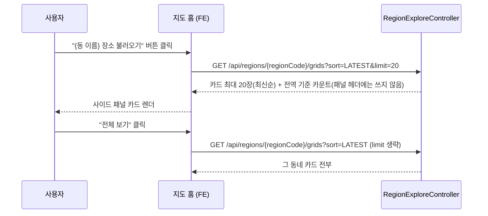

# PRD: 지도 홈 사이드 패널 격자 카드 목록 규칙

> 티켓: MSG-387 · 작성일: 2026-08-13 · 작성: prd-writer
> 상태: 검토됨 (2026-08-13 사용자 승인, 미해결 2건 답 반영)

## 1. 문제 상황

지도 홈 기본 화면의 사이드 패널에는 격자 카드 목록이 뜨는데, 몇 장을 어떤 순서로 보여줄지가 정해져 있지 않았다. FE 연동 가이드[^1]는 조회수순 3장(`sort=POPULAR&limit=3`)으로 안내하고 있었고, 서버 API는 개수 상한 없이 요청받은 대로 준다. 이대로 두면 FE는 낡은 안내를 따라 3장을 조회수순으로 구현한다. 2026-08-13에 최신순 최대 20장으로 확정했고(SRS[^2] FR-MAP-10), 이 확정을 문서 정본에 반영하는 것이 이 티켓이다.

장수와 정렬은 클라이언트가 호출 파라미터로 정하는 화면 규칙이다. 서버가 20을 강제로 자르지 않는 이유는 "전체 보기"가 limit 생략(그 동네 전부)에 의존하는 기존 계약이기 때문이고, 응답 크기는 행정동 하나에 들어가는 격자 수가 자연 상한이라 새로 생기는 노출이 없다.

## 2. 목적 · 목표

- **목적**: 사이드 패널 카드 목록의 확정 규칙(최신순 최대 20장)을 SRS, FE 연동 가이드, 스웨거가 같은 값으로 말하게 해서 FE 구현 기준을 하나로 만든다.
- **목표**:
  - FE가 어느 문서를 보더라도 패널 카드는 `sort=LATEST&limit=20` 한 가지로 안내받는다.
  - SRS에 FR-MAP-10이 등재되어 이후 PRD와 테스트가 이 ID를 참조할 수 있다.
- **비목표(스코프 제외)**:
  - 서버 강제 상한 도입. limit 생략은 지금처럼 전부를 반환한다. 강제 상한이 필요해지면 API 계약 변경이라 별도 티켓으로 다룬다.
  - 내 것 기준 카드 조회의 구현. 기본 화면 카드의 주인은 내 것으로 확정됐지만(아래 기능 요구사항 참조), 한 행정동에서 내 격자를 카드로 주는 조회가 서버에 없어 구현은 후속 티켓이 다룬다. 그때까지 FE는 기존 전역 공개 콘텐츠[^3] 조회를 최신순 20장으로 쓴다.
  - 칩 활성 상태의 패널(미션 목록). MSG-383이 다룬다.

## 3. 기능 요구사항

| ID | 요구사항 | 우선순위 |
|----|----------|----------|
| FR-1 | 지도 홈 기본 화면의 사이드 패널 격자 카드 목록은 최신순으로 최대 20장이고, 패널은 20장을 스크롤로 담는다 (SRS FR-MAP-10, 2026-08-13 디자인 확인) | Must |
| FR-2 | 기본 화면(상단 칩이 꺼진 상태)의 카드는 내 격자를 보여준다. 전역 데이터는 칩을 켰을 때만 보인다 (SRS FR-MAP-07, 2026-08-13 카드 포함 확정). 내 것 기준 카드 조회가 서버에 생길 때까지는 기존 전역 조회를 임시로 쓴다 | Must |
| FR-3 | 장수와 정렬은 클라이언트가 카드 조회의 `sort`, `limit` 파라미터로 정한다. 서버는 상한을 강제하지 않고 API 계약과 동작은 바뀌지 않는다 | Must |
| FR-4 | "전체 보기"는 지금처럼 `limit` 생략으로 그 동네의 카드 전부를 본다 | Must |
| FR-5 | 카드 조회의 카운트(gridCount, videoCount)는 limit과 무관한 전체 기준이되 전역 공개 콘텐츠를 센 값이라 **패널 헤더에 쓰지 않는다**. 패널 헤더("이 지역 격자 N개 · 영상 M개")는 집계 조회 응답의 currentRegion(중심 동 전체의 내 것, SRS FR-MAP-06)이 채운다 | Must |
| FR-6 | 콘텐츠 없는 동네는 404가 아니라 200에 카운트 0과 빈 배열이고, 패널은 빈 상태 UI를 그린다 (기존 계약 유지) | Must |

FR-3부터 FR-6은 현행 전역 조회 `GET /api/regions/{regionCode}/grids`로 패널을 채우는 동안의 계약이다. FR-2의 내 것 기준 조회로 갈아탈 때 후속 티켓의 PRD가 같은 성격의 계약을 승계해 정의한다.

## 4. 비기능 요구사항

| 분류 | 요구사항 |
|------|----------|
| 데이터 정합 | 카드 집합과 이 조회의 카운트는 같은 조회의 한 스냅샷에서 나와 서로 어긋나지 않는다 (기존 동작 유지) |
| 운영 | 서버 코드 동작 변경과 마이그레이션이 없다. 스웨거 안내 문구만 바뀐다 |

## 5. 시퀀스 다이어그램

## 6. 클래스 다이어그램

해당 없음. 신규 타입과 시그니처 변경이 없다.

## 7. 변경 파일 목록

| 파일 | 변경 | Owner |
|------|------|-------|
| `docs/srs.md` | FR-MAP-10 등재 (완료) | - |
| `docs/srs-changelog.md` | 등재 이력 행 추가 (완료) | - |
| `docs/rtm.md` | 스크립트 재생성 (완료) | - |
| `src/main/java/com/msg/fillmap/video/controller/RegionExploreController.java` | 스웨거 설명의 "지도 홈 패널은 3" 문구를 20장 기준으로 갱신 (완료, 동작 불변) | B |
| 위키 `03-specs/지도 홈 API 연동 가이드 FE.md` §3 | "POPULAR 3장" 안내를 "LATEST 20장"으로 교체 (레포 밖, 수정 완료 미커밋) | - |
| 컨플루언스 cf-32636957 | 위키와 같은 내용으로 갱신 (FE가 실제로 보는 원본, 미반영) | - |

## 8. 미해결 질문

작성 시점의 미해결 2건은 2026-08-13 정민 답변으로 해소됐다.

- [x] 디자인: 패널은 카드 20장을 스크롤로 담는 형태다 (피그마 조회 한도 소진으로 구두 확인).
- [x] 카드 주인: 기본 화면 카드도 내 것이다. 상단 칩을 누르지 않는 한 지도 홈은 전부 내 격자 기준이다 (FR-MAP-07이 카드까지 덮는 것으로 확인). 내 것 기준 카드 조회는 서버에 없으므로 후속 티켓이 필요하다 (발행 시점 미정).

[^1]: FE 연동 가이드: 지도 홈 화면 요소마다 어떤 API를 어떻게 부르는지 1:1로 매핑해 FE에 전달하는 문서. 위키 `03-specs/지도 홈 API 연동 가이드 FE.md`가 사본, 컨플루언스 cf-32636957이 FE가 보는 원본이다.
[^2]: SRS(Software Requirements Specification): 서비스 요구사항 전체를 담는 전역 정본 문서(`docs/srs.md`). 요구마다 불변 ID(FR-MAP-10 등)를 붙여 PRD, 티켓, 테스트가 참조한다.
[^3]: 전역 공개 콘텐츠: 살아 있고(삭제, 블라인드 아님) 전체 공개(PUBLIC)이며 인코딩까지 끝난 영상. 격자 대표 영상과 탐색 집계 등 전역 노출 경로가 세는 대상이다.
