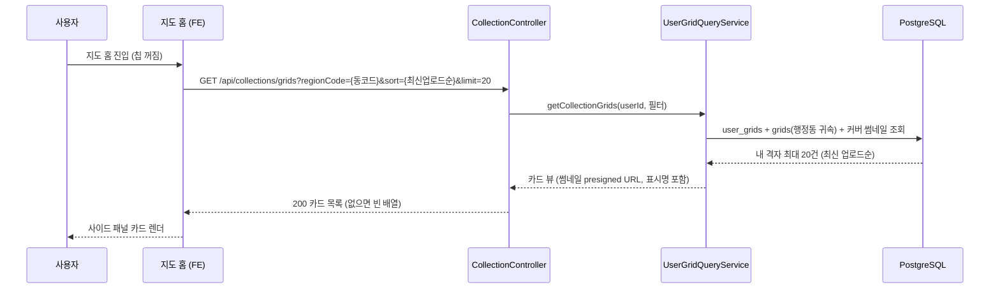
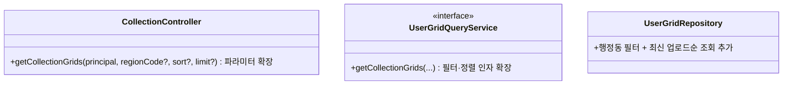

# PRD: 행정동 내 격자 카드 조회 신설 (지도 홈 패널을 내 것 기준으로)

> 티켓: MSG-388 · 작성일: 2026-08-15 · 작성: prd-writer
> 상태: 검토됨 (2026-08-15 사용자 승인. 임시 전역 조회의 타인 격자 노출은 dev 실측으로 확인: 부전2동 카드 8장 중 본인 격자 2장)

## 1. 문제 상황

지도 홈 기본 화면의 사이드 패널에는 격자 카드 목록이 뜬다. 2026-08-13에 "상단 칩을 켜지 않는 한 지도 홈은 전부 내 격자 기준"이 확정되면서(SRS FR-MAP-07, FR-MAP-10) 이 카드도 내 격자를 보여줘야 하는데, 한 행정동 안에서 내 격자를 카드(썸네일과 영상 수)로 주는 조회가 서버에 없다. 그래서 FE는 전역 공개 콘텐츠[^1] 조회 `GET /api/regions/{regionCode}/grids`를 `sort=LATEST&limit=20`으로 임시 사용 중이고, 이 상태로는 남의 영상이 섞인 카드가 내 격자 자리에 노출된다. 결정은 이미 났고(MSG-387 PRD 승인 과정, 2026-08-13 정민) 구현만 남았다.

비슷한 조회 두 개가 이미 있지만 어느 쪽도 요구를 채우지 못한다. `GET /api/collections/grids`는 내 격자 카드를 주지만 전국 대상에 수집 시각순 최대 30개 고정이고, `GET /api/collections/videos?regionCode=`는 행정동 필터가 있지만 격자 카드가 아니라 영상 목록이다.

## 2. 목적 · 목표

- **목적**: 지도 홈 패널이 "내 격자 기준" 확정(FR-MAP-07)대로 동작하도록, 한 행정동에서 내 격자를 카드로 주는 서버 조회를 만든다.
- **목표**:
  - FE가 행정동 코드 하나로 그 동네의 내 격자 카드를 최신 업로드순 최대 20장으로 받을 수 있다.
  - FE 연동 가이드의 "전역 조회 임시 사용" 안내가 새 조회로 교체된다.
- **비목표(스코프 제외)**:
  - 패널 헤더("이 지역 격자 N개 · 영상 M개")의 재료 변경. 헤더는 지금처럼 지도 집계 응답의 currentRegion[^2]이 채운다 (MSG-374, FR-MAP-06).
  - 전역 조회 `GET /api/regions/{regionCode}/grids`의 계약 변경. 상단 칩 활성 화면과 전역 탐색이 계속 쓴다.
  - 칩 활성 상태의 패널(미션 목록, MSG-383)과 친구 도감 카드.

## 3. 엔드포인트 형태 결정

티켓이 PRD에서 정하기로 한 항목이다. **기존 내 도감 갤러리 조회 `GET /api/collections/grids`에 선택 파라미터를 더하는 확장**으로 간다.

- 새 조회가 주는 카드의 재료(격자 ID, 썸네일, 영상 수, 격자 표시명)와 응답 모양이 기존 갤러리 카드와 같다. 필터(행정동)와 정렬(최신 업로드순)만 다르다.
- 행정동 필터를 쿼리 파라미터로 받는 선례가 같은 컨트롤러에 이미 있다 (`GET /api/collections/videos?regionCode=`).
- 신규 엔드포인트로 가면 같은 재료를 다른 경로 두 곳에서 반환하게 되어 응답 모양이 갈라질 위험만 생긴다.

파라미터 없는 기존 호출(도감 갤러리)의 동작은 그대로 두는 것이 이 결정의 전제다 (FR-7).

## 4. 기능 요구사항

| ID | 요구사항 | 우선순위 |
|----|----------|----------|
| FR-1 | 로그인 사용자는 행정동 코드로 그 행정동에 속한 내 격자를 카드 목록으로 조회할 수 있다. 카드에는 격자 ID, 격자 인덱스, 영상 수, 커버 썸네일, 격자 표시명 재료(zoneName, zoneCell, regionName)가 담긴다 (SRS FR-MAP-07, FR-MAP-10 상세화) | Must |
| FR-2 | 정렬은 내 영상이 가장 최근에 올라온 격자 순(최신 업로드순)을 지원한다. 지도 홈 패널이 이 정렬로 20장을 요청한다 | Must |
| FR-3 | 장수 상한(20)과 정렬은 클라이언트가 조회 파라미터로 정한다. 서버는 상한을 강제하지 않는다 (FR-MAP-10, MSG-387 FR-3 승계) | Must |
| FR-4 | 세는 대상은 내 도감 관례를 따른다. 살아 있는(삭제, 블라인드 아님) 내 영상은 비공개(PRIVATE)든 인코딩 중이든 전부 포함한다. 패널 헤더가 쓰는 currentRegion 집계와 같은 기준이라 헤더 숫자와 카드 목록이 어긋나지 않는다 | Must |
| FR-5 | 격자의 행정동 귀속은 격자 축(격자 소속 행정동)이다. 영상 좌표가 옆 동이어도 격자 소속 동 기준으로 잡힌다. 같은 화면의 동 단위 내 영상 조회(`/api/collections/videos`)와 같은 기준이다 | Must |
| FR-6 | 그 행정동에 내 격자가 없거나 존재하지 않는 행정동 코드면 404가 아니라 200에 빈 배열이다. 패널은 빈 상태 UI를 그린다 (MSG-387 FR-6 승계) | Must |
| FR-7 | 파라미터 없는 기존 호출(도감 갤러리, 수집 시각순 최대 30개)의 동작과 응답은 바뀌지 않는다 | Must |
| FR-8 | 커버 썸네일이 아직 없는 격자(인코딩 완료 전)는 카드에서 빠지지 않고 썸네일만 null로 온다 (도감 갤러리와 같은 동작) | Must |

## 5. 비기능 요구사항

| 분류 | 요구사항 |
|------|----------|
| 성능 | 패널 기본 호출(20장)은 격자당 커버 1건 조회와 썸네일 presigned URL[^3] 발급 20회 수준이다. 전국 30장을 주는 기존 갤러리 조회와 같은 구조라 새 병목이 없어야 한다 |
| 보안/인가 | 토큰 필수. 본인 것만 조회된다. 다른 사용자의 격자나 비공개 영상 존재가 이 응답으로 새지 않는다 |
| 데이터 정합 | 영상을 모두 지워 점령 롤백[^4]된 격자는 카드에서 즉시 사라진다 (user_grids 행 삭제로 자연 보장, glossary 규칙) |
| 운영 | 읽기 전용 조회라 마이그레이션이 없다 |

## 6. 시퀀스 다이어그램

## 7. 클래스 다이어그램

신규 타입 없이 기존 조회 계열의 시그니처만 확장된다. 응답 DTO는 기존 `CollectionGridResponseDto`를 그대로 쓴다.

## 8. 변경 파일 목록

| 파일 | 변경 | Owner |
|------|------|-------|
| `src/main/java/com/msg/fillmap/usergrid/controller/CollectionController.java` | `getCollectionGrids`에 선택 파라미터(regionCode, sort, limit) 추가, 스웨거 설명 갱신 | B |
| `src/main/java/com/msg/fillmap/usergrid/service/UserGridQueryService.java` | 조회 시그니처 확장 | B |
| `src/main/java/com/msg/fillmap/usergrid/service/impl/UserGridQueryServiceImpl.java` | 필터·정렬 분기 구현 | B |
| `src/main/java/com/msg/fillmap/usergrid/repository/UserGridRepository.java` | 행정동 필터 + 최신 업로드순 native 조회 추가 | B |
| `docs/srs.md` | 구현 완료 시 FR-MAP-10 비고의 "임시 사용" 서술 갱신 (마무리 단계) | - |
| 위키 `03-specs/지도 홈 API 연동 가이드 FE.md` | 패널 카드 안내를 전역 조회에서 새 조회로 교체 (레포 밖) | - |
| 컨플루언스 cf-32636957 | 위키와 같은 내용으로 갱신 (FE가 보는 원본) | - |

Owner 판정: 조회 축이 user_grids와 videos(커버)라 Owner B다. 행정동 귀속은 grids.region_code를 같은 쿼리에서 읽는 기존 B 내부 선례(`/api/collections/videos`, MSG-167)를 따르므로 A와의 새 경계 합의가 필요 없다.

## 9. 미해결 질문

- [ ] 카드 커버는 내 최신 업로드 영상(도감 갤러리와 같은 규칙, user_grids 커버)을 쓰는 것으로 제안한다. 디자인이 격자 대표 영상(전역 기준)을 요구할 가능성만 확인 필요.
- [ ] regionCode를 지정하고 limit을 생략한 호출은 그 동네의 내 격자 전부를 반환하는 것으로 제안한다 (전역 조회의 "전체 보기" 계약 승계, MSG-387 FR-4). 내 카드에도 전체 보기 진입이 있는지 FE 확인 필요.
- [ ] sort 파라미터의 값 이름과 생략 시 기본값은 스펙에서 정한다 (기존 갤러리의 수집 시각순과 충돌하지 않는 형태로).

[^1]: 전역 공개 콘텐츠: 살아 있고(삭제, 블라인드 아님) 전체 공개(PUBLIC)이며 인코딩까지 끝난 영상. 전역 노출 경로가 세는 대상이라 남의 영상이 포함된다.
[^2]: currentRegion: 지도 집계 응답(MSG-374)에 실리는 뷰포트 중심 행정동 정보. 동 이름과 그 동 전체의 내 점령 격자 수, 내 영상 수를 담아 패널 헤더를 채운다.
[^3]: presigned URL: S3 객체를 일정 시간 동안만 열 수 있게 서명한 임시 URL. 썸네일 원본 키를 그대로 노출하지 않기 위해 서버가 발급한다.
[^4]: 점령 롤백: 한 격자의 내 영상이 모두 삭제되면 점령(user_grids 행)도 자동 취소되는 규칙. 시간 제한이 없다.
