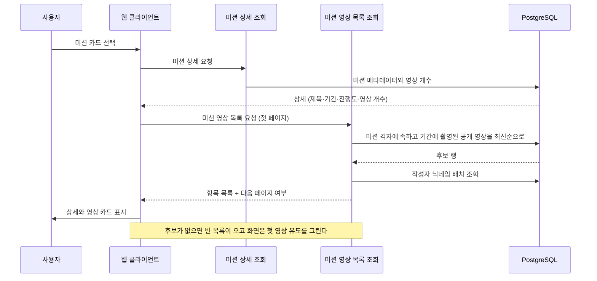
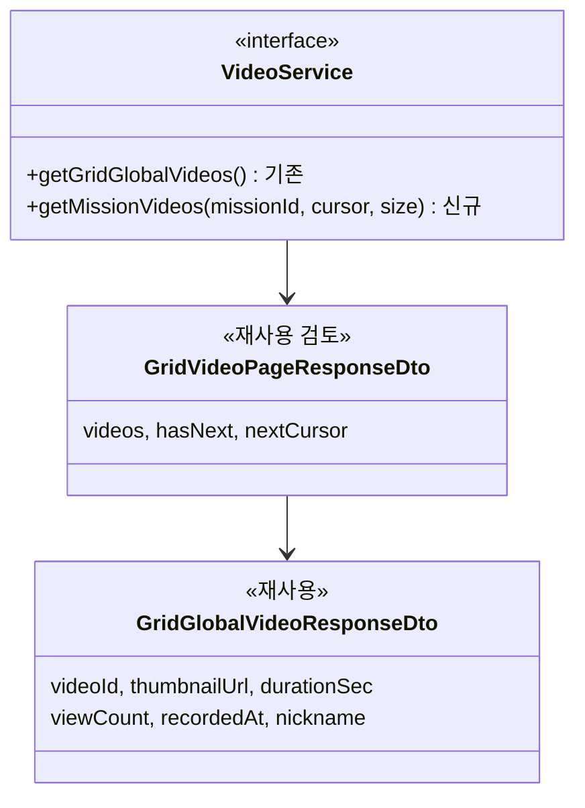

# PRD: 미션 상세의 영상 목록 조회

> 티켓: MSG-390 · 작성일: 2026-08-14 · 작성: prd-writer
> 상태: 검토됨 (2026-08-14 성민 승인)

> 이 PRD는 상위 PRD `docs/prd/mission-map-explore.md`(2026-08-13 승인)의 FR-8을 상세화한다.
> 상위 PRD가 "상세 하단에서 그 미션 영역에 올라온 영상을 최신순으로 본다"까지 확정했고,
> 여기서는 그 목록에 무엇이 들어오고 무엇이 빠지는지를 정한다. SRS로는 FR-MISSION-17이다.

## 1. 문제 상황

미션 상세 시안이 나왔다. 팝업과 축제 상세 하단에 "이 미션의 영상 3개"라는 목록이 있고,
상단 지표에도 "올라온 영상 3개"가 있다. 서버에는 그 목록을 줄 경로가 없다.

영상이 미션에 묶여 있지 않기 때문이다. `videos` 테이블에는 `mission_id`가 없고 위치 참조는
`grid_id` 하나다. 미션 쪽도 마찬가지로 미션 격자[^4]에 격자 목록만 갖는다. 둘 사이를 잇는
것은 격자뿐이다.

지금 있는 조회는 격자 하나 단위다. 축제 미션은 9×9로 81칸을 덮으므로 화면이 81번 호출해서
직접 합쳐야 한다. 합쳐도 결과가 맞지 않는다. 그 조회는 인기순 정렬이라 최신순 요구와 축이
다르고, 미션 기간 밖에 촬영된 영상까지 섞여 들어온다. 미션 기간을 아는 쪽은 서버인데 판단이
클라이언트로 넘어간다.

한편 서버에는 이미 "이 미션의 영상"을 정의한 코드가 있다. 스탬프 판정 쿼리[^1]가
`mission_grids`와 `videos`를 격자로 조인하면서 미션 기간 조건까지 붙여 두었다. 기간이 없는
미션은 조건이 자연스럽게 생략되는 형태다. 화면이 필요한 집합과 판정이 쓰는 집합이 사실상
같은 것이라, 새 테이블을 만들지 않고도 목록을 뽑을 수 있다.

## 2. 목적 · 목표

**목적**: 미션 상세가 그 미션에서 나온 영상을 한 번의 호출로 받게 한다. 그리고 "이 미션의
영상"이라는 말의 뜻을 서버 한 곳에서 정의한다.

**목표**

- 미션 하나를 지정하면 그 미션의 영역과 기간에 해당하는 공개 영상을 최신순으로 받는다
- 목록의 기준이 스탬프 판정과 같은 뿌리에서 나와, 화면과 판정이 서로 다른 정의를 갖지 않는다
- 영상이 한 편도 없는 미션에서도 화면이 오류 없이 빈 상태를 그린다

**비목표**

- `videos`와 `missions`를 직접 잇지 않는다. N:M 테이블을 새로 만들거나 업로드할 때 미션을 고르게
  하는 방식은 검토 후 제외했다. 판정은 격자로 하는데 귀속이 사용자 선택이 되면 "이 영상이 어느
  미션 것인가"에 답이 둘 생긴다. 필요해지면 별도 PRD로 다룬다
- 코스 상세의 스팟별 방문 여부와 스팟별 영상 수는 이 범위가 아니다. 상위 PRD가 그 집계를 미션
  상세 조회(`MissionGridRepository`)에 배정해 두었고, 시안에서도 코스 상세에는 영상 목록 자리가
  없다
- 미션 상세 자체(메타데이터, 내 진행도, 지도 미리보기)는 이 범위가 아니다
- 인기순 같은 정렬 선택지는 만들지 않는다. 미션 상세는 "최근에 누가 다녀왔나"를 보는 자리다

## 3. 기능 요구사항

| ID | 요구사항 | 우선순위 |
|----|----------|----------|
| FR-1 | 사용자는 미션 하나를 지정해 그 미션의 영상 목록을 한 번의 호출로 받는다 | Must |
| FR-2 | 목록에는 그 미션의 대상 격자에서 촬영된 영상만 들어온다. 대상 격자 밖 영상은 들어오지 않는다 | Must |
| FR-3 | 기간이 있는 미션은 그 기간에 촬영된 영상만 들어온다. 기간 시작 전이나 종료 후에 촬영된 영상은 빠진다 | Must |
| FR-4 | 기간이 없는 미션(코스와 지속형)은 기간 조건을 적용하지 않아 과거에 촬영된 영상도 들어온다 | Must |
| FR-5 | 공개범위가 PUBLIC인 영상만 들어온다. 본인이 올린 영상이라도 비공개나 친구 공개면 빠진다 | Must |
| FR-6 | 삭제된 영상과 블라인드[^2]된 영상은 들어오지 않는다 | Must |
| FR-7 | 인코딩이 끝나지 않은 영상은 들어오지 않는다. 썸네일이 아직 없어 카드가 빈칸으로 그려진다 | Must |
| FR-8 | 정렬은 촬영 시각 최신순이다. 카드에 표시되는 시각과 정렬에 쓰는 시각이 같아, 목록이 위에서 아래로 시간순으로 읽힌다 | Must |
| FR-9 | 목록은 페이지 단위로 받고, 뒤가 더 있으면 이어서 받을 수 있다 | Must |
| FR-10 | 항목마다 카드가 필요로 하는 값이 담긴다. 썸네일, 영상 길이, 조회수, 촬영 시각, 작성자 닉네임이다 | Must |
| FR-11 | 조건에 맞는 영상이 하나도 없으면 오류가 아니라 빈 목록이다. 화면은 그 빈 목록으로 첫 영상을 유도하는 안내를 그린다 | Must |
| FR-12 | 존재하지 않는 미션 ID로 불러도 오류가 아니라 빈 목록이다. 격자 조회 3종의 기존 규약과 같다 | Must |
| FR-13 | 기간이 끝난 미션도 목록은 조회된다. 완료한 미션을 나중에 다시 열어 볼 수 있어야 한다 | Must |
| FR-14 | 미션의 대상 격자가 바뀌면 다음 조회부터 결과에 반영된다. 별도 재집계나 백필이 필요하지 않다 | Must |
| FR-15 | 작성자가 탈퇴해 사라진 영상은 항목에서 빠진다. 닉네임이 빈칸인 카드가 나오지 않는다 | Should |

엣지 케이스

- 팝업 판정 범위가 반경 40m로 좁혀지면(상위 PRD 확정 사항) 목록에 들어오던 영상이 빠질 수 있다.
  이미 발급된 스탬프는 회수하지 않지만(SRS FR-MISSION-04) 목록은 현재 격자 기준으로 다시 계산된다.
  스탬프는 남았는데 목록이 비는 상태가 나올 수 있고, 이는 정상 동작이다
- 코스 미션은 기간이 없어 대상 격자에 찍힌 모든 과거 영상이 후보다. 도심 코스는 목록이 길어질 수
  있으므로 페이지 크기 상한이 필요하다
- 같은 영상이 여러 미션의 목록에 동시에 들어올 수 있다. 격자가 겹치는 미션이 있으면 자연스러운
  결과이고, 중복 제거 대상이 아니다

## 4. 비기능 요구사항

| 분류 | 요구사항 |
|------|----------|
| 성능 | 첫 페이지 응답이 p95 300ms 안에 온다. 상위 PRD가 잡은 화면 갱신 예산과 같은 값이다 |
| 성능 | 미션 하나가 덮는 격자는 축제 81칸, 코스 5~8칸, 팝업 1~4칸(반경 40m 전환 후)이다. 미션 격자는 전체 32,903행이고 그중 영상이 있는 칸은 24칸(0.1%)이라 대부분의 조회는 빈 목록으로 끝난다 |
| 보안/인가 | 로그인이 필요하다. 미션 목록 조회와 같은 게이트를 쓴다 |
| 보안/인가 | 응답은 누가 부르든 같다. 호출자 본인의 비공개 영상이나 친구 공개 영상도 나오지 않는다 |
| 데이터 정합 | 화면에 쓰는 영상 개수와 이 목록의 후보 기준이 같아야 한다. 기준이 어긋나면 "영상 3개"라고 써 놓고 두 개만 나온다 |
| 데이터 정합 | 스탬프 판정과 목록은 의도적으로 다르다. 판정은 블라인드 영상도 촬영 사실로 인정하고, 목록은 그것을 감춘다. 그래서 화면에 보이는 영상 수가 판정 근거보다 작을 수 있다. 버그가 아니므로 스펙에 명시한다 |
| 운영 | 스키마를 바꾸지 않는다. 마이그레이션이 없고, 되돌리기는 엔드포인트를 걷어내는 것으로 끝난다 |

## 5. 시퀀스 다이어그램

미션 상세를 여는 흐름이다. 상세 조회와 영상 목록 조회가 나뉘어 있고, 개수는 상세가 주고
목록은 페이지로 온다는 점이 이 문서의 결정 지점이다.

## 6. 클래스 다이어그램

새 타입은 최소로 둔다. 항목 표현은 격자 전역 목록과 같은 카드라서 기존 DTO를 그대로 쓴다.
페이지 커서만 축이 달라 별도 판단이 필요하다.

기존 DTO 두 종이 시안의 카드를 그대로 채운다. 썸네일은 사전 서명 URL[^3]로 내려가고 닉네임은
서비스가 배치 조회로 채우는 구조도 이미 있다. 다만 페이지 커서는 현재 격자 ID와 조회수 축으로
만들어져 있어 미션과 촬영 시각 축에는 그대로 쓸 수 없다. 커서를 어떻게 할지는 스펙에서 정한다.

## 7. 변경 파일 목록

| 파일 | 변경 | Owner |
|------|------|-------|
| `src/main/java/com/msg/fillmap/video/repository/VideoRepository.java` | 수정: 미션 격자 영역 영상 목록 조회 추가 | B |
| `src/main/java/com/msg/fillmap/video/service/VideoService.java` | 수정: 미션 영상 목록 조회 메서드 추가 | B |
| `src/main/java/com/msg/fillmap/video/service/VideoServiceImpl.java` | 수정: 페이지 조립과 닉네임 배치 조회 재사용 | B |
| `src/main/java/com/msg/fillmap/video/controller/` | 신규 또는 수정: 미션 영상 목록 엔드포인트. 경로와 배치는 스펙에서 확정한다 | B |
| `src/main/java/com/msg/fillmap/video/support/VideoCursor.java` | 수정 또는 신규 커서: 현 커서는 격자와 조회수 축이라 미션과 촬영 시각 축을 담지 못한다 | B |
| `src/main/java/com/msg/fillmap/video/dto/GridVideoPageResponseDto.java` | 무수정 예상. 재사용 가능 여부를 스펙에서 확정한다 | B |
| `src/main/java/com/msg/fillmap/mission/` | 무수정. 미션 패키지를 건드리지 않는다 | B |

Owner는 전부 B다. `videos` 테이블을 다루는 코드라 격자 접두사 경로라도 video 패키지에 두는
기존 관례(`GridVideoController`, MSG-127)를 따른다. 마이그레이션은 없다.

## 8. 확정 사항 (2026-08-14 성민)

- **영상 개수는 미션 상세 조회가 준다.** 이 목록 API는 총계를 담지 않는다. 상위 PRD가
  `MissionDetailResponseDto`에 "영상 수"를 배정한 것을 그대로 따르고, 격자 목록 3종이 지키는
  총계 없는 페이지 규약(Slice 의미, MSG-90 이후 선례)도 깨지 않는다. 화면이 상세를 먼저 부르므로
  목록 첫 페이지가 도착하기 전에 개수를 그릴 수 있다는 이점도 있다. 조건은 하나다. 그 개수의
  후보 기준이 이 목록의 기준과 글자 그대로 같아야 한다. 어긋나면 "영상 3개"라고 써 놓고 두 개만
  나온다
- **정렬은 촬영 시각 최신순이다.** 미션 기간 판정이 촬영 시각을 쓰고 카드에 표시되는 시각도
  촬영 시각이라, 세 곳을 한 축으로 맞춘다. 대신 갤러리에서 옛날 영상을 방금 올리면 목록 위가
  아니라 중간에 꽂힌다. 기간이 짧은 팝업과 축제에서는 두 시각의 차이가 작아 이 손해를 받아들였다.
  코스는 무기간이라 차이가 커질 수 있으나 코스 상세에는 영상 목록 자체가 없다
- **코스 흐름은 이 API를 부르지 않는다.** 시안에서 코스 상세는 영상 목록 자리에 포토스팟 목록이
  들어가고, 스팟을 고르면 기존 격자 상세 패널이 열린다. 거기 보이는 영상 목록은 그 격자의 것이라
  기존 격자 조회 3종이 그대로 채운다. 그래서 이 API의 소비처는 축제와 팝업 상세이고, 코스는 상세
  조회에서 총 개수만 받는다. 코스는 무기간이라 미션 기준 개수와 격자 기준 개수가 어차피 같아,
  스팟 목록의 "영상 9"와 격자 상세의 "영상 9개"가 어긋나지 않는다

## 9. 미해결 질문

없다. 남은 결정은 전부 구현 결정이라 스펙에서 정한다. 엔드포인트 경로와 페이지 크기 규격,
페이지 커서를 기존 `VideoCursor`에 얹을지 새로 만들지, 조인에 인덱스가 필요한지가 그것이다.

## 10. 참고

시안은 피그마 "필맵 웹 디자인 ver 12_미션디자인" 페이지의 섹션 "🗺️ 미션 지도 탐색 개편"에 있다.

| 화면 | 노드 |
|------|------|
| 미션 선택 · 팝업 (영상 목록) | `14587:2507` |
| 미션 선택 · 지역축제 | `14590:2555` |
| 미션 선택 · 경로추천 (스팟 목록) | `14592:2603` |
| 코스 스팟 선택 (기존 격자 상세, 이 API 미사용) | `14599:3501` |
| 상세 · 축제 빈 상태 | `14460:1621` |

관련 요구사항은 SRS의 FR-MISSION-17이고, 상위 PRD는 `docs/prd/mission-map-explore.md`의 FR-8과
FR-9다. 판정 쪽 규칙은 FR-MISSION-03과 FR-MISSION-04를 그대로 따르며 이 문서가 바꾸지 않는다.

[^1]: 스탬프 판정 쿼리: `MissionRepository.findCompleted`. 업로드가 들어올 때마다 그 사용자가 그
  미션을 완료했는지 정하는 SQL이다. 미션 격자와 영상을 격자로 조인하고 미션 기간 조건을 붙인
  형태라, 이 문서의 목록 조회가 같은 조인에서 파생된다.

[^2]: 블라인드: 신고가 처리되어 재생이 막힌 영상 상태(`BLINDED`). 삭제와 달리 행이 남아 있어
  판정에서는 촬영 사실로 인정되고, 화면 목록에서는 감춰진다.

[^3]: 사전 서명 URL: 비공개 저장소의 파일을 정해진 시간 동안만 열 수 있게 서버가 서명해 발급하는
  주소. 썸네일이 이 방식이라 목록 항목마다 서버가 발급해 넘긴다.

[^4]: 미션 격자: `mission_grids` 테이블. 축제 반경이나 코스 경로를 100m 격자로 양자화한 결과이고,
  영상이 있는지와는 무관하게 미리 채워진다. 미션과 영상을 잇는 유일한 연결 고리다.
