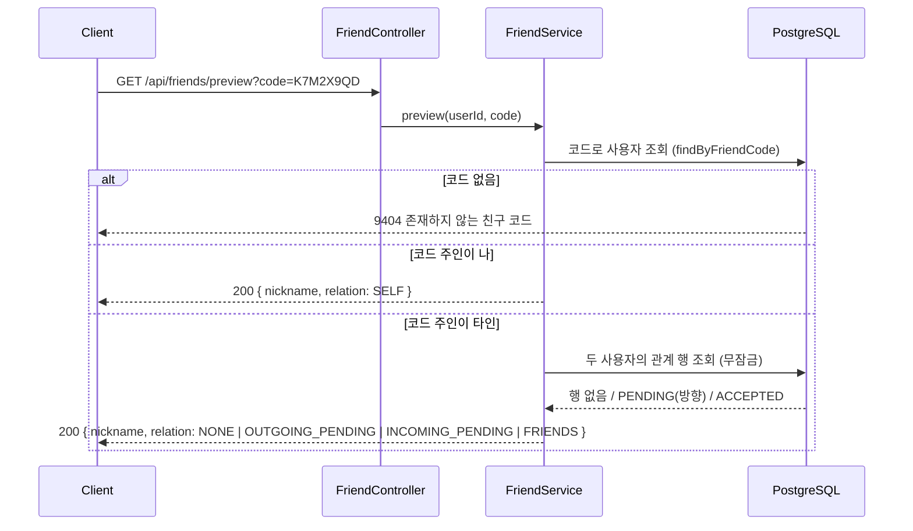
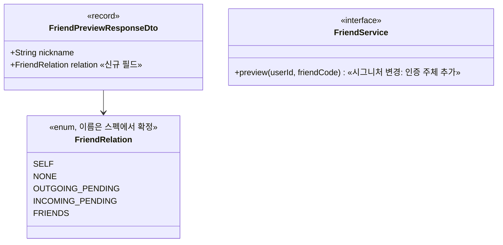

# PRD: 친구 코드 미리보기에 관계 상태 동봉

> 티켓: MSG-391 · 작성일: 2026-08-25 · 작성: prd-writer
> 상태: 검토됨 (2026-08-25 성민 승인)

## 1. 문제 상황

친구 코드 미리보기[^1]는 지금 닉네임만 돌려준다. 그래서 확인 화면에서 이미 알 수 있는 사실을
사용자는 요청 버튼을 누르고 나서야 알게 된다. 내 코드를 넣어도 미리보기는 성공해서 내 닉네임이
뜨고 "친구 요청 보내기" 버튼이 활성화된다. 이미 친구인 사람의 코드를 넣어도 마찬가지다.

가장 문제가 되는 경우는 상대가 나에게 이미 요청을 보내 둔 역방향 대기[^2] 상태다. 이때 내가
요청을 보내면 에러가 나는 대신 기존 요청이 수락으로 승격되어 그 자리에서 친구가 된다. 화면에는
"친구 요청 보내기"라고만 적혀 있으니, 사용자는 자기가 상대의 요청을 수락했다는 사실을 모른 채
친구가 된다. 미리보기 단계에서 관계를 갈라주면 이 버튼을 "수락하고 친구 되기"로 바꿀 수 있다.

피그마 친구 에러 상태 보드(14614:631)의 9400, 9409, 9410 카드는 미리보기 단계에서 관계를 이미
안다고 가정하고 그려져 있다. 자기 코드면 요청 버튼이 잠기고, 이미 친구면 프로필 이동 버튼이
뜨고, 보낸 요청이 대기 중이면 버튼이 상태 표시로 바뀐다. 지금 응답 계약[^3]으로는 이 세 화면을
버튼을 누른 뒤에 뜨는 오류 안내로만 만들 수 있다.

## 2. 목적 · 목표

- **목적**: 친구 요청을 보내기 전에 나와 코드 주인의 관계를 사용자에게 알려서, 눌러봐야 아는
  실패와 모르고 일어나는 수락을 없앤다.
- **목표**: 미리보기 응답에 관계 상태 필드가 실린다. 값은 본인(SELF), 관계 없음(NONE),
  내가 보낸 요청 대기(OUTGOING_PENDING), 상대가 보낸 요청 대기(INCOMING_PENDING),
  이미 친구(FRIENDS) 다섯 가지다. 화면은 이 값으로 요청 버튼의 활성 여부와 문구를 미리 정한다.
- **비목표(스코프 제외)**:
  - 요청 API의 검증 제거. 미리보기는 화면을 미리 맞추는 힌트이고 최종 판정은 요청 API가 계속
    한다. 미리보기와 요청 사이에 관계가 바뀔 수 있기 때문이다.
  - 요청 취소 API 신설. 현재 없어서 OUTGOING_PENDING 상태에서 되돌릴 방법이 없는데, 필요해지면
    별도 티켓으로 다룬다.
  - 버튼 문구와 화면 구성. 서버는 상태 값만 주고 표현은 FE와 디자인이 정한다.

이 기능은 MSG-185 스펙이 정한 "미리보기는 advisory 전용, 검증은 요청 API가 재수행" 결정을
일부 뒤집는다. 조회 전용이라는 성격과 요청 API의 최종 판정은 그대로 두되, "자기 코드나 이미
친구인 상대도 미리보기는 성공한다(단순 조회)"였던 부분을 "성공하되 관계 상태를 함께 알려준다"로
바꾼다. 뒤집는 근거는 위 문제 상황이다. 특히 모르고 일어나는 수락은 검증 시점의 문제가 아니라
정보 부재의 문제라서 요청 API 검증만으로는 해결되지 않는다.

## 3. 기능 요구사항

SRS 대조: FR-FRIEND-02(코드로 닉네임 미리 확인 후 요청)의 확장이며, 신규 요구
**FR-FRIEND-14**로 등재했다(2026-08-25, 상태 계획). 아래 FR 전체가 그 한 항목에 대응한다.

| ID | 요구사항 | 우선순위 |
|----|----------|----------|
| FR-1 | 로그인 사용자가 친구 코드로 미리보기를 조회하면 닉네임과 함께 나와 코드 주인의 관계 상태가 온다. 값은 SELF, NONE, OUTGOING_PENDING, INCOMING_PENDING, FRIENDS 다섯 가지 중 하나다 | Must |
| FR-2 | 내 코드를 조회하면 SELF가 온다. 화면은 요청 버튼을 잠근다 | Must |
| FR-3 | 이미 친구인 상대의 코드를 조회하면 FRIENDS가 온다. 화면은 프로필 이동 버튼을 보여준다 | Must |
| FR-4 | 내가 보낸 요청이 대기 중인 상대의 코드를 조회하면 OUTGOING_PENDING이 온다. 화면은 버튼을 수락 대기 표시로 바꾼다 | Must |
| FR-5 | 상대가 나에게 보낸 요청이 대기 중인 코드를 조회하면 INCOMING_PENDING이 온다. 화면은 버튼 문구를 수락 의미로 바꾼다 | Must |
| FR-6 | 아무 관계가 없으면 NONE이 온다. 화면은 지금과 같은 요청 버튼을 보여준다 | Must |
| FR-7 | 존재하지 않는 코드는 기존과 같은 9404 실패다. 관계 상태 추가로 실패 응답의 형태와 코드가 달라지지 않는다 | Must |
| FR-8 | 닉네임 필드는 그대로 유지된다. 새 필드를 모르는 기존 클라이언트도 이전과 같이 동작한다 | Must |
| FR-9 | 요청 API의 검증은 그대로 둔다. 미리보기가 NONE을 줬어도 요청 시점에 관계가 바뀌었으면 요청 API가 그 시점 기준으로 판정한다 | Must |
| FR-10 | 관계 판정은 조회 시점 실시간이다. 같은 관계 상태에서 미리보기와 요청 API가 서로 다른 답을 내지 않는다. 예를 들어 FRIENDS를 받은 직후 관계 변동 없이 요청하면 9409가 난다 | Must |

## 4. 비기능 요구사항

| 분류 | 요구사항 |
|------|----------|
| 성능 | 관계 판정으로 늘어나는 조회는 복합 기본 키 인덱스를 타는 단건 수준 1회다. 미리보기 조회가 다른 사용자의 요청이나 수락을 잠그거나 기다리게 하지 않는다[^4] |
| 보안/인가 | 로그인 필수는 기존 전역 정책 그대로다. 새로 노출되는 관계 정보는 당사자가 받은 요청 목록과 친구 목록 API로 이미 알 수 있는 것뿐이라 은닉 정책(NFR-SEC-06)에 새 구멍을 내지 않는다 |
| 운영 | DB 마이그레이션 없음. 응답 필드 추가라 배포 순서 제약도 없다 |

## 5. 시퀀스 다이어그램

## 6. 클래스 다이어그램

## 7. 변경 파일 목록

전부 Owner B(friend 도메인)이며 마이그레이션은 없다.

| 파일 | 변경 | Owner |
|------|------|-------|
| `friend/dto/FriendPreviewResponseDto.java` | 관계 상태 필드 추가, Swagger 설명 갱신 | B |
| `friend/dto/` 신규 enum 파일 | 관계 상태 5값 enum 신설 | B |
| `friend/controller/FriendController.java` | preview에 `@AuthenticationPrincipal` 주입 (SecurityConfig가 전역 인증이라 보안 수준 변화 없음) | B |
| `friend/service/FriendService.java` | preview 시그니처를 (userId, code)로 변경 | B |
| `friend/service/FriendServiceImpl.java` | 관계 판정 로직 추가. request의 기존 분기와 같은 순서로 판정해 두 곳이 다른 답을 내지 않게 한다 | B |
| `friend/repository/FriendshipRepository.java` | 무잠금 방향 포함 쌍 조회 신설 | B |
| `src/test/java/.../friend/` 테스트 | 다섯 상태와 9404 유지 검증 | B |

리포지토리에 조회를 새로 만드는 이유: 티켓 컨텍스트는 기존 `findPair` 재사용을 예상했지만,
`findPair`는 비관적 쓰기 잠금[^5]이 걸린 조회라 읽기 전용 트랜잭션인 미리보기에서 PostgreSQL이
거부한다(MSG-186에서 실측, 위키 Friend API 문서에도 명시). 기존 무잠금 조회
`existsAcceptedPair`는 ACCEPTED 존재만 확인해서 대기 상태의 방향을 가르지 못한다. 그래서
방향까지 돌려주는 무잠금 조회가 하나 필요하다.

## 8. 미해결 질문

작성 시점 질문 2건은 2026-08-25 승인 시점에 함께 해소됐다.

- [x] FE 합의. 티켓이 "PRD를 먼저 쓰고 FE와 합의한 뒤 구현"을 명시했다. 2026-08-25 성민
  확정: FE 공유와 합의 진행은 성민이 직접 맡고, 서버 구현은 이 PRD의 다섯 값을 계약 정본으로
  바로 진행한다. FE가 합의 과정에서 값의 이름이나 의미 변경을 요구하면 응답 계약 변경이므로
  이 PRD를 먼저 갱신하고 구현에 반영한다.
- [x] INCOMING_PENDING 확인 화면 시안. 에러 상태 보드에 9400, 9409, 9410 카드는 있는데
  "수락하고 친구 되기" 확인 화면은 시안에 없다. 서버 요구사항에는 영향이 없어 서버 작업은
  그대로 진행하고, 시안 보강 필요는 디자인에 전달만 한다(2026-08-25 확정).

[^1]: 미리보기(preview): GET /api/friends/preview?code=. 친구 요청을 보내기 전에 코드 주인이 누구인지 확인하는 조회 API.
[^2]: 역방향 대기: 상대가 나에게 먼저 친구 요청을 보내 둔 상태. 이때 내가 요청을 보내면 새 요청이 생기는 대신 기존 요청이 수락으로 승격된다(자동 수락, FR-FRIEND-03).
[^3]: 응답 계약: 서버가 내려주는 필드 구성. 필드가 늘면 FE가 맞춰야 하므로 합의 대상이다.
[^4]: 미리보기는 읽기 전용 트랜잭션에서 잠금 없는 조회만 쓴다는 뜻이다. 잠금 조회를 쓰면 조회하는 동안 그 관계 행의 수락이나 삭제가 대기하게 된다.
[^5]: 비관적 쓰기 잠금(PESSIMISTIC_WRITE): 조회한 행을 트랜잭션이 끝날 때까지 다른 쓰기가 못 건드리게 잠그는 방식. 읽기 전용 트랜잭션에서는 PostgreSQL이 이 잠금 자체를 거부한다.
