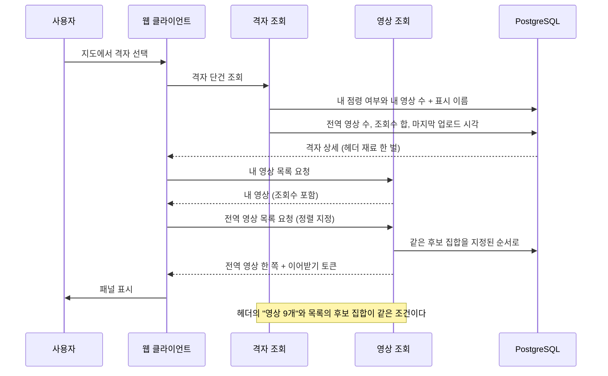
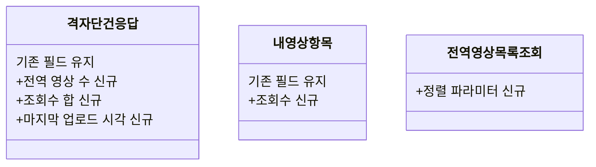

# PRD: 격자 상세의 전역 집계와 영상 목록 정렬

> 티켓: MSG-396 · 작성일: 2026-08-14 · 작성: prd-writer
> 상태: 검토됨 (2026-08-14 성민 승인)

## 1. 문제 상황

격자 상세 패널 시안이 확정됐다. 상단에 "내 영상 1개 · 영상 9개 · 조회 3,400"이 한 줄로 있고,
아래쪽에 "마지막 업로드 4시간 전"이 있다. 이 넷 중 서버가 주는 것은 "내 영상 1개" 하나다.

"영상 9개"를 얻으려면 지금은 시간대 분포를 받아 24칸을 더해야 한다. 그 조회는 차트를 그리라고
만든 것이지 개수를 세라고 만든 것이 아니다. 게다가 차트는 상단 칩이 켜진 상태에서만 뜨기로 했는데
(FR-MAP-09) 개수는 칩과 무관하게 항상 필요하다. 화면 요소 하나를 위해 다른 화면 요소의 재료를
빌려 쓰는 셈이다.

조회수 합과 마지막 업로드 시각은 아예 낼 방법이 없다. 마지막 업로드를 개인 기록에서 가져오는
길도 막혀 있다. 그 값은 사용자마다 다른 행이라 전역 축으로 쓸 수 없고, 이미 코드 주석이 그 점을
적어 두었다.

그런데 셋 다 서버가 이미 계산하고 있다. 행정동의 격자 카드 목록을 정렬하려고 격자마다 영상 수와
조회수 합과 최신 업로드 시각을 한 번에 구해 놓고[^1], 그중 영상 수만 응답에 싣고 나머지 둘은
버린다. 세는 조건도 격자 영상 목록과 글자 그대로 같은 전역 노출 게이트[^2]다. 없는 값을 새로
만드는 상황이 아니라, 만들어 놓고 버리는 값을 다른 화면에도 내주면 되는 상황이다.

영상 카드에도 빈 곳이 있다. 시안의 내 영상 카드가 "조회 180"을 보여주는데 내 영상 목록 항목에는
조회수 필드가 없다. 같은 화면 아래쪽의 전역 영상 카드에는 있다.

같은 결의 빈 곳이 하나 더 있다. 다른 진입 경로로 열린 격자 상세가 "8월 12일부터 내가 점령 중"을
보여주는데, 격자 단건 응답에 점령 시작 시각이 없다. 이 값은 도감 격자 목록과 친구 도감 응답에는
이미 실려 있어서, 어디에도 없는 값이 아니라 이 응답에만 빠진 값이다.

마지막은 정렬이다. 격자 안 영상 목록은 인기순 고정이고 정렬을 고르는 방법이 없다. 그런데 시안의
카드는 "어제", "4시간 전"처럼 시간을 보여줘서 목록이 시간순으로 읽힌다. 조회수 순으로 내려온
목록에 시간 라벨이 붙으면 순서가 뒤죽박죽으로 보인다. 같은 화면의 격자 카드 목록은 이미 인기순과
최신순을 고를 수 있으니, 영상 목록만 고정인 것이 오히려 예외다.

## 2. 목적 · 목표

**목적**: 격자 상세 패널이 화면에 적힌 값을 서버에서 그대로 받게 한다. 그리고 그 값들이 바로 아래
영상 목록과 어긋나지 않게 한다.

**목표**

- 격자 하나를 조회하면 전역 영상 수와 조회수 합과 마지막 업로드 시각이 함께 온다
- 그 값들이 세는 대상이 같은 화면의 영상 목록에 실제로 나오는 영상과 같다
- 내 영상 카드가 조회수를 보여준다
- 영상 목록을 시간순으로 볼 수 있다

**비목표**

- 코스 포토스팟 이름은 다루지 않는다. 미션 도메인 문제라 MSG-397로 분리했다
- 미션 상세의 영상 목록은 MSG-390이 다룬다. 이 문서는 격자 상세다
- 시간대 분포 차트는 이미 있고(FR-MAP-09) 이 문서가 바꾸지 않는다
- 조회수를 세는 규칙(FR-VIDEO-14)은 그대로 둔다. 이미 쌓인 값을 합할 뿐이다
- 정렬 선택지를 인기순과 최신순 둘 말고 더 만들지 않는다
- 시안의 "공유"와 "저장" 버튼은 서버에 대응 기능이 없다. 이 문서가 만들지 않는다

## 3. 기능 요구사항

| ID | 요구사항 | 우선순위 |
|----|----------|----------|
| FR-1 | 격자 하나를 조회하면 그 격자의 전역 공개 영상 수가 함께 온다 | Must |
| FR-2 | 같은 조회로 그 격자의 조회수 합이 함께 온다 | Must |
| FR-3 | 같은 조회로 그 격자에 마지막으로 영상이 올라온 시각이 함께 온다 | Must |
| FR-4 | 세 값이 세는 대상이 격자 전역 영상 목록에 실제로 나오는 영상과 같다. 화면의 "영상 9개"와 목록에 보이는 개수가 어긋나지 않는다 | Must |
| FR-5 | 공개 영상이 하나도 없는 격자는 실패가 아니라 개수 0, 조회수 0, 마지막 업로드 없음으로 응답한다 | Must |
| FR-6 | 아직 아무도 영상을 올리지 않은 격자도 실패가 아니다. 격자 단건 조회의 기존 규약 그대로다 | Must |
| FR-7 | 세 값은 누가 부르든 같다. 호출자 본인의 비공개 영상이나 친구 공개 영상은 세지 않는다 | Must |
| FR-8 | 내 영상 목록의 항목마다 조회수가 담긴다 | Must |
| FR-9 | 격자 전역 영상 목록을 인기순과 최신순 중 골라 받을 수 있다 | Must |
| FR-10 | 정렬을 지정하지 않으면 지금과 같은 순서로 온다. 이미 이 조회를 쓰는 화면이 영향을 받지 않는다 | Must |
| FR-11 | 허용되지 않는 정렬 값은 조용히 기본값으로 떨어지지 않고 실패한다. 격자 카드 목록의 기존 규칙과 같다 | Must |
| FR-12 | 어느 정렬로 받든 이어받기가 성립한다. 같은 정렬로 다음 쪽을 받으면 중복도 누락도 없다 | Must |
| FR-13 | 한 정렬로 받은 이어받기 토큰을 다른 정렬에 쓰면 실패한다. 조용히 엉뚱한 지점부터 잘려 오지 않는다 | Should |
| FR-14 | 격자 상세 화면에 놓인 내 영상 카드와 전역 영상 카드가 같은 축의 시각을 보여준다. 둘 다 업로드 시각이고, 하단의 "마지막 업로드"와도 같은 축이다. 이 요구는 격자 상세에만 걸리며 다른 화면의 표시 축을 바꾸지 않는다 | Must |
| FR-15 | 내가 점령한 격자면 언제부터 점령했는지가 함께 온다. 화면이 "8월 12일부터 내가 점령 중"을 그린다. 미점령 격자면 이 값이 없다 | Must |

엣지 케이스

- 조회수 합은 재생이 일어날 때마다 변한다. 헤더와 목록을 서로 다른 시점에 받으면 잠깐 어긋나
  보일 수 있고, 이것은 수용한다. 새로고침하면 맞는다
- 마지막 업로드 시각은 업로드 기준이지 촬영 기준이 아니다. 갤러리에서 오래된 영상을 방금 올리면
  "방금"으로 표시된다
- 영상이 전부 비공개이거나 인코딩 중인 격자는 내 영상은 있는데 전역 집계가 0이다. 화면이
  "내 영상 1개 · 영상 0개"를 그릴 수 있어야 한다

## 4. 비기능 요구사항

| 분류 | 요구사항 |
|------|----------|
| 성능 | 지도 화면 계열 조회의 기존 목표(NFR-PERF-01)를 그대로 지킨다. p95[^4] 300ms 미만이다. 대상이 격자 하나라 행정동 전체를 훑는 기존 조회보다 범위가 작다 |
| 데이터 정합 | 집계 세 값과 영상 목록이 같은 후보 집합을 본다. 다르면 화면에 적힌 숫자와 실제로 보이는 목록이 어긋난다 |
| 데이터 정합 | 조회수 합은 근사값이 아니라 그 시점의 실제 합이다. 핫스코어처럼 유실을 허용하는 값이 아니다 |
| 보안/인가 | 로그인이 필요하다. 격자 조회의 기존 게이트를 그대로 쓴다 |
| 보안/인가 | 집계 세 값은 호출자와 무관하게 같다. 내 영상 목록과 그 조회수는 본인 것만 나온다 |
| 운영 | 스키마를 바꾸지 않는다. 마이그레이션이 없다 |
| 운영 | 정렬 기본값이 기존과 같아 이미 이 조회를 쓰는 클라이언트가 배포 순서와 무관하게 안전하다 |

## 5. 시퀀스 다이어그램

격자를 골라 상세 패널을 여는 흐름이다. 헤더의 숫자와 목록이 같은 후보 집합에서 나온다는 점이
이 문서의 핵심이라 그것을 드러냈다.

## 6. 클래스 다이어그램

새로 생기는 타입은 정렬 값 하나뿐이고 나머지는 기존 응답에 필드가 붙는다.

기존 격자 단건 응답에는 이미 내 영상 수가 있다. 이름이 겹치므로 전역 영상 수와 구분되는 이름이
필요하다. 이 판단은 스펙 몫이다.

## 7. 변경 파일 목록

| 파일 | 변경 | Owner |
|------|------|-------|
| `src/main/java/com/msg/fillmap/video/repository/VideoRepository.java` | 수정: 격자 단건 집계 조회 추가, 전역 영상 목록에 최신순 축 추가 | B |
| `src/main/java/com/msg/fillmap/video/dto/GridVideoResponseDto.java` | 수정: 조회수 필드 추가 | B |
| `src/main/java/com/msg/fillmap/video/dto/GridGlobalVideoResponseDto.java` | 수정: 업로드 시각 필드 추가 (FR-14). 기존 촬영 시각은 그대로 두고 팩토리만 함께 고친다. 미션 목록도 쓰는 타입이라 축을 바꾸지 않는다 | B |
| `src/main/java/com/msg/fillmap/video/dto/ExploreSort.java` | 참고: 정렬 값 선례. 재사용 여부는 스펙에서 판단 | B |
| `src/main/java/com/msg/fillmap/video/controller/GridVideoController.java` | 수정: 전역 영상 목록에 정렬 파라미터 | B |
| `src/main/java/com/msg/fillmap/video/service/VideoService.java` | 수정: 정렬 인자 추가, 집계 조회 | B |
| `src/main/java/com/msg/fillmap/video/service/VideoServiceImpl.java` | 수정: 정렬 분기와 집계 조립 | B |
| `src/main/java/com/msg/fillmap/video/support/VideoCursor.java` | 수정 또는 신규 커서[^3]: 현 커서는 조회수 축이라 최신순 경계값을 담지 못한다 | B |
| `src/main/java/com/msg/fillmap/grid/dto/GridCellResponseDto.java` | 수정: 전역 집계 3종과 내 점령 시작 시각 추가 | A |
| `src/main/java/com/msg/fillmap/grid/service/GridQueryService.java` | 수정: 집계가 실릴 조회 경로 | A |
| `src/main/java/com/msg/fillmap/usergrid/repository/UserGridRepository.java` | 수정 가능성: 격자 단건 경로가 점령 시작 시각을 읽게 할 때 | B |
| `src/main/resources/db/migration/` | 변경 없음 | - |

**Owner A 파일을 건드린다.** 집계를 격자 단건 응답에 얹기로 확정했기 때문이다(§8). 영상 집계를
격자 도메인 응답에 담는 것이 평소 경계 원칙과는 어긋나지만, 화면을 한 번의 호출로 채우는 쪽을
택했다. 두 도메인을 한 사람이 함께 구현하는 상황이라 합의 비용도 들지 않는다.

## 8. 확정 사항 (2026-08-14 성민)

판단 기준은 하나로 정했다. **화면 시안에 맞춘다.** 도메인 경계 때문에 화면을 비틀지 않는다.

- **집계 세 값은 격자 단건 조회에 얹는다.** 화면이 헤더 한 줄에 "내 영상 1개 · 영상 9개 ·
  조회 3,400"을 나란히 그리므로 한 번의 호출로 오는 것이 맞다. 영상 집계가 격자 도메인 응답에
  들어가 Owner 경계를 넘지만 그대로 간다. 그 응답이 이미 내 영상 수를 담고 있어 전례가 아주
  없지도 않다. 조회를 하나 더 만들어 화면이 두 번 부르게 하는 쪽은 택하지 않았다
- **최신순은 업로드 시각 기준이다.** 화면 하단이 "마지막 업로드"라고 명시하고, 내 영상 카드가
  이미 업로드 시각을 보여주며, 행정동 격자 카드 목록의 최신순도 같은 축이다. 이 화면에서 시간을
  가리키는 것이 전부 업로드 시각이라 정렬만 다른 축을 쓸 이유가 없다
- **격자 상세의 전역 영상 카드도 업로드 시각을 표시한다. 축을 바꾸는 대신 공유 DTO에 업로드
  시각을 더한다.** 지금은 내 영상 카드가 업로드 시각을, 전역 영상 카드가 촬영 시각을 보여준다.
  같은 화면에 나란히 놓인 두 카드가 다른 축을 쓰는 상태라 "어제"와 "8월 9일"의 뜻이 카드마다
  다르다(FR-14). 다만 그 전역 카드 DTO는 미션 영상 목록도 함께 쓰는데, 미션 쪽은 기간 판정이
  촬영 시각이라 촬영 시각을 표시하는 것이 맞다. **한 축으로 통일하면 다른 화면이 깨지므로 필드를
  하나 더 두어 화면이 골라 쓰게 한다.** 격자 상세는 업로드 시각을, 미션 상세는 촬영 시각을 읽는다.
  정렬 축은 엔드포인트가 각자 정하고 표시 축은 화면이 정한다
- **"조회 3,400"은 그 격자 전체 공개 영상의 조회수 합이다.** 화면에 보이는 목록 한 쪽의 합이
  아니다. 헤더 한 줄이 격자 요약을 나열하는 자리라 격자 전체가 맞는 단위다

### MSG-390에 생기는 파급

**MSG-390은 이미 develop에 머지됐다**(2026-08-14, PR #168). 그 스펙은 미션 영상 목록에서
`GridGlobalVideoResponseDto`를 재사용하고 정렬을 촬영 시각 최신순으로 확정했으며, 근거로 미션
기간 판정이 촬영 시각을 쓰고 카드에 표시되는 시각도 촬영 시각이라는 두 가지를 들었다.

처음에는 이 문서가 전역 카드의 표시 축을 업로드 시각으로 바꾸려 했는데, 그러면 그 두 번째 근거가
미션 쪽에서 무너진다. 이미 배포된 스펙의 전제를 뒤에서 깨는 셈이라 방식을 바꿨다. **축을 옮기지
않고 필드를 더한다.** `GridGlobalVideoResponseDto`에 업로드 시각을 추가하고, 격자 상세는 그것을
읽고 미션 상세는 기존 촬영 시각을 그대로 읽는다.

그래서 MSG-390에 생기는 변경은 **필드 하나 추가와 팩토리 메서드 수정뿐이다.** 정렬 축, 커서,
쿼리, 테스트는 손대지 않는다. MSG-390 스펙의 "표시와 정렬을 같은 축으로 맞춘다"는 근거도 미션
쪽에서 그대로 성립한다. 두 티켓의 구현 순서 제약도 사라진다.

응답에 시각이 둘이 되므로 어느 것을 쓸지 헷갈리지 않게 `@Schema` 설명으로 용도를 갈라 적는다.
촬영 시각은 미션 목록의 정렬과 표시 축, 업로드 시각은 격자 상세의 표시 축이다.

## 9. 미해결 질문

없다.

## 10. 참고

시안 정본은 피그마 **"필맵 웹 디자인 ver 13_통합 버전"** 페이지(`14599:3501`)다. ver 12를 통합하며
노드가 전부 새로 붙었으므로 옛 페이지의 번호를 인용하지 않는다.

| 화면 | 노드 | 이 문서에 주는 것 |
|------|------|------------------|
| 지도 홈(코스 스팟 선택 · 격자 상세) | `14622:7077` | 영상 수, 조회수 합, 마지막 업로드, 시간대 차트, 내 영상 카드 조회수 |
| 지도 홈(격자 상세 · 핫구역 칸 선택) | `14641:343` | 영상 수, 조회수 합, 내 점령 시작 시각 |

두 화면 모두 격자 상세 패널이고 진입 문맥만 다르다. 앞은 코스 스팟에서, 뒤는 핫구역 칸에서
들어온다. 헤더 한 줄("내 영상 N개 · 영상 M개 · 조회 K")이 두 화면에 똑같이 있어 이 문서의 집계
요구가 특정 진입 경로에만 걸린 것이 아님을 보여준다.

두 화면의 차이도 있다. 마지막 업로드 시각과 시간대 차트는 코스 스팟 화면에만 있고, 내 점령 시작
시각은 핫구역 화면에만 있다. 서버는 재료를 모두 내려주고 무엇을 그릴지는 화면이 정한다.

관련 요구사항은 SRS의 FR-MAP-09(같은 패널의 시간대 분포, 같은 게이트), FR-VIDEO-14(조회수 산정),
FR-VIDEO-17(전역 노출은 PUBLIC만), NFR-PERF-01(지도 계열 응답 목표)이다. 이 문서의 요구는 SRS에
아직 없어 신규 등재가 필요하다. 승인 후 `srs-writer`로 등재해 ID를 받는다.

[^1]: 정렬을 위해 미리 구해 두는 값: `VideoRepository`의 행정동 격자 카드 조회가 격자마다 영상
  수와 조회수 합과 최신 업로드 시각을 한 번에 계산한다. 인기순은 조회수 합으로, 최신순은 최신
  업로드 시각으로 줄을 세우는데, 정렬이 끝나면 응답에는 영상 수만 실린다.

[^2]: 전역 노출 게이트: 남에게 보여도 되는 영상만 고르는 세 조건. 살아 있고, 전체 공개이고,
  인코딩이 끝난 영상이다. 격자와 관련된 전역 조회가 전부 이 셋을 함께 건다. 이 문서에서 중요한
  이유는 헤더의 숫자와 목록이 같은 조건을 써야 어긋나지 않기 때문이다.

[^3]: 이어받기 토큰(커서): 마지막으로 내려준 항목의 경계값을 감싼 문자열. 다음 쪽을 요청할 때
  그대로 돌려주면 그 지점부터 이어진다. 경계값이 정렬 축으로 만들어지므로 정렬이 바뀌면 토큰의
  구성도 달라진다.

[^4]: p95: 요청 100건 중 느린 쪽 5건을 뺀 나머지가 이 시간 안에 끝난다는 백분위 지표. 평균과
  달리 느린 꼬리를 잡아낸다.
