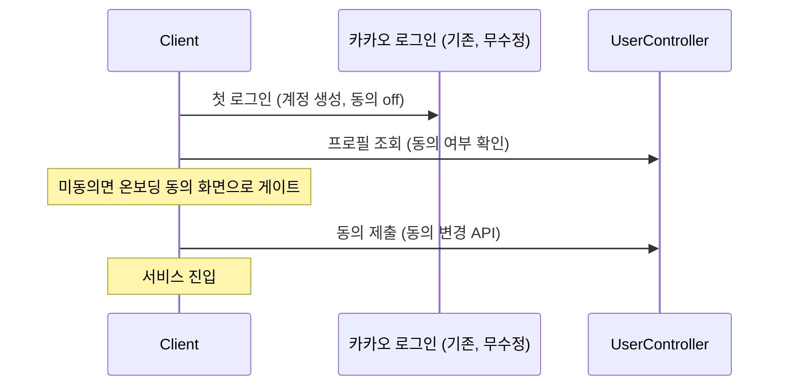
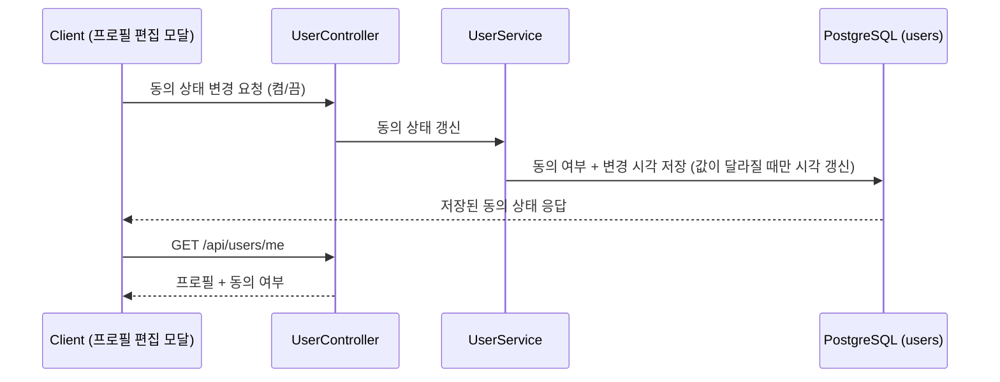
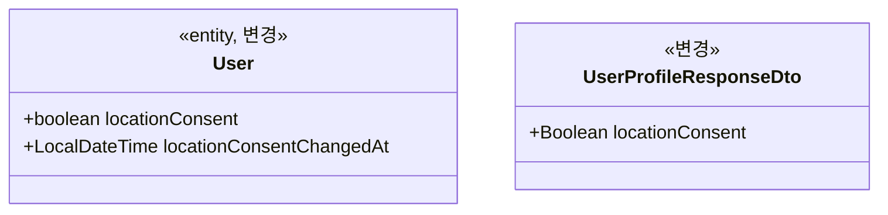

# PRD: 위치정보 사용 동의 (프로필 편집 토글)

> **개정 (2026-08-19, MSG-433)**: 위치기반서비스 동의는 철회 불가로 전환됐다(팀 합의, FR-USER-14 개정). 이 문서의 켜고 끄기 요구는 작성 시점 기록이며 현행 요구는 SRS FR-USER-14·FR-USER-15와 docs/prd/MSG-433-prd.md 참조.

> 티켓: MSG-402 · 작성일: 2026-08-15 · 작성: prd-writer
> 상태: 검토됨  <!-- 2026-08-15 정민 승인 — 온보딩 필수 수취 확정 반영(신규·기존 모두 off로 시작, 온보딩 동의 제출로 on), 티켓 MSG-402 발행 -->

## 1. 문제 상황

웹 디자인 ver 13의 프로필 편집 모달(노드 14599-3501, 2026-08-15 실측)에는 프로필 이미지 변경과
닉네임 입력 아래에 "위치정보 사용" 토글이 있다. 그런데 이 토글을 받쳐줄 것이 서버에 하나도 없다.
`users` 테이블에 관련 컬럼이 없고, 프로필 조회와 수정 API 어디에도 위치정보 항목이 없다. 지금
토글은 저장할 곳이 없는 임시 UI다.

이 공백은 새로 발견된 것이 아니다. 2026-07-17 갭 분석(위키 `06-research/갭 분석 디자인 문서 코드
싱크.md`)이 "프로필/설정 화면: 위치정보 동의·알림 설정 저장 테이블 없음"으로 지적했고, 그 뒤로
결정 없이 남아 있었다. FillMap은 영상 업로드 좌표라는 개인위치정보[^1]를 실제로 수집하는
서비스라, 위치정보법[^2]상 위치기반서비스 이용 동의를 받고 그 이력을 남겨야 하는 쪽에 가깝다.

## 2. 목적 · 목표

- **목적**: 프로필 편집의 위치정보 사용 토글에 실제 저장소와 API를 붙여, 사용자의 위치기반서비스
  이용 동의 상태를 서버가 보관하고 언제 동의하거나 철회했는지 답할 수 있게 한다 (SRS FR-USER-14).
- **목표**:
  - 카카오 로그인으로 처음 가입하는 사용자는 첫 로그인 직후 온보딩에서 위치기반서비스 이용
    동의를 필수로 거친다 (2026-08-15 정민 확정, 온보딩 방식까지 같은 날 확정). 로그인 수단이
    카카오 하나뿐이라 이 경로가 곧 전체 가입 경로다. 카카오 동의 화면에 약관을 끼우는
    간편가입(카카오 싱크)은 비즈 앱 전환이 전제라 채택하지 않았다.
  - 사용자가 프로필 편집에서 위치정보 사용을 켜고 끄면 서버에 저장되고, 다음 프로필 조회에 그
    상태가 그대로 나온다.
  - 서버가 사용자별로 마지막 동의·철회 시각을 보관한다.
- **비목표(스코프 제외)**:
  - 서버 측 기능 차단. 동의를 꺼도 서버는 업로드를 포함한 어떤 API도 막지 않는다. GPS 검증을
    두지 않기로 한 기존 결정(영상 업로드 PRD)과 같은 선상이고, 위치 기능 노출 제어는 FE 몫이다.
  - 브라우저 geolocation 권한[^3] 연동. OS와 브라우저가 통제하는 층이라 서버가 관여할 수 없다.
  - 동의 이력 테이블(변경할 때마다 행을 쌓는 방식). MVP는 마지막 시각 하나로 충분하다고 보고,
    감사 이력이 필요해지면 별도 요구로 올린다.
  - 위치기반서비스 사업자 신고[^4] 등 사업자 측 법무 절차. 서버 구현 범위 밖이다.
  - 알림 설정 토글. 같은 갭 분석에서 함께 지적됐지만 별개 요구라 따로 다룬다.

## 3. 기능 요구사항

| ID | 요구사항 | 우선순위 |
|----|----------|----------|
| FR-1 | 내 프로필 조회 응답에 위치정보 사용 동의 여부가 담긴다 | Must |
| FR-2 | 로그인 사용자는 위치정보 사용 동의를 켜고 끌 수 있고, 변경은 즉시 프로필 조회에 반영된다 | Must |
| FR-3 | 서버는 사용자별로 마지막 동의 또는 철회 시각을 저장한다. 동의 상태가 바뀔 때마다 이 시각이 갱신된다 | Must |
| FR-4 | 이미 저장된 값과 같은 값으로 다시 저장해도 실패하지 않고, 동의 시각은 갱신되지 않는다 | Should |
| FR-5 | 동의 여부는 다른 API의 동작에 영향을 주지 않는다. 동의를 끈 사용자의 영상 업로드, 지도 조회를 포함한 모든 기존 기능이 그대로 동작한다 | Must |
| FR-6 | 동의 상태는 본인만 조회하고 변경할 수 있다. 다른 사용자의 프로필 응답(친구 목록, 친구 프로필)에는 실리지 않는다 | Must |
| FR-7 | 첫 로그인(가입) 직후 온보딩에서 위치기반서비스 이용 동의를 필수로 받는다. 계정은 로그인 시점에 미동의(off)로 생성되고, 동의 전에는 클라이언트 온보딩 화면이 서비스 진입을 막는다(게이트는 FE, 서버 무차단 원칙 유지). 동의 제출은 프로필 편집과 같은 동의 변경 API로 기록된다 | Must |
| FR-8 | 배포 시점에 이미 존재하는 사용자도 미동의(off)로 시작하고, 다음 로그인에서 신규 가입자와 같은 온보딩 게이트를 지난다. 별도 일괄 재수취 절차는 두지 않는다 | Must |

## 4. 비기능 요구사항

| 분류 | 요구사항 |
|------|----------|
| 보안/인가 | 토큰 필수. 본인 계정의 동의 상태만 읽고 쓴다 (FR-6과 동일 경계) |
| 데이터 정합 | 동의·철회 시각은 UTC 저장(시각 처리 컨벤션 준수). 탈퇴 시 users 행 삭제로 함께 제거되어 별도 정리가 필요 없다 |
| 운영 | users 컬럼 추가 마이그레이션 1건. 기존 사용자 전원에 기본값이 부여되므로 배포만으로 데이터가 정합해야 하고 백필 스크립트는 없어야 한다 |

## 5. 시퀀스 다이어그램

첫 로그인 온보딩 흐름. 서버는 동의 상태를 응답할 뿐이고 진입 차단은 FE가 한다.

프로필 편집 토글 흐름. 온보딩의 동의 제출과 같은 API를 쓴다.

## 6. 클래스 다이어그램

동의 변경 요청 DTO 1종이 신규로 필요하다. 필드 구성과 엔드포인트 형태(닉네임 수정처럼 단독 PUT을
둘지)는 스펙 몫이다.

## 7. 변경 파일 목록

| 파일 | 변경 | Owner |
|------|------|-------|
| `src/main/resources/db/migration/V32__users_location_consent.sql` | 신규. users에 동의 여부·변경 시각 컬럼 (번호는 착수 시점 develop 기준 재확인) | B |
| `src/main/java/com/msg/fillmap/user/entity/User.java` | 수정. 필드 2개. 상태 전이 메서드는 두지 않는다(갱신은 리포지토리 원자 UPDATE 한 곳, 스펙 D-4) | B |
| `src/main/java/com/msg/fillmap/user/repository/UserRepository.java` | 수정. 동의 원자 UPDATE 쿼리 추가(단일 쓰기 경로, 스펙 D-4) | B |
| `src/main/java/com/msg/fillmap/user/controller/UserController.java` | 수정. 동의 변경 엔드포인트 추가 | B |
| `src/main/java/com/msg/fillmap/user/service/UserService.java` (+Impl) | 수정. 동의 갱신 로직 | B |
| `src/main/java/com/msg/fillmap/user/dto/UserProfileResponseDto.java` | 수정. 동의 여부 필드 추가 | B |
| `src/main/java/com/msg/fillmap/user/dto/` (동의 변경 요청 DTO) | 신규 | B |

auth 패키지는 변경하지 않는다. 온보딩 방식 확정(FR-7)으로 로그인 API는 무수정이고, FE가 로그인
직후 프로필 조회로 동의 상태를 확인한다. 로그인 응답 동봉은 스펙 D-2에서 미동봉으로 확정했다.
동봉 요구가 생기면 이 티켓이 아니라 별도 후속 티켓이다.

## 8. 미해결 질문

가입 시 동의 수취 여부와 기본값, 수취 방식은 모두 2026-08-15에 확정되어 FR-7, FR-8로 올라갔다
(첫 로그인 온보딩에서 필수 수취, 전원 off 시작, 게이트는 FE, 로그인 API 무수정).

- [ ] **off일 때 FE가 막는 기능 목록**: 서버는 차단하지 않으므로(FR-5) 어떤 기능을 숨기거나 막을지는
  FE 계약이다. 현재 위치 이동, 카메라 촬영 업로드 등 후보 목록을 FE와 합의해 위키에 남긴다.
- [ ] **온보딩 동의 화면의 정본 편입**: 시안은 2026-08-15에 만들어 뒀다
  (https://www.figma.com/design/3g1McR7M6hxyAwgCrcjrYA — 프로필 편집 모달 실측 스타일 그대로,
  정본 파일이 읽기 전용 계정이라 별도 파일). 편집 권한자가 카드 프레임을 웹 ver 13 정본에
  복사해 넣고 디자인 검수를 받아야 한다. 브라우저 위치 권한 팝업은 온보딩에서 당겨 띄우지 않고
  지도 홈에서 위치 기능을 처음 쓸 때 띄우는 것을 FE에 함께 전달한다.
- [ ] **약관 본문**: 위치기반서비스 이용약관 문서 자체(내용, 노출 위치)는 누가 언제 준비하나.
  서버는 동의 여부만 저장하고 약관 버전 관리는 이번 범위에서 다루지 않는다.

[^1]: 개인위치정보: 특정 개인의 위치를 알 수 있는 정보. FillMap에서는 영상 업로드에 딸려 오는 촬영 좌표가 여기 해당한다.
[^2]: 위치정보법(위치정보의 보호 및 이용 등에 관한 법률): 개인위치정보를 수집·이용하려면 이용자 동의를 받도록 정한 한국 법. 동의와 철회를 관리할 수 있어야 한다.
[^3]: geolocation 권한: 브라우저가 웹사이트의 위치 접근을 묻고 통제하는 표준 권한. 서비스가 아니라 브라우저 설정이 정본이라 서버에 저장할 대상이 아니다.
[^4]: 위치기반서비스 사업자 신고: 위치정보를 이용한 서비스를 제공하려는 사업자가 방송통신위원회에 하는 신고 절차. 코드가 아니라 사업 준비 항목이다.
