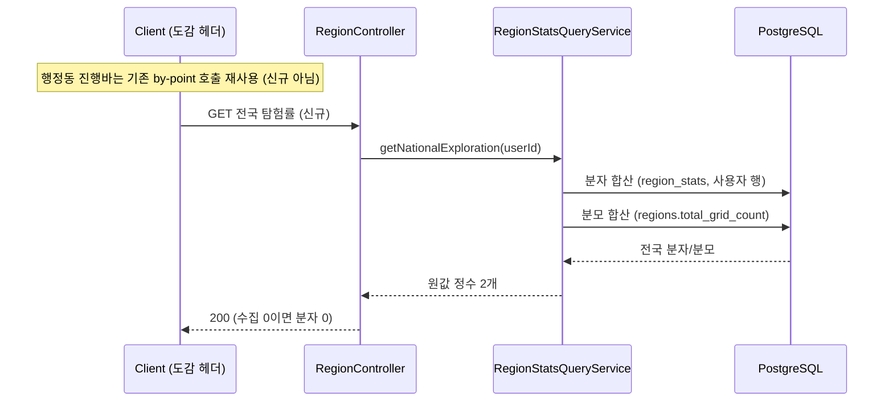

# PRD: 도감·프로필 헤더의 탐험률 요약 (전국 비율과 행정동 진행바)

> 티켓: MSG-406 · 작성일: 2026-08-19 · 작성: prd-writer
> 상태: 검토됨  <!-- 수명주기: 초안 → 검토됨(사용자 승인 시 게이트가 갱신) → 확정. 2026-08-19 승인, 같은 날 진행바 축을 시군구에서 행정동으로 정정 -->

## 1. 문제 상황

웹 ver 13 개인 도감 화면의 헤더(뱃지 탭 14599:12529, 지도 탭 14599:5081 공통)에 탐험률[^1] 두 개가 그려져 있다. 프로필 이름 아래 "전체 지도 0.012% 탐험"(전국 비율)과 탐험률 진행바다 (2026-08-15 뱃지 탭 프레임 대조에서 발견).

진행바의 값은 **현재 위치 행정동 기준 탐험률**이다 (2026-08-19 정민 확정). 행정동 단건 탐험률은 이미 구현되어 있다. `GET /api/regions/stats/by-point`(FR-REGION-07)가 좌표 하나로 그 행정동의 분자(collectedCount), 분모(totalCount), 비율(progressRate), 이름(regionName)을 반환하므로 진행바는 기존 API로 성립한다.

남는 갭은 **전국 비율 하나다.** 전국 격자 총수가 어느 API에도 노출되지 않아 "전체 지도 0.012% 탐험"을 계산할 재료가 없다. 헤더의 나머지 요소(수집 격자, 획득 뱃지, 연속 스트릭 3칸과 뱃지 진열장)는 기존 API로 성립하므로, 이 티켓의 신규 개발 범위는 전국 탐험률 조회뿐이다.

초안 단계에서 진행바를 시군구 기준으로 잘못 읽어 시군구 집계 부활까지 담았으나 같은 날 정정했다. 시군구 상위 집계의 유예(2026-07-22 개인 도감 확정 설계, 위키 cf-21528615)와 시/도 집계 범위 밖(SRS FR-REGION-13)은 **그대로 유지된다.**

## 2. 목적 · 목표

- **목적**: 도감·프로필 헤더가 디자인대로 그려지도록, 사용자 한 명의 전국 탐험 정도를 비율 재료로 제공한다.
- **목표**:
  - 로그인 사용자가 자신의 전국 탐험률 재료(분자와 분모)를 받을 수 있다.
  - 그 값이 기존 행정동 수집률과 같은 재료에서 나와 서로 모순되지 않는다.
- **비목표(스코프 제외)**:
  - 시군구·시/도 상위 집계(2026-07-22 유예와 FR-REGION-13 그대로, 초안의 부활 결정은 철회).
  - 행정동 진행바용 신규 API. 기존 by-point 조회(FR-REGION-07)를 그대로 쓴다.
  - 친구·타인의 탐험률 조회(본인 것만 다룬다).
  - `region_stats`[^2] 저장 구조 변경. 이번 값은 기존 물질화[^3] 값의 읽기 시 합산으로 만든다.
  - 지도 뷰포트 기반 집계(MSG-356, MSG-374)와의 통합. 축이 다르다(그쪽은 뷰포트, 이쪽은 사용자 전체).

## 3. 기능 요구사항

| ID | 요구사항 | 우선순위 |
|----|----------|----------|
| FR-1 | 로그인 사용자는 자신의 전국 탐험률 재료(자신이 점령한 전체 격자 수와 전국 격자 총수)를 조회할 수 있다 | Must |
| FR-2 | 헤더의 진행바는 현재 위치가 속한 행정동의 탐험률이다. 기존 by-point 조회(FR-REGION-07)가 재료(분자, 분모, 비율, 이름)를 이미 제공하므로 신규 개발 없이 성립한다 | Must |
| FR-3 | 수집이 0인 사용자도 오류가 아니라 분자 0을 받는다 | Must |
| FR-4 | 전국 분자와 분모는 반올림하지 않은 원값 정수로 제공되고, "0.012%" 같은 비율 계산과 표시 자릿수는 화면이 정한다. 비율이 100%를 넘지 않는 상한도 비율을 계산하는 화면 규약이다 | Must |
| FR-5 | 전국 분자는 행정동 수집률(region_stats)과 같은 재료에서 계산되어, 행정동 값의 합산과 모순되지 않는다 | Must |
| FR-6 | 현재 위치가 어느 행정동에도 속하지 않으면(바다, 국외) 행정동 진행바 없이 전국 비율만 보인다. 바다는 by-point가 200에 빈 값을 주는 기존 계약(FR-REGION-07) 그대로이고, 국외는 서비스 범위 밖 응답(FR-REGION-02) 그대로다. 오류 신설 없음 | Must |

**전국 분모의 정의(2026-08-19 확정)**: 전국 격자 총수는 행정동에 귀속되는 육지 격자 총수, 즉 행정동별 격자 수(FR-REGION-01이 적재 시 산출한 값)의 전체 합이다. 행정동 경계는 해안선까지 이르므로 해변과 해안 거리의 격자는 분모에 포함되고, 바다 위 격자만 빠진다.

엣지 케이스: 점령 격자 중 어느 행정동에도 속하지 않는 격자(해상 등, `grids.region_code`가 비어 있는 격자)는 행정동 귀속이 없어 분자에 넣을 수 없다. 전국 분자에서도 제외해 분모(행정동 귀속 격자 총수)와 축을 맞춘다. FR-5의 정합이 이 처리에서 나온다. 해안선에 걸친 격자는 기존 격자 중심점 축 규칙 그대로, 중심점이 행정동 안이면 포함된다.

## 4. 비기능 요구사항

| 분류 | 요구사항 |
|------|----------|
| 성능 | 실시간 조회 경로에서 공간 연산을 하지 않는다(FR-REGION-12의 축 유지). 쓰기 시점에 물질화된 region_stats와 regions의 합산만으로 계산하고, p95 300ms 이내 |
| 보안/인가 | 토큰 필수. 자신의 탐험률만 조회할 수 있다 |
| 데이터 정합 | 첫 점령과 점령 롤백이 region_stats를 같은 트랜잭션에서 갱신하므로(FR-REGION-05), 조회 시 합산인 이 값도 별도 갱신 장치 없이 즉시 반영된다 |
| 운영 | 마이그레이션 없음. 분모 재료(regions.total_grid_count)와 분자 재료(region_stats.collected_count)가 이미 있다. 전국 분모가 0이면 regions 미적재 상태이므로 화면은 그것을 정상 0%로 그리지 않는다 |

## 5. 시퀀스 다이어그램

## 6. 클래스 다이어그램

생략한다. 신규 타입은 응답 DTO 하나 수준으로 예상되고, 엔드포인트 형태는 스펙에서 확정한다.

## 7. 변경 파일 목록

리서치 기준 유력 후보다. 엔드포인트 형태 확정에 따라 스펙에서 조정한다.

| 파일 | 변경 | Owner |
|------|------|-------|
| `src/main/java/com/msg/fillmap/region/repository/RegionRepository.java` | 전국 분자/분모 합산 쿼리 추가 | A |
| `src/main/java/com/msg/fillmap/region/service/RegionStatsQueryService.java` (+Impl) | 전국 탐험률 조회 메서드 추가 | A |
| `src/main/java/com/msg/fillmap/region/controller/RegionController.java` | 조회 엔드포인트 추가 | A |
| `src/main/java/com/msg/fillmap/region/dto/` | 전국 탐험률 응답 DTO 신규 | A |
| `src/test/java/com/msg/fillmap/region/...` | 합산 정합, 0 사용자, 무귀속 제외 테스트 | A |

마이그레이션과 신규 인덱스는 없다. region_stats는 (user_id) 축 합산, regions는 전체 합산이라 소규모다(스펙에서 실행 계획으로 확인).

## 8. 미해결 질문

- [x] 헤더 진행바의 축: **행정동 기준**으로 확정 (2026-08-19 정민, 초안의 시군구 해석을 정정). 행정동 단건은 기존 API 재사용.
- [x] 전국 분모 정의: 행정동 귀속 육지 격자 총수의 합. 해변 포함, 바다 위 제외 (2026-08-19 확정).
- [x] SRS: FR-REGION-14 등재 후 행정동 축 정정 반영.
- [ ] **디자인 라벨 대조**: ver 13 진행바 라벨이 "부산진구 탐험률"(시군구 이름)인데 확정된 값은 행정동 기준이다. 라벨을 행정동 이름("부전동 탐험률")으로 갱신할지 디자인 확인 필요. 값 계약에는 영향 없음(by-point의 regionName으로 어느 쪽도 조립 가능).

[^1]: 탐험률: 사용자가 점령한 격자 수를 그 범위의 전체 격자 수로 나눈 비율. 코드와 기존 문서의 "수집률"과 같은 개념이고, 화면 문구가 "탐험"이라 이 문서는 탐험률로 쓴다.
[^2]: region_stats: 사용자별, 행정동별 수집 현황(점령 격자 수, 전체 격자 수, 비율)을 미리 계산해 두는 테이블. 업로드와 삭제 시점에 같은 트랜잭션으로 갱신된다(MSG-155).
[^3]: 물질화: 조회할 때마다 계산하지 않고, 쓰기 시점에 결과를 미리 계산해 저장해 두는 방식. 조회가 빨라지는 대신 쓰기 경로가 갱신을 책임진다.
