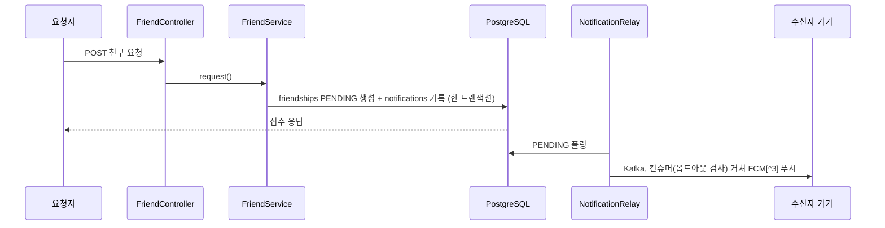

# PRD: 친구 요청·수락 알림

> 티켓: MSG-416 · 작성일: 2026-08-18 · 작성: prd-writer
> 상태: 검토됨 (2026-08-18 성민 승인)

## 1. 문제 상황

친구 기능은 요청부터 수락, 목록, 친구 도감 열람까지 갖춰져 있지만(MSG-185~187) 알림이 없다.
요청을 받은 사용자는 앱을 열어 요청 목록을 직접 확인하기 전까지 요청이 온 사실 자체를 모르고,
요청을 보낸 쪽도 상대가 수락했는지 알 길이 없다. 알림 파이프라인[^1]은 이미 카테고리 5종으로
운영 중인데(MSG-178~181) friend 도메인에는 알림 기록 호출이 한 건도 없다.

SRS에는 FR-NOTI-13이 "친구 활동 알림은 도입하지 않는다"로 등재돼 있으나, 그 근거인 MSG-313
PRD는 이를 기각이 아니라 "friend 도메인은 완성됐으나 이번 묶음 밖, 후속 티켓"으로 적어 두었다.
이 PRD가 그 후속이다.

## 2. 목적 · 목표

- **목적**: 친구 요청과 수락을 바로 알려서, 상대가 우연히 앱을 열 때까지 친구 맺기가 멈춰 있는
  공백을 없앤다.
- **목표**:
  - 친구 요청을 받으면 푸시 알림이 온다.
  - 내가 보낸 요청이 수락되면 푸시 알림이 온다.
- **비목표**:
  - 거절 통지. 거절은 보낸 쪽에 알리지 않는다는 기존 요구(FR-FRIEND-04)를 그대로 유지한다.
  - 친구의 격자 수집 같은 활동 피드형 알림.
  - 알림 이력 조회 API. 전 카테고리 공통의 별개 과제다(FR-NOTI-12).

## 3. 기능 요구사항

| ID | 요구사항 | 우선순위 |
|----|----------|----------|
| FR-1 | 친구 요청이 접수되면 수신자에게 요청자 닉네임이 담긴 요청 도착 알림이 발송된다 | Must |
| FR-2 | 수신자가 요청을 수락하면 요청자에게 수락자 닉네임이 담긴 수락 알림이 발송된다 | Must |
| FR-3 | 상호 요청으로 자동 수락되면(FR-FRIEND-03) 먼저 요청했던 쪽에 수락 알림이 간다. 나중에 요청한 쪽은 요청 응답에서 이미 결과를 받으므로 알림을 보내지 않는다 | Must |
| FR-4 | 거절은 어느 쪽에도 알림을 만들지 않는다 | Must |
| FR-5 | 알림 기록은 요청 접수나 수락 처리와 원자적이고, 메시지 재전달이 같은 사용자에게 중복 푸시가 되지 않는다 (FR-NOTI-02, FR-NOTI-03 승계) | Must |
| FR-6 | 알림은 신설 카테고리 FRIEND로 분류되고, 사용자는 기존 설정 방식대로 수신을 끌 수 있다. 기본값은 켜짐이다 (FR-NOTI-06 옵트아웃[^2] 모델) | Must |
| FR-7 | 거절된 뒤 같은 상대가 다시 요청하면 수신자에게 새 알림이 간다. 재요청은 허용된 동작이다(FR-FRIEND-04) | Must |
| FR-8 | 같은 상대에 대한 요청 도착 알림은 수신자 기준 하루 1건이 상한이다. 차단 기능이 없는 동안 반복 재요청이 알림 스팸이 되는 것을 막는다 (2026-08-18 확정) | Must |

## 4. 비기능 요구사항

| 분류 | 요구사항 |
|------|----------|
| 데이터 정합 | 요청이나 수락이 커밋되면 알림 기록도 반드시 남고, 롤백되면 알림도 남지 않는다 (아웃박스 승계) |
| 운영 | notifications 카테고리 CHECK 제약을 상위집합으로 재정의하는 마이그레이션이 필요하다. V25, V26과 같은 형상이라 기존 행 무변경이고 롤백 부담이 없다 |

## 5. 시퀀스 다이어그램

수락 흐름도 같은 골격이다. accept()가 ACCEPTED 승격과 알림 기록을 한 트랜잭션에 담고,
수신인만 요청자로 바뀐다.

## 6. 클래스 다이어그램

신규 타입 없음. NotificationCategory 열거형에 값 하나가 추가될 뿐이다.

## 7. 변경 파일 목록

| 파일 | 변경 | Owner |
|------|------|-------|
| `src/main/java/com/msg/fillmap/notification/entity/NotificationCategory.java` | FRIEND 추가 | B |
| `src/main/resources/db/migration/V35__notification_category_friend.sql` | CHECK 상위집합 재정의 (신규) | - |
| `src/main/java/com/msg/fillmap/friend/service/FriendServiceImpl.java` | 요청 접수, 수락, 자동 수락 세 지점에 알림 기록 호출 | B |

닉네임은 요청 처리 중 이미 조회하는 상대 사용자 행에서 얻는다. 알림 설정 API는 열거형 기반
파싱이라 코드 변경 없이 FRIEND를 받아들인다. 번호 V35는 현재 최신 V34 기준이고, 블라인드 통지
PRD와 같이 진행하면 카테고리 확장 마이그레이션 하나로 합칠 수 있다.

## 8. 미해결 질문

- [x] 재요청 스팸 상한: 같은 상대 하루 1건으로 확정, FR-8로 편입 (2026-08-18).
- [ ] 알림을 탭했을 때 이동할 목적지(받은 요청 목록 화면)와 딥링크[^4] 데이터. 푸시 딥링크는
  전 카테고리 공통 공백이라(FR-NOTI-12) 여기서 함께 풀지 별도 과제로 둘지.
- [x] SRS 정리: FR-NOTI-13(친구 활동 알림 미도입)을 이 요구로 대체 등재 (2026-08-18 승인과 함께 처리).

[^1]: 알림 파이프라인: 도메인 변경과 같은 트랜잭션으로 알림 요청을 DB에 먼저 기록(아웃박스)하고, 폴러가 Kafka로 넘겨 컨슈머가 FCM 발송하는 구조. 장애가 나도 커밋된 알림은 유실되지 않는다.
[^2]: 옵트아웃: 기본이 수신 켜짐이고 사용자가 원할 때 끄는 방식. 반대가 옵트인이다.
[^3]: FCM: Firebase Cloud Messaging. 구글의 푸시 발송 서비스로, 기기별 토큰으로 알림을 보낸다.
[^4]: 딥링크: 알림을 탭하면 앱의 특정 화면으로 바로 이동시키는 연결 정보.
