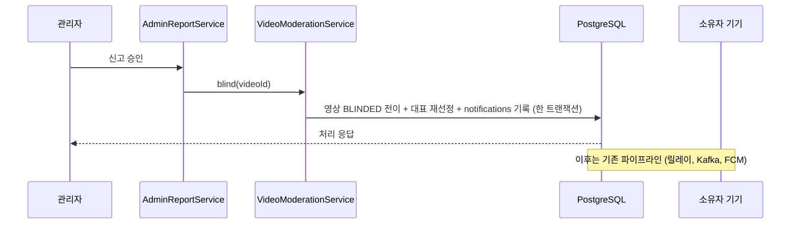

# PRD: 영상 블라인드 소유자 통지

> 티켓: MSG-417 · 작성일: 2026-08-18 · 작성: prd-writer
> 상태: 검토됨 (2026-08-18 성민 승인)

## 1. 문제 상황

신고 승인이나 운영 판단으로 영상이 블라인드[^1]되면 그 즉시 타인 재생이 404가 되고 전역 노출과
개인 목록에서 사라진다(FR-MOD-06). 그런데 소유자에게는 아무 통지가 가지 않는다. 소유자가 상황을
알 방법은 자기 영상 상태를 직접 확인하는 것뿐이라, 영상이 왜 목록에서 사라졌는지 모른 채 서비스
오류로 오해하기 쉽다. 제재를 통지 없이 적용하는 것은 신뢰 문제이고, 재업로드나 문의 같은 다음
행동의 출발점도 없다.

SRS의 FR-MOD-14는 "신고자에게 처리 결과를 알리는 기능은 도입하지 않는다"인데, 이는 신고한 쪽
이야기다. 조치를 당한 소유자에 대한 통지는 정해진 바가 없어 이 PRD가 새로 정한다.

## 2. 목적 · 목표

- **목적**: 영상에 가해진 조치를 소유자가 즉시 알게 해서, 몰래 사라지는 경험을 없애고 다음
  행동으로 이어지게 한다.
- **목표**:
  - 내 영상이 블라인드되면 푸시 알림이 온다.
  - 블라인드가 해제되면 복구 알림이 온다.
- **비목표**:
  - 신고자에 대한 처리 결과 통지. FR-MOD-14를 그대로 유지한다.
  - 이의 제기 기능. 현재 제품에 없고 이번에 만들지 않는다.
  - 블라인드 사유(신고 사유)의 노출.

## 3. 기능 요구사항

| ID | 요구사항 | 우선순위 |
|----|----------|----------|
| FR-1 | 영상이 블라인드로 전환되면 소유자에게 알림이 발송된다. 전환 트리거가 신고 승인이든 운영 직접 조치든 같은 알림이다 | Must |
| FR-2 | 문구는 조치 사실과 대상을 알리되 신고 사유, 신고자 정보, 신고 존재 여부는 싣지 않는다. 영상 처리 실패 알림이 탈락 사유를 싣지 않는 것과 같은 결이다(FR-NOTI-10) | Must |
| FR-3 | 블라인드가 해제되면 소유자에게 복구 알림이 발송된다 (2026-08-18 확정) | Must |
| FR-4 | 알림 기록은 상태 전이 트랜잭션과 원자적이다. 전이가 실패로 롤백되면 알림도 남지 않는다 (FR-NOTI-02 승계) | Must |
| FR-5 | 해제 후 다시 블라인드되면 새 알림이 간다. 같은 전이가 재시도돼도 중복 푸시는 되지 않는다 (FR-NOTI-03 승계) | Must |
| FR-6 | 신고자에게는 어떤 통지도 가지 않는다 | Must |
| FR-7 | 알림은 신설 카테고리(MODERATION)로 분류되며 수신 거부 대상이 아니다. 설정 화면에 노출되지 않고 끌 수 없다. 옵트아웃 대상은 기존 5종 그대로다 (2026-08-18 확정) | Must |

## 4. 비기능 요구사항

| 분류 | 요구사항 |
|------|----------|
| 보안 | 알림 문구와 데이터 어디에도 신고자를 특정할 정보가 담기지 않는다 |
| 데이터 정합 | 블라인드 전이와 알림 기록의 원자성. 전이는 됐는데 알림만 없는 상태를 만들지 않는다 |
| 운영 | notifications 카테고리 CHECK 재정의 마이그레이션 필요 (V25, V26 선례와 같은 형상) |

## 5. 시퀀스 다이어그램

운영 직접 조치도 같은 VideoModerationService.blind()를 지나므로 기록 지점은 한 곳이다.

## 6. 클래스 다이어그램

신규 타입 없음. 카테고리 열거형 값 추가뿐이다.

## 7. 변경 파일 목록

| 파일 | 변경 | Owner |
|------|------|-------|
| `src/main/java/com/msg/fillmap/notification/entity/NotificationCategory.java` | MODERATION 추가 | B |
| `src/main/resources/db/migration/V35__*.sql` | CHECK 상위집합 재정의 (친구 알림 PRD와 같이 가면 하나로 합침) | - |
| `src/main/java/com/msg/fillmap/video/service/VideoModerationServiceImpl.java` | blind(), unblind()에 알림 기록 호출. 두 트리거(신고 승인, 직접 조치)가 모두 이 서비스를 지나므로 이 한 곳이면 된다 | B |

## 8. 미해결 질문

- [x] 카테고리: 신설(MODERATION) + 끌 수 없음으로 확정, FR-7로 편입 (2026-08-18). 알림 설정
  API가 이 카테고리의 토글 요청을 받지 않게 하는 가드는 스펙에서 정한다.
- [x] 복구 알림 포함으로 확정, FR-3을 Must로 승격 (2026-08-18 성민).
- [x] 문의 채널 안내는 넣지 않는 것으로 확정 (2026-08-18 성민). 안내할 기능이 서비스에 없어서다.
  문의 채널이 생기면 그때 문구만 수정한다.

[^1]: 블라인드: 운영 조치로 영상을 타인에게 숨기는 상태. 삭제와 달리 점령과 영상 수에는 영향이 없고(FR-MOD-08) 해제로 되돌릴 수 있다.
