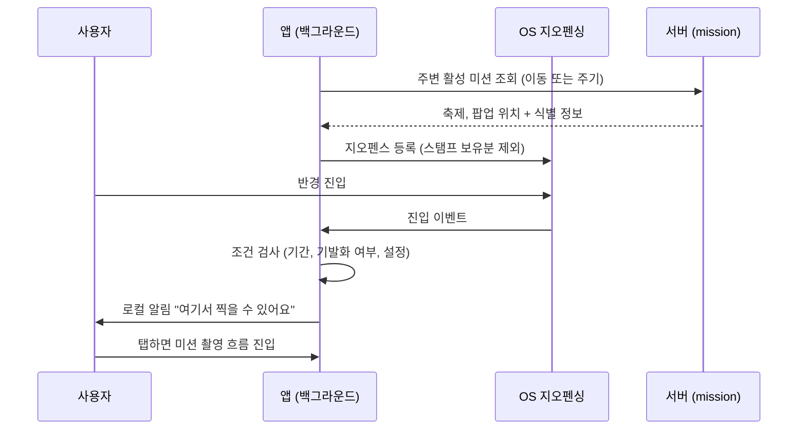

# PRD: 근접 미션 알림 (축제·팝업 촬영 유도)

> 티켓: MSG-418 · 작성일: 2026-08-18 · 작성: prd-writer
> 상태: 검토됨 (2026-08-18 성민 승인)

## 1. 문제 상황

축제와 팝업 미션은 그 자리에 가야 완료된다. 팝업은 판정 반경을 40m까지 좁혀서(FR-MISSION-10)
실제 방문 없이는 스탬프를 못 받게 해 두었다. 그런데 미션의 존재를 알 방법은 사용자가 지도를
직접 열어 봤을 때뿐이다(FR-MISSION-13). dev 적재 실측으로 활성 축제 222건, 팝업 227건이 깔려
있는데, 그 바로 앞을 지나가는 사용자를 잡을 수단이 없다. 방문 기록 서비스의 핵심 순간은
사용자가 그 장소에 실제로 있는 순간이고, 지금은 그 순간에 개입하지 못한다.

두 가지 전제 사실이 범위를 정한다.

- 웹은 백그라운드 위치를 지원하지 않는다. 브라우저는 페이지가 닫히면 위치를 알 방법이 없다.
  따라서 이 기능은 앱 전용이다(Android 먼저, 이후 iOS).
- 위치기반서비스 이용 동의는 이미 구현돼 있다(FR-USER-14, MSG-402). 다만 백그라운드 위치는
  OS 권한이 별도로 필요하다.

## 2. 목적 · 목표

- **목적**: 사용자가 미션 장소 근처에 실제로 있는 순간에 촬영을 유도해서, 미션 완료율과 영상
  업로드를 늘린다.
- **목표**:
  - 활성 축제나 팝업 근처에 도달하면 앱이 꺼져 있어도 알림이 온다.
  - 알림을 탭하면 그 미션의 촬영 흐름으로 바로 들어간다.
- **비목표**:
  - 코스 미션. 경로형이라 점 반경 모델이 맞지 않는다. 포토스팟 단위 확장은 반응을 보고 추후
    판단한다.
  - 웹. 위 전제대로 기술적으로 불가하다.
  - 서버가 사용자 위치를 받아 판정하는 방식. 위치 수집을 전제해서 아래 FR-2와 충돌한다.
  - 친구 근접 알림 같은 사람 대 사람 근접 기능.

## 3. 기능 요구사항

| ID | 요구사항 | 우선순위 |
|----|----------|----------|
| FR-1 | 위치 동의(FR-USER-14)와 OS 백그라운드 위치 권한을 모두 허용한 앱 사용자는, 활성 축제나 팝업의 근접 반경 안에 들어오면 촬영을 유도하는 알림을 받는다. 근접 반경은 미션 경계 기준 팝업 200m, 축제 500m이고, 앱 상수라 출시 후 반응을 보고 조정할 수 있다 (2026-08-18 확정). 앱이 실행 중이 아니어도 받는다 | Must |
| FR-2 | 사용자 위치는 기기 밖으로 나가지 않는다. 서버는 위치를 수집하거나 저장하지 않고, 근접 판정은 기기의 지오펜싱[^1]이 한다. 서버 역할은 미션 위치 데이터 제공까지다 (2026-08-18 기기 판정형으로 확정) | Must |
| FR-3 | 이미 스탬프를 받은 미션과 기간이 끝난 미션은 알림 대상에서 빠진다 | Must |
| FR-4 | 같은 미션의 근접 알림은 사용자당 1회다. 반경을 나갔다 다시 들어와도 반복 발화하지 않는다. 여기에 더해 하루 전체 5건(KST 자정 경계) 상한을 두며, 이 값도 앱 상수다 (2026-08-18 확정) | Must |
| FR-5 | 알림을 탭하면 해당 미션의 촬영 흐름으로 진입한다 | Must |
| FR-6 | 사용자는 이 알림을 설정에서 끌 수 있고, 위치 동의를 철회하거나 OS 권한을 회수하면 알림도 멈춘다. 권한이 없을 때는 실패가 아니라 조용한 미동작이다. 끄기 설정은 서버 알림 설정의 전용 카테고리 MISSION_NEARBY로 저장해 기기 간 동기화된다 (2026-08-18 FE 협의 후 확정) | Must |
| FR-7 | 기기는 지오펜스 등록에 필요한 주변 활성 미션(축제, 팝업)의 위치와 식별 정보를 서버에서 받을 수 있다. 기존 뷰포트 미션 조회(FR-MISSION-01)를 재사용한다 (2026-08-18 FE 합의 — 팝업도 축제와 같은 BOX 형상이고, 중심점은 polygon 앞 4점 평균으로 기기가 계산한다) | Must |
| FR-8 | 미션 데이터가 수동 갱신(FR-MISSION-11)으로 바뀌면 기기의 지오펜스도 다음 갱신 주기에 따라온다. 실시간 일치는 요구하지 않는다 | Must |

## 4. 비기능 요구사항

| 분류 | 요구사항 |
|------|----------|
| 프라이버시 | 위치 미수집 원칙(FR-2). 위치정보법 관점에서 서버가 새로 지는 의무가 없어야 한다. 기존 위치 동의(FR-USER-14) 범위 안에서 성립하는지 확인이 필요하다 |
| 배터리 | 상시 GPS 폴링이 아니라 OS 지오펜싱 API 사용을 전제한다. 배터리 소모로 앱 삭제를 부르면 역효과다 |
| 운영 | 서버 변경 폭이 작거나 없다. 알림이 기기 로컬 생성이면 서버 알림 파이프라인(아웃박스, FCM)을 타지 않는다 |

## 5. 시퀀스 다이어그램

## 6. 클래스 다이어그램

서버 신규 타입 없음. 조회는 기존 재사용으로 합의됐고(FR-7), 남은 서버 몫은 알림 설정 카테고리 확장과 문서 한 줄이다.

## 7. 변경 파일 목록

| 파일 | 변경 | Owner |
|------|------|-------|
| `src/main/java/com/msg/fillmap/notification/entity/NotificationCategory.java` | MISSION_NEARBY 추가 | B |
| `src/main/resources/db/migration/V36__*.sql` | 카테고리 CHECK 상위집합 재정의 (V35 선례) | - |
| `src/main/java/com/msg/fillmap/notification/consumer/NotificationConsumer.java` | rateLimited 전수 분기에 case 추가 (서버 발송 경로는 없지만 컴파일 단위) | B |
| 알림 설정 표면 (Controller, DTO, ErrorCode 등) | 설정 대상 카테고리 7종화 | B |
| `src/main/java/com/msg/fillmap/mission/dto/MissionShape.java` | BoxShape 스키마 설명에 POPUP 명시 (FE 혼동 원인이던 문서 한 줄) | B |

구현의 무게중심은 앱(FE)이다. 이 PRD는 서버 레포에 두지만 요구사항의 절반 이상이 앱 몫이라,
확정되면 FE와 계약 논의가 선행돼야 한다.

## 8. 미해결 질문

- [x] 근접 반경: 미션 경계 기준 팝업 200m, 축제 500m로 확정 (2026-08-18 성민). 팝업은 도보
  2~3분 거리와 OS 지오펜싱 실용 하한(100m) 사이에서, 축제는 목적지형이고 개수가 적어 더 멀리
  잡았다. FR-1에 편입, 앱 상수라 출시 후 조정 가능.
- [x] 하루 전체 상한: 5건(KST 자정 경계)으로 확정 (2026-08-18 성민). 기존 알림 피로 억제
  기조를 따르되 행동 직결 알림이라 여유를 뒀다. FR-4에 편입, 앱 상수.
- [ ] OS 지오펜스 개수 제한 대응. Android는 앱당 100개, iOS는 20개라 주변 미션이 그보다 많으면
  기기가 무엇을 등록할지 골라야 한다. 갱신 전략은 앱 몫이지만 서버 조회의 정렬과 개수 계약에
  영향을 준다.
- [x] 위치 처리: 기기 판정형(위치 미수집)으로 확정 (2026-08-18). 발화 이력이 서버에 안 남는
  것까지 감수하는 결정이다.
- [ ] 디자인 부재. 앱 정본(ver 5)에 알림 관련 화면이 없다. 설정 토글, 권한 요청 온보딩, 알림
  문구가 디자인 필요 항목이다. 백그라운드 위치 권한은 OS가 거부감 큰 권한이라 요청 시점과
  설득 문구가 성패를 가른다.
- [x] 알림 설정 저장 위치: 서버 동기화로 확정, 전용 카테고리 MISSION_NEARBY 신설 (2026-08-18
  FE 협의 후 성민 확정). HOTZONE 재사용은 핫구역 알림을 끈 사용자가 미션 알림까지 잃는 결합이
  생겨 기각했다. 알림 자체는 기기 로컬 생성 그대로이고, 기기는 발화 전에 이 설정을 조회해 따른다.

[^1]: 지오펜싱: OS에 "이 좌표 반경 안에 들어오면 깨워 달라"고 등록해 두는 기능. 앱이 GPS를 계속 켜지 않아도 OS가 저전력으로 진입을 감지해 준다.
