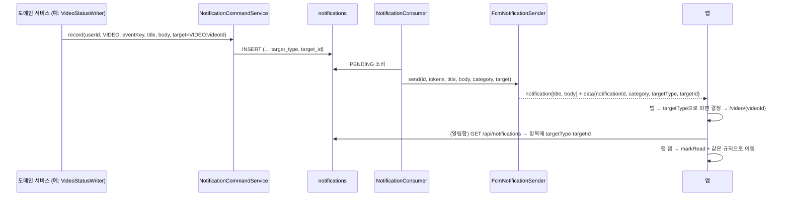
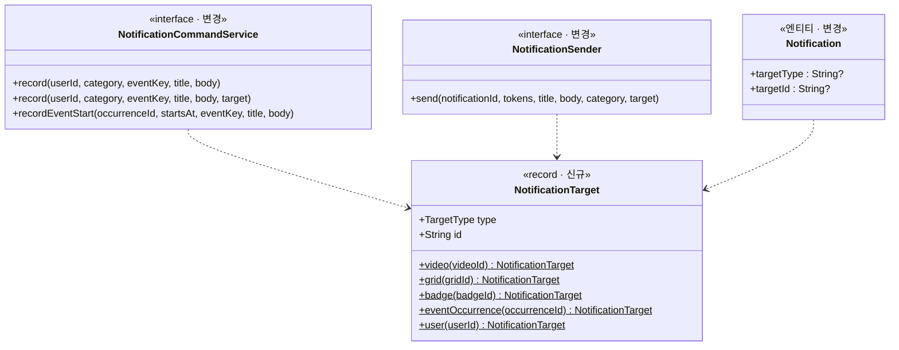

# PRD: 알림 딥링크 (알림을 누르면 관련 화면으로 바로 이동)

> 티켓: MSG-432 · 작성일: 2026-09-23 · 작성: FE 하네스(성민 위임) — 초안
> 상태: 검토 대기 (미해결 질문 4건 — 8절)

## 1. 문제 상황

푸시 알림은 제목과 본문만 싣고 나간다. `FcmNotificationSender.buildMessage()`의 `data`에는 `notificationId` 하나뿐이라, 알림을 눌러도 앱 첫 화면이 열릴 뿐이다. 알림 7종(뱃지·핫구역·스트릭·영상·주간 요약·친구·운영 조치)에 행사(EVENT)까지 8종 전부가 같은 상태다.

2026-09-23에 앱 알림함(MSG-602, FE PR #158)이 열리면서 두 번째 진입점이 생겼다. 알림함 행을 눌러도 읽음 처리만 되고 이동은 없다. 알림함 목록 응답(`NotificationItemResponseDto`)에 이동 재료가 없기 때문이다. MSG-434 PRD 8절이 "행 탭 이동용 대상 식별자는 MSG-432가 푸시 페이로드와 한꺼번에 정한다"로 이월해 둔 지점이다.

서버는 대상 식별자를 이미 알고 있다. 영상 알림은 `videoId`, 핫구역은 `gridId`, 뱃지는 `badgeId`, 행사는 `occurrenceId`를 `event_key`에 넣어 기록한다(`VIDEO:{videoId}:…`, `HOTZONE:{날짜}:{gridId}`, `BADGE:{badgeId}`, `EVENT_START:{occurrenceKey}:{epoch}`). 다만 `event_key`는 dedupe용 내부 키라 형식이 카테고리마다 다르고, 스트릭·주간 요약처럼 대상이 없는 것도 있으며, 응답에 싣지 않는 것이 비기능 요구(MSG-434 §4 보안)다. 그래서 앱이 `event_key`를 파싱하는 방식은 택하지 않는다.

## 2. 목적 · 목표

- **목적**: 알림(푸시·알림함)을 누른 사용자가 그 알림이 가리키는 화면에 바로 도착하게 한다. "영상이 준비됐어요"를 누르면 그 영상이, "핫구역에 들어갔어요"를 누르면 그 격자가 열린다.
- **목표**:
  - 서버가 알림마다 **이동 대상**(`targetType` + `targetId`)을 기록하고, 푸시 `data`와 알림함 응답 양쪽에 같은 형태로 싣는다.
  - 앱이 카테고리가 아니라 **대상 종류**로 화면을 정한다. 카테고리↔화면 표는 FE가 소유하고(이 문서 §3 표가 정본) 서버는 대상만 준다.
  - 이동 정보가 없는 알림(기존 발송분, 대상이 없는 종류)은 첫 화면(지도 홈)으로 간다. 앱이 죽거나 빈 화면이 뜨지 않는다.
- **비목표(스코프 제외)**:
  - 발송 파이프라인(outbox 릴레이·Kafka·FCM 전송 흐름) 자체의 변경. `data` 필드를 더하는 것뿐이다.
  - 웹 푸시 클릭 라우팅. 웹 서비스워커에 `notificationclick`이 없고(MSG-477에서 등록 진입점도 제거) 별도 웹 티켓으로 둔다. 페이로드 계약은 같은 것을 쓴다.
  - 근접 미션(MISSION_NEARBY) 로컬 알림. 서버 발송 경로가 없어 이 계약 밖이다(FR-NOTI-16 앱 몫에서 정한다).
  - 알림 문구·발송 정책·상한(FR-NOTI-07) 변경.

## 3. 기능 요구사항

SRS 대조: FR-NOTI-12(딥링크 데이터 부재 — 계획)를 이 PRD가 상세화한다. MSG-434가 FR-NOTI-17로 이력·읽음을 가져갔으므로 이 항목에는 딥링크만 남아 있다.

| ID | 요구사항 | 우선순위 |
|----|----------|----------|
| FR-1 | 알림 기록 시점에 이동 대상을 함께 저장한다. 대상은 **종류**(`targetType`)와 **식별자**(`targetId`) 두 값이고, 대상이 없는 알림은 둘 다 비운다 | Must |
| FR-2 | 푸시 `data`에 `category`·`targetType`·`targetId`를 싣는다(기존 `notificationId` 유지). 대상이 없으면 `targetType`·`targetId` 키를 넣지 않는다. 알림 표시(`notification` 필드)는 그대로라 백그라운드 자동 표시와 탭 시 `data` 전달이 유지된다 | Must |
| FR-3 | 알림함 목록 응답 항목에 `targetType`·`targetId`(nullable)를 더한다. 값의 의미는 FR-2와 같다 | Must |
| FR-4 | 대상 종류는 `VIDEO`(videoId)·`GRID`(gridId)·`BADGE`(badgeId)·`EVENT_OCCURRENCE`(occurrenceId)·`USER`(userId) 5종으로 시작한다. 새 종류는 SRS 개정으로 더한다 | Must |
| FR-5 | 카테고리별 대상 (서버 기록 규칙): VIDEO·MODERATION → `VIDEO:{videoId}` · HOTZONE → `GRID:{gridId}` · BADGE(획득·임박) → `BADGE:{badgeId}` · EVENT(시작·일정 변경) → `EVENT_OCCURRENCE:{occurrenceId}` · FRIEND(요청 도착) → `USER:{요청자 userId}`, FRIEND(수락) → `USER:{수락자 userId}` · REMIND·WEEKLY → 대상 없음 | Must |
| FR-6 | 앱은 `targetType`으로 화면을 정한다(표는 아래). 알 수 없는 `targetType`이나 대상 없음은 지도 홈이다 | Must |
| FR-7 | 푸시 탭: 앱이 실행 중이든(포그라운드·백그라운드) 종료 상태(콜드 스타트)든 같은 화면으로 이동한다. 콜드 스타트는 로그인 게이트·약관 게이트를 먼저 통과한 뒤 이동한다 | Must |
| FR-8 | 알림함 행 탭: 읽음 처리와 함께 같은 규칙으로 이동한다. 대상이 없는 행은 읽음 처리만 한다(이동 없음 — 알림함에 이미 와 있으므로 홈으로 튕기지 않는다) | Must |
| FR-9 | 대상이 삭제됐거나 접근할 수 없으면(삭제된 영상, 종료돼 노출 기간이 지난 회차, 차단한 사용자) 목적지 화면의 기존 오류 처리(404 안내·빈 상태)에 맡긴다. 알림 쪽에서 미리 검사하지 않는다 | Should |
| FR-10 | 이 PRD 이전에 발송·기록된 알림(대상 컬럼 NULL)을 눌러도 앱이 죽지 않고 지도 홈이 열린다(티켓 완료 조건 3) | Must |

**대상 종류 → 앱 화면 (FE 소유, 정본은 `apps/mobile` 코드의 라우팅 표)**

| targetType | 앱 목적지 | 비고 |
|---|---|---|
| `VIDEO` | 영상 재생 화면 `/video/{videoId}` | MODERATION(가려짐)도 같은 곳 — 소유자는 가려진 영상을 볼 수 있어야 하는지가 8절 Q3 |
| `GRID` | 지도 홈 `/home?gridId={gridId}` (기존 검색 진입 파라미터 재사용 — 해당 격자로 이동·하이라이트) | 셀 상세 시트까지 열지는 Q4 |
| `BADGE` | 도감 뱃지 탭 | 모바일에 뱃지 단건 화면이 없다. 탭 파라미터가 없으므로 `/dex?tab=badges` 신설 필요(FE) |
| `EVENT_OCCURRENCE` | 지도 홈 + 행사방 개요 시트 `/home?occurrenceId={id}` | 홈 파라미터 신설 필요(FE). 종료 회차는 기존 "지난 행사 기록" 상태로 열린다 |
| `USER` | 친구 화면 | **모바일에 친구 화면이 없다**(바텀 탭 "친구"는 MSG-556에서 AI 추천으로 교체). 생길 때까지 지도 홈 — Q1 |
| 없음 / 미지 | 지도 홈 `/home` | REMIND·WEEKLY·기존 알림 |

## 4. 비기능 요구사항

| 분류 | 요구사항 |
|------|----------|
| 호환 | 푸시는 `notification`+`data` 혼합을 유지한다. `data` 전용으로 바꾸면 표시 책임이 앱으로 넘어가 백그라운드 표시가 깨진다. 기존 앱 버전은 모르는 `data` 키를 무시한다 |
| 보안 | `event_key`·발송 내부 상태는 여전히 응답·페이로드에 싣지 않는다. `targetId`는 앱이 이미 API로 조회할 수 있는 공개 식별자(videoId·gridId·badgeId·occurrenceId·userId)만 쓴다. 페이로드에 닉네임 등 개인정보를 더하지 않는다 |
| 데이터 | `notifications`에 `target_type VARCHAR(20)`·`target_id VARCHAR(64)` NULL 허용 컬럼 추가(마이그레이션 1건). 기존 행은 NULL. `event_key` UNIQUE·dedupe 규칙은 무변경 |
| 크기 | FCM `data`는 4KB 상한 — 추가 3키로 여유가 충분하다. iOS(APNs)는 커스텀 키로 전달된다 |
| 운영 | 대상 저장 실패가 알림 기록을 막으면 안 된다 — 같은 트랜잭션의 컬럼 2개 추가라 별도 실패 경로가 없다 |

## 5. 시퀀스 다이어그램

## 6. 클래스 다이어그램

## 7. 변경 파일 목록

서버(notification 도메인 + 발생 지점 7곳)와 앱(FE 레포)이 함께 바뀐다. 서버는 페이로드·응답에 필드를 더하는 **하위 호환** 변경이라 앱보다 먼저 배포할 수 있다.

**서버 (fillmap)**

| 파일 | 변경 |
|------|------|
| `src/main/resources/db/migration/V56__notification_target.sql` | 신규 — `target_type`·`target_id` 컬럼 (번호는 착수 시점 재확인) |
| `notification/entity/Notification.java` · `NotificationTarget.java`(신규) · `NotificationTargetType.java`(신규 enum) | 대상 필드·값 객체 |
| `notification/service/NotificationCommandService(Impl).java` · `repository/NotificationRepository.java` | `record` 오버로드 + INSERT 컬럼 |
| `notification/sender/NotificationSender.java` · `FcmNotificationSender.java` | `send` 시그니처에 category·target, `putData` 3키 |
| `notification/consumer/NotificationConsumer.java` | send 호출부에 category·target 전달 |
| `notification/dto/NotificationPageResponseDto.java` | 항목에 `targetType`·`targetId` |
| 발생 지점: `VideoStatusWriter` · `VideoModerationServiceImpl` · `HotZoneEntryDetector` · `BadgeAwardServiceImpl`(획득·임박) · `FriendServiceImpl`(요청·수락) · `EventNotificationScheduler`/`EventSeeder`(시작·일정 변경) | 대상 전달. `StreakRemindScheduler`·`WeeklySummaryScheduler`는 무변경(대상 없음) |
| `docs/srs.md` FR-NOTI-12 · `docs/rtm.md` | 진행 중으로 갱신 |

**앱 (fillmap-FE, 별도 FE 티켓으로 착수)**

| 파일 | 변경 |
|------|------|
| `features/notifications/model/notification-route.ts`(신규, 순수) | `targetType`+`targetId` → 라우트 판정, 미지·없음 → 홈 |
| `features/notifications/api/notifications-adapter.ts` · `use-push-response.ts`(신규) | `addNotificationResponseReceivedListener` + 콜드 스타트 `getLastNotificationResponseAsync`, 게이트 통과 후 이동 |
| `features/notifications/ui/notification-inbox-screen.tsx` | 행 탭 → markRead + 이동 |
| `app/home.tsx`·`map-home-screen.tsx` | `occurrenceId` 파라미터로 행사방 열기 |
| `app/dex.tsx`·`dex-screen.tsx` | `tab` 파라미터 |
| 생성 SDK | 서버 배포 후 재생성(응답 DTO 필드 추가) |

## 8. 미해결 질문

- [ ] **Q1. FRIEND 알림의 목적지** — 모바일에 친구 화면이 없다. (a) 친구 화면이 생길 때까지 지도 홈(제안), (b) 상대 프로필 미리보기(`USER` 대상이 있으니 가능하지만 화면이 없음), (c) FRIEND는 이번 계약에서 대상 없음으로 두고 친구 화면 티켓에서 다시 정한다. → **제안 (a)**: 서버는 `USER`를 기록해 두고(웹·후속 화면이 쓴다) 앱은 홈으로.
- [ ] **Q2. REMIND(스트릭) 목적지** — 대상 없음이라 홈이 기본. "영상 하나만 올리면 이어져요"라는 문구상 **업로드 시작 화면**(`/upload`)이 더 맞을 수 있다. 그러려면 대상 종류 `UPLOAD`(식별자 없음)를 두거나 FE가 카테고리로 예외 처리해야 한다. → **제안**: 홈 유지(대상 종류를 "화면 이름"으로 남용하지 않는다). 지표를 보고 바꾼다.
- [ ] **Q3. MODERATION(가려짐) → 영상 화면** — 소유자가 가려진 자기 영상 화면에 들어갈 수 있는지 서버 재생 API 정책 확인 필요. 못 들어가면 영상 화면의 404·차단 안내가 뜨는데, "왜 가려졌는지"를 보러 온 사용자에게 적절한 안내인지. → 재생 API가 소유자에게 열려 있으면 `VIDEO`, 아니면 대상 없음(홈).
- [ ] **Q4. GRID 진입 깊이** — `/home?gridId=`는 격자로 이동·하이라이트까지다(검색 진입 재사용). 핫구역 알림은 셀 상세 시트(내 점령·핫구역 정보)까지 열어 주는 편이 자연스럽다. FE 작업량 차이가 작으면 시트까지 여는 것을 제안.

[^1]: 딥링크(deep link): 알림이나 링크를 눌렀을 때 앱의 첫 화면이 아니라 관련 화면으로 바로 이동시키는 연결 정보.
[^2]: `notification`+`data` 혼합 페이로드: FCM 메시지에 표시용(`notification`)과 앱 처리용(`data`)을 함께 싣는 형태. 앱이 백그라운드·종료 상태여도 OS가 알림을 표시하고, 사용자가 누르면 `data`가 앱에 전달된다.
